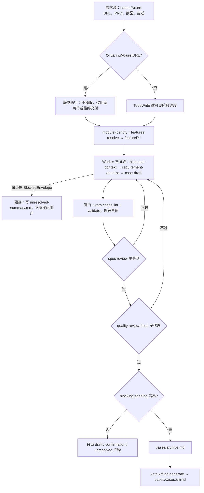

# case-draft

依需求源生成 QA 用例。每条事实必须有 SourceRef 支撑；缺证据即阻塞，不得编造。

## 路由边界

以下场景不属本 skill 范围，请转至对应 skill：

- 纯 Archive/XMind/CSV 格式转换 → case-edit
- 基于已有用例做自动化 → playwright-automation

## 静默模式（Lanhu/Axure URL-only）

Lanhu/Axure URL-only 输入：从第一条消息起全程静默执行 source-intake。期间不得：

- 宣布自己在用哪个技能；
- 给出处理计划；
- 播报执行进度。

静默只约束用户可见消息，不限制内部工具或 Worker；内部阶段与非静默路径相同。

唯一可见输出是以下之一：

1. **阻塞说明**（两行）：首行写阻塞原因或缺口，次行写需用户补充的内容；正式记录落 `cases/unresolved-summary.md`。
2. **最终交付**：阻塞解除后直接给出产出文件。

## 工作流

非静默路径用 TodoWrite 建可见阶段进度，逐阶段推进：

1. **module-identify**：先自行推断 workspace 项目（仅在无候选或多候选无法消歧时问用户）；首步执行 `kata features resolve --project <project> --module <module> --feature-version <vX.Y.Z> [--lanhu-page <pageId>] --json`，取返回的 featureDir；featureId 写入 metadata.yaml#id。**漏传 `--feature-version` 会落 `features/_standing/`（长期主流程/冒烟区）；版本类需求必须显式传，版本号由 CLI 按 `VERSION_DIR_RE`（v6.4.11 式）归一化、模型不得自拼，未知时先 `AskUserQuestion` 确认再 resolve。**
2. **historical-context / requirement-atomize / case-draft**：这三阶段派 Worker 执行繁重处理（加载哪个文件见下方表）；Worker 以 Status/BlockedEnvelope 回传结果，遇到阻塞不直接询问用户。
3. **case-review → output**：spec review（主会话）通过后派 quality review（fresh subagent）；blocking pending 清零后生成 cases/archive.md，再运行 `kata xmind generate --input cases/archive.md --output cases/cases.xmind` 产出 XMind。

## 何时加载哪个文件

| 文件                              | 何时读                    | 作用                                              |
| --------------------------------- | ------------------------- | ------------------------------------------------- |
| prompts/agent-worker.md           | 派发 case-draft Worker 时 | Worker 输入字段、写入范围、Status/BlockedEnvelope |
| prompts/agent-spec-reviewer.md    | case-review 阶段          | spec 合规、SourceRef 分层、case_id 核对机械检查   |
| prompts/agent-quality-reviewer.md | output 前内容质量审查     | 步骤完整性、标题、覆盖与一致性                    |
| rules/naming-convention.md        | 新建 feature 目录时       | 目录命名格式与客户缩写                            |
| references/source-refs.md         | 需要核对 SourceRef 或 SR 前缀时 | canonical hash-backed SourceRef、SR- 注册前缀、证据分层 |
| .claude/prompt/_shared/case-format-sample.md | 需要用例节点格式参照时 | 格式样例（含 DQ 子集），不作事实来源；其菜单名是岚图定制，禁照抄 |
| .claude/prompt/_shared/case-qa.md | 交付前自审（共享引用）    | 字段一致性、标题、前置条件、表单逐字匹配          |
| `workspace/<project>/_shared/knowledge/_index.md` → `sites/<host>/dom-*.md` | **module-identify 后、起草任何含菜单/页面/表单字段的用例前（必读）** | 真实菜单名、路由、向导步骤、表单字段与统计函数文案基线；按 `_index.md` Sites 节逐条加载目标环境 DOM |
| `workspace/<project>/_shared/knowledge/_index.md` → `modules/<module>.md`（存疑再用 `kata repos show|grep|list` 查外部源码枚举） | **起草任何含业务规则语义的用例前（必读）** | 规则类型/统计函数清单/字段类型约束/多字段 AND 逻辑/规则集·多表比对·自定义SQL 机制等产品级语义事实来源；缺证据按规则臆测会写出错误用例，必须查证 |

## 产物与引用规范

- 所有产物写入 `kata features resolve` 返回的 `featureDir`。
- 每个 requirement atom 必须在 `metadata.yaml#case_drafting.requirement_atoms` 包含 `id`、`source_ref`、`evidence_kind`、`ambiguity_class`、`confidence`。
- SourceRef 统一使用 `<kind>:<id>#sha256:<hash>`；来源种类与动态必需集合记录在 `.process/source-snapshot.json`（FeatureSourceSnapshot@2）。
- 证据分层（SourceRef 标识不进交付正文、只存结构化数据层）的权威细则见 `references/source-refs.md` 的「证据分层」。
- 每条 Archive 用例前写隐藏标记 `<!-- case_id: C... -->`；同一 `case_id` 的 `requirement_atom_ids` / `coverage_matrix_ids` 只写入 `.process/case-evidence-map.json`（CaseEvidenceMap@1）。`case_id` 只表示测试用例 ID，不得表示 ZenTao 需求 ID。
- `history_inferred` 仅作为参考证据，新增行为一律以产品反馈为准。

### 落盘位置（产物 → 目录）

| 产物                                                                                | 落盘目录          |
| ----------------------------------------------------------------------------------- | ----------------- |
| `archive.md`、`cases.xmind`、`confirmation-package.md`、`unresolved-summary.md` 等用例产物 | `cases/` 子目录   |
| `metadata.yaml`                                                                      | feature 根目录    |
| `source-snapshot.json`、`coverage-matrix.json`、`case-evidence-map.json` 等过程与证据产物 | `.process/` 子目录 |

清单与字段细则见 `.claude/prompt/_shared/output-artifacts.md` 与 `.claude/prompt/_shared/case-qa.md`（共享引用）。

## 事实字段：严禁编造，缺失即阻塞

`suite_name`（需求名）、`prd_id`（ZenTao 需求 id）、`prd_version`（lanhu-prd 迭代版本，与目录版本一致）、目标版本目录（`--feature-version`）是需向用户/ZenTao 确认的**外部事实**。`product_line` 从 workspace 项目配置取得；`case_id` 由起草流程生成，二者不得向用户索要。外部事实任一无 SourceRef/用户明示时，主会话必须一次性批量索要，严禁编造编号、自创需求名、拿 basename/迭代号/目录版本等默认值兜底后产出最终产物。字段→xmind 渲染映射见 `.claude/prompt/_shared/case-format-sample.xmind.md`。

## 起草前确认测试范围

需求开放、能拆出多条场景时（枚举多取值、衍生交互、优先级分配未定），起草用例**前**先用 `AskUserQuestion` 把测试点清单与覆盖范围摆给用户确认，再动笔——把范围缺口挡在起草前，避免用例跑出预期后整批返工。一轮确认覆盖三件事：

- **测试点清单**：按需求+证据梳理出的场景列表（编号呈现），让用户增删；
- **枚举覆盖**：需求/PRD 列出的多取值（数据源类型、状态、层级等）覆盖到哪些、是否抽样；
- **优先级分配**：P0 用例集以核心交付/回归严重度定级，占比通常 25%~30% 左右作参考（小用例集允许偏离，不为凑比例硬升降级），让用户确认或改派。

这轮范围确认与上一节「事实字段缺证据的批量索要」合并完成。URL-only 静默模式只输出约定的两行阻塞说明，不额外显示计划或结构化提问。

## 菜单/页面文案：以环境 DOM 证据为准（缺证据即阻塞）

用例步骤里的左导航/菜单名、页面与向导步骤、按钮文案、表单字段与统计函数枚举，都是**客户/环境定制的外部事实**，必须逐字来自目标环境的 `sites/<host>/dom-*.md`（或用户提供的截图）：

- module-identify 确定 project/客户/环境 host 后，**先按 `_index.md` Sites 节加载该 host 的 `dom-dataAssets.md`** 建立菜单·字段基线，再起草。
- **菜单文案只认 `sites/<host>/dom-*.md`**：fewshot（`case-format-sample.md`）的菜单名是岚图定制，禁止照抄；`modules/data-quality.md` 现为产品级规则语义（不含具体客户菜单名），是规则类型/统计函数/校验语义的事实来源，但菜单·按钮文案仍以 sites DOM 为准；历史用例里的菜单名不作事实来源。
- **目标环境无专属 DOM、`_index.md` 也无对应条目时**：主会话 `AskUserQuestion` 向用户索要真实菜单截图/左导航清单，**禁止降级套用其它环境（ltqc/ci63 等）的 DOM 或 fewshot 菜单名**——岚图与标品菜单结构本就不同。worker 遇此返回 `BLOCKED(missing_evidence)`。

## 交付约束

- `blocking pending` 未清零时，只允许产出草稿与确认类产物（`cases/confirmation-package.md` / `cases/archive.draft.md` / `cases/unresolved-summary.md`；`error-fallback` 下豁免并保留 URL token 表与 SourceRef ID）。清零后才生成 `cases/archive.md`，再由 `kata xmind generate` 产出 `cases/cases.xmind`。
- 产物落盘后、交付前，按 lint→validate→verify 顺序跑三条 exit-code 门，全部为零再进入 review——把机械可查的字段/结构错误挡在人工审查之前，避免 reviewer 把精力浪费在命令本可发现的问题上：
  1. `kata cases lint --scope <feature-dir> --exit-code`
  2. `kata cases validate <feature-id> --project <project>`
  3. `kata cases verify --project <project> --feature <feature-id> --exit-code`（默认读取 FeatureSourceSnapshot@2 的 `required_source_kinds`；仅人工覆盖策略时传 `--required-kinds`）

  verify 是三层硬校验门（L1 结构 / L2 输入消费 / L3 内容质量）；L1/L2/L3 全量触发只在 feature metadata `case_drafting.status=completed` 时发生，`blocked`/`in-progress` 路径跳过，不会误报。
- `metadata.yaml#automation.intents[]` 中状态为 `ready` 的 `AutomationIntent`，移交给 `playwright-automation`。
- 生成 `cases/archive.md` 后、产 `cases.xmind` 前，必须回读核对：实际用例数须等于 frontmatter `case_count`（该一致性由 `kata cases lint` 的 `archive-case-count-mismatch` 硬校验，FAIL 即阻塞）；产 xmind 后回读根节点版本段、各二级节点标题与 `(#N)` label，与 module-identify 阶段确认的需求名/需求 id/版本基线逐字比对，任一不符先修正再交付。

表单字段、按钮和选项与菜单文案使用同一目标环境 DOM/截图基线；不得写入基线外内容。证据不可读时按本节的缺证据规则阻塞，不再维护第二套表单规则。
