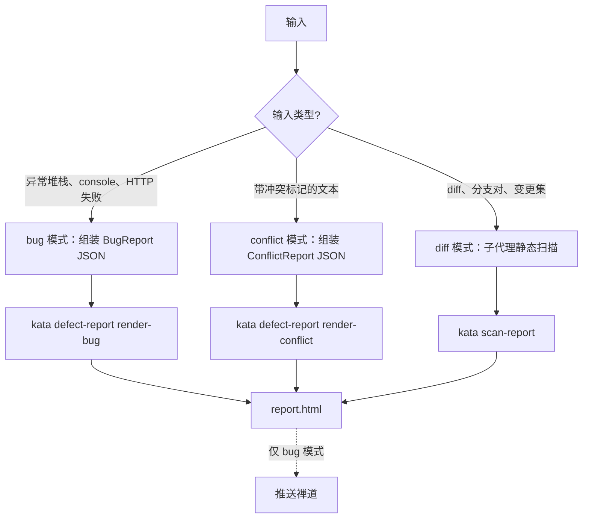

# defect-analyze

按输入类型分流到三种模式；无证据支撑的内容一律不写进报告。

## 路由边界

以下场景不属本 skill 范围，请转至对应 skill：

- ZenTao bug URL、bug-view 链接或 bug ID → case-hotfix
- 依 PRD 产出新用例 → case-draft
- 仅做概念性代码讲解、没有 diff 目标 → 由 AI 直接回答，不进本 skill

## 三种模式（工作流）



- `bug`：收到异常堆栈、控制台报错、HTTP 失败等可复现 bug 证据，先组装 BugReport JSON，再用 `kata defect-report render-bug`（仅 zentao variant）产出 `report.html`。
- `conflict`：收到带合并冲突标记的文本，先组装 ConflictReport JSON，再用 `kata defect-report render-conflict` 产出 `report.html`。
- `diff`：需对仓库 diff、分支对或变更文件集做静态扫描时，新开一个 general-purpose 子代理执行扫描，再经 `kata scan-report` 产出 `report.html`。对比分支用以下命令序列（`--slug` 不传时按分支对自动生成；完整字段以 `kata scan-report create --help` 为准）：

  ```shell
  # 1. 初始化 audit：拉基线/被测分支并算 diff
  kata scan-report create --project <name> --repo <repo> --base-branch <ref> --head-branch <ref>
  # 2. 子代理逐个 bug 写回（add-bug / update-bug / set-meta），证据须落在 evidence_refs
  # 3. 渲染 report.html
  kata scan-report render --project <name> --slug <slug>
  ```

## 各模式规则

**bug 模式**：实际行为、预期行为、复现步骤、影响范围四项必须分开陈述，不得合并。

**conflict 模式**：给出解决方案前，先把冲突双方各自的意图和依据写清楚（`side_a` / `side_b`），不得单边裁决。

**diff 模式**：只报告能依据所给 diff 与周边代码复现出来的缺陷。

**通用约束**：
- 缺乏证据时，不得编造日志、负责人、模块或根因；结论须可追溯到 `evidence_refs`。
- `workspace/{project}/.kata/repos/**` 是只读源仓库；如需修改，必须先获得用户确认，并在源仓库工作区中操作。

## 产物

三种模式都产出 `report.html`，但落点分两处，不要合并：`kata defect-report`（bug / conflict 模式）写 `defectDir`（`_shared/archive/reports/bugs/`），`kata scan-report`（diff 模式）写 `auditDir`（`_shared/archive/audits/`）。都不写入 feature 目录。

## 推送禅道（仅 bug 模式）

bug 模式产出 `report.html` 后按节点推进，输出仅走固定模板，不得夹带无关内容：

1. 用 AskUserQuestion 询问「是否推送禅道创建 bug？」（推荐「是」）。选「否」即结束，不做任何禅道写操作。
2. 选「是」→ 将 BugReport JSON 落盘，执行 `bun run .claude/plugins/zentao/create.ts --json <BugReport.json>`（产品、指派人向林、severity 映射等取插件 yaml；正文复用 zentao variant）。
3. 解析命令输出：`ok:true` 且有 `url` → 按下方固定模板回显；`ok:true` 但仅带 `note`（禅道返回 success 却无可解析链接）→ 回显 note 文案，提示去禅道按标题核对；`ok:false` → 仅回一行简明原因（登录失败 / 缺必填 / 网络不可达 / 创建被拒），不得编造。

   成功模板：

       禅道链接已生成，相关信息如下：
       - 禅道地址：<zentao_url>
       - Bug 标题：<title>

4. 一个 bug 链接只承载一处主修复建议（取 fix_suggestions 首条）。分析中发现的额外问题（补单测、相邻隐患等）用 AskUserQuestion 单独询问是否另开 bug，不得归入同一 bug。
