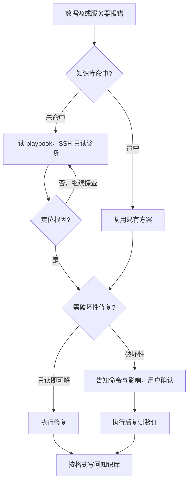

# infra-diagnose

收到数据源/服务器故障线索后，按以下顺序推进：先查本地知识库，再 SSH 只读诊断定位根因，执行破坏性修复前先确认，最后把结论写回知识库。

## 路由边界

以下场景不属本 skill 范围，请转至对应 skill：

- 纯前端运行时报错、不用 SSH 登录 → defect-analyze。
- 只查询或更新业务知识 → knowledge-curate。

## 工作流

1. **查知识库**：按报错关键词、主机、端口检索 `.kata/infra/knowledge/`；命中既有条目就优先复用它的方案，省去重复排查。
2. **只读诊断**：没命中时读 `references/diagnostic-playbook.md`，按报错类型分步做只读诊断；SSH 规约见 `references/ssh-protocol.md`。
3. **写回**：定位根因或修复完成后，按 `references/knowledge-format.md` 把知识条目写回，下次遇到同类问题可以直接复用。

## 何时加载哪个文件

| 文件                              | 何时读     | 作用                                  |
| --------------------------------- | ---------- | ------------------------------------- |
| references/diagnostic-playbook.md | 自行排查时 | 按报错类型分步只读诊断，再对症修复    |
| references/ssh-protocol.md        | 需要 SSH 登录时 | SSH 连接、读取或补充凭据、破坏性命令把关 |
| references/knowledge-format.md    | 收尾记录时 | 知识条目怎么检索、怎么写回             |

## 安全规则

- 凭据按 host 从 `.kata/infra/credentials.yaml` 读取；未命中时读不入库的本地默认配置（环境变量 `KATA_INFRA_DEFAULT_USER` / `KATA_INFRA_DEFAULT_PASSWORD`，放 `.env.local` 或用户级配置）试连，未配置则跳过这一步；仍失败则直接询问用户，获得后立即写回 `.kata/infra/credentials.yaml`，下次同一主机不再重复询问。runtime skill 正文与仓库内不写任何明文口令。
- JDBC URL（如 `jdbc:hive2://host:10000/`）仅解析主机与端口，其中不含账号密码，不得据此推测凭据。
- SSH 统一使用 `SSHPASS=<pw> sshpass -e ssh ...`，密码通过环境变量传入，不写进 `ps` 可见的命令行，避免密码在进程列表中泄露。
- 只读诊断（`ping` / `nc` / `systemctl status` / `journalctl` / `ss` / `ps` 等）可自动执行。
- 破坏性操作（重启服务 / 修改防火墙 / `kill` / 改配置）必须先将命令和影响告知用户，确认后再执行，执行后复测验证。

## 诊断规范

- 根因必须有命令输出作为支撑，严格区分事实与推断；无证据时不得臆造根因或责任人。
- 仅操作目标服务器和本地 `.kata/infra/`，不得改动 `.kata/repos/**` 源仓库。
- 知识条目写入 `workspace/{project}/.kata/infra/knowledge/`，凭据写入 `.kata/infra/credentials.yaml`；不写入 feature 目录。
