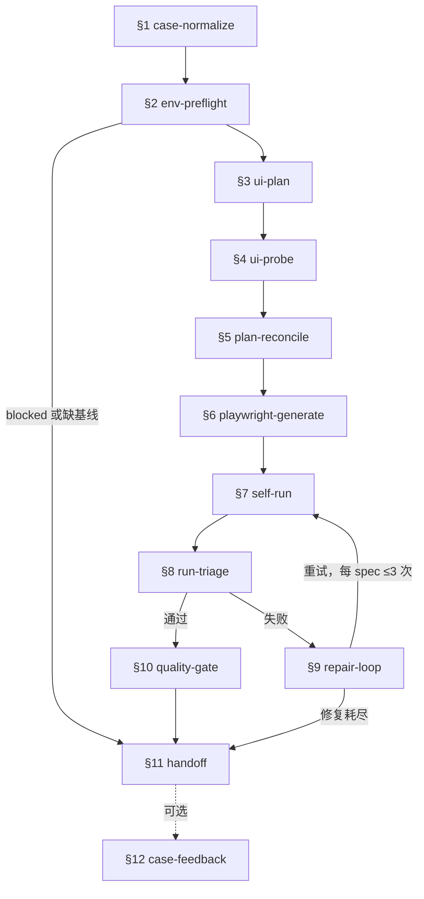

# playwright-automation

将用例目录转为可跑通的 Playwright 脚本，覆盖真实页面探测、生成、运行和修复。

## 路由边界

以下场景不属本 skill 范围，请转至对应 skill：

- 仅手动操作浏览器而不生成/修复测试 → 不触发本 skill
- 仅写非 UI 用例 → case-draft
- 仅做静态代码扫描 → defect-analyze

## 环境确认（先于一切探测）

按以下分支处理，确认环境前保持静默：

- **未给出 env profile**：用 AskUserQuestion 一次性问清环境，默认推荐项 `ltqc-local.yaml` 置顶并附理由。
- **AskUserQuestion 不可用**：输出固定兜底文案（首行为 `请确认执行环境。`）。
- **已给出 profile 或回复「确认」**：直接执行 env-preflight。

## 阶段流程（顺序推进，逐 phase 加载对应文件，前序通过才进下一阶段）

| Phase                  | 文件                             | 简介                                                              |
| ---------------------- | -------------------------------- | ----------------------------------------------------------------- |
| §1 case-normalize      | phases/§1-case-normalize.md      | MD/Archive/PRD/Lanhu/脚本/失败结果 → UiAutomationIntent           |
| §2 env-preflight       | phases/§2-env-preflight.md       | base URL、登录态、项目、数据源、权限、浏览器依赖校验              |
| §3 ui-plan             | phases/§3-ui-plan.md             | 覆盖范围、可见断言、fixture、选择器策略与风险                     |
| §4 ui-probe            | phases/§4-ui-probe.md            | 真实浏览器收集页面/可访问性/截图/网络/locator 证据                |
| §5 plan-reconcile      | phases/§5-plan-reconcile.md      | 书面用例核对真实 UI：继续/调整/提问/阻塞                          |
| §6 playwright-generate | phases/§6-playwright-generate.md | 据核对后的计划与 UI 证据生成或修复脚本                            |
| §7 self-run            | phases/§7-self-run.md            | 跑目标 spec，记录命令/退出码/输出/报告路径                        |
| §8 run-triage          | phases/§8-run-triage.md          | 失败归类：产品/脚本/数据/权限/环境/未知/需决策                    |
| §9 repair-loop         | phases/§9-repair-loop.md         | 有限修复循环，保留每次修复证据                                    |
| §10 quality-gate       | phases/§10-quality-gate.md       | 脚本结构、断言、session、handoff 等检查项，跑 `kata cases lint` 闸门 |
| §11 handoff            | phases/§11-handoff.md            | 通过/阻塞/部分/修复耗尽的最终交付报告                             |
| §12 case-feedback      | phases/§12-case-feedback.md      | 生成 case-corrections（8 类/3 级/跨轮去重）；高置信已核实项经 case-edit 回写源用例 |

## 何时加载哪个文件

| 文件                              | 何时读                                         | 作用                                           |
| --------------------------------- | ---------------------------------------------- | ---------------------------------------------- |
| references/cli-essentials.md      | ui-probe/generate/repair 阶段需要 API 速查时   | 原生 Playwright API：探测/属性/断言/mock/trace/下载；含 @playwright/cli 可选探索边界 |
| references/db-runtime-sql.md      | 用例需运行时建表/删表/改数据或核对期望度量时   | `lib/db` 多数据源(starrocks/doris/hive/sparkthrift)运行时 SQL 工具的使用时机与方式 |
| references/execution-protocol.md  | env 确认且无 blocker 后的重阶段                | per-case 任务编排与公开进度、子代理派发、汇总集中评审 |
| prompts/agent-precondition.md     | 前置条件处理阶段（env-preflight 通过后）         | 前置 opus 子代理模板：ui-probe 探测 + 共享层 + 用例清单校正 |
| prompts/agent-worker.md           | 用例 generate/self-run/repair 派子代理时 | 执行子代理模板与 Status/BlockedEnvelope        |
| prompts/agent-spec-reviewer.md    | 汇总 & 质量闸门阶段                            | spec 合规机械检查                              |
| prompts/agent-quality-reviewer.md | 汇总 & 质量闸门阶段（spec 通过后）             | 脚本质量（选择器、断言、复用度）               |
| `workspace/<project>/_shared/knowledge/_index.md` → `modules/<module>.md` + `sites/<host>/dom-*.md` | ui-probe / generate / 用例清单校正前（必读） | 真实菜单·字段·统计函数文案 + 规则语义事实，校正用例与脚本；存疑查 `source-repo-map.md` 指向的 `.kata/repos` 源码枚举 |

## 执行流程

- 严格按 env-preflight → ui-probe → plan-reconcile → playwright-generate → self-run 的顺序推进，前序阶段通过才进入下一阶段。
- 按名称片段查找目标目录时，先用关键词在 `metadata.yaml` / `cases/archive.md` / `prd.md` 中精确定位唯一目标目录，再读取其状态文件；禁止枚举 `features/` 下的候选目录。
- `blocked_by_case_draft_required` 只在一种情况下触发：目标目录既缺少 case-draft 的自动化基线（`ready` 状态的 `AutomationIntent`、`cases/archive.md`、`cases/test-point-checklist.md`），又缺少 `prd.md` 或 `inputs/lanhu-snapshots/`。触发后直接进入 handoff，不再读取需求源。

## 进度可见性

- **公开模式**：env 确认且无 blocker 后，按 `references/execution-protocol.md` 编排任务列表：
  - `前置条件处理` 分配 opus 子代理；plan-reconcile / generate / self-run / repair 按用例分配 sonnet 子代理（任务标题 = 用例标题）。
  - 主 agent 只做编排、不直接执行具体任务；失败时动态新增修复任务、限并发并行，二阶段评审集中在汇总环节。
- **静默模式**：env-preflight 全阶段、所有 BLOCKED 模板路径下，禁止公开进度——不派执行子代理、不建 TodoWrite。
- env-preflight 的权限拒绝、session 探测、登录态补充，以及 `no_permission` / `tool_permission_denied` 模板，严格遵循 `phases/§2-env-preflight.md`。

## 真实性质控

- 全阶段通用：不得把用户文字、需求文档或截图描述当作真实 UI 事实；不得弱化断言来换取通过；不得修改 `workspace/{project}/.kata/repos/**`。
- ui-probe 证据缺失时不生成最终脚本（静态审查除外）；self-run 结果缺失时不下「通过」结论。
- 每条用例步骤须实现为真实的页面动作，每条 `expected_visible_result` 须断言为真实的业务结果；禁止用「导航 + 可见性断言」代替业务动作。
- 用户明确要求底层状态链路时（如从建表、元数据同步、创建规则包、引入规则包、创建/执行质量任务、校验 SQL 和任务状态），不得用只读旧 monitor/API 合同脚本替代；脚本必须实现每个被点名的状态变化步骤，或用命令、接口返回、产物路径把未实现/受阻步骤说清楚。
- 无法真实实现的用例须阻塞或排除，记入 `handoff.excluded_cases`（含 `reason_category`）。

## 失败处理

- 遇到失败，先判断归类（产品 / 脚本 / 数据 / 权限 / 环境），再决定修复策略。
- 每个 spec 最多 3 次修复尝试，locator 内部重试最多 2 次。
- 失败断言必须反映真实问题，严禁用弱断言、`try-catch`、`test.skip` 或宽泛条件来掩盖。

## 环境与产出

- 环境配置取 `workspace/<project>/_shared/env/*.yaml` profile；新建前先检查是否已有匹配的 `base_url` + `tenant`，不得为交付新建 `.env.local`。
- 产出布局：`smoke.spec.ts` + `full.spec.ts` 存放于 `automation/tests/runners/`，case 存放于 `automation/tests/cases/`，共享页面对象/helper 存放于 `_shared/`。
- 交付以目标 `full.spec.ts` 全量通过为准，仅 smoke 通过不算完成。
