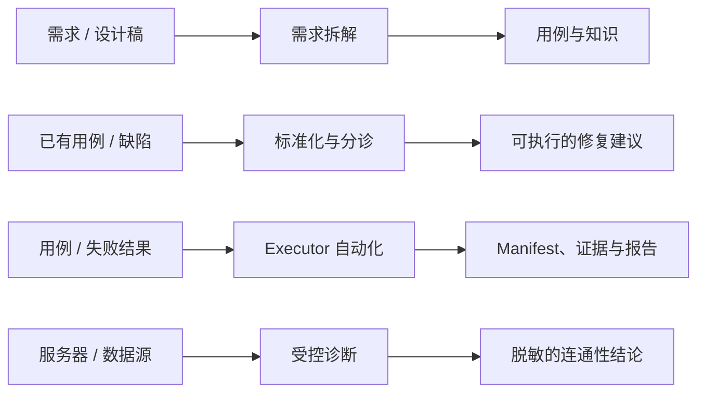

# 𝓚𝓪𝓽𝓪

<p align="center">
  
  
  
  
  
</p>

<p align="center">
  <strong>让需求、用例、自动化与证据，构成一条可复核的 QA 工程流水线。</strong>
</p>

<p align="center">
  <a href="./README-EN.md">English</a> ·
  <a href="./INSTALL.md">安装指南</a> ·
  <a href="./config/README.md">配置说明</a>
</p>

面向 𝑪𝒍𝒂𝒖𝒅𝒆 𝑪𝒐𝒅𝒆 与 𝑶𝒑𝒆𝒏𝑨𝑰 𝑪𝒐𝒅𝒆𝒙 的 QA 工程工作区：**需求分析**、**测试用例**、**Bug 分析**、**跨执行器自动化**、**服务器调试**与**知识沉淀**，均以可复用的 Skill 与 CLI 交付；产物统一落盘，运行全程可复核。

## 目录

- [工作流](#工作流)
- [能力地图](#能力地图)
- [快速开始](#快速开始)
- [交互式 TUI](#交互式-tui)
- [自动化生命周期](#自动化生命周期)
- [项目结构](#项目结构)
- [开发与验证](#开发与验证)

## 工作流



Kata 的价值不在生成更多文本，而在于每个结果都能回溯到输入、命令与证据：

- Skill 正文以 `.claude/skills/` 为唯一来源，`.agents/skills/` 仅为 Codex 提供软链。
- 通用 CLI 位于 `cli/`，Claude Code 与 Codex 共用同一套实现。
- 项目输入、权威 YAML 用例与知识位于 `workspace/{project}/`；自动化实现位于 `automation/`。
- 运行产物统一进入 Git 忽略的 `artifacts/runs/`，按 logical run、execution 与 attempt 分层保留。
- 平台 Cookie、插件凭据、基础设施凭据与数据源信息仅保存在本机 Git 忽略的配置中，绝不进入版本库。

## 能力地图

| 入口 | 适合的问题 | 主要产物 |
| --- | --- | --- |
| `/test-case` | 从 PRD、设计稿等需求来源编写、编辑和同步用例 | YAML / XMind / 可追溯的 SourceRef |
| `/automation` | 为 feature 动态选择 executor，并实现、运行和验证自动化 | manifest、Allure、证据、业务记录与 handoff |
| `/defect-analyze` | 分析堆栈、HTTP 失败、冲突或代码差异 | 根因、影响面与修复建议 |
| `/infra-diagnose` | 检查服务器或数据源的 SSH2 连通性 | 脱敏 Markdown 诊断报告 |
| `/domain-knowledge` | 查询或维护项目业务规则和术语 | 可复用的领域知识 |
| `/workspace-management` | 创建、修复和检查 Kata 工作区 | 标准化的工作区骨架 |

## 快速开始

### 一键安装

将以下提示词发送给任意本地 AI 编程助手（Claude Code、Codex 等）：

```text
请完成 https://github.com/koco-co/kata.git 的安装与首次配置引导：
1. git clone https://github.com/koco-co/kata.git && cd kata
2. 读取仓库根目录的 INSTALL.md，严格按文档完成环境安装与配置引导：
   检查并安装前置依赖，执行 Bun 与 uv 的锁定安装和质量检查，引导用户获取各平台配置
   （如 ZenTao Cookie、平台 URL、凭据）并写入 config/private/ 下对应文件；
3. 全程不得将任何凭据或密钥写入聊天记录或提交；
4. 基础配置完成后，在 workspace/ 下初始化一个项目，并走完一次
   test-case skill 流程（推荐）；
5. 其余 skill 流程由用户决定是否继续；若不继续，结束本次本地引导任务。
```

## 交互式 TUI

人类可以直接在终端进入交互界面，浏览项目、迭代版本与 Feature，并对用例执行 `Lint/Build`：

```bash
kata                              # TTY 下进入 TUI
kata tui                          # 显式进入 TUI
kata --no-interactive <command>   # 脚本、CI 或模型调用保持纯 CLI
kata cases build 16212 --project dataAssets
```

`kata cases build <requirementId>` 在 TTY 下会直接进入对应 Feature 的构建页面。TUI 入口契约和开放范围见 [docs/kata-tui-architecture.md](docs/kata-tui-architecture.md)。

## 自动化生命周期

`/automation` 从 `automation/*/executor.toml` 发现可用 executor；Playwright Web UI、App UI 与 API 等实现共享同一套 CLI 生命周期：

```bash
kata automation setup --executor playwright-web-ui
kata automation doctor --executor playwright-web-ui
kata automation collect <feature-or-requirement-id> --project <workspace-name>
kata automation run <feature-or-requirement-id> --project <workspace-name> --env <environment>
kata runs verify --project <project-id> --run <logical-run-id>
```

Skill 与用户不需要组装底层运行器命令。只有同一 execution/attempt 的 manifest、collection/preparation/run 状态、Allure、evidence、必需业务记录和 verify 全部成立，自动化交付才算通过；attempt 前失败会保留 `NOT VERIFIED` handoff，而不会伪造一次运行。

## 项目结构

```text
kata/
├── .claude/skills/       # Skill 正文唯一来源
├── .agents/skills/       # Codex 侧 symlink
├── .codex-plugin/        # Codex 插件清单
├── automation/           # Executor descriptor、实现包与项目 suite
├── artifacts/runs/       # Git 忽略的 logical run / execution / attempt 产物
├── cli/                  # kata CLI 与集成实现
├── config/               # example 模板与本机私密配置边界
├── tests/                # CLI、集成与 Skill 测试
└── workspace/            # 项目输入、权威 YAML 用例与知识
```

## 开发与验证

```bash
bun install --frozen-lockfile
uv sync --locked --all-packages --all-groups
bun run check
bun run type-check
bun test --timeout 30000 ./tests ./cli/lib
uv run --locked --no-sync ruff format --check automation
uv run --locked --no-sync ruff check automation
uv run --locked --no-sync pyright
uv run --locked --no-sync pytest automation/playwright-web-ui/tests automation/playwright-web-ui/suites/data-assets/tests/contract automation/playwright-web-ui/suites/data-assets/tests/unit -q
uv run --locked --no-sync pre-commit run --all-files
bun run ci
```

### Push Gate

`bun install` 会自动把仓库级 `pre-push` 钩子配置到 `.githooks/pre-push`，执行 Bun 控制面的完整项目校验。Python 自动化使用根目录 `.pre-commit-config.yaml` 作为统一质量入口；运行 `uv run pre-commit install` 可启用提交前检查，`uv run pre-commit run --all-files` 可手动执行全量离线门禁。真实浏览器 E2E 不在提交钩子中执行，必须通过 `kata automation collect|run` 和 `kata runs verify` 交付。GitHub Actions 会分别执行 Bun 与 Python 门禁。

## License

MIT
