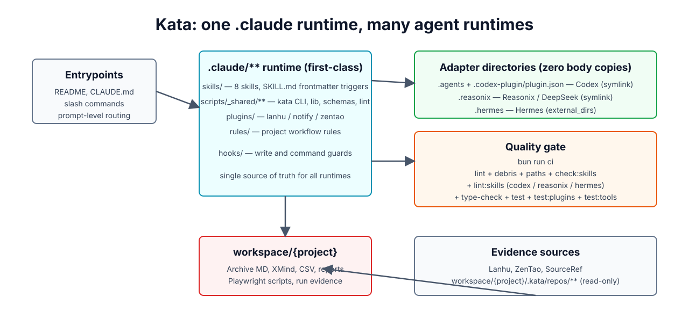
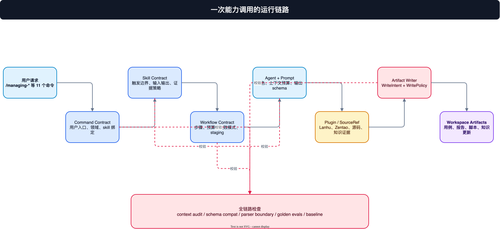
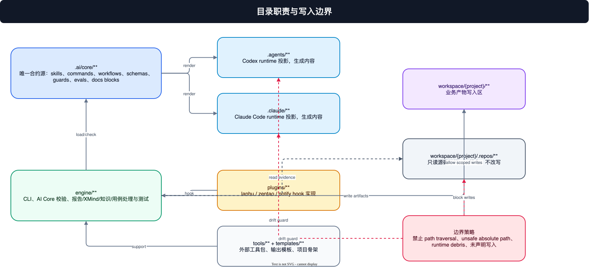

# Kata 4.0 整体项目架构设计说明

本文件描述 kata 当前 4.0 架构的完整项目视角，而不只描述 AI Core 子系统。AI Core 是 4.0 的 runtime 合约核心，但项目还包含 CLI/engine、插件、模板、工具包、workspace 产物区、只读源码证据区、文档生成和测试门禁。

可编辑图源：[`assets/diagrams/kata-project-architecture.drawio`](../../assets/diagrams/kata-project-architecture.drawio)

## 1. 架构总览



Kata 是一个面向 QA 生产链路的 coding-agent runtime 项目。它把“需求、设计源、bug、源码 diff、UI 用例、测试结果”转成可审计的工作流输入，再通过 product skills 生成或维护以下产物：

- Archive MD、XMind、测试用例矩阵。
- bug 报告、hotfix 回归用例、冲突分析报告。
- UI 自动化测试计划、Playwright 脚本、失败归因报告。
- 项目业务知识、规则、术语和证据索引。

项目分为七个主要层次：

| 层次 | 目录 / 入口 | 职责 |
| --- | --- | --- |
| 用户入口层 | `README.md`, `INSTALL.md`, `AGENTS.md`, `CLAUDE.md`, `/commands` | 告诉用户如何安装、调用能力、进入 runtime。 |
| AI Core 合约层 | `.ai/core/**` | 声明 product skills、commands、workflows、agents、prompts、schemas、guards、evals、runtime manifests 和 docs blocks。 |
| Runtime 投影层 | `.agents/**`, `.claude/**` | 从 `.ai/core` 生成 Codex 与 Claude Code 可加载的 skills、agents、索引和入口文档。 |
| Engine 执行层 | `engine/**` | 提供 `kata`、配置解析、AI Core 校验、投影渲染、报告生成、XMind/Archive/知识/源码分析等能力。 |
| 插件层 | `plugins/**` | 通过 hook 接入 Lanhu、Zentao、通知等外部系统，不能绕过合约和写入边界。 |
| 工具与模板层 | `tools/**`, `templates/**`, `lib/**` | 提供外部前置工具、输出模板、项目骨架和共享工具库。 |
| Workspace 产物层 | `workspace/{project}/**` | 存放用户项目产物；其中 `.repos/**` 只作为源码证据读取。 |

## 2. 用户能力面

4.0 的 active surface 以 `.ai/core/commands/*.command.yaml` 中 `user_invocable: true` 的命令为准。README 的命令表由 AI Core docs renderer 生成，避免手工漂移。

当前能力分为五组：

| 能力组 | 命令 |
| --- | --- |
| 工作区 | `/workspace-manage` |
| 用例生成与维护 | `/case-draft`, `/case-edit` |
| 知识管理 | `/knowledge-curate` |
| 缺陷与变更 | `/bug-file`, `/conflict-analyze`, `/case-hotfix`, `/diff-scan` |
| UI 自动化 | `/ui-plan`, `/playwright-gen`, `/run-triage` |

`playwright-cli` 是 vendor skill，保留上游规范名称。它负责真实浏览器自动化，不属于 kata-owned product skill 命名体系。

## 3. 核心运行链路



一次典型调用从用户命令开始，经过合约解析、workflow 编排、agent/prompt 执行、插件或 SourceRef 取证、写入策略检查，最后落到 workspace 产物。

标准链路如下：

1. 用户在 Codex、Claude Code 或 CLI 中调用 `/case-draft` 等命令。
2. Runtime 根据 `.agents/**` 或 `.claude/**` 投影找到 command 和 skill。
3. Engine 加载 `.ai/core` 合约，校验 skill、workflow、agent、prompt、schema、guard。
4. Workflow 按步骤调用 agent、prompt、plugin 和 SourceRef resolver。
5. 中间结果先进入 staging 或受控写入接口。
6. WritePolicy 检查 workspace scope、`.repos/**` 只读边界、path traversal、absolute path 和 runtime contract 写入。
7. 成功后写入 `workspace/{project}/`，并输出报告、用例、脚本或知识更新。

这个链路的关键点是：**AI 可以参与生成内容，但不能临时发明运行规则、写入范围、插件权限或输出格式**。这些都必须由 `.ai/core` 合约声明并通过 gate 检查。

## 4. 目录职责与边界



### 4.1 `.ai/core/**`

`.ai/core` 是 runtime source of truth。这里的文件是合约源，而不是运行时投影。

关键子目录：

| 子目录 | 职责 |
| --- | --- |
| `skills/` | product skill 合约，描述触发边界、输入输出、证据策略、失败策略、few-shot 和 references。 |
| `commands/` | 用户可调用命令，绑定 skill 并生成 README / root docs 命令表。 |
| `workflows/` | 编排步骤、预算、失败模式、staging 策略和 agent/prompt 使用关系。 |
| `agents/` | worker/reviewer/runner 合约，声明执行角色、读写范围和 handoff。 |
| `prompts/` | prompt version、schema version、上下文预算、预填充、验证重试和模型能力锁定。 |
| `schemas/` | 所有 contract、runtime event、SourceRef、telemetry、run envelope 的 JSON Schema。 |
| `guards/` | 写入、内容、插件、runner、失败策略等 guard 注册表。 |
| `runtimes/` | Claude/Codex manifest、projection inventory、projection lock、secret sources、preflight。 |
| `evals/` | P0、GA-core、GA-runtime golden evals、baseline 和环境依赖检查。 |
| `docs/` | README/CHANGELOG 等生成块声明和中英文术语表。 |

### 4.2 `.agents/**` 与 `.claude/**`

这两个目录是生成投影，不是规范源。

- `.agents/**` 面向 kata Codex runtime。
- `.claude/**` 面向 Claude Code runtime。
- `INDEX.md` 是 runtime 冷启动索引，把 command、skill、workflow、agent、prompt、plugin 和 outputs 串成调用图。
- 生成内容由 projection inventory 和 projection lock 防漂移。

如果需要调整 skill 内容、命令说明、workflow 或 agent 行为，应修改 `.ai/core/**`，再运行 projection/docs/gate。

### 4.3 `engine/**`

`engine` 是项目的执行和验证层。它不是 AI prompt 的堆放处，而是 TypeScript/Bun 工具链：

- `engine/bin/kata`：用户和 CI 使用的 CLI 入口。
- `engine/src/ai-core/**`：AI Core loader、validator、renderer、projection、parser audit、eval、gate。
- `engine/src/**`：项目创建、PRD/XMind/Archive、知识维护、报告生成、源码分析、测试通知等业务支撑。
- `engine/lib/**`：共享库、legacy support 和工具函数。
- `engine/tests/**`：AI Core 聚焦测试、CLI 测试和历史业务能力测试。

Engine 的职责是让合约可执行、可验证、可重复，而不是替代 `.ai/core` 成为规范源。

### 4.4 `plugins/**`

插件用于连接外部系统：

| 插件 | 作用 | 常见配置 |
| --- | --- | --- |
| `lanhu` | 拉取设计源，用于生成测试用例。 | `KATA_LANHU_COOKIE` |
| `zentao` | 拉取 bug 或需求记录，用于 hotfix 用例和报告。 | `KATA_ZENTAO_BASE_URL`, `KATA_ZENTAO_ACCOUNT`, `KATA_ZENTAO_PASSWORD` |
| `notify` | 在输出阶段发送飞书、钉钉、企业微信或 SMTP 通知。 | `KATA_*_WEBHOOK_URL`, `KATA_SMTP_*` |

插件必须通过 manifest/hook 接入 product skill，不应直接改写 workspace、runtime projection 或 `.ai/core` 合约。

### 4.5 `workspace/{project}/**`

Workspace 是业务产物区。它可以包含：

- `project.json`、项目配置和本地知识。
- 需求派生物、Archive MD、XMind、报告。
- UI 自动化计划、Playwright 脚本和运行结果。
- `.repos/**` 源码副本。

其中 `.repos/**` 是只读证据目录。Kata workflow 可以读取源码、diff、配置和测试结果，但不能在这里 commit、push 或写业务文件。

### 4.6 `tools/**`, `templates/**`, `lib/**`

- `tools/dtstack-sdk` 是外部平台前置工具，用于项目、SQL、资产同步等准备工作。
- `templates/**` 存放 Archive、bug report、scan report、conflict report 等输出模板。
- `lib/playwright/**` 存放共享 Playwright 支撑代码。

这些目录是 engine 和 workflow 的支撑资源，不承担 runtime contract source-of-truth 角色。

## 5. AI Core 子系统

AI Core 是整体架构中最重要的控制面。它的目标是把原本散落在手写 prompt、规则文件、agent 说明和临时脚本里的行为，收敛为可测试的合约。

AI Core 负责：

- 定义 product skill 的触发边界和输出格式。
- 维护 command 到 skill 的用户入口映射。
- 编排 workflow、agent 和 prompt。
- 管理 schema、guard、SourceRef、secret ref 和 write policy。
- 渲染 `.agents/**` 与 `.claude/**` runtime projection。
- 生成 README/CHANGELOG/root docs 中的托管块。
- 提供 parser boundary audit、projection lock、golden eval、baseline report 和 gate。

更细的 AI Core 内部说明见 [`ai-core-architecture.md`](./ai-core-architecture.md)。

## 6. 写入模型

Kata 的写入模型遵循“先声明、再执行、失败关闭”：

| 目标 | 策略 |
| --- | --- |
| `workspace/{project}/**` | 允许声明范围内的业务产物写入。 |
| `workspace/{project}/.repos/**` | 只读，作为源码证据和 diff 来源。 |
| `.ai/core/**` | 只能由人工或明确的开发任务修改，workflow 运行路径不得直接改写。 |
| `.agents/**`, `.claude/**` | 由 projection 生成；手工漂移应被检测。 |
| 绝对路径 / path traversal / symlink escape | 默认阻断。 |

这使 kata 能在一个仓库里同时管理 runtime 投影、用户 workspace 和外部源码证据，而不让 agent 在边界上“自由发挥”。

## 7. 配置与密钥

配置入口分三层：

1. `.env.example` 声明支持的 `KATA_*` 变量。
2. `.ai/core/config/env.schema.json` 约束 AI Core 相关配置。
3. `.ai/core/runtimes/secret-sources.yaml` 声明 secret ref 来源。

原则：

- secret 不进入合约、docs、runtime projection 或测试 fixture。
- raw secret-like env 必须 fail-closed。
- 插件只能读取自己声明的配置。
- README 只列出用户需要知道的配置，不替代 schema。

## 8. 文档生成策略

README 是上手入口，不是完整规格书。详细架构、设计历史和实现计划放入 `docs/**`。

当前文档分工：

| 文档 | 职责 |
| --- | --- |
| `README.md` / `README-EN.md` | 快速理解、安装、能力入口、验证命令。 |
| `INSTALL.md` | 安装与本机环境准备。 |
| `AGENTS.md` / `CLAUDE.md` | coding-agent runtime 公开入口，由 AI Core 托管块生成命令索引。 |
| `docs/architecture/kata-project-architecture.md` | 整体项目架构。 |
| `docs/architecture/ai-core-architecture.md` | AI Core 子系统架构。 |
| `docs/superpowers/specs/**` | 历史设计与阶段计划，不作为 runtime source-of-truth。 |

README 中的 command index 和 runtime support block 由 `ai-core:docs render` 生成，并由 `ai-core:docs check` 防漂移。

## 9. 质量门禁

发布前至少应通过：

```bash
bun run test:ai-core
bun run lint:ai-core
bun --no-env-file test --cwd engine
bun --no-env-file engine/bin/kata ai-core docs check
```

`lint:ai-core` 覆盖：

- AI Core contract validate/lint。
- projection check、inventory、lock。
- schema compat。
- preflight、context audit。
- docs check。
- parser boundary audit。
- P0 / GA-core / GA-runtime eval。
- ga-completion gate。

全量 engine 测试用于确认旧业务能力和 CLI 行为没有被架构升级破坏。

## 10. 扩展新能力的标准路径

新增 product skill 不应从 runtime 目录开始写。推荐顺序：

1. 在 `.ai/core/skills/<skill>/skill.yaml` 定义能力边界、输入输出、references、few-shot、证据和失败策略。
2. 在 `.ai/core/commands/<skill>.command.yaml` 增加用户入口。
3. 增加 workflow、agent、prompt、schema 和必要 guard。
4. 如需外部系统，增加 plugin manifest 与 hook。
5. 增加 golden eval，覆盖正例、别名、边界和负例。
6. 运行 projection render/check，生成 `.agents/**` 和 `.claude/**`。
7. 更新 docs generated block 并跑 gate。

这个流程的好处是：能力先被合约描述，再被 runtime 消费；不会出现“某个 agent 文件能跑，但 README、CLI、eval、schema 不知道它存在”的状态。

## 11. 当前边界

当前架构已经把 active runtime surface 收敛到 4.0 product skills，但仍有一些刻意保留的边界：

- `playwright-cli` 作为 vendor skill 保留上游名称和语义。
- `workspace/**` 是用户产物区，不应被当作 AI Core 合约源扫描。
- 环境依赖的真实浏览器 PDF 检查默认不运行；需要本机 Playwright browser 可执行文件时再 opt-in。
- `docs/superpowers/**` 是设计和执行历史，不参与 runtime 合约加载。

这些边界不是兼容旧架构的借口，而是为了区分“项目运行所需的 active surface”和“开发/审计/历史上下文”。
