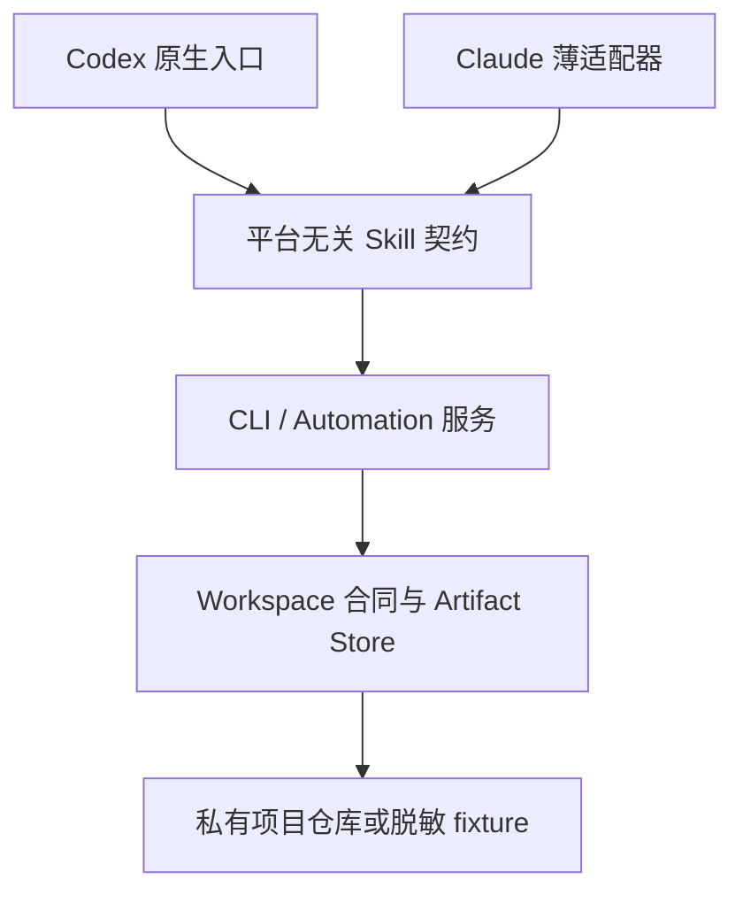

# Kata 全仓代码审查与一次性架构切换方案

> 审查对象：`https://github.com/koco-co/kata.git`  
> 审查基线：`main@11a3921a97463cf1a6628afcedfdba44f981f32b`  
> 基线提交时间：2026-07-22 22:38:28 +08:00  
> 审查日期：2026-07-22  
> 已确认决策：一次性切换；Claude Code 与 Codex 双端支持；Codex 优先；迁移并规范化 `workspace/dataAssets` 全部历史需求。

## 1. 结论

Kata 目前具备较丰富的 QA 领域资产和不少可复用实现，但还没有形成一个稳定、可验证、双端一致的产品级工程系统。最主要的问题不是单个脚本质量，而是规则、实现、目录和运行状态之间缺少唯一权威来源：同一件事在 Codex Skill、Claude Skill、Schema、CLI、Playwright 配置、lint 和历史项目目录中存在不同定义，导致规则写得很严格，实际却无法被持续执行。

建议直接进入 `v5` 一次性切换，不保留旧命令、旧 runner、旧目录、旧 manifest 或双写兼容。目标不是“把现有目录整理一下”，而是建立以下五个强约束：

1. 平台无关的业务契约只有一份，Codex 是主入口，Claude Code 是薄适配器。
2. 每个 feature 使用稳定 ASCII ID，显示名称、客户和版本只放元数据，不参与路径。
3. 用例、自动化能力和运行记录分别拥有独立 Schema，不再用一个 `metadata.yaml` 承担所有状态。
4. 自动化范围由 `automation/suite.yaml` 声明，不再依赖 `smoke.spec.ts` / `full.spec.ts` 聚合 import。
5. 所有临时产物和正式运行证据都由 `run-id`、manifest、校验器和保留策略管理；不能证明归属的文件禁止生成，不能证明完成条件的运行禁止标记为通过。

当前建议评级：**不适合继续在现有架构上增量扩展；应先完成 P0 风险处置和一次性迁移，再恢复新需求开发。**

## 2. 审查范围与方法

本轮覆盖：

- 1,491 个 Git 跟踪文件的路径、类型、大小、哈希、目录归属和迁移处置分类。
- 59 个历史 feature、891 个 `workspace/dataAssets` 跟踪文件。
- `.agents`、`.claude`、CLI、Schema、Playwright 配置、共享库、集成插件、CI、文档与工作区规则。
- 16 个含自动化代码的目录，其中 15 个位于标准 `automation/`，1 个嵌套在 `inputs/legacy/automation/`。
- 309 个历史自动化 TypeScript 文件、246 个 case 文件、36 个 runner spec、569 个 `test()` 调用。
- JSON/YAML 可解析性、符号链接、Markdown 本地引用、内容重复、路径长度、静态代码味道、TypeScript、Biome 和目标测试。

逐文件结果见配套清单 `kata-code-review-file-inventory.csv`。清单为每个跟踪文件记录：路径、区域、文件类型、大小、行数、SHA-256、建议处置、目标位置和命中的风险代码。二进制文件做了路径、大小、哈希和归属审查；DOCX/XMind/XLSX/JMX 的业务语义没有等价于人工逐页审阅，因此迁移时仍需做内容脱敏和格式验收。

## 3. 仓库基线

| 指标 | 结果 | 判断 |
| --- | ---: | --- |
| Git 跟踪文件 | 1,491 | 仓库规模已需要自动化治理，不能依赖提示词约束 |
| `workspace/dataAssets` 文件 | 891 | 其中大量为真实客户与历史需求资料 |
| feature | 59 | 1 个缺少 `metadata.yaml` |
| feature 下文件 | 777 | 跨 v6.4.6 至 v7.0.0 |
| `_shared` 文件 | 111 | 页面对象、helper、知识、审计和历史备份混杂 |
| TypeScript | 739 | 但根 TypeScript 检查排除整个 `workspace` |
| Markdown | 258 | 21 份历史 PRD 存在 209 个真实失效图片链接 |
| PNG | 238 | 存在跨 feature 重复与超长名称 |
| XMind | 39 | 二进制用例导出与源数据职责不清 |
| 非空重复内容组 | 38 组、158 个文件 | 理论可消除约 14.9 MB 重复内容 |
| 最长路径 | 269 UTF-8 bytes | 4 条超过 240 bytes，跨平台风险高 |
| Git pack | 32.47 MiB | 当前历史尚可，但大文件策略缺失 |
| 最大单文件 | 4.28 MB DOCX | 客户报告直接进入公开框架仓库 |
| 最大 TypeScript | 11,030 行 | `_shared/pages/.../data-quality-page.ts` 已是巨型对象 |
| 最大 runner | 4,420 行 | runner 中直接实现大量业务逻辑，违反自身规范 |

当前仓库为公开仓库。路径中有 498 个文件直接包含客户/组织名称；文本中还能检出内网地址、ZenTao/Lanhu 引用和客户业务资料。规则扫描未确认有效明文私钥或 API key，但这不能替代对二进制附件和 Git 历史进行专用秘密扫描。

## 4. 最高优先级问题

### P0-1：公开框架仓库混入客户、内网和项目运行资料

证据：

- `workspace/AGENTS.md:4` 已明确要求真实客户产物优先进入独立私有仓库或制品存储，但当前公开仓库保留 891 个 DataAssets 文件。
- 498 个文件路径带客户/组织标识；存在客户性能报告 DOCX、XMind、XLSX、JMX、截图、patch 和内部环境线索。
- `_shared/knowledge/.history/` 跟踪 6 个 `.bak`，其中路径包含内网主机信息。

影响：商业信息、内部拓扑、产品实现和测试数据可能被长期保留在公开 Git 历史中；以后仅删除工作树文件也不能撤销历史暴露。

建议：架构迁移前先完成数据分类。框架仓库只保留脱敏 fixture；真实 `workspace/dataAssets` 应迁移到私有项目仓库。若业务决定仍在当前仓库保留，至少必须先将仓库转私有、轮换可能受影响的凭据、执行 Git 历史扫描，并建立内容准入门禁。该动作优先于目录重排。

### P0-2：路径校验可被绝对路径和前缀碰撞绕过

证据：`.claude/scripts/_shared/lib/paths.ts:156-165`。

- 绝对路径完全跳过 `allowedRoots` 校验。
- 相对路径使用字符串 `startsWith()` 判断，`/allowed-x` 可以命中 `/allowed`。
- 没有 `realpath`、路径边界分隔符或 symlink 逃逸检查。
- 该函数被 archive、XMind patch、历史转换和 PRD frontmatter 等读写命令复用。

影响：提供特制路径时，CLI 可能读取或写入仓库允许根之外的文件。对可以修改 XMind、生成 archive 的命令，这是实际文件系统安全边界缺陷。

建议：建立唯一 `PathPolicy`：拒绝未授权绝对路径；对候选路径和允许根执行 `realpath`；使用 `relative(root, candidate)` 判断；拒绝 `..`、绝对 relative 和 symlink 穿越；项目、feature、suite、run-id 等每个路径段均做正则和长度校验。所有写入必须使用能力化的 `WorkspaceWriter`，不能让命令自行拼路径。

### P0-3：真实历史自动化被主检查体系整体排除

证据：

- `tsconfig.json:15` 排除 `workspace`。
- `biome.json:53` 排除 `workspace`。
- `workspace/dataAssets/tsconfig.json:6-7` 仍映射不存在的 `shared/`，实际目录是 `_shared/`。
- 根 `tsc --noEmit` 退出 0；单独运行 DataAssets tsconfig 产生 **1,742 个 TypeScript 错误**。

影响：主分支可以显示类型检查通过，同时 309 个自动化 TS 文件存在大量缺失模块、隐式 any、DOM/Node 类型缺失和实际类型错误。新增历史脚本不会受到根检查保护。

建议：建立 `tsconfig.automation.json`，包含 Node、DOM、Playwright 类型，明确引用 `workspace/*/shared` 和所有 feature spec；CI 分别运行核心包、运行时适配器、工作区自动化三套 type-check。Biome 只排除原始输入和生成产物，不能排除 `automation/**`。

### P0-4：Playwright 默认发现路径和输出路径与真实目录不一致

证据：`playwright.config.ts:70-87`。

- `testMatch` 查找 `features/**/tests/...`，真实标准和现有代码位于 `features/**/automation/tests/...`。
- `resolveOutputDir()` 把结果写到 `features/<feature>/tests/.runs/test-results`，同样遗漏 `automation`，并制造新的同义目录。
- 注释声称没有项目变量时可 fallback，代码在 `playwright.config.ts:29-31` 直接抛错。
- Allure 默认写 `_shared/published-reports`，Skill 又要求 feature `runs/`，形成双输出模型。
- 配置 import 时即解析真实环境和认证，使只做静态发现、`--list` 或 review 也依赖环境。

影响：默认测试发现不能代表仓库真实自动化；调用方只能靠显式路径绕过。测试结果、Allure 和 feature 运行记录可能落入三个不同位置。

建议：配置本身保持纯净，不在 import 阶段读取认证；根配置发现 `**/automation/specs/**/*.spec.ts`；CLI 从 `suite.yaml` 解析精确范围并创建 run 目录，将 Playwright、Allure 和日志路径一次性注入。

### P0-5：运行器允许“零用例成功”，且 Allure 失败不影响成功状态

证据：`.claude/skills/playwright-automation/scripts/run-tests-notify.ts:190-201, 287-301, 304-353`。

- 两阶段都注入 `--pass-with-no-tests`。
- 没有验证 manifest 声明数、选择数、执行数和结果数。
- Allure 生成失败只写日志，最终仍返回 Playwright 退出码。
- `SKIP_NOTIFY=1` 会在写完部分日志后立即退出，不生成 `run.json` 或摘要。
- 统计来自 Allure result 文件数量，重试可能把 attempt 当作逻辑用例重复计数。

影响：没有发现测试、串行/并行标签错误、报告生成失败或结果统计异常时，流程仍可能以 0 退出并被表述为通过。

建议：删除 `--pass-with-no-tests`；开始运行前冻结 `declared/selected` 清单；结束时以 Playwright JSON reporter 的 test identity 统计；通过必须满足 `selected > 0`、`executed == selected`、失败和意外跳过为 0、所有必需产物成功、业务记录策略满足、清理状态合法。任一门禁失败都由统一 `KataError` 返回非 0。

### P0-6：Codex 与 Claude Code 对同一 Skill 给出不同事实

证据：

- `.agents/skills/playwright-automation/SKILL.md:12-17` 允许无环境 review/generate；`.claude/.../SKILL.md:23-29` 要求任何探测前先确认环境且硬编码推荐 `ltqc-local`。
- Codex 推荐 `automation/manifest.yaml` 和 feature-local `pages/fixtures`；Claude 的 `directory-structure.md:27-48` 禁止 automation 顶层 YAML，且要求 page/helper 全部放 `_shared`。
- Codex run contract 示例把 `.spec.ts` 放 `tests/cases`；Claude 目录规范明确禁止。
- Codex 以 mode/manifest 决定完成范围；Claude 强制 `full.spec.ts + --headed + 平台记录`。
- `README.md:31-34` 和 `docs/CODEX-SKILLS.md:13-20` 承认大部分 Codex Skill 仍是指向 `.claude` 的兼容软链接。

影响：相同用户输入因运行端不同产生不同目录、状态、提问、代理策略和“完成”结论。所谓双端支持目前是双实现，不是双端一致。

建议：平台无关的语义契约只保留一份；Codex 和 Claude 文件只描述调用平台差异。模型名、代理数量、工具名称和固定阶段不得进入共享业务规则。

### P0-7：Worker 阻塞协议在提示词与 Schema 之间不可同时满足

证据：

- `execution-protocol.md:78-96` 使用 `session_expired`、`tool_permission_denied`、`no_permission`。
- `WorkerStatusEnvelope.v1.schema.json:28-35` 只允许 `missing_evidence`、`ambiguous_requirement`、`history_only`、`missing_required_fact`。

影响：按 Playwright 提示词正确工作的 worker 会生成 Schema 无法验证的结果，主流程只能忽略验证、错误阻塞或临时扩展枚举，进一步造成漂移。

建议：统一 `ProblemDetails`：`code` 使用稳定机器码，`category` 使用需求/环境/权限/产品/脚本/数据/基础设施，`retryable` 明示，`evidence` 为受控相对路径。Schema、提示词模板和测试从同一枚举源生成。

## 5. Playwright 自动化专项审查

### 5.1 历史脚本质量画像

| 规则/代码味道 | 次数 | 涉及文件 | 说明 |
| --- | ---: | ---: | --- |
| `waitForTimeout()` | 389 | 71 | Skill 明确禁止，但 lint 没有执行该规则 |
| `.nth()` | 153 | 32 | 默认依赖 DOM 顺序，页面微调即易失效 |
| `test.skip/fixme` | 11 | 10 | 存在长期“缺数据”跳过，破坏完成度统计 |
| `catch(...)` | 831 | 74 | 大量宽泛兜底或吞错模式 |
| `page.locator(...)` | 1,086 | 135 | CSS/结构定位比重过高，需逐个分级 |
| `force: true` | 40 | 12 | 可能掩盖遮挡、状态或交互问题 |
| 当前时间/随机数直接调用 | 165 | 80 | 测试数据和 generatedAt 不可控、不可复现 |
| 直接 API/SQL 迹象 | 9 | 7 | 需要在 suite manifest 声明用途和权限 |

典型巨型文件：

- `...支持每个数据表的规则集管理/automation/tests/full.spec.ts`：4,420 行。
- `...数据质量任务性能优化.../t16-ui-rebuild-v6411-cases.ts`：4,084 行。
- `...集成测试用例/automation/tests/smoke.spec.ts`：2,760 行。
- `workspace/dataAssets/_shared/pages/.../data-quality-page.ts`：11,030 行。

这些文件同时承担导航、数据准备、页面对象、业务流程、断言、修复和结果收集。它们不能通过改名解决，必须按领域组件、场景 spec 和 fixture 拆分。

### 5.2 命名与范围失真

- 8 组同一 feature 内重复 `tNN`，如完整性 JSON Key 的 `t03/t04`，Lindorm 的 `t17/t26/t28/t30/t31/t32`。
- 78 个弱语义文件名，如 `t01-key.ts`、`t08-case-08.ts`。
- 大量 `-shell.ts` / `-contract.ts` 只做页面壳或文案可见性检查，却容易被聚合 runner 当成完整业务自动化。
- 37 个 runner 处置项需要删除或迁移；当前存在 `full-a/b/c/d`、`fail-only`、`archive-pending`、`data-quality-pending` 等任意命名。
- 4,420 行 `full.spec.ts` 和 2,760 行 `smoke.spec.ts` 直接包含测试体，与“runner 只能 import”规则相反。

建议取消 `tNN` 和 runner 双重编号。用例拥有永久 ID，例如 `DA-15696-C0044`；文件名采用 `<case-id>--<slug>.spec.ts`。优先级和 suite 成员关系存入 `suite.yaml`，不从文件名或 import 推断。

### 5.3 `build-case-tasks` 不适合作为权威计划器

证据：`.claude/skills/playwright-automation/scripts/build-case-tasks.ts`。

- 只按中文关键词判断是否写数据，`配置` 等词会误判，隐式写操作会漏判。
- 租户排除硬编码“泸州老窖”“生产环境”。
- archive 只识别五级标题；格式微调即可得到零用例。
- ID 是当前位置生成的 `C001...`，插入一条用例后全部变化。
- 已声明的 case 文件不存在时静默生成 fallback 标题，仍进入调度。
- `case_file` 没有做 feature 根内路径约束。
- 同时维护 FeatureMetadata@2、manifest@1 和 archive fallback，增加三套语义。

建议：计划器只消费已验证的 `cases/cases.yaml` 和 `automation/suite.yaml`。写数据、串行、前置、清理、UI 核心动作、业务记录要求都必须显式声明；文件不存在、路径越界、重复 case ID 或 suite 空集合必须立即失败。

### 5.4 报告与 handoff 存在路径和一致性问题

- `report-to-pdf.ts:246-250` 信任报告 JSON 的附件相对路径，`../` 可以读取报告目录之外的图片并内嵌到 PDF。
- `report-to-pdf.ts:131-133` 对所有图片强制标记 PNG MIME。
- 输出路径无限制，写入非原子；`waitForTimeout(500)` 又违反 Skill 自身规范。
- 成功时 stdout 输出英文句子，不符合根 CLI “stdout 只输出数据”的契约。
- `handoff-render.ts:67-86` 按目录名取第一个 feature；同名跨版本时存在歧义，且输出非原子。
- `PlaywrightAutomationHandoff@2` 强制 acceptance command 包含 `full.spec.ts` 与 `--headed`，与 Codex mode/suite 契约冲突。
- passed 时强制至少一个 platform record，导致明确授权的只读场景永远不能合法通过。

建议：删除独立 handoff 双轨。`run.json` 是机器真相，`summary.md` 由它一次性生成。PDF/Allure 是 artifact，不参与状态源；所有附件路径必须来自 artifact manifest、校验真实归属并记录哈希。

### 5.5 Prompt 规则过载

Claude Playwright Skill 共 26 个文件；Claude 与 Codex Playwright 相关内容约 3,666 行，其中 Markdown 规则约 2,095 行。核心 Skill 中混入了某次规则集、monitor ID、字段长度、特定租户和修复次数等事故后规则。这些内容应成为项目策略、数据 Schema 或 lint，不应成为每次上下文都加载的通用提示词。

目标结构应只有：

- `SKILL.md`：触发、模式、边界、最少工作流。
- `contract.md`：输入、输出、状态、不变量。
- `project policy`：DataAssets 特有字段、环境和数据规则。
- `Schema/lint`：可机械验证的命名、路径、状态、完整性。
- `playbook`：失败分类和可选修复策略，按需加载。

## 6. 目录与历史资产专项审查

### 6.1 当前可直接识别的目录违规

静态审计识别 45 个显式布局问题：

| 类型 | 数量 | 说明 |
| --- | ---: | --- |
| 缺少 cases 索引 | 8 | 但目标架构将取消手工 README 索引，改由 cases Schema 生成 |
| feature 根散落 | 5 | 性能方案、报告、DOCX、`.gitignore` 直接落根 |
| case 名非法 | 1 | `_db.ts` |
| runner 名非法 | 13 | 任意 full 分片、pending、fail-only 等 |
| metadata 缺失 | 1 | v7.0.0 数据资产性能测试 |
| automation 顶层散落 | 2 | `sql/`、`scripts/` |
| tests 顶层散落 | 15 | helper、precond、fixtures、sql、README、根 spec 等 |

现有 lint 仍会漏报：

- `feature-root-layout.ts:10-12` 忽略几乎所有隐藏文件，因此 `.env.local` 可绕过明确禁令。
- automation 顶层同样忽略所有隐藏文件。
- `inputs/legacy/automation/` 不在扫描入口内。
- runner 检查没有真正验证 runner 只有 import。
- 没有执行 `waitForTimeout`、宽泛 catch、skip、唯一 ID、manifest 对齐、文件大小等规则。

### 6.2 历史 PRD 引用已经断裂

21 份真实 feature PRD 共存在 209 个失效本地图片链接。主要原因是 PRD 仍引用 `images/<name>.png`，图片实际已经移动到 `inputs/lanhu-snapshots/`。JSON 和 YAML 均可解析、跟踪的符号链接也没有断裂，因此这里不是普通文件损坏，而是历史迁移没有同步更新内容引用。

建议：输入文件通过 `source-id` 和内容哈希引用，不再在 Markdown 中手写相对目录。迁移器建立旧链接到新 asset ref 的映射，验证每个引用可解析后才删除旧路径。

### 6.3 临时产物与备份没有所有权模型

- `.process/` 同时被 Workspace 规则列为 feature 固定目录，又被 Playwright 目录白名单排除。
- `.gitignore` 忽略 `runs/`、`.process/`、`.debug/`，但是否允许生成、由谁清理并没有 manifest 强制。
- 6 个 `.bak` 已被跟踪，说明“临时备份”可以永久进入源码。
- `automation-normalize.ts` 把文件移动到 `runs/<timestamp>-normalized`，但不写 run manifest、变更清单或原子事务。
- `automation-scaffold.ts` 同步非原子写文件，`--force` 可以覆盖 runner，且不创建统一 manifest 或 run contract。

建议：删除 feature `.process/`。执行中状态进入仓库忽略的 `.kata/runtime/<run-id>/`；需要交付的状态原子收敛到 feature `runs/<run-id>/run.json`。清理命令只能删除 artifact manifest 记录且处于允许保留策略内的路径。

## 7. 其余架构、稳定性与安全问题

### 7.1 运行时实现反向依赖 Claude 目录

`package.json` workspace、bin、TypeScript path alias 和中央 CLI 都指向 `.claude/**`。`.agents/scripts/kata` 只是符号链接，7 个 Codex Skill 也是 Claude Skill 的符号链接。因此“Codex 优先”不能只改 README，必须把运行时代码从 `.claude` 移出。

建议：

```text
apps/kata-cli/
packages/core/
packages/contracts/
packages/workspace/
packages/automation-playwright/
packages/integrations/{dtstack,lanhu,notify,zentao}/
skills/<skill-name>/
.agents/skills/<skill-name>/SKILL.md
.claude/skills/<skill-name>/SKILL.md
```

`.agents` 是 Codex 原生入口；`.claude` 只做 Claude frontmatter 和工具适配；业务实现和 Schema 不属于任何运行端。

### 7.2 Codex 工具映射文档已过时

`.agents/skills/using-kata-codex/references/codex-tools.md:7-31` 声称存在 `close_agent`，并要求保持固定子代理结构。当前可用能力与该文档不一致；是否允许多代理也应由当前客户端和任务约束决定。

建议：删除稳定工具名映射表。适配器只描述能力，例如“可用时并行独立任务”，不得规定不存在的 API；Codex Skill 不固定代理数量、模型或工具拓扑。

### 7.3 CLI 是静态耦合的单进程注册表

`.claude/scripts/_shared/cli/index.ts` 静态 import 所有命令和 skill 脚本。任意可选集成依赖缺失都会妨碍 `kata --help`；大量模块内部直接 `process.exit()`，也破坏组合、测试和嵌入使用。全仓可检出 50 个文件中的 149 个 `process.exit` 迹象，虽然一部分属于合法 CLI 边界，但当前边界没有统一执行。

建议：命令定义仅返回 `CommandResult` 或抛 `KataError`，只有 `apps/kata-cli/main.ts` 映射退出码；命令按 namespace 懒加载；`--json` 输出单一稳定文档，进度只写 stderr；外部副作用默认 dry-run。

### 7.4 文件写入广泛绕过原子写规则

代码中大量 `writeFileSync`、`renameSync`、`mkdirSync` 和直接覆盖模式；scaffold、handoff、PDF、Lanhu 下载等均未统一使用原子事务。根 `AGENTS.md` 和 `workspace/AGENTS.md` 的原子写要求没有形成公共库和 lint。

建议：只允许 `AtomicWriter.write()`、`ArtifactStore.commit()` 和 `MigrationTransaction.apply()` 三类写入入口；临时文件必须同文件系统、`fsync` 后 rename；已有最终产物先比对哈希，冲突时失败而非覆盖。

### 7.5 网络调用缺少统一超时、取消和响应上限

`dtstack` 登录、通用 HTTP client、Lanhu 图片下载、通知 webhook、ZenTao 创建均有直接 `fetch()`；多数没有 AbortSignal、响应体大小限制或统一重试预算。通用 client 最多重试 6 次，每次固定递增等待，但单次请求无超时。

影响：CLI 可无限挂起、下载超大响应、重复外部请求；错误日志还可能包含服务端完整响应。

建议：所有网络调用经 `HttpClient`：默认连接/总超时、用户取消、最大响应、重试幂等性、退避抖动、敏感响应脱敏。创建类 POST 默认不自动重试，除非有幂等键。

### 7.6 页面公共库仍使用固定等待

`lib/playwright/ant-design/interactions.ts`、`navigation.ts` 和 DataAssets 适配器包含固定等待；`execute-table.ts:169` 固定等待 15 秒。公共库一旦鼓励固定等待，Skill 再禁止也无法生效。

建议：公共交互返回可观察状态，调用方用 locator assertion、response predicate、polling deadline 或产品事件等待。对确实需要退避的后台任务，使用有超时和诊断的 polling，而不是 sleep。

### 7.7 Schema 过度宽松又彼此重叠

`FeatureMetadata@2` 同时允许中文旧 ID 和 ASCII ID，`feature_id` 可选；`requirement_context`、source ref 等大量 `additionalProperties: true`。feature 生命周期、用例起草、自动化能力和最近运行都堆在一个文件，造成每个命令都需要兼容部分字段。

建议拆分：

- `feature.yaml`：稳定身份、显示信息、来源、生命周期。
- `inputs/sources.yaml`：来源和哈希。
- `cases/cases.yaml`：权威用例。
- `automation/suite.yaml`：自动化能力和范围。
- `runs/<id>/run.json`：一次不可变运行。

### 7.8 CI 无法证明主干处于可发布状态

- 当前基线提交没有可见 combined status 或 workflow run 证据。
- 本地 Biome 检查失败：437 个文件中 12 errors、39 warnings、6 infos。
- CI 的 `features-lint` / `features-index` 使用 `bunx kata`，可能解析外部包或产生入口歧义，应显式调用仓库本地 CLI。
- GitHub Actions 使用可变 tag，未固定提交 SHA；没有依赖审查、CodeQL/静态安全、秘密扫描、许可证策略或制品保留策略。
- `.gitignore` 以“有效行不得超过 20”作为门禁，约束形式而非风险，容易阻止合理的产物隔离。

建议：保护主分支，并把 core、adapter contract、workspace migration、automation lint、unit/integration 分成可观察 job；Actions 固定 SHA；启用依赖和秘密检查；取消 `.gitignore` 行数限制，改为“受控产物根 + manifest 所有权”测试。

## 8. 目标架构



建议仓库结构：

```text
kata/
├── apps/
│   └── kata-cli/
│       ├── src/main.ts
│       └── src/commands/
├── packages/
│   ├── core/                    # 错误、时间、ID、日志、原子写、路径策略
│   ├── contracts/               # JSON Schema + 生成类型 + 语义校验器
│   ├── workspace/               # feature、source、case、run、迁移服务
│   ├── automation-playwright/   # suite 计划、配置、运行、报告、质量门禁
│   └── integrations/            # dtstack / lanhu / notify / zentao
├── skills/                      # 平台无关的语义契约、policy、playbook
├── .agents/skills/              # Codex 原生、短入口；正式优先支持
├── .claude/skills/              # Claude Code 薄适配入口
├── config/
│   ├── schema/
│   └── env.example.yaml
├── workspace/
│   └── dataAssets/              # 建议实际迁入私有项目仓库
├── tests/
│   ├── contract/
│   ├── migration/
│   └── fixtures/
└── docs/adr/
```

依赖方向必须是单向的：adapter → skill contract → application service → domain/contracts → infrastructure。`packages/**` 不得 import `.agents` 或 `.claude`；workspace 也不得 import runtime Skill。

## 9. 统一 workspace 目录和命名

### 9.1 项目与 feature

```text
workspace/dataAssets/
├── project.yaml
├── features/
│   └── <feature-id>/
│       ├── feature.yaml
│       ├── inputs/
│       │   ├── sources.yaml
│       │   └── raw/<source-id>/...
│       ├── cases/
│       │   └── cases.yaml
│       ├── automation/
│       │   ├── suite.yaml
│       │   ├── specs/<case-id>--<slug>.spec.ts
│       │   └── support/{pages,fixtures,data,sql}/
│       └── runs/<run-id>/...
└── shared/
    ├── automation/{pages,components,fixtures}/
    ├── knowledge/
    └── assets/sha256/<prefix>/<digest>
```

命名规则：

| 对象 | 规则 | 示例 |
| --- | --- | --- |
| project ID | `^[a-z][a-z0-9-]{1,31}$` | `data-assets`；可在一次切换中把旧 `dataAssets` 改为此 ID |
| feature ID | 稳定 ASCII，最大 64；不含客户、版本、日期状态 | `req-15696-json-format-config` |
| source ID | `<kind>-<stable-id>` 或 `<kind>-<hash8>` | `lanhu-15696` |
| case ID | 项目内永久 ID，不随顺序变化 | `DA-15696-C0044` |
| spec | `<case-id>--<slug>.spec.ts` | `da-15696-c0044--export-json.spec.ts` |
| run ID | UTC 时间 + 随机后缀 | `20260723T051530Z-a1b2c3d4` |
| artifact | 由固定类型决定，不使用自由文本标题 | `artifacts/screenshots/<case-id>/<step-id>.png` |

显示名称、客户、版本、模块、中文标题只写 `feature.yaml`，不得进入目录名。feature 采用扁平稳定路径；版本是元数据和查询条件，不因版本或归档状态改变位置。

### 9.2 输入合同

`inputs/sources.yaml` 每个来源至少包含：

- `source_id`、`kind`、`origin_ref`。
- `captured_at`、`content_sha256`、`local_path`。
- `classification`：public/internal/confidential/restricted。
- `redaction_status`、`contains_customer_data`、`retention`。
- `derived_from`，用于截图、转换 MD、导入 CSV 的可追溯关系。

原始输入只读；修订后的需求事实进入 `cases.yaml` 或知识库。相同二进制使用内容寻址 asset store，不复制到多个 feature。禁止 `image`、`image 1`、完整需求句子和时间戳备份作为文件名。

### 9.3 用例合同

`cases/cases.yaml` 是唯一权威源；Archive Markdown、XMind、CSV 都是导入源或导出物，不再互相作为真相源。每条 case 至少包含：

- 永久 `case_id`、标题、优先级、标签。
- `source_refs` 和需求覆盖关系。
- 前置、步骤、可见结果、数据和清理策略。
- `automation_eligibility` 与不能自动化的明确原因。
- 变更历史使用事件记录或 Git，不生成 `.bak`。

Markdown/XMind 导出进入一次 run 的 `artifacts/case-exports/`，不与源码并列跟踪；若团队必须跟踪导出物，CI 要用内容哈希证明它与 `cases.yaml` 同步。

## 10. 统一 Playwright 能力与运行合同

### 10.1 `automation/suite.yaml`

建议字段：

```yaml
schema: kata.automation-suite/v1
feature_id: req-15696-json-format-config
spec_root: specs
cases:
  - case_id: DA-15696-C0044
    spec: da-15696-c0044--export-json.spec.ts
    tags: [smoke, full]
    core_channel: ui
    mutation: create
    record_evidence: required
    setup_channels: [api]
    cleanup: owned-records-only
suites:
  smoke:
    include_tags: [smoke]
  full:
    include_tags: [full]
artifacts:
  required: [playwright-json, summary, allure-results]
  on_failure: [trace, screenshot, stderr]
```

不再保留 runner。suite 选择器解析为不可变 case 清单，CLI 在运行前输出并写入 `run.json`。任何重复 case ID、缺失 spec、空 suite、越界路径或未声明 API/DB 写入都会在启动前失败。

### 10.2 run 目录

```text
runs/<run-id>/
├── run.json
├── summary.md
└── artifacts/
    ├── manifest.json
    ├── logs/{stdout.log,stderr.log}
    ├── playwright/{results.json,test-results/}
    ├── allure/{results/,report/}
    ├── screenshots/<case-id>/
    ├── traces/<case-id>.zip
    └── downloads/
```

`run.json` 至少记录：Schema、run/feature/suite/mode、runtime adapter、仓库 revision、环境引用（不含秘密）、起止时间、冻结范围、命令数组和退出码、逻辑 case 计数、失败分类、业务记录、清理结果、artifact 清单、未解决项。

状态分层：

| 维度 | 状态 |
| --- | --- |
| feature 生命周期 | `draft / ready / active / blocked / archived` |
| 自动化能力 | `not-started / generated / verified / degraded` |
| operation mode | `review / generate / run / repair / migrate` |
| run outcome | `running / passed / failed / blocked / cancelled / infrastructure-error` |

禁止把 `reviewed`、`generated-not-run` 和真实运行 `passed` 混在同一个 status 枚举。review/generate 是 operation，结果由 `completed` 与 findings 表达；只有 mode=run/repair 才能产生 passed。

### 10.3 passed 不变量

通过状态必须由代码计算，不能由 agent 自行填写：

1. `selected > 0`。
2. `executed == selected`；排除项在运行前冻结并有原因。
3. passed + failed + skipped = executed，且 failed=0、unexpected skipped=0。
4. 所有命令和 quality gate 退出码为 0。
5. suite 必需 artifact 已存在、位于 run 根内且哈希匹配。
6. 声明 mutation 的 case 已提供业务记录证据；只读 case 显式声明 `record_evidence: not-applicable`。
7. 清理只涉及本 run 创建的 ID；失败或保留均被记录。
8. run.json 与 summary.md 由同一模型生成并通过语义校验。

### 10.4 新命令面

一次性切换后的公开命令建议：

| 新命令 | 职责 | 被替代的旧入口 |
| --- | --- | --- |
| `kata feature validate <id>` | 验证 feature、source、case、suite | 分散的 features/cases/path lint |
| `kata automation review <id>` | 静态审查，不需要环境 | Skill 内隐式 review |
| `kata automation generate <id>` | 生成/更新 spec，不声称运行 | scaffold + agent 手工维护 runner |
| `kata automation plan <id> --suite <name>` | 冻结执行清单 | `case-tasks build` |
| `kata automation run <id> --suite <name> --env <ref>` | 唯一真实运行入口 | `run-tests-notify`、直接 `bunx playwright` |
| `kata automation repair <run-id>` | 依据失败 run 修复并新建 run | 隐式 repair loop |
| `kata run show <run-id>` | 查看机器与人类摘要 | handoff 双轨 |
| `kata run prune --policy <name>` | 按 artifact manifest 清理 | `results prune` |
| `kata workspace migrate --plan <file>` | 执行一次性、有哈希的迁移 | `automation normalize` 和各类临时迁移脚本 |

删除旧入口，不保留 alias、warning 周期或兼容分支。插件、README、CI、示例和 Skill 在同一切换提交中更新。

## 11. Codex 优先、Claude Code 双端支持

### 11.1 权威关系

- `skills/<name>/contract.md`：平台无关唯一事实源。
- `.agents/skills/<name>/SKILL.md`：Codex 原生入口，负责自然语言触发、最少路由和安全边界。
- `.claude/skills/<name>/SKILL.md`：Claude Code frontmatter 与工具适配，不复制业务规则。
- `packages/contracts`：Schema、枚举和语义验证；prompt 引用它们，不能另造状态。
- `apps/kata-cli`：所有可机械执行的规则。

### 11.2 双端一致性测试

每个 Skill 至少有：

- 触发与不触发 fixture。
- 相同输入在两端得到相同 mode、contract version、目标路径和状态语义。
- Claude 专用 frontmatter 不进入 Codex；Codex 工具名不进入共享 contract。
- 不允许固定模型、固定代理数或不存在的工具名。
- adapter 可以改变“怎么调用工具”，不能改变“什么算完成”。

### 11.3 Playwright Skill 应缩短为决策式入口

建议主流程只有：确定 mode 和 feature → 验证 contract → 计划 → 执行允许的操作 → 校验 run → 交付。环境只在 run/repair 时强制；review/generate 不因缺环境被阻塞。并发、子代理和模型选择由当前运行端根据规模决定。

## 12. 59 个历史 feature 的一次性迁移

### 12.1 迁移原则

每个旧文件只能有一种处置：`retain`、`convert`、`move`、`deduplicate`、`quarantine`、`delete-after-verification`。迁移计划记录旧路径、新路径、源哈希、目标哈希、转换器版本和验证结果。没有映射的文件、路径碰撞、断链或哈希异常都会阻止提交。

### 12.2 批次

#### 批次 0：安全冻结

- 暂停向旧 `workspace/dataAssets` 写新需求。
- 确认仓库可见性和客户资料授权；创建不可变迁移基线 tag。
- 运行 Git 历史 secret/PII 扫描；先完成需要轮换或移除的风险处置。

#### 批次 1：身份与目录

- 为 59 个 feature 生成稳定 ASCII ID 映射。
- 补齐唯一缺失 metadata；把版本、客户、中文名迁入 `feature.yaml`。
- 扁平化版本目录；不再按 active/archived 移动路径。
- 处理 4 条超过 240 bytes 的路径和所有自由文本文件名。

#### 批次 2：输入与引用

- 将根散落性能报告、方案、DOCX 移入 `inputs/raw/<source-id>/`。
- 修复 21 份 PRD 的 209 个失效图片引用。
- 对 38 个非空重复组进行内容寻址去重；保留来源引用，不复制 blob。
- `.bak` 转为正式版本记录后删除；`inputs/legacy` 只保留不可重建的原始输入。

#### 批次 3：用例真相源

- 把 archive、CSV、XMind 合并为 `cases/cases.yaml`。
- 生成永久 case ID；解决 8 组重复 `tNN`。
- 记录冲突、缺失预期和不可自动化原因；导出 Markdown/XMind 做一致性对照。

#### 批次 4：自动化重构

- 309 个 TypeScript 文件逐个按配套清单处置。
- 246 个 case 文件转换为 case-ID spec 或拆出 support。
- 删除 36 个 runner spec 和所有 import 聚合逻辑。
- 将 4,420/4,084/2,760/11,030 行巨型文件按领域拆分。
- 修复 389 个固定等待、审查 153 个 nth、831 个 catch、11 个 skip/fixme、40 个 force action。
- 将嵌套 `inputs/legacy/automation` 提取到正式 suite；无法证明业务价值的脚本隔离后删除。

#### 批次 5：切换与删除

- 新 CLI、Codex/Claude adapter、CI 和文档同时切换。
- 迁移器以 dry-run 计划和正式 apply 两阶段运行；apply 使用原子事务。
- 只有 1,491 个旧跟踪文件全部有已验证处置、59 个 feature 全部通过新 Schema、导出对照通过后，才删除旧目录和 legacy 代码。
- 删除 FeatureMetadata@1、旧 manifest、runner、`.process`、normalize/scaffold 兼容逻辑和所有旧命令。

### 12.3 回滚策略

一次性切换不等于不可回滚。回滚单位是 Git 迁移提交/基线 tag，不是在新代码里保留兼容分支。迁移器生成只读 `migration-report.json` 和路径映射；若验收失败，回退整个迁移提交，不双写旧新目录。

## 13. 工程质量门禁

### 必须阻止合并

- Schema 或语义校验失败。
- 任何 workspace automation TypeScript 错误。
- Biome error、失效本地引用、重复稳定 ID、空 suite。
- feature/automation/run 根存在白名单外文件，包括隐藏文件。
- 路径超过项目阈值、路径段非法或 symlink 逃逸。
- `waitForTimeout`、未声明 skip/fixme、空 catch、未授权 force、硬编码秘密/生产 URL。
- run 产物写到受控根之外，或 artifact 不在 manifest。
- Codex/Claude contract conformance 不一致。

### 允许告警但需要预算

- CSS locator、nth、超大文件、圈复杂度、非幂等 API 准备。
- 允许时必须有 owner、原因、到期日期；到期自动升级为 error。

### 建议测试分层

| 层 | 内容 |
| --- | --- |
| unit | ID、PathPolicy、Schema 语义、计划器、统计器、原子写 |
| contract | CLI JSON、双端 Skill、目录、run passed 不变量 |
| migration | 59 个 feature golden plan、断链、碰撞、幂等、回滚 |
| integration | 临时 workspace、真实 Playwright JSON/Allure fixture |
| e2e | 受控环境中的最小 UI smoke；不作为普通 PR 的唯一质量证明 |

## 14. 推荐实施优先级与验收

### P0：先止血

1. 处理公开仓库客户资料和历史泄露风险。
2. 修复 PathPolicy 和所有写入调用方。
3. 将 workspace automation 纳入 type-check/Biome。
4. 禁止 zero-test success；Allure/run.json 成为硬门禁。
5. 冻结旧目录写入。

### P1：建立新骨架

1. 建立 `apps/`、`packages/`、`skills/` 和 contracts。
2. 实现 feature/source/case/suite/run 五类 Schema。
3. 实现新 CLI、ArtifactStore、PathPolicy、AtomicWriter。
4. 实现 Codex 原生入口和 Claude 薄适配器。

### P2：迁移历史

按第 12 节执行 59 feature 迁移、引用修复、去重和自动化重构。建议以迁移清单为唯一工作队列，不按“看到哪个文件就挪哪个文件”的方式推进。

### 切换完成定义

- 1,491 个旧文件全部在迁移清单中有终态，未映射数为 0。
- 59/59 feature 通过新 Schema；所有 source 引用可解析。
- 209 个失效图片链接归零；重复 stable ID 归零。
- 新目录无旧 runner、`.process`、`.bak`、隐藏逃逸和自由命名根目录。
- workspace type-check、Biome、contract、migration、unit 全部通过。
- Codex 和 Claude 对同一 fixture 产生相同业务 contract 结果。
- 任意 run 都可从 `run.json` 唯一解释范围、退出码、计数、业务记录、清理和产物。
- 旧命令、旧 Schema 和兼容代码已删除，而非 deprecated。

## 15. 本轮验证记录

| 检查 | 命令/范围 | 退出码 | 结果 |
| --- | --- | ---: | --- |
| 根 TypeScript | `node node_modules/typescript/bin/tsc --noEmit --pretty false` | 0 | 通过；但根配置排除 workspace |
| DataAssets TypeScript | `tsc -p workspace/dataAssets/tsconfig.json --noEmit` | 2 | 1,742 errors |
| Biome | `biome check . --reporter=summary` | 1 | 437 files；12 errors、39 warnings、6 infos；workspace 被排除 |
| JSON/YAML 解析 | 全部跟踪 `.json/.yaml/.yml` | 0 | 0 个解析失败 |
| 符号链接 | 全部跟踪 symlink | 0 | 0 个断链 |
| Markdown 本地链接 | 全部跟踪 Markdown | 发现项 | 211 个缺失；其中 2 个为模板占位，209 个为真实 feature PRD |
| 目标单元测试 | Playwright automation 相关 8 个测试文件 | 1 | 83 pass、3 fail、1 skip；3 个失败均由本地依赖安装不完整导致 CLI 子进程缺模块，不能据此判定实现回归 |
| Git 工作树 | `git status --short` | 0 | 审查过程中未修改仓库文件 |

验证限制：审查环境最初未安装 Bun；通过临时 npm 缓存获取 Bun 后，依赖安装没有完整结束，导致完整测试套件和 3 个 CLI 子进程测试不具备有效判定条件。当前 GitHub 基线也没有可见的 status/check run 证据。因此本报告没有声称“全量测试已通过”。

## 16. 全文件处置矩阵

配套 CSV 覆盖全部 1,491 个跟踪文件。处置分布如下：

| 处置 | 文件数 | 含义 |
| --- | ---: | --- |
| move-and-refactor | 397 | 从 `.claude` 运行时目录迁入 apps/packages 并重构边界 |
| rewrite-or-extract | 301 | 历史自动化改写为 spec 或抽取 support |
| normalize-and-deduplicate | 234 | 输入统一命名、来源清单和内容寻址 |
| thin-claude-adapter | 89 | Claude Skill 缩为平台适配器 |
| convert-to-canonical-cases | 85 | archive/xmind/csv 转入 cases.yaml |
| sanitize-and-migrate | 81 | `_shared` 知识/审计/资产脱敏迁移 |
| rewrite-schema | 58 | metadata 改为 feature.yaml 新 Schema |
| relocate-and-classify | 45 | feature 根散落或非标准内容归类迁移 |
| remove-after-suite-migration | 37 | runner/.gitkeep 等在 suite 迁移后删除 |
| extract-or-remove-vendored-integration | 34 | 集成插件拆包或移除 vendor fork |
| retain-and-revalidate | 32 | 许可证、基础配置等保留并重新验证 |
| split-and-refactor | 24 | `_shared` 巨型 page/helper 拆分 |
| extract-and-rewrite | 15 | 从 `inputs/legacy/automation` 提取 |
| move-to-core-package | 12 | 根 `lib` 迁入 core |
| make-codex-primary | 10 | Codex 原生入口与说明 |
| update-documentation | 9 | README/安装/合同/ADR 同步 |
| update-ci-contract | 8 | CI 改为新命令和完整门禁 |
| replace-symlink-with-native-adapter | 7 | 取消 Codex 到 Claude 的 Skill symlink |
| delete-after-migration | 6 | 跟踪的 `.bak` |
| rewrite-build-contract | 5 | package/tsconfig/Biome/Playwright 重写 |
| quarantine-as-raw-input | 2 | 不可重建 legacy 输入保留为只读来源 |

CSV 中的处置是目标架构分类，不代表已经执行修改。迁移前应把它转为 `migration-plan.json`，补充目标精确路径和人工确认字段，再由迁移器 dry-run。

## 附录 A：59 个 feature 基线

| # | 当前 feature | automation 文件 | cases 文件 | 显式目录问题 | 迁移重点 |
| ---: | --- | ---: | ---: | ---: | --- |
| 1 | `v7.0.0/【v700】【16019】【岚图汽车】【数据质量】json格式校验导出支持勾选导出` | 4 | 2 | 1 | 重写元数据；automation 重构；cases 归一；source manifest |
| 2 | `v7.0.0/【v700】【岚图汽车】【数据质量】已上线需求用例` | 0 | 0 | 1 | 重写元数据；确认/重建用例源；source manifest；根散落归类 |
| 3 | `v7.0.0/【v700】【16035】【浙商证券】【数据质量】StarRocks3.x数据源支持` | 52 | 44 | 6 | 重写元数据；automation 重构；cases 归一 |
| 4 | `v7.0.0/【v700】【岚图汽车】数据资产集成用例` | 3 | 1 | 1 | 重写元数据；automation 重构；cases 归一 |
| 5 | `v7.0.0/【v700】【岚图汽车】数据资产性能测试` | 0 | 0 | 5 | 补 feature.yaml；确认/重建用例源；根散落归类 |
| 6 | `v6.4.9/【v649】【Gate】【数据标准】支持维护标准负责人、列表展示负责人、创建人信息` | 0 | 0 | 0 | 重写元数据；确认/重建用例源 |
| 7 | `v6.4.9/【v649】【袋鼠云】【数据质量】v63主流程用例` | 0 | 0 | 0 | 重写元数据；确认/重建用例源 |
| 8 | `v6.4.9/【v649】【袋鼠云】【数据资产】元数据、数据质量适配Doris3` | 0 | 0 | 0 | 重写元数据；确认/重建用例源 |
| 9 | `v6.4.9/【v649】【Gate】【数据安全】数据表权限分配支持通配符匹配批量配置权限` | 0 | 0 | 0 | 重写元数据；确认/重建用例源 |
| 10 | `v6.4.11/【v6411】【岚图汽车】【数据资产】数据质量任务性能优化，规则sql合并` | 25 | 5 | 3 | 重写元数据；automation 重构；cases 归一；source manifest |
| 11 | `v6.4.11/【v6411】【岚图汽车】【数据资产】数据资产适配lindorm` | 62 | 48 | 8 | 重写元数据；automation 重构；cases 归一 |
| 12 | `v6.4.11/【v6411】【岚图汽车】【数据资产】落标检查任务性能优化，规则sql合并` | 0 | 0 | 0 | 重写元数据；确认/重建用例源；source manifest |
| 13 | `v6.4.6/【v646】【岚图汽车】【数据标准】DBC落标检查` | 0 | 0 | 0 | 重写元数据；确认/重建用例源 |
| 14 | `v6.4.10/【v6410】【岚图汽车】【数据质量】多表数据一致性比对` | 0 | 0 | 0 | 重写元数据；确认/重建用例源 |
| 15 | `v6.4.10/【v6410】【岚图汽车】【数据质量】有效性JSONValue格式校验` | 35 | 29 | 1 | 重写元数据；automation 重构；cases 归一；source manifest |
| 16 | `v6.4.10/【v6410】【袋鼠云】【数据安全】下线行列级别权限配置` | 0 | 0 | 0 | 重写元数据；确认/重建用例源 |
| 17 | `v6.4.10/【v6410】【岚图汽车】【数据质量】JSON格式配置` | 54 | 46 | 3 | 重写元数据；automation 重构；cases 归一；source manifest |
| 18 | `v6.4.10/【v6410】【岚图汽车】【数据质量】完整性JSONKey范围校验` | 40 | 29 | 2 | 重写元数据；automation 重构；cases 归一；source manifest |
| 19 | `v6.4.8/【v648】【岚图汽车】【数据质量】规则任务支持编辑分区信息` | 0 | 0 | 0 | 重写元数据；确认/重建用例源 |
| 20 | `v6.4.8/【v648】【岚图汽车】【数据质量】时效性及时性两个字段之间的时间差校验` | 5 | 2 | 1 | 重写元数据；automation 重构；cases 归一 |
| 21 | `v6.4.8/【v648】【岚图汽车】【数据质量】任务时长限制` | 0 | 0 | 0 | 重写元数据；确认/重建用例源 |
| 22 | `v6.4.8/【v648】【岚图汽车】【数据质量】规则库支持自定义SQL模版` | 0 | 0 | 0 | 重写元数据；确认/重建用例源 |
| 23 | `v6.4.8/【v648】【岚图汽车】【数据质量】时效性周期性同一个字段的时间差校验` | 0 | 0 | 0 | 重写元数据；确认/重建用例源 |
| 24 | `v6.4.8/【v648】【岚图汽车】【数据质量】内置规则增加规则项` | 6 | 3 | 1 | 重写元数据；automation 重构；cases 归一 |
| 25 | `v6.4.8/【v648】【岚图汽车】【数据质量】合理性单调递减递增` | 0 | 0 | 0 | 重写元数据；确认/重建用例源 |
| 26 | `v6.4.8/【v648】【岚图汽车】【数据质量】Spark任务调参` | 0 | 0 | 0 | 重写元数据；确认/重建用例源 |
| 27 | `v6.4.8/【v648】【岚图汽车】【数据质量】菜单名称修改` | 3 | 0 | 3 | 重写元数据；automation 重构；确认/重建用例源 |
| 28 | `v6.4.8/【v648】【岚图汽车】【数据质量】一个数据表支持创建多个质量规则任务` | 0 | 0 | 0 | 重写元数据；确认/重建用例源 |
| 29 | `v6.4.8/【v648】【中电信息】【元数据】支持Doris引擎下指标全链路血缘` | 0 | 0 | 0 | 重写元数据；确认/重建用例源；source manifest |
| 30 | `v6.4.8/【v648】【岚图汽车】【数据质量】支持每个数据表的规则集管理` | 3 | 0 | 3 | 重写元数据；automation 重构；确认/重建用例源 |
| 31 | `v6.4.7/【v647】【数据质量】Spark任务调参` | 0 | 0 | 0 | 重写元数据；确认/重建用例源；source manifest |
| 32 | `v6.4.7/【v647】【数据质量】一致性多表数据一致性比对` | 0 | 0 | 0 | 重写元数据；确认/重建用例源；source manifest |
| 33 | `v6.4.7/【v647】【数据质量】每表规则集管理` | 0 | 0 | 0 | 重写元数据；确认/重建用例源；source manifest |
| 34 | `v6.4.7/【v647】【数据质量】校验失败邮件通知含明细数据` | 0 | 0 | 0 | 重写元数据；确认/重建用例源 |
| 35 | `v6.4.7/【v647】【数据质量】合理性单表字段计算关系对比` | 0 | 0 | 0 | 重写元数据；确认/重建用例源；source manifest |
| 36 | `v6.4.7/【v647】【数据资产】产品名称修改` | 0 | 0 | 0 | 重写元数据；确认/重建用例源 |
| 37 | `v6.4.7/【v647】【数据质量】合理性单调递减递增` | 0 | 0 | 0 | 重写元数据；确认/重建用例源；source manifest |
| 38 | `v6.4.7/【v647】【数据质量】控制每个规则开关` | 0 | 0 | 0 | 重写元数据；确认/重建用例源；source manifest |
| 39 | `v6.4.7/【v647】【东风商用车】【数据安全】批量创建脱敏规则、批量进行脱敏应用` | 0 | 0 | 0 | 重写元数据；确认/重建用例源 |
| 40 | `v6.4.7/【v647】【东风商用车】【数据治理】名称修改` | 0 | 0 | 0 | 重写元数据；确认/重建用例源 |
| 41 | `v6.4.7/【v647】【数据质量】一个表支持多个规则任务` | 0 | 0 | 0 | 重写元数据；确认/重建用例源；source manifest |
| 42 | `v6.4.7/【v647】【数据质量】有效性多规则且或关系` | 31 | 26 | 0 | 重写元数据；automation 重构；cases 归一；source manifest |
| 43 | `v6.4.7/【v647】【袋鼠云】【数据资产】v63回归` | 7 | 4 | 1 | 重写元数据；automation 重构；cases 归一；source manifest |
| 44 | `v6.4.7/【v647】【数据资产】集成测试用例` | 8 | 0 | 5 | 重写元数据；automation 重构；确认/重建用例源 |
| 45 | `v6.4.7/【v647】【数据质量】内置规则增加规则项` | 0 | 0 | 0 | 重写元数据；确认/重建用例源；source manifest |
| 46 | `v6.4.7/【v647】【袋鼠云】【元数据】适配SparkKyuubi模式` | 0 | 0 | 0 | 重写元数据；确认/重建用例源 |
| 47 | `v6.4.7/【v647】【数据质量】产品名称修改` | 0 | 0 | 0 | 重写元数据；确认/重建用例源；source manifest |
| 48 | `v6.4.7/【v647】【数据安全】Trino数据源权限管控` | 0 | 0 | 0 | 重写元数据；确认/重建用例源 |
| 49 | `v6.4.7/【v647】【数据质量】时效性同字段时间差校验` | 0 | 0 | 0 | 重写元数据；确认/重建用例源；source manifest |
| 50 | `v6.4.7/【v647】【数据质量】时效性两字段时间差校验` | 0 | 0 | 0 | 重写元数据；确认/重建用例源；source manifest |
| 51 | `v6.4.7/【v647】【数据质量】控制规则开关影响任务运行` | 0 | 0 | 0 | 重写元数据；确认/重建用例源；source manifest |
| 52 | `v6.4.7/【v647】【数据质量】报告字段维度范围选择` | 0 | 0 | 0 | 重写元数据；确认/重建用例源；source manifest |
| 53 | `v6.4.7/【v647】【数据质量】合理性多表字段大小计算对比` | 0 | 0 | 0 | 重写元数据；确认/重建用例源；source manifest |
| 54 | `v6.4.7/【v647】【元数据】数据库列表展示版本号` | 0 | 0 | 0 | 重写元数据；确认/重建用例源 |
| 55 | `v6.4.7/【v647】【数据质量】任务时长限制` | 0 | 0 | 0 | 重写元数据；确认/重建用例源；source manifest |
| 56 | `v6.4.7/【v647】【数据资产】主流程测试用例` | 0 | 0 | 0 | 重写元数据；确认/重建用例源 |
| 57 | `v6.4.7/【v647】【数据质量】规则任务支持编辑分区信息` | 0 | 0 | 0 | 重写元数据；确认/重建用例源；source manifest |
| 58 | `v6.4.7/【v647】【数据模型】Doris建表支持Datetime精度` | 0 | 0 | 0 | 重写元数据；确认/重建用例源 |
| 59 | `v6.4.7/【v647】【数据质量】规则库支持自定义SQL模版` | 0 | 0 | 0 | 重写元数据；确认/重建用例源；source manifest |

## 附录 B：45 个显式目录问题

| # | 规则 | 路径 | 当前问题 |
| ---: | --- | --- | --- |
| 1 | `CASE_INDEX_MISSING` | `workspace/dataAssets/features/v7.0.0/【v700】【16019】【岚图汽车】【数据质量】json格式校验导出支持勾选导出/automation/tests/cases` | cases/README.md missing |
| 2 | `FEATURE_ROOT` | `workspace/dataAssets/features/v7.0.0/【v700】【岚图汽车】【数据质量】已上线需求用例/.gitignore` | not in feature-root contract |
| 3 | `CASE_INDEX_MISSING` | `workspace/dataAssets/features/v7.0.0/【v700】【16035】【浙商证券】【数据质量】StarRocks3.x数据源支持/automation/tests/cases` | cases/README.md missing |
| 4 | `CASE_NAME` | `workspace/dataAssets/features/v7.0.0/【v700】【16035】【浙商证券】【数据质量】StarRocks3.x数据源支持/automation/tests/cases/_db.ts` | must match tNN-kebab.ts |
| 5 | `RUNNER_NAME` | `workspace/dataAssets/features/v7.0.0/【v700】【16035】【浙商证券】【数据质量】StarRocks3.x数据源支持/automation/tests/runners/full-b.spec.ts` | runner not allow-listed |
| 6 | `RUNNER_NAME` | `workspace/dataAssets/features/v7.0.0/【v700】【16035】【浙商证券】【数据质量】StarRocks3.x数据源支持/automation/tests/runners/full-a.spec.ts` | runner not allow-listed |
| 7 | `RUNNER_NAME` | `workspace/dataAssets/features/v7.0.0/【v700】【16035】【浙商证券】【数据质量】StarRocks3.x数据源支持/automation/tests/runners/full-c.spec.ts` | runner not allow-listed |
| 8 | `RUNNER_NAME` | `workspace/dataAssets/features/v7.0.0/【v700】【16035】【浙商证券】【数据质量】StarRocks3.x数据源支持/automation/tests/runners/full-d.spec.ts` | runner not allow-listed |
| 9 | `CASE_INDEX_MISSING` | `workspace/dataAssets/features/v7.0.0/【v700】【岚图汽车】数据资产集成用例/automation/tests/cases` | cases/README.md missing |
| 10 | `FEATURE_ROOT` | `workspace/dataAssets/features/v7.0.0/【v700】【岚图汽车】数据资产性能测试/岚图资产性能分析报告` | not in feature-root contract |
| 11 | `FEATURE_ROOT` | `workspace/dataAssets/features/v7.0.0/【v700】【岚图汽车】数据资产性能测试/岚图资产性能测试报告` | not in feature-root contract |
| 12 | `FEATURE_ROOT` | `workspace/dataAssets/features/v7.0.0/【v700】【岚图汽车】数据资产性能测试/岚图资产性能测试报告.docx` | not in feature-root contract |
| 13 | `FEATURE_ROOT` | `workspace/dataAssets/features/v7.0.0/【v700】【岚图汽车】数据资产性能测试/性能测试方案` | not in feature-root contract |
| 14 | `METADATA_MISSING` | `workspace/dataAssets/features/v7.0.0/【v700】【岚图汽车】数据资产性能测试` | metadata.yaml missing |
| 15 | `AUTOMATION_TOP` | `workspace/dataAssets/features/v6.4.11/【v6411】【岚图汽车】【数据资产】数据质量任务性能优化，规则sql合并/automation/sql` | automation/ only allows tests/ |
| 16 | `RUNNER_NAME` | `workspace/dataAssets/features/v6.4.11/【v6411】【岚图汽车】【数据资产】数据质量任务性能优化，规则sql合并/automation/tests/runners/result-recheck.spec.ts` | runner not allow-listed |
| 17 | `RUNNER_NAME` | `workspace/dataAssets/features/v6.4.11/【v6411】【岚图汽车】【数据资产】数据质量任务性能优化，规则sql合并/automation/tests/runners/sort.spec.ts` | runner not allow-listed |
| 18 | `AUTOMATION_TOP` | `workspace/dataAssets/features/v6.4.11/【v6411】【岚图汽车】【数据资产】数据资产适配lindorm/automation/scripts` | automation/ only allows tests/ |
| 19 | `TESTS_TOP` | `workspace/dataAssets/features/v6.4.11/【v6411】【岚图汽车】【数据资产】数据资产适配lindorm/automation/tests/helpers` | unexpected tests/ entry |
| 20 | `TESTS_TOP` | `workspace/dataAssets/features/v6.4.11/【v6411】【岚图汽车】【数据资产】数据资产适配lindorm/automation/tests/precond` | unexpected tests/ entry |
| 21 | `CASE_INDEX_MISSING` | `workspace/dataAssets/features/v6.4.11/【v6411】【岚图汽车】【数据资产】数据资产适配lindorm/automation/tests/cases` | cases/README.md missing |
| 22 | `RUNNER_NAME` | `workspace/dataAssets/features/v6.4.11/【v6411】【岚图汽车】【数据资产】数据资产适配lindorm/automation/tests/runners/data-quality.spec.ts` | runner not allow-listed |
| 23 | `RUNNER_NAME` | `workspace/dataAssets/features/v6.4.11/【v6411】【岚图汽车】【数据资产】数据资产适配lindorm/automation/tests/runners/archive-pending.spec.ts` | runner not allow-listed |
| 24 | `RUNNER_NAME` | `workspace/dataAssets/features/v6.4.11/【v6411】【岚图汽车】【数据资产】数据资产适配lindorm/automation/tests/runners/archive-inventory.ts` | runner not allow-listed |
| 25 | `RUNNER_NAME` | `workspace/dataAssets/features/v6.4.11/【v6411】【岚图汽车】【数据资产】数据资产适配lindorm/automation/tests/runners/data-quality-pending.spec.ts` | runner not allow-listed |
| 26 | `CASE_INDEX_MISSING` | `workspace/dataAssets/features/v6.4.10/【v6410】【岚图汽车】【数据质量】有效性JSONValue格式校验/automation/tests/cases` | cases/README.md missing |
| 27 | `TESTS_TOP` | `workspace/dataAssets/features/v6.4.10/【v6410】【岚图汽车】【数据质量】JSON格式配置/automation/tests/README.md` | unexpected tests/ entry |
| 28 | `RUNNER_NAME` | `workspace/dataAssets/features/v6.4.10/【v6410】【岚图汽车】【数据质量】JSON格式配置/automation/tests/runners/.gitkeep` | runner not allow-listed |
| 29 | `RUNNER_NAME` | `workspace/dataAssets/features/v6.4.10/【v6410】【岚图汽车】【数据质量】JSON格式配置/automation/tests/runners/fail-only.spec.ts` | runner not allow-listed |
| 30 | `TESTS_TOP` | `workspace/dataAssets/features/v6.4.10/【v6410】【岚图汽车】【数据质量】完整性JSONKey范围校验/automation/tests/README.md` | unexpected tests/ entry |
| 31 | `RUNNER_NAME` | `workspace/dataAssets/features/v6.4.10/【v6410】【岚图汽车】【数据质量】完整性JSONKey范围校验/automation/tests/runners/.gitkeep` | runner not allow-listed |
| 32 | `CASE_INDEX_MISSING` | `workspace/dataAssets/features/v6.4.8/【v648】【岚图汽车】【数据质量】时效性及时性两个字段之间的时间差校验/automation/tests/cases` | cases/README.md missing |
| 33 | `CASE_INDEX_MISSING` | `workspace/dataAssets/features/v6.4.8/【v648】【岚图汽车】【数据质量】内置规则增加规则项/automation/tests/cases` | cases/README.md missing |
| 34 | `TESTS_TOP` | `workspace/dataAssets/features/v6.4.8/【v648】【岚图汽车】【数据质量】菜单名称修改/automation/tests/full.spec.ts` | unexpected tests/ entry |
| 35 | `TESTS_TOP` | `workspace/dataAssets/features/v6.4.8/【v648】【岚图汽车】【数据质量】菜单名称修改/automation/tests/MANUAL-TRIAGE.md` | unexpected tests/ entry |
| 36 | `TESTS_TOP` | `workspace/dataAssets/features/v6.4.8/【v648】【岚图汽车】【数据质量】菜单名称修改/automation/tests/smoke.spec.ts` | unexpected tests/ entry |
| 37 | `TESTS_TOP` | `workspace/dataAssets/features/v6.4.8/【v648】【岚图汽车】【数据质量】支持每个数据表的规则集管理/automation/tests/full.spec.ts` | unexpected tests/ entry |
| 38 | `TESTS_TOP` | `workspace/dataAssets/features/v6.4.8/【v648】【岚图汽车】【数据质量】支持每个数据表的规则集管理/automation/tests/MANUAL-TRIAGE.md` | unexpected tests/ entry |
| 39 | `TESTS_TOP` | `workspace/dataAssets/features/v6.4.8/【v648】【岚图汽车】【数据质量】支持每个数据表的规则集管理/automation/tests/smoke.spec.ts` | unexpected tests/ entry |
| 40 | `CASE_INDEX_MISSING` | `workspace/dataAssets/features/v6.4.7/【v647】【袋鼠云】【数据资产】v63回归/automation/tests/cases` | cases/README.md missing |
| 41 | `TESTS_TOP` | `workspace/dataAssets/features/v6.4.7/【v647】【数据资产】集成测试用例/automation/tests/fixtures` | unexpected tests/ entry |
| 42 | `TESTS_TOP` | `workspace/dataAssets/features/v6.4.7/【v647】【数据资产】集成测试用例/automation/tests/MANUAL-TRIAGE.md` | unexpected tests/ entry |
| 43 | `TESTS_TOP` | `workspace/dataAssets/features/v6.4.7/【v647】【数据资产】集成测试用例/automation/tests/smoke.spec.ts` | unexpected tests/ entry |
| 44 | `TESTS_TOP` | `workspace/dataAssets/features/v6.4.7/【v647】【数据资产】集成测试用例/automation/tests/sql` | unexpected tests/ entry |
| 45 | `TESTS_TOP` | `workspace/dataAssets/features/v6.4.7/【v647】【数据资产】集成测试用例/automation/tests/precond` | unexpected tests/ entry |

## 附录 C：关键证据索引

| 主题 | 关键路径 |
| --- | --- |
| 根规则 | `AGENTS.md`、`workspace/AGENTS.md`、`config/AGENTS.md` |
| 双端说明 | `README.md`、`docs/CODEX-SKILLS.md`、`CLAUDE.md` |
| Codex Playwright | `.agents/skills/playwright-automation/` |
| Claude Playwright | `.claude/skills/playwright-automation/` |
| 目录规范 | `.claude/skills/playwright-automation/references/directory-structure.md` |
| 运行实现 | `.claude/skills/playwright-automation/scripts/run-tests-notify.ts` |
| 计划器 | `.claude/skills/playwright-automation/scripts/build-case-tasks.ts` |
| PDF | `.claude/skills/playwright-automation/scripts/report-to-pdf.ts` |
| Handoff | `.claude/skills/playwright-automation/scripts/handoff-render.ts` |
| Schema | `.claude/scripts/_shared/schemas/` |
| 路径安全 | `.claude/scripts/_shared/lib/paths.ts` |
| 目录 lint | `.claude/scripts/_shared/lint/feature-root-layout.ts`、`tests-layout.ts` |
| 迁移工具 | `.claude/scripts/_shared/cli/automation-normalize.ts`、`automation-scaffold.ts` |
| Playwright 配置 | `playwright.config.ts` |
| 构建检查 | `package.json`、`tsconfig.json`、`workspace/dataAssets/tsconfig.json`、`biome.json` |
| CI | `.github/workflows/` |
| 逐文件结果 | `kata-code-review-file-inventory.csv` |
