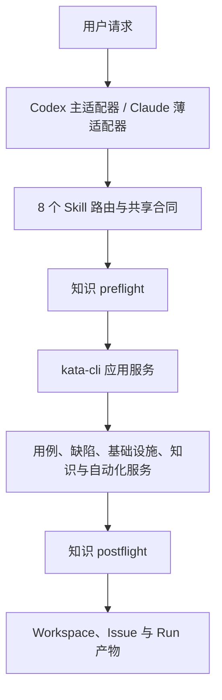
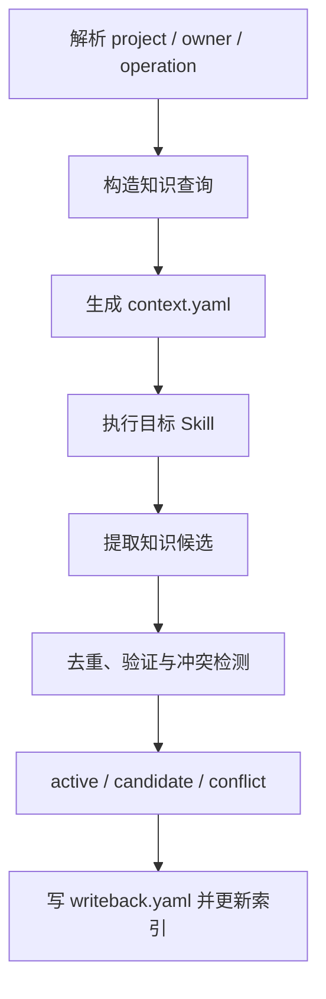
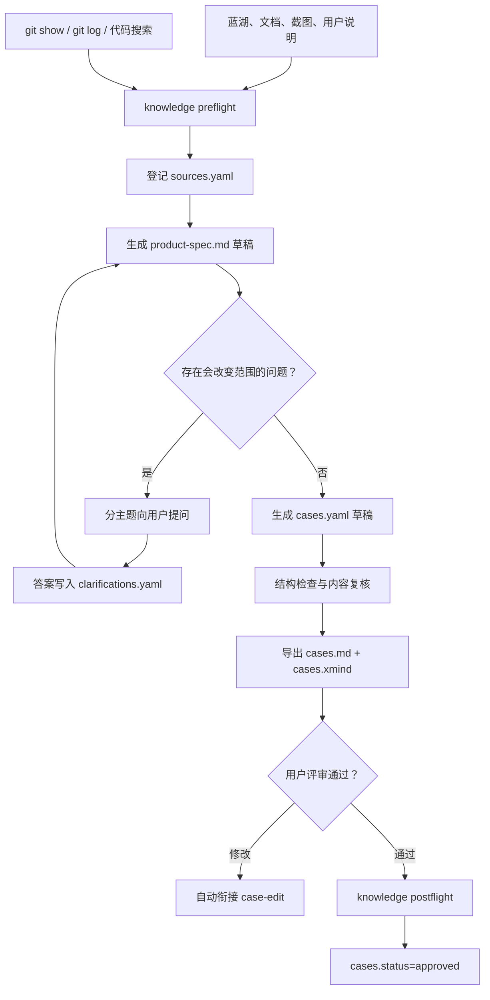
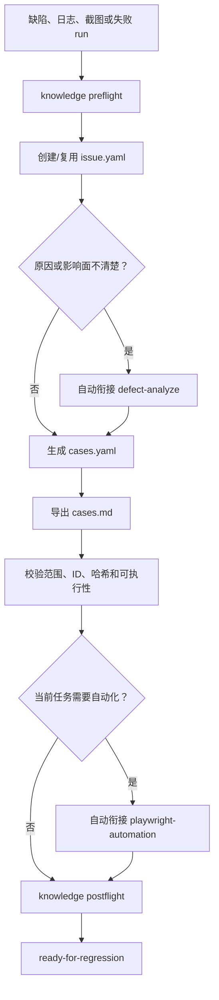
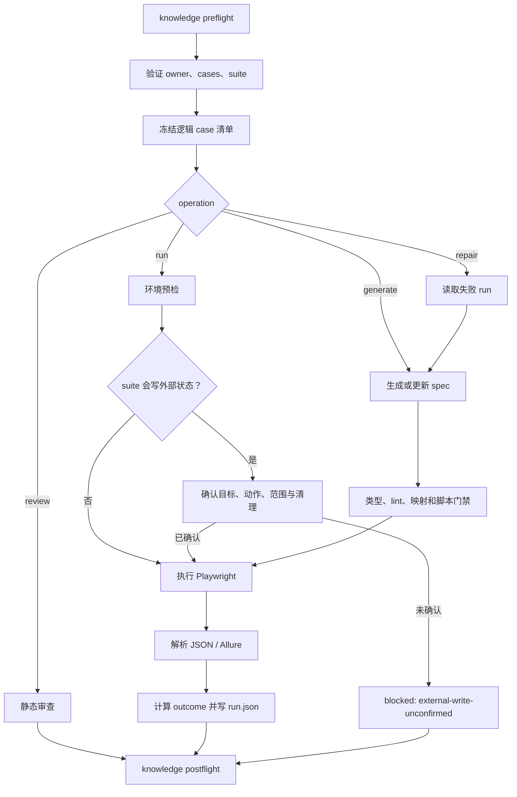

# Kata v5 审查重构详细设计方案

| 项目 | 内容 |
| --- | --- |
| 仓库 | `https://github.com/koco-co/kata.git` |
| 设计基线 | `main@11a3921a97463cf1a6628afcedfdba44f981f32b` |
| 方案版本 | `1.4` |
| 日期 | `2026-07-23` |
| 状态 | 可执行设计，供本地 Codex CLI 实施 |
| 本次修订 | 补齐 8 个 Skill 的完整目录与产物合同；将 `knowledge-curate` 改为默认启用的跨 Skill 知识前置检索与后置沉淀闭环；增加分析、诊断、知识和 workspace 系统记录的 Schema、CLI、CI 与验收规则 |

## 1. 方案结论

本次重构采用 `v5` 一次性切换，不保留旧目录、旧命令、旧 runner、旧 manifest、旧 Schema
或双写兼容层。开发分支中可以暂时同时存在新旧结构，但最终合并到主分支的提交必须只保留
新架构。

已确定的方向如下：

1. Kata 仍以测试日常工作为核心。`case-draft → playwright-automation` 是主要端到端业务链路，
   但不是全部能力。经用户意图、输入输出、owner、完成条件和权限边界复核，以下 8 个 Skill
   的拆分合理，保留独立入口和现有名称：
   - `case-draft`：从原始需求建立规范化产品文档并生成新功能用例。
   - `case-edit`：编辑、补充、合并和重新导出既有功能用例。
   - `case-hotfix`：围绕单个缺陷生成或维护快速回归用例。
   - `defect-analyze`：分析异常、实现差异、冲突和缺陷原因。
   - `infra-diagnose`：诊断服务器、网络、中间件、数据源和执行环境问题。
   - `knowledge-curate`：整理、去重、校验和维护项目业务知识。
   - `workspace-manage`：创建、校验、迁移、索引和整理工作区。
   - `playwright-automation`：基于已评审用例生成、审查、运行和修复 Playwright 自动化。
2. Codex 是首要运行端；Claude Code 继续支持，但只保留薄适配入口。
3. 平台无关的业务规则、Schema、目录合同和完成条件只维护一份。
4. `workspace/dataAssets` 一次性迁移为 `workspace/data-assets`，59 个历史需求全部进入新结构。
5. 历史自动化代码继续保留可追溯版本，但不再用备份文件、日期后缀和重复目录保存版本；源码
   版本由 Git 保存，运行历史由 `runs/<run-id>` 保存。
6. 蓝湖、原始文档、截图和源码只作为输入。功能用例生成前，必须先形成规范化产品文档并完成
   必要的用户澄清。
7. `cases/cases.yaml` 是测试用例唯一正式数据源。feature 用例强制生成 Markdown 和 XMind；
   Hotfix 用例只生成 YAML 与 Markdown，不生成 XMind、Excel、CSV 等其他用例格式。这里的
   “只生成 YAML 与 Markdown”指测试用例格式，不排斥同一 issue 目录内按合同生成
   `issue.yaml`、来源、分析、自动化和运行记录。
8. 自动化范围由 `automation/suite.yaml` 声明；不得再用 `smoke.spec.ts`、`full.spec.ts` 或
   runner import 聚合用例。
9. 所有执行产物必须归属于唯一 `run-id`，并由 `run.json` 和 `artifacts/manifest.json` 管理。
10. “通过”只能由程序按照计数、退出码、产物和清理结果计算，Agent 不得自行填写。
11. 8 个 Skill 的正式产物采用统一的 owner、源文件、派生文件和 run 证据模型；不得由 Skill
    自由决定目录或临时增加同义文件。
12. `knowledge-curate` 既保留用户可直接调用的独立入口，也作为所有业务型 Skill 的默认
    基础服务。每次执行前自动检索适用知识，形成新且已验证的业务结论后自动沉淀；用户无需
    主动提到 `knowledge-curate`。
13. 自动沉淀不等于无条件写入“已确认知识”。明确来源、作用域且通过验证的结论可自动生效；
    推测、单次异常、作用域不明或与现有条目冲突的内容只能进入候选或冲突队列。

## 2. 目标与边界

### 2.1 本次必须完成

- 重组根目录、CLI、共享代码、Schema、Skill 和 workspace。
- 重构并保留全部 8 个 Skill 的独立入口、共享合同、工作流和一致性测试。
- 建立规范化产品文档、需求澄清、测试用例、评审导出、自动化套件和运行记录合同。
- 建立 `workspace/data-assets/_shared/issues/<issue-id>/`，统一承载 `case-hotfix` 的缺陷
  回归资产。
- 建立 `_shared/analyses/`、`_shared/diagnostics/`、`_shared/knowledge/` 和 `_system/`，
  分别承载独立分析、基础设施诊断、长期知识和项目控制记录。
- 将 Hotfix 导出固定为 `cases.yaml + cases.md`，移除 Hotfix XMind、Excel、CSV 和多格式开关。
- 为 8 个 Skill 分别确定唯一 owner、必需输入、正式数据源、人类可读输出、run 证据、
  可选产物和禁止产物。
- 建立知识 preflight/postflight：执行 Skill 前生成可追溯的知识上下文包，执行后生成候选、
  去重、冲突检查和写回记录。
- 将 59 个历史 feature、1,491 个已审查文件逐项迁移或处置。
- 修复 Playwright 发现范围、输出目录、零用例成功、Allure 失败不阻断等问题。
- 将 workspace 中的自动化 TypeScript 和 Biome 检查纳入主 CI。
- 删除 Claude 目录对通用运行代码的所有权；Codex 和 Claude 都只能调用平台无关实现。
- 更新中英文 README、安装说明、CLI 合同、目录说明、ADR 和变更记录。

### 2.2 本次不做

- 不为旧命令、旧目录或旧文件名提供 alias、warning 期或兼容读取。
- 不把历史文档、源码现状或旧自动化行为自动当作新需求。
- 不在迁移时臆测缺失的产品规则；无法确定的内容进入澄清记录或迁移待办。
- 不为了让历史脚本通过而降低断言、扩大重试、保留固定等待或吞掉异常。
- 不重写用户未授权改变的外部业务系统数据。
- 不在没有单独授权时改写 Git 历史、删除远端分支或改变 GitHub 仓库可见性。

## 3. 不可破坏的设计约束

| 编号 | 约束 |
| --- | --- |
| INV-01 | 一个概念只有一个正式数据源；导出物不得反向覆盖源文件。 |
| INV-02 | 目录使用稳定 ASCII ID；客户、版本、中文标题只写入元数据。 |
| INV-03 | 原始输入只读；整理后的内容写入 `requirements/` 和 `cases/`。 |
| INV-04 | 源码只用于了解当前实现，产品文档与源码冲突时必须请用户决定。 |
| INV-05 | 未评审通过的 `cases.yaml` 不得进入正式自动化生成。 |
| INV-06 | review、generate、run、repair 是不同操作，不共享“通过”状态。 |
| INV-07 | 空 suite、零用例执行、计数不一致或 Allure 失败都不能返回成功。 |
| INV-08 | 所有写入通过 PathPolicy、WorkspaceWriter 和 AtomicWriter。 |
| INV-09 | 临时文件、截图、trace、下载和日志必须归属于 run，不得散落。 |
| INV-10 | Codex 与 Claude 可使用不同工具，但对目录、状态和完成条件的判断必须一致。 |
| INV-11 | 自动化脚本、用例 ID、需求 ID 和运行 ID 都必须稳定、唯一、可校验。 |
| INV-12 | 迁移清单未覆盖的文件数不为 0 时，不得删除旧目录或完成切换。 |
| INV-13 | 8 个 Skill 都保留独立入口；主链路节点不得吞并其他 Skill 的职责。 |
| INV-14 | 当前请求范围内自动衔接；创建禅道 Bug、SSH 修复、远端推送、平台数据写入等外部写操作执行前必须确认。 |
| INV-15 | Hotfix 永远写入 `workspace/data-assets/_shared/issues/<issue-id>/`，不得散落在 feature 或临时目录。 |
| INV-16 | Hotfix 用例只生成 `cases.yaml` 和 `cases.md`；不得生成 XMind、Excel、CSV 或其他用例导出格式。 |
| INV-17 | `<project-root>` 是已解析的项目根目录；当前项目恒为 `workspace/data-assets`。Hotfix 的唯一完整根路径是 `<project-root>/_shared/issues/<issue-id>/`，任何省略 `<project-root>` 的写法只可作为该根目录内的相对路径，不得解释为其他存放位置。 |
| INV-18 | 每个 Skill 都必须声明 owner 类型、规范源文件、派生文件、run-only 文件和禁止文件；未在合同中声明的正式产物不得写入 owner 根目录。 |
| INV-19 | 任一业务型 Skill 启动后、读取业务输入前，必须执行知识 preflight；结束前必须执行知识 postflight。两个钩子由 orchestration 强制调用，不能依赖用户主动提到 `knowledge-curate`。 |
| INV-20 | 只有 `active` 且作用域、版本、有效期均匹配的知识条目可作为确定事实使用；candidate、conflicted、stale、deprecated 条目只能用于提示风险或形成澄清问题。 |
| INV-21 | 源码观察只能沉淀为绑定 repository、commit 和版本范围的 `implementation-fact`，不得静默提升为产品业务规则。 |
| INV-22 | 知识库不得保存明文凭据、Cookie、token、客户生产数据、完整敏感日志或未脱敏截图；此类内容只保留受控 source ref。 |
| INV-23 | `_shared` 保存长期业务资产和可复用项目资产；`_system` 只保存索引、迁移、隔离、保留策略和项目级运行记录，不保存产品事实或测试用例。 |

## 4. 总体架构



依赖方向必须保持单向：

```text
runtime adapter
  → shared skill contract
    → application service
      → domain service / contracts
        → core infrastructure
```

禁止反向依赖：

- `packages/**` 不得 import `.agents/**` 或 `.claude/**`。
- `skills/**` 不得包含文件写入、路径拼接、状态计算等可执行规则。
- `workspace/**` 不得 import Skill。
- `.agents/**` 与 `.claude/**` 不得各自复制 Schema、枚举和完成条件。
- 项目级页面对象不得进入框架 package；框架通用代码不得放入 workspace。

## 5. 目标仓库结构

```text
kata/
├── apps/
│   └── kata-cli/
│       ├── package.json
│       └── src/
│           ├── main.ts
│           ├── command-registry.ts
│           └── commands/
├── packages/
│   ├── core/
│   ├── contracts/
│   ├── workspace/
│   ├── case-management/
│   ├── defect-analysis/
│   ├── infra-diagnostics/
│   ├── knowledge/
│   ├── orchestration/
│   ├── automation-playwright/
│   └── integrations/
├── skills/
│   ├── case-draft/
│   ├── case-edit/
│   ├── case-hotfix/
│   ├── defect-analyze/
│   ├── infra-diagnose/
│   ├── knowledge-curate/
│   ├── workspace-manage/
│   └── playwright-automation/
├── .agents/
│   └── skills/
├── .claude/
│   └── skills/
├── config/
│   ├── env/
│   ├── policies/
│   └── schema/
├── workspace/
│   └── data-assets/
├── tests/
│   ├── contract/
│   ├── migration/
│   ├── integration/
│   └── fixtures/
├── docs/
│   ├── adr/
│   ├── contracts/
│   └── migration/
├── package.json
├── tsconfig.base.json
├── tsconfig.automation.json
├── biome.json
└── playwright.config.ts
```

### 5.1 package 职责

| package | 职责 | 不得包含 |
| --- | --- | --- |
| `@kata/core` | 错误、时间、ID、哈希、日志、原子写和 PathPolicy | Schema、Playwright、Skill |
| `@kata/contracts` | JSON Schema、生成类型、语义校验器、版本兼容检查 | CLI、文件写入、运行端工具名 |
| `@kata/workspace` | 项目文件定位、读写、索引和迁移 | 页面逻辑、Agent 提示词 |
| `@kata/case-management` | 需求、用例、Hotfix 与评审导出 | 浏览器执行、环境凭据 |
| `@kata/defect-analysis` | 失败材料归一化、缺陷分类、影响面和结构化 handoff | 业务代码修复、基础设施写操作 |
| `@kata/infra-diagnostics` | 诊断计划、检查结果、环境分类和修复验证 | 明文凭据、未经授权的高影响操作 |
| `@kata/knowledge` | scoped 检索、上下文包、候选、来源、去重、冲突、失效和索引 | 未确认事实、客户知识越界提升、明文秘密 |
| `@kata/orchestration` | 8 个 Skill 路由、自动衔接、授权边界和中断恢复 | 运行端工具细节、自由路径写入 |
| `@kata/automation-playwright` | suite 计划、执行、结果解析和完成度计算 | 项目页面对象、Skill |
| `@kata/integrations` | Lanhu、Git source、DataAssets、通知等外部适配 | 核心状态定义、跨集成业务编排 |
| `@kata/kata-cli` | 命令解析、应用服务编排、stdout/stderr 和退出码 | 重复 Schema、直接自由写文件 |

### 5.2 workspace 分工

`workspace/data-assets/_shared` 只保存 DataAssets 项目内部复用的业务资产和项目级 issue：

```text
workspace/data-assets/_shared/
├── automation/
│   ├── pages/
│   ├── components/
│   ├── fixtures/
│   └── data/
├── knowledge/
│   ├── knowledge.yaml
│   ├── entries/
│   ├── candidates/
│   ├── conflicts/
│   ├── indexes/
│   └── runs/
├── issues/
│   └── <issue-id>/
├── analyses/
│   └── <analysis-id>/
├── diagnostics/
│   └── <diagnostic-id>/
└── assets/
    └── sha256/<前两位>/<完整哈希>
```

项目控制记录单独进入 `workspace/data-assets/_system/`：

```text
workspace/data-assets/_system/
├── indexes/
├── migrations/
├── quarantine/
├── retention/
└── runs/
```

当前 `_shared` 的处置原则：

- 通用路径、Schema、日志、CLI、报告解析：迁入 `packages/**`。
- DataAssets 页面对象、组件和业务 fixture：迁入 `workspace/data-assets/_shared/automation/**`。
- 项目业务知识：迁入 `workspace/data-assets/_shared/knowledge/**`。
- 缺陷回归、Hotfix 用例及其可选自动化：迁入
  `workspace/data-assets/_shared/issues/<issue-id>/`。
- 没有 issue owner 的代码 diff、冲突和独立审查：迁入
  `workspace/data-assets/_shared/analyses/<analysis-id>/`。
- 服务器、网络、数据源和中间件诊断：迁入
  `workspace/data-assets/_shared/diagnostics/<diagnostic-id>/`；通过引用关联 issue、feature 或 run，
  不复制证据。
- workspace 索引、迁移、隔离和保留策略：迁入 `workspace/data-assets/_system/**`。
- 发布报告、截图、trace、下载：迁入对应 `runs/<run-id>/artifacts/**`。
- `.history/*.bak`：在确认 Git 或正式版本记录可恢复后删除。
- 不能说明用途、无法被引用且不能重建的文件：先隔离并记录，验证后删除。

## 6. 统一 workspace 结构

本方案后文使用 `<project-root>` 表示项目根目录。对当前 DataAssets 项目：

```text
<project-root> = workspace/data-assets
```

因此，Hotfix 的唯一完整目录是：

```text
workspace/data-assets/_shared/issues/<issue-id>/
```

`_shared/issues/<issue-id>/` 只是在项目根已经确定时的简写，不是仓库根路径；严禁创建
`workspace/_shared/issues/`、`workspace/data-assets/features/<feature-id>/_shared/issues/`、
`workspace/data-assets/features/<feature-id>/issues/` 或继续写入旧
`workspace/dataAssets/_shared/archive/issues/`。

```text
workspace/data-assets/
├── project.yaml
├── features/
│   └── <feature-id>/
│       ├── feature.yaml
│       ├── inputs/
│       │   ├── sources.yaml
│       │   └── raw/<source-id>/...
│       ├── requirements/
│       │   ├── product-spec.md
│       │   └── clarifications.yaml
│       ├── cases/
│       │   ├── cases.yaml
│       │   └── review/
│       │       ├── cases.md
│       │       ├── cases.xmind
│       │       └── export-manifest.json
│       ├── automation/
│       │   ├── suite.yaml
│       │   ├── specs/
│       │   └── support/
│       │       ├── pages/
│       │       ├── fixtures/
│       │       ├── data/
│       │       └── sql/
│       └── runs/
│           └── <run-id>/...
└── _shared/
    ├── automation/
    ├── knowledge/
    │   ├── knowledge.yaml
    │   ├── entries/
    │   │   ├── business-rule/
    │   │   ├── terminology/
    │   │   ├── workflow/
    │   │   ├── permission/
    │   │   ├── data-contract/
    │   │   ├── implementation-fact/
    │   │   └── troubleshooting/
    │   ├── candidates/
    │   ├── conflicts/
    │   ├── indexes/
    │   └── runs/
    ├── assets/
    ├── issues/
    │   └── <issue-id>/
    │       ├── issue.yaml
    │       ├── inputs/
    │       │   ├── sources.yaml
    │       │   └── raw/<source-id>/...
    │       ├── analysis/
    │       │   ├── analysis.yaml
    │       │   └── defect-analysis.md
    │       ├── cases/
    │       │   ├── cases.yaml
    │       │   └── review/
    │       │       └── cases.md
    │       ├── automation/
    │       │   ├── suite.yaml
    │       │   ├── specs/
    │       │   └── support/
    │       └── runs/
    │           └── <run-id>/...
    ├── analyses/
    │   └── <analysis-id>/
    │       ├── analysis.yaml
    │       ├── report.md
    │       ├── inputs/sources.yaml
    │       └── runs/<run-id>/...
    └── diagnostics/
        └── <diagnostic-id>/
            ├── diagnostic.yaml
            ├── summary.md
            ├── inputs/sources.yaml
            ├── repair-plan.yaml
            ├── verification.yaml
            └── runs/<run-id>/...
└── _system/
    ├── indexes/
    ├── migrations/<migration-id>/
    ├── quarantine/<quarantine-id>/
    ├── retention/
    └── runs/<run-id>/...
```

### 6.1 命名规则

| 对象 | 规则 | 示例 |
| --- | --- | --- |
| project ID | `^[a-z][a-z0-9-]{1,31}$` | `data-assets` |
| customer ID | 项目内稳定 ASCII ID；显示名只写元数据 | `voyah` |
| feature ID | `^[a-z][a-z0-9-]{2,63}$` | `req-15696-json-format-export` |
| source ID | `<kind>-<稳定编号或 hash8>` | `lanhu-6e513ee1` |
| requirement ID | feature 内稳定编号 | `REQ-001` |
| clarification ID | feature 内稳定编号 | `Q-001` |
| case ID | 项目内永久唯一 | `DA-15696-C0044` |
| issue ID | `^[a-z][a-z0-9-]{2,63}$`，优先使用外部缺陷号 | `bug-dt-20418` |
| analysis ID | `analysis-<kind>-<hash8>` 或外部审查号 | `analysis-diff-a1b2c3d4` |
| diagnostic ID | `diag-<system>-<hash8>` | `diag-doris-fe-12ab34cd` |
| knowledge ID | `<type>-<semantic-slug>-<hash6>`，创建后永久稳定 | `business-rule-export-selection-a1b2c3` |
| migration ID | `mig-v5-<batch>-<hash8>` | `mig-v5-cases-a1b2c3d4` |
| quarantine ID | `quarantine-<reason>-<hash8>` | `quarantine-unclassified-a1b2c3d4` |
| step ID | case 内永久唯一 | `S01` |
| spec | `<case-id>--<slug>.spec.ts`，全小写 | `da-15696-c0044--export.spec.ts` |
| run ID | UTC 时间 + 随机后缀 | `20260723T051530Z-a1b2c3d4` |
| artifact | 固定类别 + case/step ID | `screenshots/DA-15696-C0044/S03.png` |

禁止：

- 中文、客户名、版本号、日期状态进入 feature 路径。
- `新建文件夹`、`images 2`、`最新`、`最终版`、`副本`、`backup` 等自由命名。
- 用时间戳文件保存源码历史版本。
- feature 根出现合同外文件或隐藏目录。
- spec、截图和日志使用完整用例标题作为文件名。

### 6.2 owner 与目录解析

所有正式产物必须先解析 owner，再由 `WorkspaceLocator` 返回路径。Skill、Agent 和 CLI command
不得直接拼接字符串路径。

| owner kind | owner ref | 唯一根目录 | 典型 Skill |
| --- | --- | --- | --- |
| project | `project:data-assets` | `<project-root>/` | `knowledge-curate`、`workspace-manage` |
| feature | `feature:<feature-id>` | `<project-root>/features/<feature-id>/` | `case-draft`、`case-edit`、`playwright-automation` |
| issue | `issue:<issue-id>` | `<project-root>/_shared/issues/<issue-id>/` | `case-hotfix`、`defect-analyze`、`playwright-automation` |
| analysis | `analysis:<analysis-id>` | `<project-root>/_shared/analyses/<analysis-id>/` | 独立 diff、冲突和审查模式 |
| diagnostic | `diagnostic:<diagnostic-id>` | `<project-root>/_shared/diagnostics/<diagnostic-id>/` | `infra-diagnose` |

owner 解析规则：

1. 已有 owner 时复用，不复制长期资产到第二个 owner。
2. `case-hotfix` 永远创建或复用 issue owner。
3. 已有关联 issue 的缺陷分析写入 issue；无 issue 的独立 diff/冲突分析使用 analysis owner。
4. 基础设施诊断始终使用 diagnostic owner，并通过 `related_owner_refs` 关联触发它的
   feature、issue 或 automation run。
5. `knowledge-curate` 的正式库属于 project owner；一次 curate 的运行记录写入
   `_shared/knowledge/runs/<run-id>/`。
6. `workspace-manage` 的运行记录写入 `_system/runs/<run-id>/`；迁移、隔离等专项记录再链接到
   `_system/migrations/` 或 `_system/quarantine/`。
7. 每个 owner 根只允许合同白名单中的顶层目录。暂存文件必须进入当前 run 的 `work/`，
   不能使用 owner 根下的 `.temp`、`tmp`、`latest` 或自由命名目录。

### 6.3 正式源、派生物与 run 证据

每个文件必须属于以下一种角色，`artifact manifest` 中必须明确记录：

| 角色 | 含义 | 覆盖规则 |
| --- | --- | --- |
| `canonical` | 后续流程直接读取的唯一正式源 | 通过服务生成 diff 后原子替换；保留 revision 和 hash |
| `derived` | 可从 canonical 重新生成的人类评审稿或索引 | 禁止反向覆盖 canonical；源 hash 变化即 stale |
| `source` | 只读原始输入、快照或外部引用 | 不原地改写；需要整理时生成新 canonical |
| `run-evidence` | 某次执行的日志、计划、截图、报告和中间结果 | 只能位于 `runs/<run-id>/`，按保留策略清理 |
| `control` | 索引、迁移、隔离和保留记录 | 只能位于 `_system/`，不得当作业务事实 |

同一内容不得同时拥有两个 canonical 文件。需要 Markdown 给人看时，优先使用结构化
YAML/JSON 作为 canonical、Markdown 作为 derived；`product-spec.md` 因本身就是规范化需求正文，
是少数 Markdown canonical 文件之一。

## 7. 数据合同

所有 Schema 放入 `packages/contracts/schema/`，使用 JSON Schema 2020-12。TypeScript 类型由
Schema 生成，禁止手写一套相似但不一致的类型。

### 7.1 合同清单

| Schema ID | 文件 | 作用 |
| --- | --- | --- |
| `kata.project/v1` | `project.schema.json` | 项目身份、分类、默认策略 |
| `kata.feature/v1` | `feature.schema.json` | feature 身份和生命周期 |
| `kata.issue/v1` | `issue.schema.json` | 项目级缺陷、Hotfix 范围和路径 |
| `kata.sources/v1` | `sources.schema.json` | 原始来源、快照、哈希和引用关系 |
| `kata.product-spec/v1` | `product-spec.schema.json` | 产品文档 frontmatter |
| `kata.clarifications/v1` | `clarifications.schema.json` | 用户问答、冲突和处理状态 |
| `kata.cases/v1` | `cases.schema.json` | 功能测试用例正式数据 |
| `kata.case-export/v1` | `case-export-manifest.schema.json` | MD/XMind 同步校验 |
| `kata.case-change-set/v1` | `case-change-set.schema.json` | 既有用例编辑的增删改、hash 与反馈处置 |
| `kata.automation-suite/v1` | `suite.schema.json` | 自动化范围、spec 和策略 |
| `kata.execution-plan/v1` | `execution-plan.schema.json` | 冻结后的自动化执行范围与外部写计划 |
| `kata.run/v1` | `run.schema.json` | operation 与真实运行结果 |
| `kata.artifact-manifest/v1` | `artifact.schema.json` | 产物、哈希和保留策略 |
| `kata.defect-analysis/v1` | `defect-analysis.schema.json` | 缺陷、冲突和 diff 分析的结构化结论 |
| `kata.infra-diagnostic/v1` | `infra-diagnostic.schema.json` | 环境诊断步骤、证据、分类与结果 |
| `kata.repair-plan/v1` | `repair-plan.schema.json` | 远程修复目标、动作、影响和回滚 |
| `kata.verification/v1` | `verification.schema.json` | 修复前后对比和验证结果 |
| `kata.knowledge-catalog/v1` | `knowledge-catalog.schema.json` | 项目知识库设置、分类和索引版本 |
| `kata.knowledge-entry/v1` | `knowledge-entry.schema.json` | 已生效知识条目 |
| `kata.knowledge-candidate/v1` | `knowledge-candidate.schema.json` | 自动提取但尚未满足生效条件的候选 |
| `kata.knowledge-conflict/v1` | `knowledge-conflict.schema.json` | 新旧结论冲突、影响与处置 |
| `kata.knowledge-context/v1` | `knowledge-context.schema.json` | Skill preflight 实际加载的知识上下文包 |
| `kata.skill-handoff/v1` | `skill-handoff.schema.json` | Skill 自动衔接的输入、状态和授权边界 |
| `kata.external-write-plan/v1` | `external-write-plan.schema.json` | 外部写目标、动作、范围、回滚和确认 hash |
| `kata.workspace-index/v1` | `workspace-index.schema.json` | 项目、owner、引用和派生物索引 |
| `kata.migration-plan/v1` | `migration-plan.schema.json` | 旧文件到新文件的逐项处置 |
| `kata.migration-report/v1` | `migration-report.schema.json` | 迁移执行和校验结果 |
| `kata.quarantine-manifest/v1` | `quarantine-manifest.schema.json` | 隔离文件、原因、原路径与处置状态 |
| `kata.retention-policy/v1` | `retention-policy.schema.json` | run、输入、报告和隔离内容的保留策略 |

### 7.2 `project.yaml`

```yaml
schema: kata.project/v1
project_id: data-assets
display_name: DataAssets
classification: confidential
feature_root: features
issue_root: _shared/issues
analysis_root: _shared/analyses
diagnostic_root: _shared/diagnostics
knowledge_root: _shared/knowledge
system_root: _system
case_id_prefix: DA
default_locale: zh-CN
retention_policy: standard
repository_visibility_required: private
```

保留真实客户历史资产时，`repository_visibility_required` 必须为 `private`。如果远端仍是公开仓库，
迁移器应返回安全阻塞，不得继续新增客户资料。

### 7.3 `feature.yaml`

```yaml
schema: kata.feature/v1
feature_id: req-15696-json-format-export
display_name: JSON 格式校验结果支持勾选导出
lifecycle: active
project_id: data-assets
requirement_keys:
  - "15696"
release_versions:
  - v7.0.0
customers:
  - customer_id: voyah
    display_name: 岚图汽车
    classification: confidential
modules:
  - data-quality
paths:
  sources: inputs/sources.yaml
  product_spec: requirements/product-spec.md
  clarifications: requirements/clarifications.yaml
  cases: cases/cases.yaml
  automation_suite: automation/suite.yaml
```

`feature.yaml` 只保存身份、显示信息、生命周期和固定路径，不再保存 case-draft、automation、run
等多套可变状态。

### 7.4 `inputs/sources.yaml`

```yaml
schema: kata.sources/v1
feature_id: req-15696-json-format-export
sources:
  - source_id: lanhu-6e513ee1
    kind: lanhu
    origin_ref: "https://lanhuapp.com/..."
    captured_at: "2026-07-23T05:15:30Z"
    content_sha256: "<sha256>"
    local_path: raw/lanhu-6e513ee1
    classification: confidential
    contains_customer_data: true
    redaction_status: original
    retention: permanent-input
  - source_id: git-frontend-11a3921a
    kind: git
    origin_ref: "repo:<name>@<commit>"
    captured_at: "2026-07-23T05:20:00Z"
    content_sha256: "<sha256>"
    local_path: raw/git-frontend-11a3921a/observations.md
    classification: internal
    contains_customer_data: false
    redaction_status: not-required
    retention: permanent-input
```

Git 来源必须记录：

- 仓库名称、commit SHA、读取的文件范围。
- 使用的 `git show`、`git log` 或 `git diff` 查询范围。
- 从源码观察到的当前行为。
- 与产品文档不一致的地方。

不得复制整个外部源码仓库到 feature 中，也不得把源码现状直接改写为产品要求。

### 7.5 `requirements/product-spec.md`

文档使用带 Schema 的 frontmatter：

```yaml
---
schema: kata.product-spec/v1
feature_id: req-15696-json-format-export
revision: 3
status: ready
source_refs:
  - lanhu-6e513ee1
  - git-frontend-11a3921a
knowledge_refs:
  - knowledge_id: business-rule-export-selection-a1b2c3
    entry_sha256: "<sha256>"
open_blocking_questions: 0
---
```

正文固定章节：

1. 背景与目标
2. 本次范围
3. 不在本次范围
4. 角色、权限和前置条件
5. 页面与入口
6. 主流程
7. 业务规则
8. 字段、枚举和校验
9. 状态变化
10. 异常与失败处理
11. 数据与清理
12. 兼容性和回归影响
13. 非功能要求
14. 验收条件
15. 已确认的冲突处理
16. 尚未解决的问题

每条可测试要求使用稳定编号 `REQ-001`、`REQ-002`。编号不得因段落调整而重排。

### 7.6 `requirements/clarifications.yaml`

```yaml
schema: kata.clarifications/v1
feature_id: req-15696-json-format-export
questions:
  - question_id: Q-001
    topic: 导出范围
    question: 未勾选任何结果时，导出按钮应禁用还是导出全部结果？
    status: merged
    blocking: true
    asked_at: "2026-07-23T05:30:00Z"
    answer: 未勾选时按钮禁用，并显示说明。
    answered_by: user
    merged_requirement_refs:
      - REQ-012
  - question_id: Q-002
    topic: 文件命名
    question: 导出文件名是否需要包含任务名称？
    status: deferred
    blocking: false
    defer_reason: 不影响本轮核心流程
```

状态只允许：

- `open`：尚未回答。
- `answered`：用户已回答，尚未写入产品文档。
- `merged`：已经写入产品文档并关联需求编号。
- `blocked`：当前信息不足，相关范围无法继续。
- `deferred`：明确推迟，不阻塞当前范围。

### 7.7 `cases/cases.yaml`

```yaml
schema: kata.cases/v1
project_id: data-assets
owner:
  kind: feature
  id: req-15696-json-format-export
revision: 4
status: approved
product_spec_sha256: "<sha256>"
review:
  approved_at: "2026-07-23T08:00:00Z"
  approved_by: user
cases:
  - case_id: DA-15696-C0044
    title: 勾选 JSON 格式校验结果后导出
    priority: P1
    tags: [functional, export, smoke]
    requirement_refs: [REQ-012]
    source_refs: [lanhu-6e513ee1]
    knowledge_refs:
      - knowledge_id: business-rule-export-selection-a1b2c3
        entry_sha256: "<sha256>"
    preconditions:
      - 已创建包含 JSON 格式校验结果的数据质量任务
      - 当前账号具有查看和导出权限
    steps:
      - step_id: S01
        action: 打开任务结果页面
        expected:
          - 页面显示可勾选的 JSON 格式校验结果
      - step_id: S02
        action: 勾选一条 JSON 格式校验结果并点击导出
        expected:
          - 浏览器开始下载导出文件
          - 导出文件只包含已勾选的结果
    cleanup:
      strategy: none
    automation:
      eligibility: eligible
      reason: ""
```

规则：

- case ID 永久保留；标题、优先级和步骤变化不得换 ID。
- 一条用例只验证一个可独立判断的场景。
- 每个步骤必须有可执行动作；关键步骤必须有可观察结果。
- `requirement_refs` 必须能在 `product-spec.md` 中找到。
- `knowledge_refs` 只允许引用 preflight 命中的 active entry，并冻结当时 hash；candidate、
  conflicted、needs-review 或 scope 不匹配条目不能进入该字段。
- `status=approved` 时，阻塞问题必须为 0，且产品文档哈希匹配。
- 只有 `automation.eligibility=eligible` 的用例可以进入 suite。
- 历史 feature 没有可恢复用例时，允许 `status=not-available` 和空 `cases`，但必须写
  `not_available_reason`；它不能进入自动化，也不能标记为 ready。

### 7.8 用例评审导出

所有导出物都从 `cases.yaml` 生成，但按使用场景采用不同的强制格式：

| 场景 | 正式数据源 | 强制评审稿 | 可选导出 |
| --- | --- | --- | --- |
| `case-draft` / `case-edit` | YAML | MD、XMind | XLSX、CSV |
| `case-hotfix` | YAML | MD | 无 |

feature 用例目录：

```text
cases/review/
├── cases.md
├── cases.xmind
├── cases.xlsx
├── cases.csv
└── export-manifest.json
```

feature 的 `export-manifest.json` 至少记录：

```json
{
  "schema": "kata.case-export/v1",
  "owner": {"kind": "feature", "id": "req-15696-json-format-export"},
  "source": "cases/cases.yaml",
  "source_sha256": "<sha256>",
  "case_count": 44,
  "exporter_version": "5.0.0",
  "required_formats": ["md", "xmind"],
  "optional_formats": ["xlsx", "csv"],
  "outputs": [
    {"path": "cases.md", "sha256": "<sha256>", "case_count": 44},
    {"path": "cases.xmind", "sha256": "<sha256>", "case_count": 44}
  ]
}
```

强制规则：

- `cases.yaml` 是唯一正式数据源。
- 所有评审导出只能由 CLI 从 `cases.yaml` 生成，不手工分别维护。
- `case-hotfix` 必须在 `<project-root>/_shared/issues/<issue-id>/` 内生成
  `cases/cases.yaml` 和 `cases/review/cases.md`，并且不得生成 XMind、Excel、CSV、JSON
  用例导出或提供多格式开关。
- Hotfix 的源哈希、用例数量、case ID 集合和 Markdown 哈希记录在 `issue.yaml#case_artifacts`，
  不为 Hotfix 另建 `export-manifest.json`。
- `case-draft` 与 `case-edit` 继续强制生成 MD 和 XMind。
- feature XMind 中的评审修改先形成变更建议，再由 `case-edit` 合并回 `cases.yaml`；
  Hotfix Markdown 评审修改由 `case-hotfix` 合并回 `cases.yaml`。
- 合并后按 owner profile 重新生成评审稿：feature 为 MD/XMind，Hotfix 仅为 MD。
- CI 校验源哈希、用例数量、case ID 集合和输出哈希。
- 一次操作的不可变副本同时写入
  `runs/<run-id>/artifacts/case-exports/`，便于回看当时评审版本。

### 7.9 `automation/suite.yaml`

```yaml
schema: kata.automation-suite/v1
feature_id: req-15696-json-format-export
cases_source: ../cases/cases.yaml
cases_sha256: "<approved-cases-sha256>"
spec_root: specs
cases:
  - case_id: DA-15696-C0044
    spec: da-15696-c0044--export-json.spec.ts
    tags: [smoke, full]
    core_channel: ui
    setup_channels: [api]
    mutation: create
    cleanup: owned-records-only
    record_evidence: required
suites:
  smoke:
    include_tags: [smoke]
  full:
    include_tags: [full]
artifacts:
  required: [playwright-json, summary, allure-results]
  on_failure: [trace, screenshot, stderr]
```

启动前必须校验：

- `cases_sha256` 等于当前已批准的 `cases.yaml`。
- case ID 在 `cases.yaml` 中存在且允许自动化。
- spec 路径位于 `automation/specs`，没有 `..`、绝对路径或 symlink 逃逸。
- 每个 spec 存在且只归属于声明的 case。
- suite 选择结果不为空。
- API/DB 准备、写入和清理已显式声明。
- case ID、spec、tag 和 suite 无重复或悬空引用。

### 7.10 `run.json`

run 目录：

```text
runs/<run-id>/
├── run.json
├── summary.md
├── work/
└── artifacts/
    ├── manifest.json
    ├── logs/
    │   ├── stdout.log
    │   └── stderr.log
    ├── playwright/
    │   ├── results.json
    │   └── test-results/
    ├── allure/
    │   ├── results/
    │   └── report/
    ├── screenshots/<case-id>/
    ├── traces/<case-id>.zip
    ├── downloads/
    ├── case-exports/
    └── knowledge/
        ├── query.yaml
        ├── context.yaml
        ├── candidates.yaml
        └── writeback.yaml
```

`run.json` 至少包含：

- Schema、run ID、owner（project、feature、issue、analysis 或 diagnostic）、operation mode。
- runtime adapter：Codex 或 Claude。
- 仓库 revision、cases SHA、suite SHA。
- 环境引用；不得包含 Cookie、token、密码。
- 开始、结束和持续时间。
- 冻结后的逻辑 case 清单和 Playwright 执行清单。
- 所有命令、退出码、stdout/stderr 路径。
- selected、executed、passed、failed、skipped 计数。
- 失败分类、重试原因和修复轮次。
- 本次创建或修改的业务记录。
- 清理对象、清理结果和未清理原因。
- artifact manifest 路径。
- unresolved 和 next actions。
- completion warnings；知识写回、派生索引等非业务主结果告警与真实 outcome 分开记录。

状态分开定义：

| 对象 | 状态 |
| --- | --- |
| feature 生命周期 | `draft / ready / active / blocked / archived` |
| issue 生命周期 | 见 `kata.issue/v1` |
| cases 评审 | draft / in-review / changes-requested / approved / not-available |
| 自动化能力 | `not-started / generated / verified / degraded` |
| operation mode | 见 operation 枚举 |
| run outcome | running / completed / passed / failed / blocked / cancelled |

issue 状态：

```text
open / analyzing / ready-for-regression / verified / closed / blocked
```

operation 枚举：

```text
intake / clarify / generate / edit / review / export / promote
analyze / diagnose / plan-repair / verify / curate / reconcile / invalidate
reindex / validate / migrate / quarantine / archive / run / repair
```

基础设施异常使用 `infrastructure-error`。只有自动化 `mode=run` 或 `mode=repair` 能产生
`passed`；其他成功操作使用 `completed`。

### 7.11 `issue.yaml`

`case-hotfix` 的一切正式资产始终归属于项目级 issue，不因关联到某个 feature 而改变存放位置：

```text
<project-root>/_shared/issues/<issue-id>/
└── issue.yaml
```

下列 `paths` 和 `case_artifacts.*_path` 都是相对于该 issue 根目录的路径，不代表另一个存放位置：

```yaml
schema: kata.issue/v1
project_id: data-assets
issue_id: bug-dt-20418
title: 导出 JSON 结果时页面无响应
status: ready-for-regression
severity: major
priority: P1
external_refs:
  - system: zentao
    id: "20418"
related_feature_ids:
  - req-15696-json-format-export
paths:
  sources: inputs/sources.yaml
  analysis: analysis/analysis.yaml
  analysis_report: analysis/defect-analysis.md
  cases: cases/cases.yaml
  automation_suite: automation/suite.yaml
case_artifacts:
  source_sha256: "<cases.yaml sha256>"
  case_count: 1
  case_ids: ["BUG-DT-20418-C001"]
  markdown_path: cases/review/cases.md
  markdown_sha256: "<cases.md sha256>"
```

规则：

- `<project-root>` 先由 `project_id` 解析；当前 `project_id=data-assets` 对应
  `workspace/data-assets`。
- issue 根目录固定为 `<project-root>/_shared/issues/<issue-id>/`；当前项目的完整路径固定为
  `workspace/data-assets/_shared/issues/<issue-id>/`。
- `related_feature_ids` 只建立关联，不允许把 Hotfix 产物写入 feature 目录。
- 必需用例产物的完整路径为
  `<project-root>/_shared/issues/<issue-id>/cases/cases.yaml` 与
  `<project-root>/_shared/issues/<issue-id>/cases/review/cases.md`，二者必须存在并一致。
- 不得在 Hotfix 正式目录生成 `cases.xmind`、`cases.xlsx`、`cases.csv` 或
  `export-manifest.json`；历史同类文件只能作为只读原始输入保存在 `inputs/raw/`。
- 已确认需要长期保留到 feature 的回归场景，由 `case-edit` 执行显式 `promote`；新 feature
  case 记录 `derived_from`，issue 原始资产保持不变。
- issue 可以包含自动化，但只能消费该 issue 已评审的 `cases.yaml`，并使用 issue 自己的
  `automation/suite.yaml` 和 `runs/`。

### 7.12 `analysis.yaml` 与分析报告

缺陷、冲突和 diff 分析以 `analysis.yaml` 为 canonical，Markdown/HTML 只是派生报告。

```yaml
schema: kata.defect-analysis/v1
analysis_id: analysis-diff-a1b2c3d4
owner:
  kind: analysis
  id: analysis-diff-a1b2c3d4
mode: diff
status: completed
classification: application-defect
scope:
  repositories:
    - repo: frontend
      base_ref: main
      head_ref: feature/export-json
findings:
  - finding_id: F-001
    title: 未勾选数据时仍允许提交导出请求
    confidence: high
    fact_refs: [SRC-001, SRC-002]
    counter_evidence_refs: []
    impact: 可能导出全部结果
    reproduction: []
    next_action: create-or-link-issue
unresolved: []
```

目录规则：

- issue owner：`<issue-root>/analysis/analysis.yaml` 与
  `<issue-root>/analysis/defect-analysis.md`。
- 独立分析 owner：`<project-root>/_shared/analyses/<analysis-id>/analysis.yaml` 与
  `report.md`。
- `report.html` 仅在用户需要浏览器分享或既有集成要求 HTML 时按需生成，并记录在 run
  artifact manifest；不得成为唯一交付物。
- 原始 diff、日志和冲突文本进入 `inputs/` 或 run evidence，分析正文只使用 source ref。

### 7.13 `diagnostic.yaml`、修复计划与验证

基础设施诊断始终使用独立 diagnostic owner：

```text
<project-root>/_shared/diagnostics/<diagnostic-id>/
```

`diagnostic.yaml` 是 canonical：

```yaml
schema: kata.infra-diagnostic/v1
diagnostic_id: diag-doris-fe-12ab34cd
status: diagnosed
related_owner_refs:
  - issue:bug-dt-20418
target:
  kind: database
  system: doris
  environment_ref: test-doris-219
symptoms:
  - code: jdbc-no-route
checks:
  - check_id: CHECK-001
    mode: read-only
    command_ref: run:20260723T051530Z-a1b2c3d4:commands/1
    exit_code: 0
    result: port-unreachable
conclusion:
  layer: network
  confidence: high
  evidence_refs: [CHECK-001]
unresolved: []
```

产物规则：

| 文件 | 角色 | 何时存在 |
| --- | --- | --- |
| `diagnostic.yaml` | canonical | 每个 diagnostic 必需 |
| `summary.md` | derived | 每次诊断必需 |
| `repair-plan.yaml` | canonical plan | 提议远程写或高影响动作时必需 |
| `verification.yaml` | canonical result | 实际执行修复或用户要求复测时必需 |
| `runs/<run-id>/artifacts/evidence/**` | run-evidence | 命令输出、脱敏配置快照和对比材料 |

`repair-plan.yaml` 必须包含目标、前置检查、原子动作、预期影响、回滚动作、验证步骤、有效期和
plan hash。用户确认只对该 hash 生效；任何目标或动作变化都生成新计划。

### 7.14 知识库目录与 `knowledge.yaml`

`<project-root>/_shared/knowledge/knowledge.yaml` 只保存知识库配置，不保存具体业务结论：

```yaml
schema: kata.knowledge-catalog/v1
project_id: data-assets
default_locale: zh-CN
entry_root: entries
candidate_root: candidates
conflict_root: conflicts
index_root: indexes
allowed_types:
  - business-rule
  - terminology
  - workflow
  - permission
  - data-contract
  - implementation-fact
  - troubleshooting
retrieval:
  max_entries: 20
  max_rendered_chars: 12000
  exact_scope_first: true
```

一条知识一个 YAML 文件，避免多人编辑单个大文件：

```text
entries/<type>/<knowledge-id>.yaml
candidates/<candidate-id>.yaml
conflicts/<conflict-id>.yaml
indexes/by-module/<module-id>.yaml
indexes/by-term/<term-slug>.yaml
```

`indexes/**` 全部是 derived，可删除后重建；不得把索引内容反向写回条目。

### 7.15 `knowledge-entry.yaml`

```yaml
schema: kata.knowledge-entry/v1
knowledge_id: business-rule-export-selection-a1b2c3
type: business-rule
title: 导出范围只包含已勾选结果
statement: 用户勾选部分校验结果后，导出文件只包含被勾选的结果。
status: active
confidence: high
scope:
  project_id: data-assets
  customer_ids: []
  modules: [data-quality]
  feature_ids: []
  environments: []
  release_versions:
    from: v7.0.0
    to: null
applicability:
  predicates: []
source_refs:
  - owner: feature:req-15696-json-format-export
    source_id: user-answer-Q-001
    source_sha256: "<sha256>"
verification:
  method: user-confirmed-and-spec-merged
  verified_at: "2026-07-23T08:00:00Z"
  verified_by: workflow
validity:
  effective_from: "2026-07-23"
  effective_to: null
  review_after: "2027-01-23"
supersedes: []
related_knowledge_ids: []
classification: internal
```

状态只允许：

- `active`：可以在匹配作用域内作为事实消费。
- `needs-review`：来源变更、超出复核时间或版本无法匹配；不得作为确定事实。
- `conflicted`：存在未解决冲突；不得自动选择任一结论。
- `deprecated`：历史规则，仅供解释旧版本。
- `superseded`：已被明确的新条目替代。
- `archived`：不再参与检索。

知识类型边界：

- `business-rule`：产品要求、计算规则、状态变化和验收语义。
- `terminology`：项目术语、别名和不可混用的概念。
- `workflow`：用户或系统的稳定业务流程，不是 Skill 流程。
- `permission`：角色与允许/禁止的业务动作。
- `data-contract`：字段、枚举、格式、数据源能力和兼容边界。
- `implementation-fact`：当前源码或环境观察，必须绑定 repo、commit、环境或版本。
- `troubleshooting`：已经复现并验证的问题特征、根因、处理和复测方式；不保存秘密或完整日志。

### 7.16 知识候选、冲突和上下文包

所有 Skill 的 postflight 先生成 `knowledge-candidate`，再由 `KnowledgeReconciler` 决定
activate、merge、queue 或 conflict：

```yaml
schema: kata.knowledge-candidate/v1
candidate_id: kcand-20260723-a1b2c3d4
origin:
  skill: playwright-automation
  run_id: 20260723T051530Z-a1b2c3d4
proposed_type: troubleshooting
statement: 规则任务提交后必须等待后端状态进入 SUCCESS，再读取结果页。
scope:
  project_id: data-assets
  modules: [data-quality]
source_refs: [run-evidence:CHECK-002]
verification:
  method: reproduced-before-and-after-fix
  outcome: passed
dedupe_fingerprint: "<sha256>"
promotion_hint: auto-eligible
```

自动处置矩阵：

| 来源与验证 | 处置 |
| --- | --- |
| 用户明确回答，已合并进 `product-spec.md`，作用域清楚且无冲突 | 自动创建或更新 `active` |
| 已批准产品文档中的明确规则，来源 hash 可追溯且无冲突 | 自动创建或更新 `active` |
| 源码观察 | 自动写为 commit/version 绑定的 `implementation-fact`，不转成业务规则 |
| 问题已复现，修复后同一验证通过，错误特征与环境范围明确 | 自动写为 `troubleshooting` |
| 单次失败、未复测、只有推断或证据不足 | 保留 candidate，不参与事实检索 |
| 作用域不明、可能为客户专有或可能跨项目 | 保留 candidate，等待归属确认 |
| 与 active 条目语义冲突 | 写入 conflict，双方都不被静默覆盖 |

preflight 的实际结果写入当前 run：

```text
runs/<run-id>/artifacts/knowledge/
├── query.yaml
├── context.yaml
├── candidates.yaml
└── writeback.yaml
```

`context.yaml` 使用 `kata.knowledge-context/v1`，记录查询条件、命中条目 ID、版本、hash、选中原因、
未采用条目及原因。任何产品文档、用例、分析或自动化因为知识条目发生变化，都能追溯到具体
entry revision。

### 7.17 workspace 控制产物

`workspace-manage` 只能在 `_system` 中写控制产物：

| 目录 | canonical | derived/run |
| --- | --- | --- |
| `_system/indexes/` | 无 | `workspace-index.json`、owner/link/stale 索引 |
| `_system/migrations/<migration-id>/` | `plan.yaml` | `dry-run.md`、`report.json`、`summary.md` |
| `_system/quarantine/<quarantine-id>/` | `manifest.yaml` | 被隔离文件的只读副本和说明 |
| `_system/retention/` | `policy.yaml` | `prune-preview.json`、执行报告 |
| `_system/runs/<run-id>/` | `run.json` | workspace 操作证据 |

索引不得成为其他 Skill 的唯一输入；找不到索引时从 canonical 资产重建。隔离不是删除，
`manifest.yaml` 必须记录原路径、hash、隔离原因、候选 owner、创建时间和最终处置状态。

## 8. Skill 系统设计

### 8.1 共同合同与入口

8 个 Skill 都是一等能力，不按“核心”和“辅助”分级。`case-draft → playwright-automation`
只是最常用业务链路。

#### 8.1.1 独立性与命名复核

本次重新对 8 个 Skill 做职责审查，结论是：不合并、不拆分、不改名。判断不是为了保持旧结构，
而是因为每个 Skill 都有独立的用户意图和至少一项不能与相邻 Skill 混用的合同边界：

| Skill | 独立边界 | 不合并或改名的理由 |
| --- | --- | --- |
| `case-draft` | 新需求、产品文档、澄清和新用例 | 与既有用例编辑的 ID 稳定性、变更集和审核流程不同 |
| `case-edit` | 既有 feature 用例的语义变更、评审合并和格式同步 | 合并进 `case-draft` 会混淆“新建需求事实”和“修改已批准资产” |
| `case-hotfix` | issue owner、单缺陷回归、固定项目级目录、YAML/MD 交付 | 与 feature 用例的生命周期、范围和导出 profile 不同 |
| `defect-analyze` | 基于日志、diff、冲突或失败 run 形成分析结论 | 只产分析和分类，不写测试用例、不直接执行远程修复 |
| `infra-diagnose` | SSH、网络、数据库、中间件和环境诊断 | 具有独立凭据与远程写入确认边界，不能并入普通缺陷分析 |
| `knowledge-curate` | 稳定知识的检索、来源、去重、冲突和生命周期 | 其他 Skill 可自动产生候选或经规则自动生效，但统一检索、校验、合并与生命周期仍需独立 owner |
| `workspace-manage` | project/feature/issue 的路径、索引、迁移与保留策略 | 只管理结构，不理解业务语义，是其他 Skill 共用的目录边界 |
| `playwright-automation` | UI 自动化 review/generate/run/repair 和 run 证据 | 具有环境、浏览器、外部状态和 passed 判定等独立执行合同 |

现有名称虽然语法风格不是完全一致，但都已准确对应用户日常调用意图。重命名只会增加迁移成本，
不会改善路由准确率，因此保持名称不变。`defect-analyze` 内的日志、diff 和冲突模式共享同一套
证据、分类和报告合同，暂不拆分；若未来任一模式形成不同 owner、权限或正式产物，再通过 ADR
评估拆分，而不是在 Skill 内继续堆叠无关模式。

#### 8.1.2 共同文件与执行规则

每个 Skill 必须具有同构文件：

```text
skills/<skill-name>/
├── contract.yaml
├── workflow.md
├── references/
└── fixtures/

.agents/skills/<skill-name>/SKILL.md
.claude/skills/<skill-name>/SKILL.md
```

`contract.yaml` 是 Skill 的平台无关机器合同，必须声明 `owner_kinds`、`operations`、
`required_inputs`、`canonical_outputs`、`derived_outputs`、`run_outputs`、`forbidden_outputs`、
`preflight_hooks`、`postflight_hooks`、`handoff_events` 和 `completion_rules`。`workflow.md`
只说明需要语言表达的流程与判断；详细领域材料放 `references/`，验收输入放 `fixtures/`。
运行端入口保持简洁，只写触发条件、工具映射和运行端限制。禁止在 Codex 与 Claude 入口中分别
复制业务规则、Schema、目录和完成条件。

所有 Skill 执行遵循：

- 明确当前 project、owner（feature、issue、analysis、diagnostic 或 project）、operation 和允许写入范围。
- 先验证输入合同，再产生正式文件。
- 正式产物通过应用服务和 `WorkspaceWriter` 写入，Skill 文本不得自行拼路径。
- 运行记录写入 owner 自己的 `runs/<run-id>/`。
- Skill 切换通过结构化 handoff 事件完成，不依赖聊天摘要猜测状态。
- 业务型 Skill 在读取需求、用例或系统行为前必须执行 `knowledge preflight`；结束前执行
  `knowledge postflight`。`workspace-manage` 的纯结构操作只执行 postflight 安全摘要，不读取业务
  知识；能力问答不产生持久化运行。
- 只有当前请求范围内的操作才可自动衔接；自动衔接不扩大用户原始授权。
- 本地、可恢复且位于已授权 workspace 的写入可以自动执行。
- 外部系统写操作必须在执行前获得确认，即使当前请求已包含相关目标；确认按明确的系统、目标、
  动作和范围授权，不能跨目标复用。

#### 8.1.3 8 个 Skill 的产物总合同

| Skill | owner | canonical | 必需 derived | run-only | 明确禁止 |
| --- | --- | --- | --- | --- | --- |
| `case-draft` | feature | `sources.yaml`、`product-spec.md`、`clarifications.yaml`、`cases.yaml` | `cases.md`、`cases.xmind`、`export-manifest.json` | intake、question、coverage、knowledge 记录 | 直接从蓝湖生成正式 spec；手工双写 MD/XMind |
| `case-edit` | feature | 更新后的 `cases.yaml` | 重新生成的 MD、XMind、export manifest | `case-change-set.yaml`、review feedback disposition、knowledge 记录 | 无变更集覆盖已批准用例；无理由重编号 |
| `case-hotfix` | issue | `issue.yaml`、`sources.yaml`、`cases.yaml` | `cases.md` | 生成/校验、knowledge 记录；需要时由其他 Skill 增加分析或自动化产物 | Hotfix XMind、Excel、CSV、JSON 用例导出及 feature 下 Hotfix |
| `defect-analyze` | issue 或 analysis | `analysis.yaml` | `defect-analysis.md` 或 `report.md` | 证据、复现、分类、knowledge 记录；HTML 按需 | 只产 HTML；无证据根因；未经确认创建禅道 Bug |
| `infra-diagnose` | diagnostic | `diagnostic.yaml`；需要时 `repair-plan.yaml`、`verification.yaml` | `summary.md` | 脱敏命令输出、前后对比、knowledge 记录 | 明文凭据；未确认远程写；把完整日志写进知识条目 |
| `knowledge-curate` | project knowledge | `knowledge.yaml`、entry/candidate/conflict YAML | 生成索引与可选人类摘要 | query、reconcile、writeback、validation | 无来源 active 条目；跨项目/客户静默提升；索引反向写源 |
| `workspace-manage` | project system | migration/quarantine/retention 控制文件 | index、dry-run、summary | `_system/runs` 内命令与校验 | 业务语义改写；把控制记录写进 feature/issue；索引当正式源 |
| `playwright-automation` | feature 或 issue | `suite.yaml`、spec/support 源码 | 无固定人类派生物；run `summary.md` 必需 | execution plan、JSON/Allure、trace、截图、日志、knowledge 记录 | 蓝湖直出正式脚本；根目录运行产物；零用例成功 |

表中的相对路径必须结合 §6.2 owner 根解析。任何 Skill 需要新增长期产物时，必须同时修改：
Skill contract、Schema/白名单、CLI、迁移、CI、fixture 和本方案；不得先在工作区创建文件，
再补文档解释。

#### 8.1.4 默认知识钩子

orchestration 对每次业务型 Skill 统一执行：



preflight 查询键至少包含：

- project ID、owner ref、operation 和当前日期。
- feature/issue 的 module、customer、release version 和 environment ref。
- 用户请求、产品文档、用例或错误中识别到的业务术语、字段、状态、权限和错误特征。
- 源码观察时的 repository 与 commit。

preflight 采用两段式：先用 owner 元数据和用户请求生成基础上下文；目标 Skill 读取输入后若识别到
新的模块、字段、状态或错误特征，再执行增量查询。两段结果合并到同一个 `context.yaml`，相同
knowledge ID 只保留一次，避免“必须先读知识才能理解输入”和“必须先理解输入才能查知识”的循环。

检索优先级固定为：精确 feature/issue 关联 → customer + module + version → module + version →
project 通用。客户专有条目不得回退为项目通用。结果按配置限制为最多 20 条、渲染后最多
12,000 字符；超出时只加载摘要和 ID，目标 Skill 可按 ID 追加读取，禁止把整个知识库塞入上下文。

postflight 在以下事件发生时自动提取候选：

- 用户回答了产品歧义并已合并到规范化产品文档。
- 用例评审明确确认了业务规则、角色权限、字段、枚举或状态变化。
- 缺陷分析确认了可复用的产品规则、实现差异或长期回归风险。
- 基础设施问题或自动化失败完成了“复现 → 修复/调整 → 同范围验证通过”。
- 页面或接口探测确认了稳定入口、交互、数据合同或兼容边界。

纯措辞优化、一次性测试数据、临时账号、完整日志、无复测猜测、只适用于当前 run 的 locator
和未确认的用户口头推断不得进入 active 知识。

失败与恢复规则：

- 索引缺失或 stale 时，从 entry canonical 自动重建后重试，不把“索引无结果”当成“知识库
  没有知识”。
- 单个 entry 损坏或 source ref 失效时，将该条目标记 needs-review，继续处理不依赖它的范围；
  如果该条知识会改变当前用例范围或预期，则只阻塞受影响范围并生成澄清。
- preflight 完全无法读取知识根时，业务 Skill 返回 `blocked: knowledge-unavailable`，不得悄悄
  跳过后声称已使用项目知识完成。
- postflight 写回失败时，把完整 candidate 保留在本次 run，记录 completion warning；
  下一次同项目业务流程在 query 前先执行 pending reconcile。
- 相同 run ID 和 candidate fingerprint 重试必须幂等，不能重复创建 entry。

### 8.2 `case-draft`

#### 8.2.1 职责

`case-draft` 负责新 feature 或发生实质需求变化的功能用例生成：收集来源、结合源码了解现状、
建立规范化产品文档、多轮澄清、生成新用例并形成评审稿。它不再吞并 `case-edit` 或
`case-hotfix`。

支持模式：

| mode | 说明 |
| --- | --- |
| `intake` | 收集蓝湖、文档、截图、用户说明和源码范围 |
| `clarify` | 整理不确定项，与用户多轮确认 |
| `draft` | 生成产品文档和功能用例草稿 |
| `review` | 检查覆盖、重复、可执行性和表达 |
| `export` | 从 YAML 生成强制 MD/XMind |
| `migrate` | 将历史需求和用例转为新合同 |

#### 8.2.2 工作流



#### 8.2.3 用户问答规则

- 能从蓝湖、附件、项目知识或源码确认的问题，不向用户重复询问。
- 源码只能说明当前实现；当源码、产品文档和历史用例冲突时，清楚列出差异，由用户决定。
- 每轮围绕一个主题提问，优先处理会改变用例数量、业务结果或测试范围的问题。
- 回答立即写入 `clarifications.yaml`，再合并进 `product-spec.md`。
- 非阻塞问题可以 `deferred`，但不能把未知内容写成确定内容。
- 多轮会话中断后，从 `clarifications.yaml` 恢复，不依赖聊天记录记忆。

#### 8.2.4 目录与产物

`case-draft` 只写 feature owner：

```text
features/<feature-id>/
├── inputs/sources.yaml
├── inputs/raw/<source-id>/...
├── requirements/product-spec.md
├── requirements/clarifications.yaml
├── cases/cases.yaml
├── cases/review/{cases.md,cases.xmind,export-manifest.json}
└── runs/<run-id>/
    ├── run.json
    ├── summary.md
    └── artifacts/
        ├── intake/source-observations.yaml
        ├── requirements/question-plan.yaml
        ├── coverage/requirement-case-matrix.yaml
        └── knowledge/{query.yaml,context.yaml,candidates.yaml,writeback.yaml}
```

`source-observations.yaml`、`question-plan.yaml` 和覆盖矩阵属于 run evidence；最终状态分别合并进
`sources.yaml`、`product-spec.md`、`clarifications.yaml` 和 `cases.yaml`，不得在 feature 根下
长期保存第二份草稿。

#### 8.2.5 完成条件

1. `sources.yaml` 可解析，所有引用存在且哈希匹配。
2. `product-spec.md` 结构完整，阻塞问题为 0。
3. `cases.yaml` 通过 Schema 和语义校验。
4. requirement 覆盖完整，或有明确的不覆盖原因。
5. case ID 无重复，步骤可执行，预期可观察。
6. MD 和 XMind 已从同一份 YAML 生成。
7. `export-manifest.json` 的哈希、数量和 case ID 集合一致。
8. 用户评审后 `cases.status=approved`。
9. knowledge preflight 记录存在；新增稳定规则已通过 postflight 写为 active、candidate 或 conflict，
   不允许无处置丢失。

### 8.3 `case-edit`

#### 8.3.1 职责与边界

`case-edit` 负责编辑既有 feature 用例，包括补充、删除、拆分、合并、调整优先级、合并
XMind/评审反馈和重新导出。它必须保留稳定 case ID，并记录每次变更原因。

它不负责：

- 从零建立新 feature；应转 `case-draft`。
- 围绕单个缺陷建立快速回归资产；应转 `case-hotfix`。
- 直接修改 Playwright spec；用例批准后由 `playwright-automation` 更新映射。

支持 `revise / review / export / promote / migrate`。`promote` 只用于将已确认需要长期保留的
issue 回归场景显式写入 feature，并记录 `derived_from`。

#### 8.3.2 输入与输出

输入：

- feature 的 `product-spec.md`、`clarifications.yaml`、`cases.yaml` 和评审意见。
- XMind 修改稿、缺陷复盘结论或自动化发现的用例问题。

输出：

- 更新后的 `cases.yaml`。
- 强制重新生成的 `cases.md`、`cases.xmind` 和 `export-manifest.json`。
- 当前 run 的 `artifacts/cases/case-change-set.yaml`，记录 added/updated/removed、旧新哈希、
  稳定 ID、评审意见处置和变更原因。
- 当前 run 的 `artifacts/knowledge/{query,context,candidates,writeback}.yaml`。

如果编辑内容改变产品要求，自动衔接 `case-draft` 更新产品文档并重新进入澄清；不得只改用例
掩盖需求变化。

`case-edit` 开始前按被修改 case 的 requirement refs、module、字段、状态和术语读取知识。
编辑后只沉淀真正新确认的业务内容；纯格式修复、措辞优化和顺序调整不产生知识候选。

#### 8.3.3 完成条件

- 未修改无关 case，未无理由重编号。
- 评审反馈逐项具有 `accepted / rejected / deferred` 结论。
- requirement 覆盖和自动化引用无悬空。
- MD/XMind 与 YAML 同步。
- `case-change-set.yaml` 与最终 YAML diff 一致，所有评审意见都有明确处置。
- 已批准用例发生语义变化时，相关 suite 自动标记 `stale`，随后在当前请求包含自动化维护时
  自动衔接 `playwright-automation`。

### 8.4 `case-hotfix`

#### 8.4.1 职责与固定位置

`case-hotfix` 只处理单个缺陷或紧急修复的快速回归用例。无论能否关联某个 feature，正式产物
都写入：

```text
<project-root>/_shared/issues/<issue-id>/
```

当前项目的实际路径是：

```text
workspace/data-assets/_shared/issues/<issue-id>/
```

不得把 Hotfix 目录放在 feature 下，也不得使用桌面、下载目录、仓库根、旧
`workspace/dataAssets/_shared/archive/issues/` 或自由命名临时目录。

现有仓库与 v5 目标的迁移关系必须按下表理解：

| 项目 | 路径 |
| --- | --- |
| v4 旧输入示例 | `workspace/dataAssets/_shared/archive/issues/202604/hotfix_148716-*.md` |
| v5 issue 根目录 | `workspace/data-assets/_shared/issues/bug-148716/` |
| v5 用例源 | `workspace/data-assets/_shared/issues/bug-148716/cases/cases.yaml` |
| v5 Markdown 评审稿 | `workspace/data-assets/_shared/issues/bug-148716/cases/review/cases.md` |

旧文件按 issue ID 拆成独立目录；月份只保留在来源元数据中，不再作为目录层级。feature 关联只写
入 `issue.yaml#related_feature_ids`，不得改变上述目标路径。

#### 8.4.2 必需与可选产物

下表中的路径均相对于 `<project-root>/_shared/issues/<issue-id>/`：

| 产物 | 要求 | 用途 |
| --- | --- | --- |
| `issue.yaml` | 必需 | issue 身份、状态、关联 feature 和固定路径 |
| `inputs/sources.yaml` | 必需 | 缺陷描述、截图、日志、diff、源码 revision 等来源 |
| `cases/cases.yaml` | 必需 | Hotfix 用例唯一正式数据源 |
| `cases/review/cases.md` | 必需 | 快速评审；从 YAML 单向生成 |
| `analysis/analysis.yaml`、`analysis/defect-analysis.md` | 触发分析时必需 | 结构化结论及其人类可读派生报告 |
| `automation/**` | 可选 | 需要自动化回归时生成 |
| `runs/<run-id>/artifacts/knowledge/**` | 每次运行必需 | preflight 命中、候选和写回结果 |

Hotfix 不提供可选用例导出格式。`cases.yaml` 或 `cases.md` 缺失、二者 case ID/数量/内容不一致，
或者正式目录出现 XMind、Excel、CSV、JSON 用例导出时，都必须失败。缺陷分析 Markdown 和
自动化运行产物按相应 Skill 合同生成，不属于 Hotfix 用例格式扩展。

#### 8.4.3 工作流与完成条件



完成必须满足：issue 路径正确、来源可追溯、YAML/MD 一致、没有其他用例导出格式、缺陷修复点
和影响面均有用例、未决阻塞项为 0。需要长期沉淀到 feature 时，衔接 `case-edit promote`，
不直接双写。缺陷特有、尚未验证的现象只写 candidate；已经确认的修复点、业务规则和稳定回归
风险可按 §7.16 自动写回项目知识。

### 8.5 `defect-analyze`

`defect-analyze` 负责分析异常、需求与实现冲突、代码 diff、失败日志、失败 run 和复现差异。
它输出结论，不把推测伪装成已确认原因。

owner 规则：

- 已有 issue 或输入为已登记缺陷：复用 issue owner，写
  `analysis/analysis.yaml` 与 `analysis/defect-analysis.md`。
- 独立 diff、分支对、合并冲突或尚未判定为缺陷的审查：创建 analysis owner，写
  `_shared/analyses/<analysis-id>/analysis.yaml` 与 `report.md`。
- feature 或 automation run 只是 source/related owner，不能在其 artifact 目录中保存第二份
  长期 analysis canonical。run 内只保存不可变快照和 source ref。

分析分类固定为 `product-rule`、`application-defect`、`test-script`、`test-data`、
`infrastructure` 或 `unknown`。每项给出置信度、支持材料、反例、复现条件和下一步。

每次执行的固定步骤：

1. 用报错签名、模块、字段、状态、版本、分支和已有 issue 执行 knowledge preflight。
2. 将输入登记到 `inputs/sources.yaml`，原始日志/diff 作为 source 或 run evidence。
3. 生成 `analysis.yaml`；有推测时必须标记 hypothesis，不得写入 confirmed finding。
4. 从 YAML 渲染 Markdown；需要 HTML 时仅在当前 run 生成。
5. 按分类产生结构化 handoff。
6. 对新确认的业务规则、实现差异和长期风险执行 knowledge postflight。

自动衔接：

- `infrastructure` → `infra-diagnose`。
- `application-defect` 且需要回归 → `case-hotfix`。
- `test-script` → `playwright-automation repair`。
- `product-rule` 或用例表达错误 → `case-edit` 或 `case-draft`。

若用户仅要求诊断，Skill 不得擅自修改业务代码。当前请求包含修复时可以自动衔接修复流程，
但提交/推送、创建禅道 Bug、修改外部业务系统等外部写操作仍须在执行前单独确认。

完成条件：`analysis.yaml` 通过 Schema；所有 confirmed finding 至少有一个证据引用；Markdown
与 YAML finding ID 一致；unknown/未验证项没有被误判为根因；handoff 和知识候选均有明确处置。

### 8.6 `infra-diagnose`

`infra-diagnose` 负责服务器、网络、DNS、代理、证书、SSH、容器、HDFS、数据库、中间件、
权限和测试环境诊断。支持 `inspect / reproduce / compare / verify / repair`。只读检查可以在
当前请求范围内自动执行；任何通过 SSH、数据库、平台控制台或远程 API 改变外部状态的
`repair`，都必须在执行前说明目标、命令/动作、影响和回滚方式，并取得用户确认。

所有正式输出进入唯一 diagnostic owner，禁止继续写入
`workspace/<project>/.kata/infra/knowledge/`、根 `.kata/infra/`、feature 临时目录或本机下载目录。

工作流：

1. 根据错误签名、system、host alias、port、component version 和 environment ref 自动执行
   knowledge preflight；命中 active troubleshooting 时仍执行最小只读验证，不能只复制旧结论。
2. 创建 `diagnostic.yaml`，逐项记录实际检查、退出码、脱敏结果、已排除项和未验证项。
3. 只读检查可以连续执行；需要外部写时先生成不可变 `repair-plan.yaml` 并暂停确认。
4. 获批后按计划执行，并用相同检查集生成 `verification.yaml`；未获批时状态为
   `blocked: external-write-unconfirmed`，不得伪装为 repaired。
5. 从 canonical 文件生成 `summary.md`。
6. 已完成“复现 → 修复/调整 → 验证”的稳定处理自动生成 troubleshooting candidate；
   `KnowledgeReconciler` 可在作用域明确且无冲突时直接 active。

应用层缺陷信号自动衔接 `defect-analyze`；环境修复获批并完成后，如存在 UI 回归范围，
自动回到原 `playwright-automation run/repair`。生产数据删除、服务重启、权限扩大、配置覆盖
等高影响动作除外部写确认外，还必须提供明确回滚方案。

完成条件：目标和时间范围明确；实际检查、退出码和关键结果完整；根因有证据或保持 unknown；
repair plan/verification 状态一致；知识库没有凭据或完整敏感日志；关联原流程的 handoff 可恢复。

### 8.7 `knowledge-curate`

`knowledge-curate` 有两种调用方式，但只维护同一套数据：

1. 用户直接调用：查询、解释、补充、纠错、合并、废弃或审计项目知识。
2. orchestration 内部调用：所有业务 Skill 的 preflight/postflight 自动使用，不要求用户主动
   说出 Skill 名称。

支持模式：

| mode | 输入 | 输出 |
| --- | --- | --- |
| `query` | project、owner、operation、实体、版本、环境 | 当前 run 的 `context.yaml` |
| `capture` | 一个或多个 candidate | candidate、active entry 或 conflict |
| `reconcile` | candidate + existing entries | merge/activate/queue/conflict 结果 |
| `review` | candidate/conflict/needs-review | 状态变更与 source refs |
| `invalidate` | 来源 hash、版本、有效期变化 | `needs-review/deprecated/superseded` |
| `reindex` | active entries | 重新生成 `indexes/**` |
| `validate` | 整个 knowledge root | Schema、引用、作用域、秘密和冲突报告 |

自动读取规则：

- `case-draft`：读取术语、模块流程、权限、字段/枚举、历史已确认规则和版本差异，用于减少重复
  提问；不匹配版本或 conflicted 条目转为澄清问题。
- `case-edit`：读取被编辑 requirement/case 关联知识，用于识别旧规则和无效措辞。
- `case-hotfix`/`defect-analyze`：读取错误特征、历史缺陷、业务规则和回归风险。
- `infra-diagnose`：读取相同 system/environment/error signature 的 troubleshooting。
- `playwright-automation`：读取入口、稳定交互、权限、数据约束、等待条件和已验证踩坑，但不能用
  知识条目跳过已批准 cases/suite。

自动写回规则：

- `active` 写回是本地、可恢复、位于已授权 workspace 的操作，不需要额外询问。
- 不保存整段聊天记录；用户回答只有在合并进正式产品文档、澄清记录或验证结论后，才提取为
  最小业务 statement 和 source ref。
- 用户明确说“本次不要沉淀”“仅当前会话使用”时，在 run 中记录 suppression，既不创建
  candidate，也不把该内容复制到知识库。
- 用户明确纠正现有 active 知识时，不静默覆盖；创建 superseding entry，并把旧条目标记
  `superseded`，保留引用链。
- 未确认结论不再使用含糊的 `draft` 状态；统一写入 `candidates/`。
- 冲突写入 `conflicts/`，下次相关 Skill preflight 必须明确展示冲突并在会改变结果时向用户提问。
- 客户、环境或版本专有结论只能保留在对应 scope；跨 scope 提升必须经过明确确认或权威多来源
  验证，不得仅因多次出现就自动提升。
- 业务规则写入 knowledge；Agent 编写规范、目录规则和质量门禁写入 `config/policies/`，
  两者不得混用。

下游失效规则：

- `product-spec.md`、`cases.yaml` 和分析结论使用知识时必须冻结 knowledge ID 与 entry hash。
- entry 被 superseded、deprecated、conflicted、needs-review，或 hash 已变化时，validator 返回
  `KATA_KNOWLEDGE_REF_STALE`，列出受影响 requirement/case。
- stale 不自动改写产品文档或用例；自动衔接 `case-draft`/`case-edit` 复核。复核完成前相关
  `suite.yaml` 进入 stale，不能执行正式 run。
- 仅文字摘要或索引变化不触发下游失效，判断以 canonical entry hash 为准。

完成条件：查询结果可追溯；写回具有 source ref、scope、verification 和有效期；索引可重建；
候选/冲突/失效条目没有被其他 Skill 当作确定事实；知识库秘密扫描为 0。

### 8.8 `workspace-manage`

`workspace-manage` 负责 project/feature/issue 的创建、校验、索引、迁移、隔离、归档和保留
策略，是目录合同的唯一管理入口，同时保留用户可直接调用的独立 Skill。

它不得理解或重写业务语义；涉及产品内容时衔接对应业务 Skill。主要模式：

- `help`：回答 Kata 能力、Skill 和 CLI 用法；不创建 owner、run 或持久产物。
- `create`：按 Schema 建立 project、feature 或 issue。
- `validate`：校验白名单、链接、引用、哈希、命名和状态。
- `index`：重建只读索引，不复制正式数据。
- `migrate`：按计划执行可验证迁移。
- `quarantine`：隔离无法归类但暂不能删除的文件。
- `archive`：应用保留策略；实际删除仍受破坏性动作确认约束。

所有 Skill 创建或移动正式资产时自动调用其应用服务，不需要因“切换到 workspace-manage”
单独询问用户。

产物细则：

- `create`：只创建对应 owner 合同中声明的最小骨架，不生成空的伪业务内容。
- `validate`：报告写入 `_system/runs/<run-id>/artifacts/validation/report.json` 和
  `summary.md`；不得在被验证的 feature 根创建报告。
- `index`：原子替换 `_system/indexes/workspace-index.json`，索引记录 source hash；
  stale 索引不得用于判断业务完成。
- `migrate`：计划、dry-run、apply report 都位于
  `_system/migrations/<migration-id>/`；未映射、hash 变化或目标碰撞时停止。
- `quarantine`：内容与 manifest 一同进入 `_system/quarantine/<quarantine-id>/`；
  不能以 quarantine 名义删除或改写原内容。
- `archive/prune`：先生成 preview，实际删除只允许 manifest 精确列出的 run-only 产物，并遵守
  外部/破坏性操作确认。

纯路径和结构操作不读取业务知识，也不产生业务知识候选；但若迁移过程中识别出可能的业务内容，
只发出 `unclassified-business-asset` handoff，由对应业务 Skill 判断，不自行改写。

### 8.9 `playwright-automation`

#### 8.9.1 职责

`playwright-automation` 消费 feature 或 issue owner 的已评审 `cases.yaml`、对应
`automation/suite.yaml`、共享页面对象、环境引用和失败 run。feature 还读取
`product-spec.md`；issue 读取 `issue.yaml` 和可用的缺陷分析。

它不得直接从蓝湖跳过用例评审生成正式自动化。需求内容变化转 `case-draft`；既有用例需要
调整转 `case-edit`；单缺陷回归转 `case-hotfix`。

#### 8.9.2 模式

| mode | 环境 | 允许外部写入 | 结果表达 |
| --- | --- | --- | --- |
| `review` | 不需要 | 否 | 静态问题清单 |
| `generate` | 可选 | 默认否 | `generated`，不得写 passed |
| `run` | 必须 | 按 suite 声明；首次外部写入前确认 | `passed/failed/blocked/...` |
| `repair` | 必须或已有完整失败材料 | 按原 suite 声明；首次外部写入前确认 | 新 run 的结果 |
| `migrate` | 不需要 | 仅仓库文件 | 迁移报告 |

#### 8.9.3 工作流



#### 8.9.4 目录与产物

owner 根内的长期自动化资产固定为：

```text
automation/
├── suite.yaml
├── specs/<case-id>--<slug>.spec.ts
└── support/
    ├── pages/
    ├── fixtures/
    ├── data/
    └── sql/
```

每次 `review/generate/run/repair` 都创建 run。至少包含：

```text
runs/<run-id>/
├── run.json
├── summary.md
├── work/execution-plan.json
└── artifacts/
    ├── manifest.json
    ├── automation/review.yaml
    ├── knowledge/{query.yaml,context.yaml,candidates.yaml,writeback.yaml}
    └── ...按 §7.10 声明的执行证据
```

`generate` 的 spec diff 和 suite diff 记录在 run evidence，确认后原子写回 `automation/`；
`review` 不修改长期自动化资产。`run/repair` 的截图、trace、JSON、Allure、日志和下载只能进入
本次 run。任何 `latest/`、根 `test-results/`、根 `allure-results/` 或 feature 外共享结果目录都
视为合同违规。

#### 8.9.5 脚本规则

- 一个 spec 文件归属于一个 case ID；参数化执行记录逻辑 case 和实际实例的关系。
- 核心用户操作通过 UI 完成；API/DB 只用于声明过的准备、清理和诊断。
- 页面对象封装稳定页面行为，不隐藏整段业务流程和断言。
- 优先使用 `getByRole`、`getByLabel`、`getByTestId`。
- 禁止 `waitForTimeout`、空 catch、宽泛吞错、未声明 `force`、临时 `skip/fixme`。
- `nth()` 必须有 waiver、原因、owner 和到期日期。
- 测试数据包含 run ID，并记录业务 ID；清理只能使用本 run 创建的对象。

#### 8.9.6 passed 不变量

`passed` 由 `RunOutcomeEvaluator` 计算，必须全部满足：

1. `selected > 0`。
2. `executed == selected`；排除用例有明确原因。
3. `passed + failed + skipped == executed`。
4. `failed == 0` 且 `unexpected_skipped == 0`。
5. 所有命令和质量门禁退出码为 0。
6. Playwright JSON 可解析，Allure 结果生成成功。
7. 必需产物位于 run 根内，且哈希与 manifest 一致。
8. mutation case 有对应业务记录。
9. 清理只涉及本 run 创建的对象。
10. `run.json` 与 `summary.md` 一致。
11. knowledge preflight/postflight 均有记录；自动沉淀失败不改变真实测试 outcome，但必须写入
    `run.completion_warnings`，并把 candidate 保留在本次 run，供下次 reconcile 重试。

任何一项不满足时，禁止将 run 写为 `passed`。

### 8.10 自动衔接与确认边界

默认策略采用 A：当前请求范围内自动衔接，但所有外部写操作必须在执行前确认。不得在每次
Skill 切换、只读检查或本地可恢复写入时重复询问。

| 当前 Skill/事件 | 自动衔接 |
| --- | --- |
| `case-draft` 收到评审修改 | `case-edit` |
| `case-draft` 用例已批准且请求包含自动化 | `playwright-automation` |
| `case-edit` 导致 suite 过期且请求包含自动化维护 | `playwright-automation` |
| `case-hotfix` 原因或影响面不明 | `defect-analyze` |
| `case-hotfix` 需要自动化回归 | `playwright-automation` |
| Playwright 环境预检失败 | `infra-diagnose` |
| Playwright 业务失败 | `defect-analyze` |
| 分析确认脚本问题 | `playwright-automation repair` |
| 分析确认永久回归场景 | `case-edit promote` |
| 任一业务 Skill 开始 | `knowledge-curate query`，内部 preflight，不要求用户点名 |
| 任一业务 Skill 形成新结论 | `knowledge-curate capture/reconcile`，内部 postflight |
| 命中知识冲突且会改变范围或预期 | 原 Skill 生成澄清问题并暂停受影响范围 |
| 来源 hash、版本或有效期使知识失效 | `knowledge-curate invalidate`，原 Skill 不再将其作为确定事实 |
| 任一 Skill 需要创建、移动、校验正式目录 | `workspace-manage` 应用服务 |

权限分为三层：

| 层级 | 规则 | 示例 |
| --- | --- | --- |
| 自动执行 | 当前请求范围内的只读操作，以及授权 workspace 内可恢复的本地写入 | 读取蓝湖/Git、`git show`、静态检查、生成本地文件、运行本地测试、创建本地分支或提交 |
| 执行前确认 | 任何会改变外部系统状态的操作，无论是否破坏性 | 创建/更新禅道 Bug、SSH 修复、数据库写入、平台 UI/API 创建或删除记录、发送消息、Git push、创建 PR |
| 执行前确认并提供回滚 | 破坏性、高影响或难恢复操作 | 删除生产数据、服务重启、权限扩大、覆盖远程配置、强推、删除远端分支、改写历史 |

外部写确认必须紧邻执行动作，并至少说明：外部系统、目标环境/对象、拟执行动作、影响范围、
是否可回滚。一次确认只覆盖列出的目标和动作；新增目标、扩大范围或改变动作类型时重新确认。
确认后，同一批已声明的原子写入可以连续完成，不需要逐条重复询问。

以下情况同样暂停：

1. 产品规则存在会改变范围、预期结果或验收结论的关键歧义。
2. 缺少权限、凭据或必须由用户完成的登录/MFA。
3. 操作超出当前请求授权。
4. 目标、环境或接收方无法唯一确定。

来源抓取、目录创建、格式导出、分析、静态检查、只读诊断和 Skill handoff 自动继续；
知识 preflight/postflight 和匹配规则下的本地知识写回也自动继续。“自动衔接”只代表工作流
连续，不代表获得外部写权限。

## 9. Playwright 配置与执行实现

### 9.1 纯配置

根 `playwright.config.ts` 不得在 import 阶段：

- 读取真实 Cookie。
- 解析 DataAssets 环境。
- 访问网络。
- 创建目录。
- 推断 feature 或 suite。

配置改为纯工厂：

```ts
createPlaywrightConfig({
  specFiles,
  outputDir,
  allureResultsDir,
  storageStatePath,
  workers,
  fullyParallel,
});
```

`kata automation run` 先完成环境解析和 suite 计划，再生成本 run 专用临时配置。临时配置放在
run 的 `work/`，执行结束后按保留策略处理。

### 9.2 计划器

`AutomationPlanner` 的输入是：

- approved `cases.yaml`
- `suite.yaml`
- suite 名称
- 可选 case/tag 过滤

输出不可变 `execution-plan.json`，记录：

- cases SHA、suite SHA。
- 逻辑 case ID 清单。
- spec 文件清单。
- Playwright test 预期映射。
- 环境和写入策略。
- 需要的产物。

不得再从 import 图、文件名或 `test()` 文本猜测自动化范围。

### 9.3 结果解析

执行器必须分别保存：

- 进程退出码。
- Playwright JSON reporter 结果。
- Allure 生成退出码。
- 逻辑 case 与执行实例映射。
- 被过滤、跳过和重试的原因。

Allure 报告生成失败时，run outcome 至少为 `infrastructure-error`，不能保留成功状态。

## 10. CLI 设计

### 10.1 新命令

| 命令 | 作用 |
| --- | --- |
| `kata project validate <project-id>` | 验证项目合同和安全策略 |
| `kata feature create <feature-id>` | 创建空的新结构 |
| `kata feature validate <feature-id>` | 验证 feature、来源、产品文档、用例和 suite |
| `kata issue create <issue-id>` | 在 `<project-root>/_shared/issues/<issue-id>/` 创建标准 issue |
| `kata issue validate <issue-id>` | 验证 issue、来源、YAML/MD 用例和可选自动化 |
| `kata source capture <owner-ref> ...` | 登记需求、日志或 Git 来源 |
| `kata requirements build <feature-id>` | 建立或更新规范化产品文档 |
| `kata requirements questions <feature-id>` | 查看待确认问题 |
| `kata requirements validate <feature-id>` | 验证产品文档与澄清状态 |
| `kata cases generate <feature-id>` | 生成或更新 `cases.yaml` |
| `kata cases edit <feature-id> --changes <file>` | 编辑用例并生成 change set |
| `kata cases promote <issue-id> <feature-id>` | 将永久回归场景写入 feature |
| `kata cases review <feature-id>` | 运行内容和覆盖检查 |
| `kata cases export <feature-id> --format md,xmind` | 生成强制评审稿 |
| `kata cases validate <feature-id>` | 验证 YAML、MD、XMind 一致性 |
| `kata hotfix generate <issue-id>` | 在 `<project-root>/_shared/issues/<issue-id>/cases/` 生成 `cases.yaml` |
| `kata hotfix export <issue-id>` | 在同一 issue 目录生成 `cases/review/cases.md`，不接受格式参数 |
| `kata hotfix validate <issue-id>` | 验证固定目录、YAML/MD、禁止格式和缺陷覆盖 |
| `kata defect create-analysis [--kind diff\|conflict\|audit]` | 在 `_shared/analyses/<analysis-id>/` 创建独立分析 owner |
| `kata defect analyze <owner-ref>` | 生成 `analysis.yaml` 和派生 Markdown，并分类衔接 |
| `kata defect validate <owner-ref>` | 验证 finding、证据、分类和报告同步 |
| `kata defect publish <owner-ref> --target zentao --confirmed-plan <hash>` | 确认后创建或更新禅道 Bug |
| `kata infra create <target-ref>` | 创建 `_shared/diagnostics/<diagnostic-id>/` |
| `kata infra diagnose <diagnostic-ref>` | 执行只读诊断并写 `diagnostic.yaml`/`summary.md` |
| `kata infra plan-repair <diagnostic-ref>` | 生成不可变 `repair-plan.yaml` 和确认 hash |
| `kata infra repair <diagnostic-ref> --plan <file> --confirmed-plan <hash>` | 确认后执行 SSH/数据库等远程修复 |
| `kata infra verify <diagnostic-ref>` | 使用同一检查集写 `verification.yaml` |
| `kata knowledge query <project-id> --context <file>` | 执行 preflight，生成可追溯 `context.yaml` |
| `kata knowledge capture <project-id> --candidates <file>` | 接收其他 Skill postflight 候选 |
| `kata knowledge reconcile <project-id>` | 去重并处置 active/candidate/conflict |
| `kata knowledge review <project-id> [--candidate <id>\|--conflict <id>]` | 人工复核候选或冲突 |
| `kata knowledge invalidate <project-id> --source <ref>` | 因来源、版本或有效期变化标记失效 |
| `kata knowledge reindex <project-id>` | 从 entries 重建全部派生索引 |
| `kata knowledge validate <project-id>` | 校验知识来源、冲突和分类 |
| `kata automation review <owner-ref>` | 静态审查 |
| `kata automation generate <owner-ref>` | 为 feature 或 issue 生成/更新 spec |
| `kata automation plan <owner-ref> --suite <name>` | 冻结执行范围 |
| `kata automation run <owner-ref> --suite <name> --env <ref> [--confirmed-plan <hash>]` | 唯一真实执行入口；mutation suite 需确认 |
| `kata automation repair <run-id> [--confirmed-plan <hash>]` | 根据失败 run 修复并创建新 run；外部写入需确认 |
| `kata external-write plan <operation> ...` | 生成外部系统、目标、动作、影响、回滚和 plan hash |
| `kata run show <run-id>` | 查看机器记录和人类摘要 |
| `kata run prune --policy <name>` | 按 manifest 清理 run |
| `kata workspace create <kind> <id>` | 按合同创建 project、feature 或 issue |
| `kata workspace validate <project-id>` | 验证完整项目目录、引用、哈希和命名 |
| `kata workspace index <project-id>` | 重建工作区索引 |
| `kata workspace migrate --plan <file> --dry-run` | 预演历史迁移 |
| `kata workspace migrate --plan <file> --apply` | 执行已确认迁移 |
| `kata workspace migrate --verify <report>` | 校验迁移结果 |
| `kata workspace quarantine --plan <file>` | 生成隔离预览和 manifest；不删除原内容 |
| `kata workspace retention preview <project-id>` | 精确列出可清理的 run-only 产物 |
| `kata workspace retention apply <project-id> --confirmed-plan <hash>` | 按已确认计划清理 |

`owner-ref` 统一使用 `project:<project-id>`、`feature:<feature-id>`、`issue:<issue-id>`、
`analysis:<analysis-id>` 或 `diagnostic:<diagnostic-id>`，禁止靠目录猜 owner。

外部写命令必须先生成不可变计划。Agent 将计划内容展示给用户并获得确认后，才可把该计划的
SHA-256 作为 `--confirmed-plan` 传入执行命令。CLI 必须验证 hash、目标、动作和有效期；缺少
确认、计划变化或 hash 不匹配时返回退出码 3。`--yes`、环境变量或配置文件不得绕过该门禁。

### 10.2 输出合同

- stdout 只输出请求的数据。
- 进度、提示和诊断写 stderr。
- `--json` 输出一个稳定 JSON 文档，不混入进度文字。
- 失败使用统一结构：

```json
{
  "ok": false,
  "code": "KATA_CASES_NOT_APPROVED",
  "message": "cases/cases.yaml 尚未评审通过",
  "details": [],
  "next_actions": []
}
```

退出码：

| 退出码 | 含义 |
| ---: | --- |
| 0 | 成功 |
| 2 | 参数、Schema 或语义校验失败 |
| 3 | 缺少用户确认、环境或外部输入 |
| 4 | 执行失败 |
| 5 | 安全策略阻止 |
| 6 | 产物或内部一致性错误 |

### 10.3 删除的旧命令和实现

完成切换时删除：

- `automation normalize`
- `automation scaffold`
- `case-tasks build`
- 旧 `features lint/index/migrate/archive/resolve` 组合入口
- `results path/publish` 的旧目录模型
- `run-tests-notify`
- handoff 双轨生成
- `FeatureMetadata@1`
- `FeatureSourceSnapshot@1`
- `PlaywrightAutomationHandoff@2`
- `WorkerStatusEnvelope@1`
- runner 生成、runner import 修复和 `smoke/full.spec.ts`
- `.process`

其中仍有业务价值的能力迁入新 service 后，再删除旧实现；不得先删后补。

## 11. PathPolicy 与写入安全

`PathPolicy` 必须统一处理所有读写：

1. 拒绝未声明允许的绝对路径。
2. 对允许根和目标执行 `realpath`。
3. 使用 `relative(root, candidate)` 判断归属，不使用字符串 `startsWith()`。
4. 拒绝 `..`、绝对 relative、NUL、非法路径段和 symlink 穿越。
5. 限制单个路径段和总路径字节数。
6. 写入前再次检查父目录，防止检查后替换 symlink。
7. 通过临时文件、fsync 和 rename 原子替换。
8. 覆盖已有正式文件前先生成差异；只有命令明确允许时替换。
9. 删除只允许 manifest 中明确登记的路径。
10. 所有写入返回相对 workspace 的规范路径，不把本机绝对路径写入产物。

需要单元测试覆盖：

- `/allowed-x` 前缀碰撞。
- 绝对路径绕过。
- `../` 逃逸。
- 中间目录 symlink。
- 目标文件 symlink。
- Unicode 和超长路径。
- 检查后路径被替换。
- 原子写中断和恢复。

## 12. 历史数据迁移

迁移输入：

- `kata-code-review-file-inventory.csv`
- 当前 Git 树和每个文件 SHA-256
- 59 个 feature 基线
- 45 个显式目录问题
- 21 份 PRD 的 209 个失效图片链接
- 38 组重复内容
- 309 个自动化 TypeScript 文件
- 246 个历史 case 文件
- 36 个 runner spec

### 12.1 迁移计划

先将 CSV 转为 `docs/migration/v5/migration-plan.json`。每项必须包含：

```json
{
  "source_path": "workspace/dataAssets/...",
  "source_sha256": "<sha256>",
  "disposition": "convert",
  "target_path": "workspace/data-assets/features/<feature-id>/...",
  "converter": "cases-md-to-yaml@1",
  "manual_review": true,
  "status": "planned"
}
```

允许的 `disposition`：

- `retain`
- `convert`
- `move`
- `deduplicate`
- `quarantine`
- `delete-after-verification`

任何文件没有处置、一个旧文件映射到多个无说明目标、多个文件发生目标碰撞或源哈希变化时，
dry-run 必须失败。

### 12.2 批次 0：安全冻结

1. 暂停旧 `workspace/dataAssets` 写入。
2. 确认工作区干净并记录未跟踪的本地配置，不覆盖用户文件。
3. 建立只读基线 tag：`kata-v4-pre-v5-migration-11a3921a`。
4. 检查 GitHub 仓库可见性。
5. 若仓库公开且继续保留客户资料，停止迁移，请用户先决定转私有或脱敏。
6. 执行 secret、PII、内网地址和二进制附件扫描。
7. 需要轮换凭据、删除远端内容或改写历史时单独请用户授权。

### 12.3 批次 1：新骨架与身份

1. 创建 `apps/`、`packages/`、`skills/`、`tests/` 新骨架。
2. 创建 `workspace/data-assets/project.yaml`。
3. 为复核通过的 8 个 Skill 创建共享合同、Codex 主入口和 Claude 薄适配入口；保持现有名称，
   不删除、不合并。
4. 创建 `workspace/data-assets/_shared/{issues,analyses,diagnostics,knowledge,automation,assets}/`
   和 `workspace/data-assets/_system/{indexes,migrations,quarantine,retention,runs}/`。
5. 为 59 个 feature 生成稳定 ASCII ID。
6. 输出 `feature-id-map.yaml`，记录旧路径、新 ID、显示名、版本、客户和需求编号。
7. 人工检查碰撞和命名语义后再应用。
8. 将中文长路径中的信息写入 `feature.yaml`。

feature ID 一旦应用不得再次根据标题自动重算。

### 12.4 批次 2：原始输入和产品文档

1. 根目录散落的 PRD、DOCX、XLSX、XMind、JMX、截图、性能报告迁入 `inputs/raw/<source-id>/`。
2. 创建 `sources.yaml`，补齐来源、哈希、分类和保留策略。
3. 修复 21 份 PRD 中 209 个图片引用。
4. 重复二进制迁入内容寻址 asset store，各 feature 只保留引用。
5. 从现有 PRD、历史说明和源码观察整理 `product-spec.md`。
6. 无法确认的行为写入 `clarifications.yaml`，不得自行补全。

### 12.5 批次 3：功能用例

1. 按 feature 汇总 archive、MD、XMind、CSV 和自动化中的用例信息。
2. 选出信息最完整的内容作为转换输入，不把多个文件互相覆盖。
3. 生成 `cases.yaml` 和旧 ID 到新 ID 的映射。
4. 解决 8 组重复 `tNN`；不得仅通过顺序重编号掩盖重复内容。
5. 标记缺少预期、范围冲突和不可自动化原因。
6. 生成 MD/XMind，检查 case ID 集合和数量。
7. 历史来源不足的 feature 使用 `not-available`，记录缺口，不编造用例。

现有 `case-hotfix`、缺陷回归、临时复现和问题分析资产单独迁移：

1. 根据外部缺陷号或稳定哈希建立 issue ID。
2. 当前旧目录 `workspace/dataAssets/_shared/archive/issues/<period>/` 及 feature 下散落的
   Hotfix，无论原来关联哪个 feature，都迁入
   `workspace/data-assets/_shared/issues/<issue-id>/`。
3. 每个 issue 必须在上述目录中生成 `issue.yaml`、`inputs/sources.yaml`、
   `cases/cases.yaml` 和 `cases/review/cases.md`；存在分析时额外生成
   `analysis/analysis.yaml` 和派生 Markdown。
4. 历史 XMind、Excel、CSV、JSON 用例文件若有保留价值，只作为只读原始输入迁入
   `inputs/raw/legacy-case-export/`；不得放入 `cases/review/`，也不得重新生成。
5. Hotfix 正式目录出现 YAML/MD 之外的用例导出格式时，迁移校验失败。
6. 原路径、issue ID、feature 关联和内容哈希写入迁移报告。

### 12.6 批次 4：分析、诊断、知识与系统记录

1. 将现有 `_shared/archive/reports/bugs/` 中能关联缺陷号的内容迁入对应 issue；
   无缺陷号的 diff/冲突/审查内容迁入 `_shared/analyses/<analysis-id>/`。
2. 旧 `report.html` 仅作为原始输入；从可恢复 JSON/Markdown 生成 `analysis.yaml`，
   无法恢复结构化 finding 时标记 manual review，不编造。
3. 将 `.kata/infra/knowledge/`、`workspace/<project>/.kata/infra/knowledge/` 和散落的诊断笔记
   分为：
   - 一次性命令输出 → diagnostic run evidence；
   - 可复用且已验证的处理方式 → scoped troubleshooting entry；
   - 凭据、完整敏感日志和主机秘密 → 不迁入知识库，按安全报告处置。
4. 将旧 `_shared/knowledge/**` 逐条拆分为 entry；仅有明确来源、作用域和验证信息的条目可
   active，其余进入 candidates。
5. 项目业务规则进入 knowledge；Skill 编写规范、目录规则和质量策略迁入 `config/policies/`，
   不得作为 business-rule。
6. 为 active entry 生成稳定 knowledge ID、source ref、scope、verification、有效期和 hash；
   同义内容去重，冲突内容进入 conflicts。
7. 从 canonical 资产重建 `_system/indexes/`；旧手工索引只作迁移输入。
8. 无法归类但不能删除的文件进入 `_system/quarantine/<quarantine-id>/` 并生成 manifest。
9. 输出知识迁移报告：active/candidate/conflict/secret-rejected/stale 各自数量必须可核对。

### 12.7 批次 5：自动化

对 309 个 TypeScript 文件逐个执行以下分类：

| 当前内容 | 目标 |
| --- | --- |
| 单一业务场景 | `automation/specs/<case-id>--<slug>.spec.ts` |
| 页面行为 | feature 或 project `support/pages` |
| 稳定项目组件 | `_shared/automation/components` |
| fixture | `support/fixtures` 或 project `_shared` |
| 数据 | `support/data` |
| SQL 准备与核对 | `support/sql` |
| runner import | suite 映射完成后删除 |
| 临时探测与 debug | 有保留价值则进入对应失败 run，否则删除 |
| 无法说明业务价值 | quarantine，人工确认后删除 |

专项处理：

- 删除 36 个 runner spec 和所有 import 聚合。
- 拆分 4,420、4,084、2,760 和 11,030 行巨型文件。
- 清除 389 个固定等待。
- 逐项处理 153 个 `nth()`、831 个 catch、11 个 skip/fixme 和 40 个 force action。
- 修复 workspace 的 1,742 个 TypeScript 错误。
- 将 `inputs/legacy/automation` 中仍有效的脚本提取到正式 suite。
- 每个已迁移 spec 必须对应 approved case ID；无法对应时不能进入 suite。

### 12.8 批次 6：切换与删除

只有以下条件全部满足才能执行：

- 1,491 个旧文件全部有迁移终态。
- 59/59 feature 通过新 Schema。
- 209 个失效链接归零。
- 重复 stable ID 归零。
- 需要自动化的 feature 均有非空 suite。
- 所有 suite 引用的 spec 都通过 type-check 和 Biome。
- 所有长期分析和诊断都有唯一 owner、canonical YAML 和派生 Markdown。
- active knowledge 全部通过来源、作用域、验证、有效期和秘密扫描；知识钩子集成测试通过。
- `_system` 索引可从 canonical 资产重建，quarantine 全部有 manifest。
- Codex/Claude 合同一致性测试通过。
- 新 CLI、CI、README、安装文档和 ADR 已切换。

随后：

1. 删除 `workspace/dataAssets`。
2. 删除旧 Schema、runner、`.process`、兼容迁移器和旧命令。
3. 删除 `.agents` 指向 `.claude` 的 symlink。
4. 删除 `.claude/scripts/_shared` 中已迁出的通用实现。
5. 运行全仓 dead-code、stale-path 和文档链接检查。

## 13. CI 与质量门禁

### 13.1 CI 分层

```text
bun run format:check
bun run lint:core
bun run lint:workspace
bun run typecheck:core
bun run typecheck:automation
bun run test:unit
bun run test:contract
bun run test:migration
bun run test:integration
bun run skills:conformance
bun run docs:check
bun run ci
```

### 13.2 必须阻止合并

- Schema、语义或路径校验失败。
- workspace 自动化 TypeScript 错误或 Biome error。
- 失效本地链接、重复 ID、空执行 suite、缺失 spec。
- feature、issue、automation 或 run 根出现白名单外文件。
- symlink 逃逸、超长路径、非法文件名。
- `waitForTimeout`、空 catch、未登记 skip/fixme、未授权 force。
- 硬编码 Cookie、密码、token、生产 URL。
- `cases.yaml` 与当前 profile 的强制导出不同步：feature 缺 MD/XMind，issue Hotfix 缺 MD。
- Hotfix 正式目录生成 XMind、Excel、CSV、JSON 用例导出或额外 export manifest。
- suite 引用未批准或已变化的 cases。
- 零用例成功、计数不一致、Allure 失败但 outcome 为 passed。
- Codex 与 Claude 对同一 fixture 得出不同 mode、路径或完成状态。
- 迁移文件未映射、源哈希变化、目标碰撞或重复内容处置不完整。
- 业务型 Skill 的 run 缺失 knowledge `query/context/candidates/writeback` 任一记录。
- active knowledge 缺少 source ref、scope、verification、有效期，或引用已变化的 source hash。
- candidate/conflicted/needs-review 知识被产品文档、用例、分析或自动化当作确定事实。
- 客户专有知识提升到 project 通用 scope，或 knowledge/diagnostic 中发现凭据、完整敏感日志。
- `analysis.yaml` 与派生 Markdown 的 finding ID 不一致，或 confirmed finding 无证据。
- `diagnostic.yaml`、`repair-plan.yaml`、`verification.yaml` 状态矛盾，或远程写计划 hash 无法追溯。
- `_system` 中出现产品文档、测试用例或业务知识；feature/issue 根出现 workspace 控制产物。

### 13.3 可限期告警

CSS locator、`nth()`、过大文件、过高复杂度、非幂等准备操作可以临时告警，但必须在
`config/policies/waivers.yaml` 中登记：

- owner
- 原因
- 影响
- 到期日期
- 替代方案

到期自动升级为 error。

知识候选超过 30 天未处置、active 条目接近 `review_after`、索引 stale 和 postflight
writeback 失败先作为告警；超过策略期限后升级为 error。告警不得使 candidate 被当作确定事实。

## 14. 测试设计

| 测试层 | 必测内容 |
| --- | --- |
| unit | ID、哈希、PathPolicy、AtomicWriter、Schema 语义、知识作用域/去重/冲突、计划器、统计器 |
| contract | CLI JSON、退出码、owner/目录白名单、8 个 Skill 产物 profile、知识钩子、自动衔接、状态计算 |
| migration | 59 feature、issue、analysis、diagnostic、knowledge golden plan、碰撞、断链、幂等、源哈希变化、回滚 |
| integration | 临时 workspace、feature MD/XMind、Hotfix YAML/MD、analysis/diagnostic 派生、知识闭环、Playwright JSON、Allure fixture |
| e2e | 脱敏 fixture 的 8 个 Skill 关键链路、跨会话知识复用、Hotfix issue 流程和受控 UI smoke |

关键回归用例：

1. 蓝湖信息不完整时创建澄清问题，回答后可从中断处继续。
2. 源码与产品文档冲突时不得自动采用源码行为。
3. 修改 `cases.yaml` 后旧 XMind 必须被 CI 判定为过期。
4. 未批准 cases 不能生成正式 suite。
5. suite 选择 0 条用例时命令失败。
6. Playwright 退出 0 但 JSON 计数为 0 时 run 失败。
7. Playwright 通过但 Allure 生成失败时 outcome 不是 passed。
8. 跳过用例未在计划中声明时 run 失败。
9. 清理逻辑尝试删除非本 run 记录时被阻止。
10. Codex 和 Claude 对同一输入生成相同目标路径与状态语义。
11. `case-edit` 修改既有用例时保留稳定 case ID，并使受影响 suite 进入 stale。
12. `case-hotfix` 无论是否关联 feature 都只写入
    `workspace/data-assets/_shared/issues/<issue-id>/`。
13. Hotfix 缺 YAML 或 MD 时失败；出现 XMind、Excel、CSV 或 JSON 用例导出时失败。
14. Skill 自动衔接不重复询问；创建禅道 Bug、SSH 修复、平台数据写入或 Git push 前暂停确认。
15. `defect-analyze` 可将基础设施类问题衔接到 `infra-diagnose` 并返回原流程。
16. `knowledge-curate` 不得把未确认结论或客户专有规则提升为通用知识。
17. 外部写计划未经确认、hash 变化或目标扩大时，CLI 返回退出码 3 且不产生外部副作用。
18. 未显式提到 `knowledge-curate` 的 `case-draft` 仍会自动读取匹配 active 条目，并在
    `context.yaml` 记录实际使用的知识 ID/hash。
19. 一次 `case-draft` 中用户确认并合并的规则会自动写回 active；下一次相关
    `case-draft`/`case-edit` 能命中，无需再次询问同一问题。
20. 单次 Playwright 失败只生成 candidate；完成复现和修复后同范围验证通过才可自动生成
    troubleshooting active 条目。
21. 源码观察自动写为 commit 绑定的 implementation fact，不能覆盖 business rule。
22. knowledge 新旧条目冲突时生成 conflict；相关 Skill 不得静默选择最新或置信度最高的一条。
23. customer A 条目不能在 customer B 或 project 通用查询中命中。
24. source hash 或适用版本变化后 active 条目进入 needs-review，后续 Skill 只能提示而不能当事实。
25. `defect-analyze` 的 YAML 与 Markdown finding ID 一致；只生成 HTML 时合同失败。
26. `infra-diagnose` 的只读检查自动执行，repair 无确认时 blocked，确认后 verification 与
    repair plan 使用同一目标和检查集。
27. workspace index 删除后可从 canonical 资产重建；删除索引不影响业务数据。
28. `_system/quarantine` 保留原 hash 和来源；quarantine 操作不能删除原文件或改写业务语义。

## 15. 实施工作包

| 工作包 | 内容 | 前置 | 完成条件 |
| --- | --- | --- | --- |
| WP-00 | 基线、安全检查、迁移冻结 | 无 | 基线 tag、扫描报告、可见性结论 |
| WP-01 | monorepo 骨架与 package 边界 | WP-00 | 新 package 可构建，无反向依赖 |
| WP-02 | core、PathPolicy、AtomicWriter | WP-01 | 安全回归测试全部通过 |
| WP-03 | 29 份新 Schema 与生成类型 | WP-02 | Schema 和语义测试通过 |
| WP-04 | owner locator、workspace、feature、issue、analysis、diagnostic、knowledge 与 `_system` 骨架 | WP-03 | 全部 owner/path fixture 通过 |
| WP-05 | suite、Playwright 计划、run 和结果计算 | WP-03 | 零用例与 Allure 回归测试通过 |
| WP-06 | 新 CLI 与输出合同 | WP-04、WP-05 | 新命令 contract tests 通过 |
| WP-07 | knowledge catalog、query、candidate、reconcile、conflict、invalidate 与索引 | WP-03、WP-04、WP-06 | 跨会话 preflight/postflight fixture 通过 |
| WP-08 | 8 个 Skill 产物 profile、自动编排与双端适配 | WP-06、WP-07 | 8/8 conformance 和知识钩子 fixture 通过 |
| WP-09 | 迁移器、ID map、dry-run | WP-03、WP-04 | 1,491 条计划、未映射为 0 |
| WP-10 | feature、issue、analysis、diagnostic、knowledge 与 `_system` 资产迁移 | WP-09 | 59/59 feature；所有长期资产均有 owner |
| WP-11 | 历史自动化逐文件重构 | WP-05、WP-10 | suite/spec/typecheck 全部通过 |
| WP-12 | CI、文档、删除旧实现 | WP-08、WP-11 | 全 CI 通过，无旧路径引用 |
| WP-13 | 最终验收和切换 | WP-12 | 完成定义全部满足 |

## 16. 建议提交序列

每个提交保持可解释、可回滚：

1. `chore: freeze v4 migration baseline`
2. `refactor: add v5 monorepo package boundaries`
3. `feat: add core path and atomic write policies`
4. `feat: add v5 owner workspace and workflow contracts`
5. `feat: add requirements and canonical case workflow`
6. `feat: add playwright suite and run services`
7. `feat: add automatic knowledge preflight and postflight`
8. `feat: add structured defect analysis and infra diagnostics`
9. `feat: preserve eight skills with output profiles and orchestration contracts`
10. `feat: add project issue and hotfix workflow`
11. `refactor: make codex primary with thin claude adapters`
12. `feat: add deterministic v5 migration planner`
13. `migrate: normalize data-assets features issues analyses diagnostics and knowledge`
14. `refactor: migrate data-assets playwright automation`
15. `ci: enforce v5 contracts knowledge lifecycle and workspace automation`
16. `docs: publish kata v5 workflow and migration guide`
17. `refactor!: remove v4 layouts commands and compatibility code`

不要把 59 个 feature 的所有迁移压成一个无法审阅的提交。建议按迁移批次或功能域拆分，但最终
切换提交前必须运行一次全量迁移验收。

## 17. 回滚方案

一次性切换不保留运行时兼容分支，回滚使用 Git：

1. 迁移前保留基线 tag。
2. 每批迁移生成不可变 `migration-report.json`。
3. 失败时回退整个批次提交，不在同一工作树中双写旧新目录。
4. 迁移器必须幂等；相同基线和计划重复 dry-run 结果一致。
5. 正式 apply 前验证源 SHA；变化时重新生成计划，禁止强行套用。
6. 已推送分支不得强制重写；需要改写历史时另行授权。

## 18. 最终验收

### 18.1 数量验收

- 1,491 个旧文件迁移终态完整，未映射数为 0。
- 59/59 feature 通过新合同。
- 8/8 Skill 在共享合同、Codex 入口和 Claude 薄适配层中全部存在。
- 所有历史 Hotfix/缺陷回归资产均有 issue ID，且 feature 下散落 Hotfix 目录归零。
- 所有独立 diff/冲突/审查和基础设施诊断均有 analysis/diagnostic ID，长期 Markdown-only
  分析与诊断归零。
- 旧知识文件全部进入 active、candidate、conflict、rejected 或 archived 终态，未映射为 0。
- 21 份 PRD 的 209 个失效图片链接归零。
- 8 组重复 case ID 归零。
- 36 个 runner spec 归零。
- `workspace/dataAssets` 路径引用归零。
- `.process`、`.bak`、旧 manifest 和旧 Schema 引用归零。

### 18.2 功能验收

- 用蓝湖链接可以创建来源记录、产品文档草稿和待确认问题。
- 用户多轮回答后可继续生成 `cases.yaml`。
- `case-draft` 与 `case-edit` 每次变更都会产出一致的 MD 和 XMind。
- `case-hotfix` 每次变更都会产出一致的 YAML 和 MD，且不生成 XMind、Excel、CSV 或 JSON
  用例导出。
- Hotfix 始终进入 `workspace/data-assets/_shared/issues/<issue-id>/`。
- 8 个 Skill 均可直接调用，也可在当前请求范围内自动衔接。
- 8 个 Skill 都严格遵守各自 owner、canonical、derived、run-only 和 forbidden output profile。
- 用户不提 `knowledge-curate` 时，`case-draft`、`case-edit`、`case-hotfix`、`defect-analyze`、
  `infra-diagnose` 和 `playwright-automation` 仍自动执行知识 preflight/postflight。
- 一次流程中已验证的新知识会在下一次匹配流程中自动命中；候选、冲突、失效或 scope 不匹配
  的条目不会被当作确定事实。
- `defect-analyze` 和 `infra-diagnose` 都有结构化 canonical 与一致的 Markdown 派生稿。
- `_system` 只含控制记录，删除并重建索引不会改变任何业务资产。
- 禅道创建/更新、SSH 修复、远端推送和测试平台 mutation 均在实际外部写入前取得确认。
- 评审通过的用例可生成 suite 和 spec。
- review/generate 不因缺少运行环境被阻塞。
- run/repair 必须选择环境并产生完整 run。
- 任意 passed run 都能说明范围、执行数、退出码、业务记录、清理和产物。
- 任意失败 run 都能保留足够材料进入 repair。

### 18.3 工程验收

- `bun run ci` 退出码为 0。
- workspace 自动化 type-check 和 Biome 全部通过。
- contract、migration、integration 和 Skill conformance 全部通过。
- 8 个 Skill 在 Codex/Claude 上的 conformance matrix 为 16/16 通过。
- 29/29 Schema 通过 positive/negative fixture；知识作用域、冲突、失效、跨会话复用和秘密扫描
  均有回归测试。
- 根 README、README-EN、INSTALL、CLI 合同和 ADR 使用新命令。
- `rg` 搜索不到旧路径、旧命令和 runner 约定。

## 19. 本地 Codex CLI 执行要求

本地 Codex 在实施时必须遵守：

1. 从基线提交确认仓库状态；存在用户未提交改动时先说明，不覆盖。
2. 新建 `refactor/kata-v5` 分支，不直接在 `main` 修改。
3. 先生成迁移计划和 dry-run 报告，再移动、转换或删除文件。
4. 不把“已设计”当作“已实现”，每个工作包都要运行对应检查。
5. 迁移历史业务内容时逐文件理解，不使用只改文件名的批量脚本替代语义判断。
6. 自动转换后仍需检查产品文档、case ID、步骤、预期和自动化映射。
7. 无法确认的产品规则写入澄清记录，不自行补全。
8. 删除旧文件前证明目标文件存在、哈希或语义校验通过、引用已更新。
9. 每个阶段提交一次，保留清楚的提交说明。
10. 未明确授权前只创建本地提交，不 push、不建 PR、不改 Git 历史。
11. Skill 之间在当前任务范围内自动衔接，不因切换 Skill 反复询问。
12. 创建禅道 Bug、SSH 修复、数据库/平台写入、push、建 PR、发送消息等任何外部写操作，
    即使属于当前请求，也必须在实际执行前展示写入计划并确认。
13. 破坏性、高影响、不可逆或超出当前请求授权的动作必须暂停确认并说明回滚方案。
14. 实现 `knowledge-curate` 时，不得只修改其 SKILL.md 描述；必须在 orchestration、CLI、
    contracts、workspace writer、run artifact、CI 和 6 个业务 Skill 中同时实现强制
    preflight/postflight。
15. 每个 Skill 的 output profile 必须由 contract fixture 验证；新增目录或正式文件前先更新
    owner whitelist 和 Schema，禁止边实现边自由命名。

## 20. 可直接交给本地 Codex CLI 的总提示词

```text
请在本地直接操作 koco-co/kata 仓库，按照《Kata v5 审查重构详细设计方案》
完整实施 v5 一次性架构切换。

基线要求：
- 目标基线为 main@11a3921a97463cf1a6628afcedfdba44f981f32b。
- 先检查当前分支、远端、工作区和未跟踪文件；不得覆盖用户已有改动。
- 新建 refactor/kata-v5 分支，不直接修改 main。
- 未得到我明确授权前，只允许创建本地提交，不 push、不创建 PR、不改写 Git 历史。

已确定的产品边界：
- 一次性切换，不保留旧命令、旧目录、旧 runner、旧 manifest、旧 Schema 或兼容层。
- Codex 优先，Claude Code 继续支持，但两端共用平台无关合同和实现，Claude 只保留薄适配。
- case-draft → playwright-automation 是主要业务链路。经职责、owner、产物和权限边界复核，
  以下 8 个 Skill 的拆分合理，必须完整保留并重构，名称不变：case-draft、case-edit、
  case-hotfix、defect-analyze、
  infra-diagnose、knowledge-curate、workspace-manage、playwright-automation。
- 不得将 case-edit 合并进 case-draft，不得将 case-hotfix 改成 case-draft 的 defect 模式，
  也不得删除、改名或隐藏其余 6 个 Skill。
- workspace/dataAssets 改为 workspace/data-assets，并将 59 个历史需求全部迁移到统一结构。
- feature 的 cases/cases.yaml 是功能用例唯一正式数据源；case-draft 和 case-edit 每次生成或
  修改都必须同步导出 MD 和 XMind，并通过 manifest 校验数量、case ID 和哈希。
- case-hotfix 永远写入项目 workspace/data-assets/_shared/issues/<issue-id>/；完整必需用例
  路径为 workspace/data-assets/_shared/issues/<issue-id>/cases/cases.yaml 和
  workspace/data-assets/_shared/issues/<issue-id>/cases/review/cases.md；不得生成 XMind、Excel、CSV、JSON
  用例导出或 Hotfix export manifest，也不得提供多格式开关。
- 功能用例生成必须先整理 inputs、product-spec.md 和 clarifications.yaml；需要结合 git show、
  git log 和源码搜索了解当前实现。源码与产品资料冲突时必须记录并询问用户，不得自行决定。
- playwright-automation 只能消费评审通过的 cases.yaml 和 suite.yaml；不得从蓝湖直接跳过
  功能用例评审生成正式自动化。
- 自动化范围由 automation/suite.yaml 声明，不保留 smoke/full runner。
- 所有运行产物写入 runs/<run-id>，passed 必须由程序根据非零范围、执行计数、退出码、
  Playwright JSON、Allure、业务记录、清理结果和 artifact manifest 计算。
- 8 个 Skill 必须按方案固定 owner、canonical、derived、run-only 和 forbidden output profile；
  不得自行增加同义目录或只输出无法被后续流程读取的自然语言报告。
- workspace/data-assets/_shared 用于长期项目资产；独立分析、基础设施诊断和知识分别进入
  _shared/analyses/<analysis-id>/、_shared/diagnostics/<diagnostic-id>/ 和 _shared/knowledge/。
  索引、迁移、隔离与保留记录只能进入 workspace/data-assets/_system/。
- defect-analyze 以 analysis.yaml 为正式源并派生 Markdown；infra-diagnose 以 diagnostic.yaml
  为正式源，远程修复另有 repair-plan.yaml 和 verification.yaml。不得继续只产 report.html
  或散落诊断笔记。
- knowledge-curate 必须同时保留可直接调用能力和默认后台能力。case-draft、case-edit、
  case-hotfix、defect-analyze、infra-diagnose、playwright-automation 在用户没有提到
  knowledge-curate 时，也必须在执行前自动读取匹配 active 知识、结束后自动沉淀候选并完成
  去重/冲突/写回。
- 已明确来源、作用域且通过验证的结论可自动 active；推测、单次失败、作用域不明或冲突内容
  只能进入 candidates/conflicts。源码观察只能成为 commit/version 绑定的 implementation-fact；
  客户专有知识不得提升为项目通用知识。
- 每次业务 Skill run 必须保存 artifacts/knowledge/query.yaml、context.yaml、candidates.yaml
  和 writeback.yaml，使下一次流程能自动读取且可追溯本次实际使用了哪些知识。
- Skill 切换本身不需要询问；当前请求范围内的非破坏性目录创建、格式转换、分析、诊断、
  测试、代码修改和 Skill 衔接默认连续执行。
- 创建或更新禅道 Bug、SSH/数据库远程修复、测试平台数据写入、Git push、创建 PR、发送消息
  等任何外部写操作，即使当前请求已经包含该目标，也必须在实际执行前展示外部系统、目标、
  动作、影响范围与回滚方式并向我确认。一次确认不得扩大到未列出的目标或动作。
- 删除或覆盖不可恢复数据、改写 Git 历史、强推、远端删除、生产数据修改、停启服务等
  破坏性/高影响动作必须在外部写确认之外额外给出可执行回滚方案。

执行顺序：
1. 完成 WP-00 安全检查和旧目录写入冻结。若远端仍公开且继续保留客户资料，停止并向我报告，
   不擅自改变仓库可见性或删除历史。
2. 按 WP-01 至 WP-08 建立 apps、packages、29 份 contracts、owner/path 服务、CLI、
   knowledge preflight/postflight、8 个 Skill、自动编排和双端适配；要求 Codex 与 Claude
   的 16 个入口全部通过一致性测试。
3. 将现有逐文件审查清单转换为 kata.migration-plan/v1；要求 1,491 个旧文件全部有处置，
   源 SHA 匹配、目标无碰撞、未映射为 0。
4. 先执行 migration dry-run。dry-run 未通过时只修计划，不移动或删除正式文件。
5. 按批次迁移 59 个 feature 的身份、输入、产品文档、澄清记录、cases.yaml、MD/XMind、
   suite.yaml、spec 和 support；同时把所有历史 Hotfix、缺陷回归和临时问题资产迁入
   workspace/data-assets/_shared/issues/<issue-id>/。Hotfix 只生成 YAML/MD；历史其他格式仅可作为 raw input
   保留，不得继续作为评审导出。
6. 迁移独立分析、基础设施诊断、旧知识和 workspace 控制文件：分别建立 analysis/diagnostic
   canonical YAML；将知识逐条分为 active/candidate/conflict/rejected/archived；凭据和完整敏感
   日志不得进入知识库；所有无法归类内容使用带 manifest 的 quarantine。
7. 对历史自动化逐文件理解和重构，处理固定等待、catch、nth、skip/fixme、force 和巨型文件；
   不得用弱断言或扩大重试让脚本表面通过。
8. 完成 CI、文档和引用切换后，再删除旧目录、旧命令、旧 Schema、runner、.process、
   symlink 和兼容代码。
9. 按设计方案的提交序列创建阶段性本地提交。

每个阶段都要：
- 说明实际修改范围。
- 运行该阶段最小且充分的单元、合同、迁移、类型和 lint 检查。
- 记录命令、退出码、通过/失败/跳过数量和未验证内容。
- Skill 之间按设计自动衔接，不要因切换 Skill 反复询问。
- 只有遇到会改变范围/预期的产品歧义、客户资料授权不明、源哈希变化、迁移映射冲突、
  缺少登录权限或动作超出当前请求授权时才停止并提出明确问题；另外，所有外部写操作必须
  在执行前按上述规则暂停确认。

最终验收必须达到：
- 1,491 个旧文件未映射为 0。
- 59/59 feature 通过新 Schema。
- 8/8 Skill 及 Codex/Claude 16 个入口全部存在并通过 conformance。
- 29/29 Schema、8 个 output profile 和知识 preflight/postflight contract fixtures 全部通过。
- 历史 Hotfix 全部进入 `workspace/data-assets/_shared/issues/<issue-id>/`；feature 下散落
  Hotfix 目录和旧 `workspace/dataAssets/_shared/archive/issues/` 的正式资产均为 0。
- 独立分析与诊断全部有唯一 owner、canonical YAML 和一致的 Markdown；旧 Markdown/HTML-only
  正式报告为 0。
- 已验证知识能在下一次相关 Skill 中自动命中；candidate/conflict/needs-review/scope 不匹配
  条目不会被当作事实；知识库秘密扫描为 0。
- 209 个失效图片链接、重复 stable ID、36 个 runner、旧路径引用全部归零。
- workspace 自动化 TypeScript、Biome、unit、contract、migration、integration、
  Skill conformance 和 bun run ci 全部通过。
- feature 的 MD/XMind 与 cases.yaml 一致；Hotfix 的 MD 与 cases.yaml 一致，Hotfix 正式目录
  不存在 XMind、Excel、CSV、JSON 用例导出或额外 export manifest。
- Codex 与 Claude 对同一 fixture 的 mode、目标路径、状态和完成条件一致。
- 旧命令、旧 Schema、旧目录和兼容代码已删除，不是 deprecated。

不要只给方案或报告；请实际修改代码和文件。除非遇到上述必须由我决定的阻塞项，否则持续执行，
直到完成全部实现、验证和本地提交。
```

## 21. 实施交付内容

本地 Codex 完成后应交付：

1. 重构分支名称和基线。
2. 按工作包排列的提交列表。
3. `migration-plan.json` 和 `migration-report.json`。
4. 59 个 feature 迁移汇总。
5. 项目 `workspace/data-assets/_shared/issues/` 迁移汇总，以及 Hotfix YAML/MD 必需产物和
   禁止格式检查结果。
6. analysis、diagnostic 和 `_system` 迁移汇总，以及 structured/derived 一致性结果。
7. knowledge active/candidate/conflict/rejected/archived 迁移统计、跨 Skill 复用测试和秘密扫描。
8. 8 个 Skill 的共享合同、output profiles、Codex/Claude 入口和 conformance matrix。
9. 删除、移动、转换、去重和隔离数量。
10. 未解决的产品问题与对应 feature/issue。
11. 全部验证命令、退出码和测试统计。
12. 仍需人工完成的 UI 运行范围。
13. 是否已 push；未授权时必须明确写“仅本地提交”。
