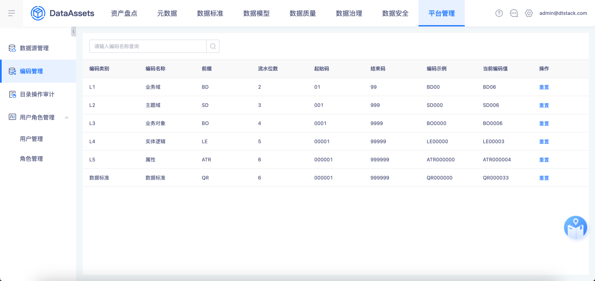
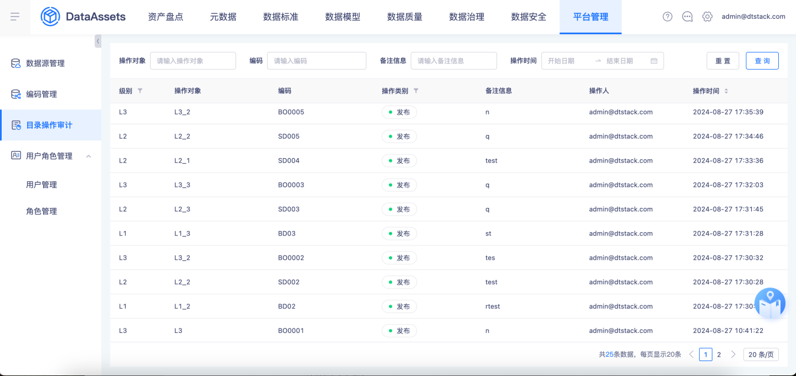
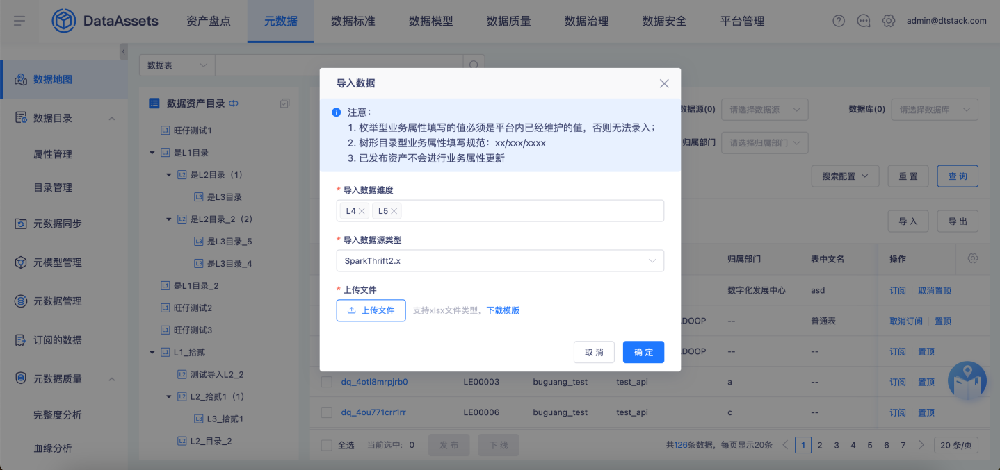
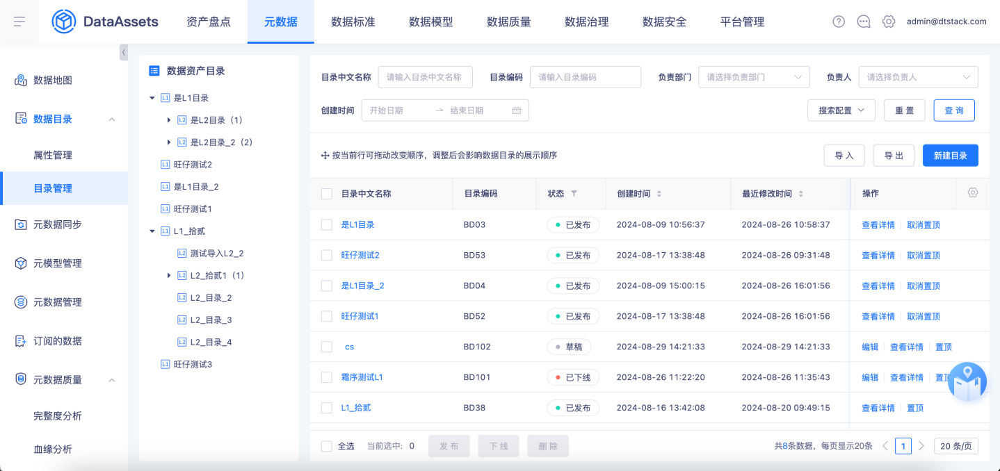
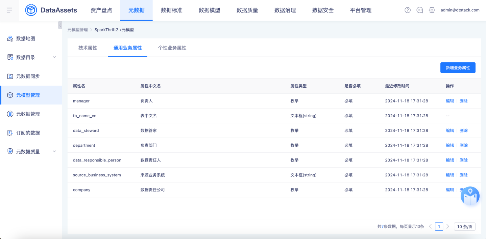
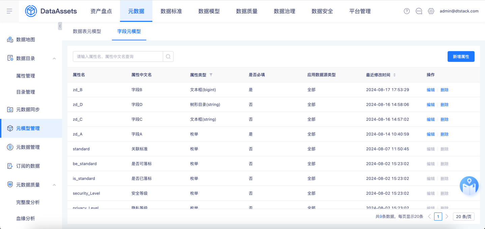
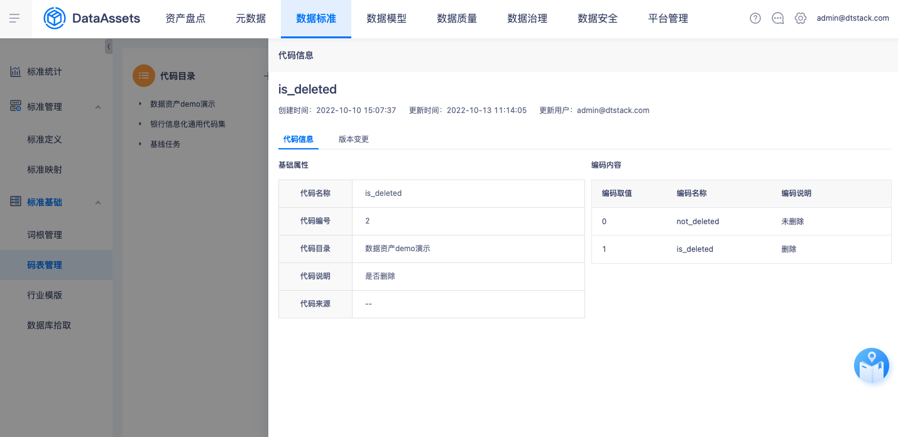
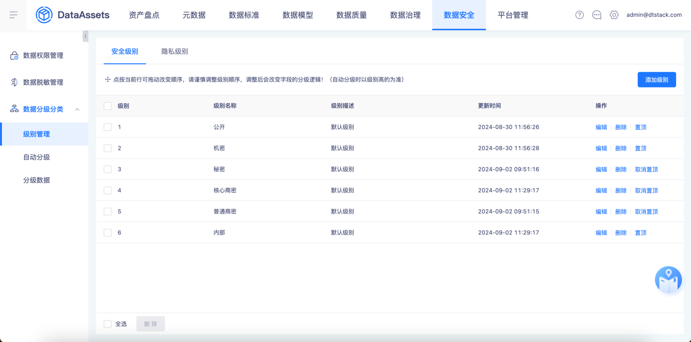
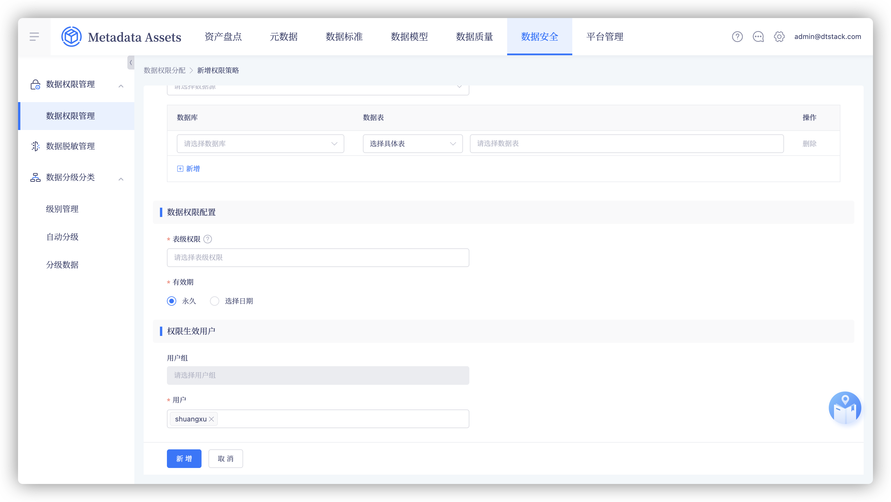

# 【15911】【泸州老窖】【数据资产】资产定制化代码剥离

## 需求身份与来源

- 需求 ID：15911
- 蓝湖文档：【15911】【泸州老窖】【数据资产】资产定制化代码剥离
- 文档 ID：`6e513ee1-fb7f-4e60-897a-21af81c65aba`
- 版本 ID：`6df27b45-b95e-4c3e-b79c-30515d3f4292`
- 页面 ID：`7ef1d18e9bb04ca495903a55bc84a088`

## 背景、目标与成功标准

本基线用于泸州老窖 v7.0.0 数据资产定制化代码剥离后的回归。目标是把蓝湖需求、产品说明书、禅道历史用例和 release 源码中的有效行为整理成可读、可追踪、可自动化扩展的测试资产。成功标准：24 个子需求均有可执行覆盖；每条用例可追溯到 TP、PRD 稳定 ID 和需求 ID；YAML 能独立构建 XMind；API 与页面自动化边界清晰；关键异常、边界、权限和数据完整性均有明确预期。

父需求 15911 只表示本聚合范围；它本身不作为测试场景，代码剥离方案文档交付也不生成执行用例。

## 范围

纳入以下 24 个子需求：13176 编码管理；13177 L1～L3 属性管理；13178 L1～L3 目录管理；13179 L4 数据表管理；13180 L5 字段管理；13181 操作审计；13182 标准目录管理；13183 标准属性管理；13184 标准维护管理；13185 码表管理；13186 隐私等级管理；13187 自动分级管理；13188 表级别自动分级；13548 数据表批量删除；13549 自定义属性列表展示与搜索配置；13550 L1～L3 导出优化；13551 L4 导入导出与列表优化；13552 L4 级联查询；13553 L1～L4 内置属性编辑与删除规则；13923 门户接口与字段内置属性；13925 L4/L5 导出速度；14050 L1～L5 内置属性逻辑；14280 码表引用数据表；16178 行级权限管控。

不纳入：通用产品回归、父需求 15911 的重复场景、15863 方案文档交付、没有有效证据支持的旧操作符和虚构性能阈值。

## 角色、权限与前置条件

角色：平台管理员负责元模型、目录、标准、码表、数据安全和权限策略配置；资产维护人员负责目录、L4/L5 业务属性和标准维护；数据安全管理员负责安全/隐私等级与自动分级；接口消费者调用门户 L1～L5 查询接口；受授权用户或用户组消费权限策略。

通用前置：泸州老窖定制应用已部署，租户与权限账号可用；准备 L1～L5、标准、码表、组织架构和审计数据。数据权限和码表引用场景使用一个数据源占位符 ${DataSourceA}，SQL 按 SparkThrift2.x 执行。API 用例使用环境已配置的鉴权和请求超时，不在用例中固化 Cookie 或真实地址。

## 现状与变更

产品说明书提供平台通用功能基线，蓝湖与禅道提供客户定制需求和历史覆盖。后续 release 源码对 13553、13923 的内置属性白名单与删除入口做了有效收敛，因此覆盖旧说明书中允许删除默认属性的通用描述。

本次整理把旧用例中的重复步骤、空预期、错误操作符、父需求重复内容和过程性话术改成可执行的功能方向；保留历史需求的功能覆盖，但不继承历史执行结果。

## 业务场景

### 编码、目录和审计
验证编码初始化、层级前缀、流水值、租户隔离、重置条件与溢出；验证 L1～L3 属性和目录的增删改查、层级、状态、导入导出、排序、置顶、发布下线、目录关联和审计记录；验证 L4/L5 业务属性维护、导入导出、详情、预览、目录绑定和批量删除。

### 元模型、标准和码表
验证 L1～L5、标准和字段内置/自定义属性的类型、中文名、必填、顺序、列表、表单、模板与导出同步；验证标准目录同步及仅 L3 关联；验证标准新增、维护、发布、导入导出、版本、落标统计；验证码表手工维护、导入校验、导出、版本比对，以及引用数据表配置。

### 数据安全、门户接口和权限
验证安全与隐私等级、自动分级和表级从严汇总；验证门户 L1～L5 分页接口与字段内置属性；验证 L4/L5 10000 行导出性能；验证行级与列级权限、用户/用户组互斥、条件组合、生命周期和越权阻断。

## 字段、枚举、校验与错误

| 领域 | 有效枚举/规则 | 错误处理 |
| --- | --- | --- |
| 编码 | L1/L2/L3/L4/L5/数据标准；前缀、流水位、起止码 | 未满足删除或重置前置时阻断；溢出不复用旧值 |
| 自定义属性 | 枚举、文本、树形；文本为 STRING/BIGINT，BIGINT 仅正数 | 类型、必填、重复、超限和枚举不匹配给出定位提示 |
| 状态 | 目录草稿/已发布/已下线；码表有效/无效 | 状态不允许的发布、编辑、删除和关联操作阻断 |
| 数据源 | Hive2.x、SparkThrift2.x；${DataSourceA} | 数据源、库、表、字段不存在或不可用时明确报错 |
| 码表映射 | 代码值、代码名称必填；说明、上级代码、状态可选 | 空值、重复值和字段映射冲突阻断，不静默去重 |
| 行权限 | =、!=、in、not in、is null；最多五条件 | 第六个条件、缺值、非法组合和越权访问阻断 |
| 分页 | pageSize 10/20/100；首末页、命中/无命中 | 参数合法且在环境超时内完成，返回结构和数据一致 |

## 状态与数据规则

目录新建默认为草稿，已发布目录才能关联 L4 数据表或标准；发布/下线必须填写备注并记录审计。L4/L5 导入只维护元数据同步产生的业务属性，不创建表或字段。

码表手工导入按代码精确匹配更新，空编码新增，找不到匹配关系报错；引用数据表时从当前源表读取，配置方式决定可用操作，手工导入不得覆盖引用源数据。码表内容发生变化生成版本并支持任意两版本比对。

安全与隐私字段按字段级别计算，表级展示取字段中的最高等级。行权限同一策略内按且/或计算，多个策略按外层或汇总；用户与用户组在同一策略中互斥。权限策略编辑、禁用、删除、回收、失效和移除单个生效对象后，查询、详情、导出和接口结果必须实时遵循最新状态。

## 异常、边界与兼容性

覆盖编码存在未删除数据时重置阻断、删除后重置物理清理、编码溢出和租户隔离；目录/标准/码表/L4/L5 导入的必填、重复、枚举、层级、字符长度、错误文件和已发布状态；列表配置最小/最大数量、级联清空、无结果和批量部分失败；L4/L5 导出 799、800、801 与 10000 行；L4、L5 单独 10000 行在 180 秒内完成。

覆盖门户接口 L1～L5 的 pageSize 10/20/100、首末页、命中/无命中、环境超时和数据结构；覆盖引用数据表源不可用、字段不存在、空值、重复值、切换清理、超过 1000 行仅展示前 1000 行；覆盖行权限 0/1/5/6 条件、五种操作符、且/或、行列组合、用户/用户组互斥、全行覆盖、过期和回收。

兼容性边界：不固化真实环境 URL、Cookie、账号、数据库名或表名；用例中的数据源只写 ${DataSourceA}，实际 SQL 使用 SparkThrift2.x。

## 依赖与影响

证据依赖蓝湖聚合需求文档、禅道需求与历史用例、产品说明书 DOCX、当前页面入口快照及三个 release 分支源码。功能回归依赖可访问的泸州老窖定制应用、一个可查询的 SparkThrift2.x 数据源、组织架构、标准/码表/目录测试数据和具备不同权限的用户。

影响范围覆盖 dataAssets 的数据目录、数据地图、元数据、数据标准、数据安全、数据权限及门户接口；自动化资产通过 YAML 的 automation.executor 区分 API 与 Playwright，不改变业务用例语义。

## 已确认的产品决策

### PD-001 定制范围

只收录 24 个泸州老窖定制化子需求，15911 作为父需求聚合标识，不生成执行用例。

来源：`Q-001`、`lanhu:15911`、`zentao:15911`

### PD-002 证据优先级

后续有效需求和 release 源码优先，当前页面行为用于核对，历史用例只提供覆盖线索。

来源：`Q-002`、`docx:product-manual`、`source:release-commits`

### PD-003 聚合产物

只维护一份 YAML，用 kata cases build 派生一份 XMind；不手工维护派生文件。

来源：`Q-003`、`skill:test-case-layout`

### PD-004 XMind 语义层级

每个需求一个 L1，需求 ID 在 L1 标签中，前置条件在用例标题节点 notes，没有实际分类时直接挂用例标题。

来源：`Q-004`、`user:xmind-notes-tags`

### PD-005 执行器分离

接口用例使用 api 执行器且不生成 spec.ts，页面用例才进入 Playwright 映射。

来源：`Q-005`、`source:cli-contract-tests`

### PD-006 数据源约定

所有数据源使用 ${DataSourceA}，SQL 统一为 SparkThrift2.x 语法。

来源：`Q-006`、`user:single-datasource`

### PD-007 行权限契约

16178 仅覆盖 =、!=、in、not in、is null，最多五个条件，并单独验证第六个条件阻断。

来源：`Q-007`、`Q-008`、`Q-009`、`ui:data-permission`

### PD-008 性能边界

13925 只有 L4 和 L5 各 10000 行导出使用 180 秒硬门槛；799、800、801 只做功能边界和完整性校验。

来源：`Q-010`、`lanhu:13925`

### PD-009 接口性能表达

13923 使用环境超时作为成功边界，记录实际响应时间，不增加没有证据的固定毫秒阈值。

来源：`Q-011`、`source:portal-api`

### PD-010 内置属性权限

内置属性删除入口禁用；允许编辑的中文名和必填项按需求字段白名单验证，安全等级与隐私等级可编辑但不可删除。

来源：`Q-012`、`source:frontend-13553`、`source:frontend-13923`

### PD-011 引用数据表

14280 支持 Hive2.x 和 SparkThrift2.x，必填五项与可选三项按 release 表单规则验证，切换来源清理下游选择。

来源：`Q-013`、`source:frontend-14280`

### PD-012 异常数据处理

引用数据表不可用或字段值非法时明确报错并阻断，不手工降级、不跳过、不去重；仅码表内容变化生成版本。

来源：`Q-014`、`source:backend-14280`、`docx:code-table-version`

### PD-013 清理历史噪声

移除未分类占位节点、过程性确认字样、已证伪操作符和不受支持的旧预期；所有用例都落到有效测试点。

来源：`Q-015`、`knowledge:historical-conflict-rule`

## 验收标准

AC-001～AC-024 分别对应 24 个子需求的可执行回归集合。所有 P0 场景必须覆盖主链路和阻断性异常；P1 覆盖关键组合、接口和生命周期；P2 覆盖展示、排序、分页与边界。

交付验收还包括：PRD 使用稳定 FR/BR/ER/AC/PD ID；test-points.md 的每个 TP 引用稳定 ID且摘要链有效；YAML 的每条用例有 requirement_id、priority、步骤、预期、前置条件和 TP source_ref，XMind 不生成未分类占位标签；XMind 每个 L1 标签包含需求 ID，前置条件位于标题节点 notes，功能用例直接挂在需求 L1 下；API 用例不生成 Playwright 脚本；所有静态 lint、构建和导出一致性校验通过。

## 截图与证据追踪

## 需求追踪矩阵

| ID | 需求或验收表述 | 来源 |
| --- | --- | --- |
| FR-001 | 支持泸州老窖数据资产编码的查询、初始化、层级自增、重置和租户隔离。 | `lanhu:13176`、`docx:encoding` |
| FR-002 | 支持 L1～L3 自定义属性的类型配置和目录使用。 | `lanhu:13177`、`docx:catalog-attributes` |
| FR-003 | 支持 L1～L3 目录的维护、状态、层级、导入导出和资产关联。 | `lanhu:13178`、`docx:catalog-management` |
| FR-004 | 支持 L4 数据表查询、目录关联、业务属性、详情、预览、导入导出和批量操作。 | `lanhu:13179`、`docx:data-map` |
| FR-005 | 支持 L5 字段元模型与业务属性维护、批量编辑和导入。 | `lanhu:13180`、`docx:field-model` |
| FR-006 | 记录目录及数据资产发布、下线等操作审计并支持检索。 | `lanhu:13181`、`docx:operation-audit` |
| FR-007 | 标准目录同步 L1～L3，并限制标准只能关联 L3。 | `lanhu:13182`、`docx:standard-directory` |
| FR-008 | 支持标准自定义属性配置并同步到标准业务操作。 | `lanhu:13183`、`docx:standard-attributes` |
| FR-009 | 支持标准定义的维护、发布下线、导入导出、统计和版本。 | `lanhu:13184`、`docx:standard-definition` |
| FR-010 | 支持码表目录、内容、导入导出、查询和版本比对。 | `lanhu:13185`、`docx:code-table` |
| FR-011 | 支持安全和隐私等级维护及字段级别汇总。 | `lanhu:13186`、`docx:data-level` |
| FR-012 | 支持自动分级规则、手动分级和分级数据查看修正。 | `lanhu:13187`、`docx:auto-classification` |
| FR-013 | 按字段最高等级展示数据表安全与隐私等级及相关标记。 | `lanhu:13188`、`docx:table-level` |
| FR-014 | 支持数据表列表对草稿和已下线数据表批量删除并反馈部分失败。 | `lanhu:13548`、`zentao:13548` |
| FR-015 | 支持 L1～L4 和标准自定义属性的列表字段与搜索条件配置。 | `lanhu:13549`、`zentao:13549` |
| FR-016 | 支持 L1～L3 目录按范围导出并保持层级和属性。 | `lanhu:13550`、`zentao:13550` |
| FR-017 | 优化 L4 导入导出、列表展示条数和是否绑定目录字段。 | `lanhu:13551`、`docx:data-asset-import-export` |
| FR-018 | L4 查询选择框按上级条件级联并支持清空和组合筛选。 | `lanhu:13552`、`zentao:13552` |
| FR-019 | 按后续有效白名单控制 L1～L4 内置属性编辑，删除入口禁用。 | `lanhu:13553`、`source:frontend-13553` |
| FR-020 | 门户提供 L1～L5 分页接口，安全和隐私字段内置属性可编辑但不可删除。 | `lanhu:13923`、`source:frontend-13923` |
| FR-021 | L4、L5 10000 行导出分别在 180 秒内完成并保持完整性。 | `lanhu:13925` |
| FR-022 | L1～L5 内置属性的名称、必填和顺序同步到全链路，并优化标准导出选择。 | `lanhu:14050`、`source:frontend-14050` |
| FR-023 | 码表支持引用 Hive2.x 或 SparkThrift2.x 数据表创建并映射字段。 | `lanhu:14280`、`source:frontend-14280` |
| FR-024 | 支持行级权限条件与列权限组合，并在查询、详情、导出和接口中执行。 | `lanhu:16178`、`zentao:16178` |
| BR-001 | 单一聚合 YAML 是用例权威，XMind 和测试点是可校验派生物。 | `PD-003`、`skill:test-case` |
| BR-002 | 用户和用户组在同一权限策略中互斥，多个策略按外层或汇总。 | `PD-007`、`ui:data-permission` |
| BR-003 | 行条件最多五个，且、或和全行覆盖的计算结果必须一致。 | `PD-007`、`knowledge:row-condition-contract` |
| BR-004 | 引用数据表错误时明确失败，不手工降级、不跳过、不去重。 | `PD-012`、`source:backend-14280` |
| ER-001 | 导入错误需要可下载并包含可定位的错误原因。 | `docx:import-error-file`、`lanhu:13178` |
| ER-002 | 数据源、字段或权限不可用时返回明确错误并阻断危险保存或读取。 | `PD-012`、`PD-007` |
| ER-003 | 越权查询、详情、导出和接口请求不得返回未授权行或列。 | `FR-024`、`Q-009` |
| ER-004 | 仅对 L4/L5 各 10000 行导出应用 180 秒硬性能门槛。 | `PD-008` |
| AC-001 | 编码初始化、层级自增、重置前置、溢出与租户隔离结果正确。 | `FR-001` |
| AC-002 | L1～L3 属性类型、校验、使用入口和列表行为正确。 | `FR-002` |
| AC-003 | L1～L3 目录全生命周期、层级、导入导出和关联规则正确。 | `FR-003` |
| AC-004 | L4 数据表维护、绑定、导入导出、详情和批量操作正确。 | `FR-004` |
| AC-005 | L5 字段属性、元模型、批量编辑和导入规则正确。 | `FR-005` |
| AC-006 | 审计字段、筛选、排序、分页和操作拆分记录正确。 | `FR-006` |
| AC-007 | 标准目录同步且只有 L3 可被标准关联。 | `FR-007` |
| AC-008 | 标准自定义属性配置和标准表单同步正确。 | `FR-008` |
| AC-009 | 标准维护、导入导出、发布下线、统计和版本正确。 | `FR-009` |
| AC-010 | 码表手工维护、导入导出、版本和错误规则正确。 | `FR-010` |
| AC-011 | 安全、隐私等级配置及从严汇总正确。 | `FR-011` |
| AC-012 | 自动分级和手动修正结果及优先级正确。 | `FR-012` |
| AC-013 | 表级安全、隐私、标准标记与字段下钻正确。 | `FR-013` |
| AC-014 | 批量删除状态限制、部分失败和结果反馈正确。 | `FR-014` |
| AC-015 | 自定义属性列表展示和查询配置的范围与数量限制正确。 | `FR-015` |
| AC-016 | L1～L3 按范围导出且层级与属性完整。 | `FR-016` |
| AC-017 | L4 导入导出、列表字段、展示条数和绑定目录正确。 | `FR-017` |
| AC-018 | L4 级联筛选、清空和无结果反馈正确。 | `FR-018` |
| AC-019 | 内置属性白名单编辑和删除禁用规则正确。 | `FR-019` |
| AC-020 | L1～L5 门户接口分页及安全隐私字段编辑规则正确。 | `FR-020` |
| AC-021 | L4/L5 10000 行导出在 180 秒内完成且数据完整。 | `FR-021` |
| AC-022 | 内置属性变更同步到列表、详情、表单、模板和导出，标准全选正确。 | `FR-022` |
| AC-023 | 引用数据表码表的来源、映射、边界、错误和手工导入限制正确。 | `FR-023` |
| AC-024 | 行列权限组合、条件计算、策略生命周期和各消费入口结果正确。 | `FR-024`、`BR-002`、`BR-003`、`ER-003` |
