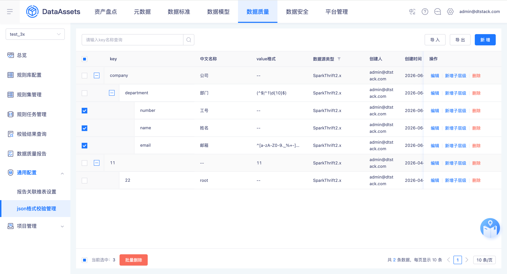
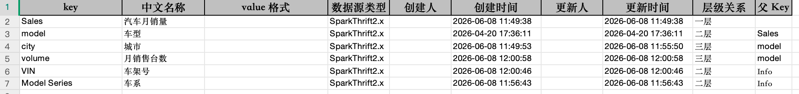
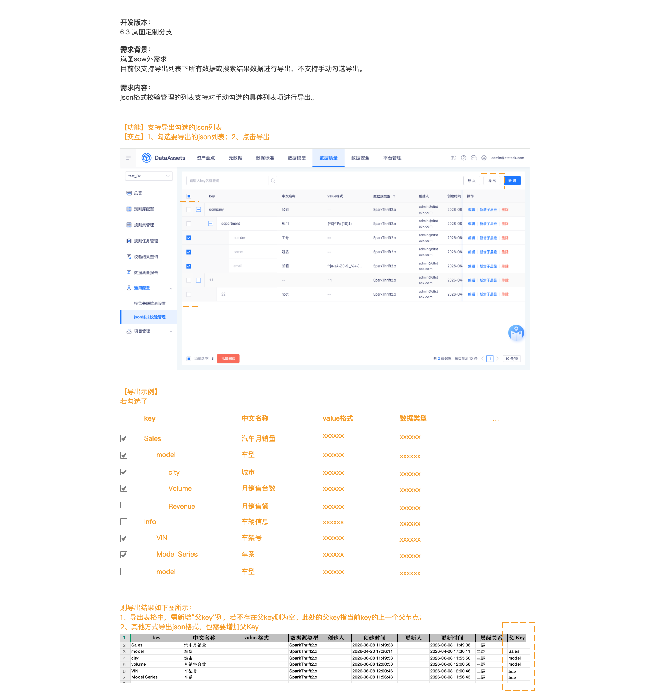

# 【7.20】【数据质量】json格式校验，导出支持勾选导出

## 开发版本

6.3 岚图定制分支

## 需求背景

岚图 DW 平台。目前 json 格式校验管理列表仅支持导出当前条件下的全部数据，不支持手动勾选指定行后导出。

## 需求内容

json 格式校验管理的列表支持对勾选的列表行进行导出。

## 功能

支持导出勾选的 json 规则。

## 交互

1. 勾选要导出的 json 列表行；
2. 点击【导出】按钮，仅导出已勾选的行。

## 页面元素截图

## 整页截图

## 导出文件列结构（依据页面元素截图 2-u57.png）

导出文件包含以下列（按顺序）：

| 列名 | 说明 |
| ---- | ---- |
| key | key 名称 |
| 中文名称 | key 对应的中文名称 |
| value 格式 | 正则表达式（可为空） |
| 数据源类型 | SparkThrift2.x / Hive2.x / Doris3.x |
| 创建人 | 创建该 key 的用户 |
| 创建时间 | 创建时间戳 |
| 更新人 | 最后更新该 key 的用户 |
| 更新时间 | 更新时间戳 |
| 层级关系 | 一层 / 二层 / 三层 / 四层 / 五层 |
| 父 Key | 当前 key 的父节点 key 名（一层节点此列为空） |

## 关联原始需求

原始 json 格式配置需求 PRD ID：#15696（数据资产 v6.3.10 迭代）
参考用例归档：`workspace/dataAssets/features/v6.4.10/【v6410】【岚图汽车】【数据质量】JSON格式配置/cases/archive.md`
