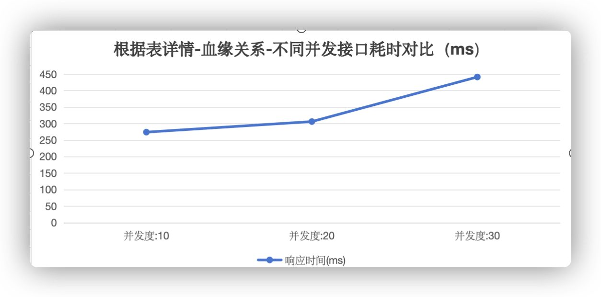
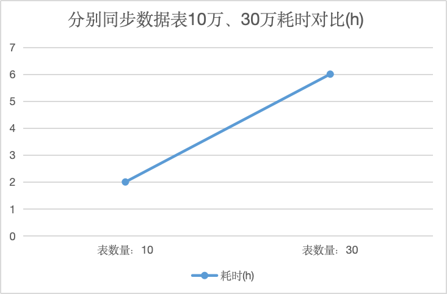

# 岚图资产性能分析报告

# 岚图资产平台性能测试分析报告

|**报告版本**|V1\.0|
|---|---|
|**测试日期**|2026年07月10日|
|**编写人**|向林|
|**所属部门**|应用平台测试组|
|**审批日期**|2026年07月10日|

## 测试概述

### 测试背景

岚图资产平台面向存在高并发、大业务数据量的客户场景，为避免客户实际使用过程中出现性能瓶颈、响应缓慢、服务异常等问题，保障平台稳定高效运行，特对资产平台指定核心功能开展本次性能测试，完成平台性能摸底与问题排查。

### 测试目的

1. 对岚图资产平台核心功能进行**性能摸底**，获取不同并发场景下的接口响应时间、异常率、吞吐量等关键性能指标；

2. 识别平台在高并发场景下的**性能瓶颈**与薄弱模块，为后续性能优化提供数据支撑和方向指引；

3. 验证平台在3万张数据表的大数据量基础上，应对10/20/30并发请求的服务处理能力，评估平台实际使用的性能表现。

### 测试范围

本次测试基于metadata接口，通过Jmeter发起请求，聚焦资产平台的3个测试场景，覆盖范围：数据地图、元数据同步，重点验证接口在不同并发下的响应耗时、异常率等性能指标。

### 测试环境

#### 硬件配置

本次测试采用3台CentOS Linux服务器，配置均为16C/24G，各司其职保障测试环境稳定，具体分配如下：

|服务器IP|用途|操作系统|
|---|---|---|
|10\.199\.172\.107|MySQL底层业务库|CentOS Linux|
|10\.199\.161\.223|metadata/Assets应用|CentOS Linux|
|10\.199\.161\.224|metadata/Assets应用|CentOS Linux|

#### 软件配置

|类型|主机|软件系统/应用|描述|
|---|---|---|---|
|MySQL|10\.199\.172\.107|Linux|底层业务库支撑|
|被测系统|10\.199\.161\.223/10\.199\.161\.224|metadata/Assets|资产平台核心应用|

#### 测试数据

提前构造**3万张业务数据表**（test\_sale\_data\_\*系列），覆盖订单ID、客户ID、车辆价格等多类型字段；同时准备10万/30万张数据表，满足元数据同步等模块的测试要求。

#### 测试工具与策略

1. **测试工具**：采用Apache JMeter5\.6\.3，支持压力测试、接口性能测试，可模拟多并发请求，获取聚合报告、响应时间、异常率等指标；

2. **测试策略**：以API调用流程为核心，设置10/20/30三个并发梯度，单场景持续请求60s，重点监控**事务平均响应时间**、**TPS（吞吐量）**、**异常率**、**服务器资源状况**四大核心指标；

3. **测试过程**：配置Jmeter线程数模拟并发→执行测试→提取聚合报告中Average、TPS指标→分析不同并发下的性能表现→定位性能问题。

### 专有名词解释

|术语|说明|
|---|---|
|TPS（吞吐量）|每单位时间内系统处理的事务数，计算公式：吞吐量=总请求数/持续时间|
|事务平均响应时间|API接口接收到请求至返回结果的平均耗时，单位：ms（毫秒）|
|异常率|测试过程中异常请求数占总请求数的比例，反映服务稳定性，单位：%|
|并发度|同一时间内向服务器发起请求的线程数，本次测试核心梯度：10/20/30|

## 核心测试结果分析

本次测试覆盖3个子场景，各模块在不同并发下的性能表现差异显著，**数据地图**表现优异，**元数据同步**存在明显性能瓶颈，以下为各模块详细分析。

### 数据地图模块

数据地图为平台核心查询模块，含2个子场景\.

1. **首次搜索类**：数据源名首次搜索响应时间在 **4s**** **以内, 性能表现正常;

2. **表详情查询**：血缘关系响应时间在 **1s **以内, 性能表现正常;

### 元数据同步模块

元数据同步模块含创建同步任务、大批量数据表同步两大场景，**接口操作性能优异，大批量数据同步耗时过长**为核心问题。

1. **大批量数据表同步**：同步10万张表耗时 7\.5h，30万张表耗时 21h，耗时与表数量呈非线性增长；

**核心问题**：大批量数据同步采用串行处理方式，未做并行优化；同步过程中数据校验、日志记录环节冗余，增加整体耗时；无增量同步机制，全量同步导致大数据量下耗时过高。

## 测试整体结论

本次基于3万张数据表的大数据量基础，对岚图资产平台2个场景开展10/20/30并发性能测试，**平台整体性能表现分化显著，核心高频基础操作性能优异，大批量同步存在明显性能瓶颈**，具体结论如下：

### 优秀模块

- **数据地图模块: 筛选查询、表详情查询**等基础详情查询性能优异，0异常率，无需额外优化。

### 待优化模块

**元数据同步模块（大批量同步）**：同步10万张表耗时7\.5h, 30万张表耗时21h，串行处理、无增量同步导致耗时过长，无法满足客户大批量数据同步的实际需求；

### 关键性能指标总结

1. **响应时间**：平台最优响应时间 ≤ 300ms（数据地图\-表详情\-血缘关系），最差响应时间2069ms（数据地图\-数据源名30并发搜索），二者差距超7倍；

2. **异常率**：优秀模块全程0异常率，服务较为稳定；

3. **并发适应性**：3万表数据，30并发下平台整体异常率=0%，服务较为稳定。

## 性能优化建议

针对本次测试发现的核心性能瓶颈，结合平台实际业务场景，从**技术优化、架构优化、功能优化**三个维度提出针对性优化建议，优先级分为**高（必须优化）、中（建议优化）、低（可选优化）**。

### 高优先级

#### 元数据同步模块\-大批量同步优化

- **并行处理**：将大批量数据表同步按库/按模块拆分，采用多线程并行同步，提升同步效率；

- **增量同步**：增加增量同步机制，仅同步新增/修改的数据表，避免全量同步的资源浪费；

- **简化校验**：同步过程中简化非必要的数据校验、日志记录环节，仅保留核心校验项，减少同步耗时。

### 中优先级

无

### 低优先级

无

## 最终结论

本次岚图资产平台性能测试完成了2个模块, 3个场景的性能摸底，**性能优异，可满足客户基础使用需求，但大批量元数据同步核心业务场景存在严重性能瓶颈，必须完成高优先级优化后才可上线**。

通过本次测试提出的针对性优化建议，优化后可大幅提升服务稳定性，确保平台在客户高并发、大数据量的实际使用场景下稳定、高效运行。后续需完成优化并通过复测后，方可正式交付客户使用。

