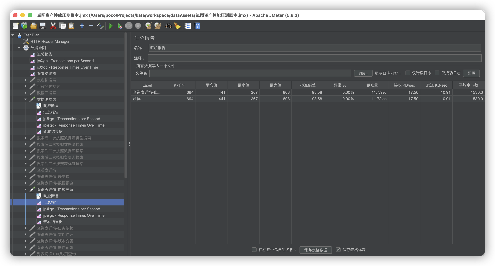

# 岚图资产性能测试报告

## **数据地图查询性能测试报告V1\.0**

|**作 者**|向林|**最后修改日期**|2026\-07\-10|
|---|---|---|---|
|**审 核 人**|向林|**最后审批日期**|2026\-07\-10|
|**批 准 人**|向林|**最后批准日期**|2026\-07\-10|

*修订记录*

|**版本**|**修订说明**|**修订人**|**批准人**|**发布日期**|
|---|---|---|---|---|
|V1\.0|初始版本|向林|向林|2026\-07\-10|

**说 明**

**模版版本信息**

**编辑部门：测试组**

**批准日期：2026年0****7****月****10****日**

# 基本要素

## 项目背景介绍

资产客户存在并发和大量业务数据的情况，为避免客户使用过程中出现性能问题，所以展开了本次对资产指定功能进行性能测试。

## 测试目的

通过测试，进行资产平台性能评估。

## 参加测试单位

|**测试团队**|**负责人**|**所属部门**|**备注**|
|---|---|---|---|
|测试组|向林|应用平台|资产|

## 专有名词解释及缩略语

|**术语**|**全称/说明**|
|---|---|
|TPS（吞吐量）|即每单位时间所处理事物数（吞吐量=总请求数/持续时间）|
|事务平均响应时间|即API调用的平均响应时间|
|资源状况表现|服务器CPU占用和内存情况|


# 测试环境

## 测试范围

|**发起渠道**|**发起端**|**业务名称**|
|---|---|---|
|metadata接口|jmeter|调用查询API|

## 硬件配置

### 被测系统配置

|**服务器名称**|**资源**|**操作系统 **|**备注**|
|---|---|---|---|
|10\.199\.172\.107|16C/64G|CentOS Linux|MySQL|
|10\.199\.161\.223|16C/64G|CentOS Linux|Metadata/Assets|
|10\.199\.161\.224|16C/64G|CentOS Linux|Metadata/Assets|

## 软件配置

### 应用环境配置

|**类型**|**主机**|**软件系统**|**描述**|
|---|---|---|---|
|MySQL|10\.199\.172\.107|操作系统|Linux|
|||应用系统|底层业务库|
|被测系统|10\.199\.161\.223<br>10\.199\.161\.224|应用系统|Metadata/Assets应用服务器|

## 数据准备

### **数据表\-数据构造脚本 \(Lindorm PySpark 任务\)**

```Python
**from pyspark.sql import SparkSession**

**spark = SparkSession.builder \**
**    .appName("create_sale_data_tables") \**
**    .enableHiveSupport() \**
**    .getOrCreate()**

**spark.sql("USE iov_dq")**

**schema_ddl = """(**
**    id              BIGINT           COMMENT '主键ID',**
**    order_id        BIGINT           COMMENT '订单ID',**
**    customer_id     INT              COMMENT '客户ID',**
**    car_price       DECIMAL(15,2)    COMMENT '车辆价格',**
**    discount_amount DECIMAL(10,2)    COMMENT '折扣金额',**
**    final_amount    DECIMAL(15,2)    COMMENT '最终金额',**
**    quantity        TINYINT          COMMENT '购买数量（1-255）',**
**    salesman_id     INT              COMMENT '销售员ID',**
**    mileage_at_sale INT              COMMENT '购车时里程数',**
**    rating_score    FLOAT            COMMENT '客户评分（0.0～5.0）'**
**)"""**

**# 只过滤 test_sale_data_ 前缀的表**
**existing_tables = set()**
**try:**
**    rows = spark.sql("SHOW TABLES IN iov_dq").collect()**
**    existing_tables = {r.tableName for r in rows if r.tableName.startswith("test_sale_data_")}**
**    print(f"已检测到 {len(existing_tables)} 张 test_sale_data_* 表，其余无关表不纳入判断")**
**except Exception as e:**
**    print(f"获取已有表列表失败: {e}，将逐条检查")**

**created_count = 0**
**skipped_count = 0**
**failed_count = 0**
**failed_names = []**

**for i in range(1, 300001):**
**    table_name = f"test_sale_data_{i:05d}"**

**    # 精确匹配，只跳过同名的 test_sale_data_ 表**
**    if table_name in existing_tables:**
**        skipped_count += 1**
**        continue**

**    try:**
**        ddl = f"""**
**            CREATE TABLE IF NOT EXISTS iov_dq.{table_name}**
**            {schema_ddl}**
**            USING parquet**
**            COMMENT '销售数据表'**
**        """**
**        spark.sql(ddl)**
**        created_count += 1**
**    except Exception as e:**
**        failed_count += 1**
**        failed_names.append(table_name)**
**        print(f"{table_name} 创建失败: {e}")**

**    if i % 1000 == 0:**
**        print(f"进度: {i}/300000 | 已创建: {created_count} | 已跳过: {skipped_count} | 失败: {failed_count}")**

**print("=" * 50)**
**print(f"  执行完毕")**
**print(f"  目标总数:  300000")**
**print(f"  已创建:    {created_count}")**
**print(f"  已跳过:    {skipped_count}")**
**print(f"  失败:      {failed_count}")**
**if failed_names:**
**    print(f"  失败表列表（前20）: {failed_names[:20]}")**
**    with open("failed_tables.log", "w") as f:**
**        for name in failed_names:**
**            f.write(f"{name}\n")**
**print("=" * 50)**

**spark.stop()**
```


### 测试脚本和工具准备：

1\) 准备jmeter测试脚本。设置并发数、循环次数、持续时长为变量。

[岚图资产性能压测脚本\.jmx](图片和附件/岚图资产性能压测脚本.jmx)


## 测试工具

> 本次测试采用的Jmeter 5\.6\.3 版本。测试工具由测试组负责安装配置。
> 
> 

Apache JMeter是Apache组织开发的基于Java的压力测试工具。用于对软件做压力测试，它最初被设计用于Web应用测试，但后来扩展到其他测试领域。 它可以用于测试静态和动态资源，例如静态文件、Java 小服务程序、CGI 脚本、Java 对象、数据库、FTP 服务器， 等等。JMeter 可以用于对服务器、网络或对象模拟巨大的负载，来自不同压力类别下测试它们的强度和分析整体性能。另外，JMeter能够对应用程序做功能/回归测试，通过创建带有断言的脚本来验证你的程序返回了你期望的结果。为了最大限度的灵活性，JMeter允许使用正则表达式创建断言。


# 测试策略

|**类型**|**场景设计**|
|---|---|
|测试策略|API调用流程|


# 测试场景

## 平台测试场景

|**编号**|**编号**|**场景**|**并发数**|**pageSize**|**持续时间**|**备注**|
|---|---|---|---|---|---|---|
|数据地图|1|根据数据源名搜索|10/20/30并发|/|60s|3万张|
||2|查询表详情 \- 血缘关系||/|||
|元数据同步|1|创建周期同步任务||/|||

## 元数据同步测试场景

|**编号**|**编号**|**场景**|**备注**|
|---|---|---|---|
|元数据同步|1|同步数据表10万、30万|已准备数据表10万、30万数据，字段类型均覆盖；|
||2|数据表10万，不同字段类型|已准备数据表10万；|
||3|数据表500张、包含200个字段|数据表500张数据，包含200个字段均覆盖；|

# 测试过程

1. Jmeter配置线程数（10/20/30），持续请求时间60s

2. 查看聚合报告中的“Average”、“TPS（Throughput）”指标


# 平台性能测试结果

## 数据地图

### 场景一

#### 场景介绍

|场景一： 验证在不同并发下根据数据源名搜索响应耗时||
|---|---|
|用例名称|不同并发度及策略对接口的影响|
|用例编号|001|
|功能模块|数据地图|
|性能描述|并发数为10/20/30时的服务处理请求能力|
|前置条件|已准备数据表3万数据|

#### 结果展示

|**并发度**|测试结果|**响应时间 \(ms\)**|
|---|---|---|
|并发度：10||859|
|并发度：20||1167|
|并发度：30||2069|


### 场景二

#### 场景介绍

|场景二： 验证在不同并发下查询表详情\-血缘关系响应耗时||
|---|---|
|用例名称|不同并发度及策略对接口的影响|
|用例编号|002|
|功能模块|数据地图|
|性能描述|并发数为10/20/30时的服务处理请求能力|
|前置条件|已准备数据表3万数据|

#### 结果展示

|**并发度**|测试结果|**响应时间 \(ms\)**|
|---|---|---|
|并发度：10||274|
|并发度：20||306|
|并发度：30||441|


# 元数据同步测试结果

## 元数据同步

### 场景一

#### 场景介绍

|场景一： 同步数据表10万、30万，任务耗时及资源情况||
|---|---|
|用例名称|同步数据表10万、30万，任务耗时及资源情况|
|用例编号|001|
|功能模块|元数据同步|
|性能描述|关注同步数据表10万、30万，任务耗时及资源情况|
|前置条件|已准备数据表10万、30万数据表；|

#### 结果展示

|**表数量**|**测试结果**|**耗时\(h\)**|
|---|---|---|
|表数量：10w||7\.5|
|表数量：30w|||


# 测试结论

> 岚图资产性能测试整体通过率在100%，通过率=\(通过场景数/总场景数\)\*100%：\(3/3\)\*100%=100%。
> 
> 

|###### 模块|###### 场景描述|###### 测试指标|###### 目标指标|###### 测试结论|###### 原因分析||###### 岚图侧拉通结论||
|---|---|---|---|---|---|---|---|---|
|数据地图|场景一： 验证在不同并发下根据数据源名搜索响应耗时|1. 10并发: 响应耗时859ms，接口异常率0%;<br>2. 20并发: 响应耗时1169ms，接口异常率0%;<br>3. 30并发: 响应耗时2069ms，接口异常率0%;|1. 10并发: 响应耗时\<=10s，接口异常率\<=0%;<br>2. 20并发: 响应耗时\<=10s，接口异常率\<=0%;<br>3. 30并发: 响应耗时\<=10s，接口异常率\<=0%;|通过|||||
||场景二： 验证在不同并发下查询表详情\-血缘关系响应耗时|1. 10并发: 响应耗时274ms，接口异常率0%;<br>2. 20并发: 响应耗时306ms，接口异常率0%;<br>3. 30并发: 响应耗时441ms，接口异常率0%;|1. 10并发: 响应耗时\<=10s，接口异常率\<=0%;<br>2. 20并发: 响应耗时\<=10s，接口异常率\<=0%;<br>3. 30并发: 响应耗时\<=10s，接口异常率\<=0%;|通过|||||
|元数据同步|场景一：同步数据表10万、30万，任务耗时及资源情况|1. 10万耗时7\.5h，接口异常率0%;<br>2. 30万耗时21H，接口异常0%;|/|通过|||||


