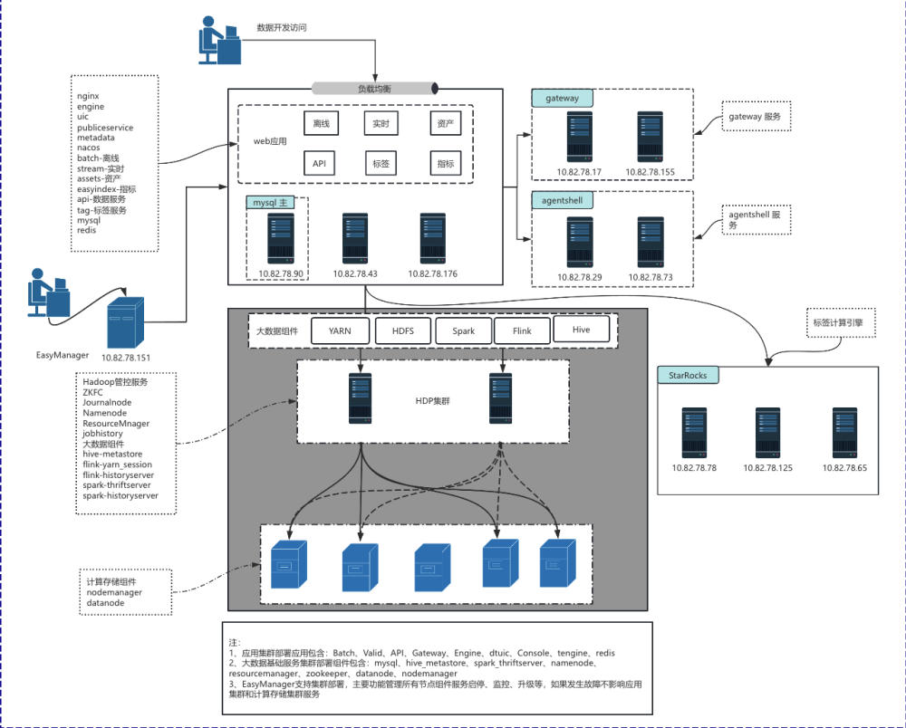

# 性能测试方案

# 性能测试方案

# 前提

本文档是针对岚图要求的组件模块的系统测试方案，明确当前版本的测试范围与测试策略。

**备注：所有性能测试都要基于测试环境进行测试**

主要阅读对象：

1. 项目管理人员

2. 测试负责人员

3. 技术开发人员

4. 系统运维人员

5. 产品负责人员

6. 系统其他使用人员

# 测试环境

## 系统架构图



## 部署架构

|主机IP|主机名称|CPU|内存|数据磁盘|系统盘|操作系统|
|---|---|---|---|---|---|---|
|10\.199\.172\.107|web01|16core|61\.53GB|490\.91GB|196\.49GB|centos7\.9\.2009|
|10\.199\.161\.223|web02|16core|61\.53GB|490\.91GB|196\.49GB|centos7\.9\.2009|
|10\.199\.161\.224|web03|16core|61\.53GB|490\.91GB|196\.49GB|centos7\.9\.2009|
|10\.199\.161\.160|gw1|8core|14\.84GB|294\.56GB|196\.49GB|centos7\.9\.2009|
|10\.199\.161\.225|gw2|8core|14\.84GB|294\.56GB|196\.49GB|centos7\.9\.2009|
|10\.199\.161\.158|Ashell1|4core|7\.29GB|392\.48GB|98\.05GB|centos7\.9\.2009|
|10\.199\.161\.159|Ashell2|4core|7\.29GB|392\.48GB|98\.05GB|centos7\.9\.2009|

## 部署版本

|交付产品|交付版本|
|---|---|
|EasyManager|6\.2\.7\-release|
|ChunJun1\.12|6\.3\.73\_rel\_hadoop2\_zookeeperv3\.9|
|DTAgentshell|6\.4|
|DTApi|6\.3\.68\_rel\_ltqcsy|
|DTAssets|6\.3\.158\_rel\_ltqcsy|
|DTBase|2\.2\.5|
|DTBatch|6\.3\.193\_rel\_ltqcsy|
|DTDatasourceX|6\.3\.137\_rel\_ltqcsy|
|DTEasyIndex|6\.3\.57\_rel\_ltqcsy|
|DTEnginePlugin|6\.3\.91\_rel\_ltqcsy|
|DTFlinkSql1\.16|6\.3\.54\_rel\_hadoop3|
|DTFront|6\.3\.38\_rel\_ltqcsy\_intel\-x86\_64\_centos\-7|
|DTGateway|6\.3\.51\_rel\_ltqcsy|
|DTMetadata|6\.3\.187\_rel\_ltqcsy|
|DTPublicService|6\.3\.164\_rel\_ltqcsy|
|DTSchedulex|6\.3\.179\_rel\_ltqcsy|
|DTSpark2\.4|2\.4\.8|
|DTSpark3\.5|3\.5\.5|
|DTSqlParser|6\.3\.89\_rel\_ltqcsy|
|DTStream|6\.3\.113\_rel\_ltqcsy|
|DTTag|6\.3\.34\_rel\_ltqcsy|
|DTUic|6\.3\.55\_rel\_ltqcsy|
|Hadoop|3\.2\.1\_1\.3\_x86|
|Nacos|2\.3\.1\-2|
|Spark|3\.5\.5|

## 部署清单

|组件|服务版本|服务|组件版本|10\.199\.172\.107/web01|10\.199\.161\.223/web02|10\.199\.161\.224/web03|10\.199\.161\.158/Ashell1|10\.199\.161\.159/Ashell2|10\.199\.161\.160/gw1|10\.199\.161\.225/gw2|
|---|---|---|---|---|---|---|---|---|---|---|
|EasyManager|6\.2\.7\-release||||||||||
|DTAgentshell|6\.4|agentServer|6\.4||||✅||||
|DTAgentshell|6\.4|agentServerSql|6\.4|✅|||||||
|DTAgentshell|6\.4|agentSidecar|6\.4||||✅|✅|||
|DTApi|6\.3\.68\_rel\_ltqcsy|Api|v6\.3\.1\_ltqcsy||✅|✅|||||
|DTApi|6\.3\.68\_rel\_ltqcsy|ApiFront|v6\.3\.0\-dataApi\-ltqcsy||✅|✅|||||
|DTApi|6\.3\.68\_rel\_ltqcsy|ApiServer|v6\.3\.0\_ltqcsy||✅|✅|||||
|DTApi|6\.3\.68\_rel\_ltqcsy|ApiSql|v6\.3\.1\_ltqcsy|✅|||||||
|DTAssets|6\.3\.158\_rel\_ltqcsy|Assets|v6\.3\.3\_ltqcsy||✅|✅|||||
|DTAssets|6\.3\.158\_rel\_ltqcsy|AssetsFront|v6\.3\.2\-dataAssets\-ltqcsy||✅|✅|||||
|DTAssets|6\.3\.158\_rel\_ltqcsy|AssetsSql|v6\.3\.3\_ltqcsy|✅|||||||
|DTBase|2\.2\.5|kafka|2\.5\.0|✅|||||||
|DTBase|2\.2\.5|mysql|8\.0\.35|✅|||||||
|DTBase|2\.2\.5|mysql\_slave|8\.0\.35||✅||||||
|DTBase|2\.2\.5|prometheus|2\.37\.9|✅|||||||
|DTBase|2\.2\.5|pushgateway|0\.8\.0|✅|||||||
|DTBase|2\.2\.5|redis|6\.2\.22|✅|✅|✅|||||
|DTBase|2\.2\.5|zookeeper|3\.9\.3|✅|✅|✅|||||
|DTBatch|6\.3\.193\_rel\_ltqcsy|Batch|v6\.3\.6\_ltqcsy||✅|✅|||||
|DTBatch|6\.3\.193\_rel\_ltqcsy|BatchFront|v6\.3\.0\-batch\-ltqcsy||✅|✅|||||
|DTBatch|6\.3\.193\_rel\_ltqcsy|BatchSql|v6\.3\.6\_ltqcsy|✅|||||||
|DTDatasourceX|6\.3\.137\_rel\_ltqcsy|DatasourceX|6\.3\.32\_rel|✅|✅|✅|✅|✅|✅|✅|
|DTEasyIndex|6\.3\.57\_rel\_ltqcsy|EasyIndex|v6\.3\.0\_ltqcsy||✅|✅|||||
|DTEasyIndex|6\.3\.57\_rel\_ltqcsy|EasyIndexFront|v6\.3\.0\-easyIndex\-ltqcsy||✅|✅|||||
|DTEasyIndex|6\.3\.57\_rel\_ltqcsy|EasyIndexSql|v6\.3\.0\_ltqcsy|✅|||||||
|DTEnginePlugin|6\.3\.91\_rel\_ltqcsy|EnginePlugin|v6\.3\.0\_ltqcsy|✅|✅|✅|✅|✅|✅|✅|
|DTFront|6\.3\.38\_rel\_ltqcsy\_intel\-x86\_64\_centos\-7|HelpdocFront|v6\.3\.0\-portal\-ltqcsy||✅|✅|||||
|DTFront|6\.3\.38\_rel\_ltqcsy\_intel\-x86\_64\_centos\-7|PortalFront|v6\.3\.0\-portal\-ltqcsy||✅|✅|||||
|DTFront|6\.3\.38\_rel\_ltqcsy\_intel\-x86\_64\_centos\-7|tengine|2\.4\.1\_20260624110404||✅|✅|||||
|DTGateway|6\.3\.51\_rel\_ltqcsy|Gateway|v6\.3\.0\_ltqcsy||||||✅|✅|
|DTGateway|6\.3\.51\_rel\_ltqcsy|GatewaySql|v6\.3\.0\_ltqcsy|✅|||||||
|DTMetadata|6\.3\.187\_rel\_ltqcsy|Metadata|v6\.3\.3\_ltqcsy||✅|✅|||||
|DTMetadata|6\.3\.187\_rel\_ltqcsy|MetadataSql|v6\.3\.3\_ltqcsy|✅|||||||
|DTPublicService|6\.3\.164\_rel\_ltqcsy|PublicService|v6\.3\.2\_ltqcsy||✅|✅|||||
|DTPublicService|6\.3\.164\_rel\_ltqcsy|PublicServiceFront|v6\.3\.0\-publicService\-ltqcsy||✅|✅|||||
|DTPublicService|6\.3\.164\_rel\_ltqcsy|PublicServiceSql|v6\.3\.2\_ltqcsy|✅|||||||
|DTSchedulex|6\.3\.179\_rel\_ltqcsy|Engine|v6\.3\.2\_ltqcsy||✅|✅|||||
|DTSchedulex|6\.3\.179\_rel\_ltqcsy|EngineSql|v6\.3\.2\_ltqcsy|✅|||||||
|DTSchedulex|6\.3\.179\_rel\_ltqcsy|ScheduleXFront|v6\.3\.0\-console\-ltqcsy||✅|✅|||||
|DTSpark2\.4|2\.4\.8|spark\_pkg|2\.4\.8|✅|✅|✅|✅|✅|✅|✅|
|DTSpark3\.5|3\.5\.5|spark\_pkg|3\.5\.5|✅|✅|✅|✅|✅|✅|✅|
|DTSqlParser|6\.3\.89\_rel\_ltqcsy|SqlParser|v6\.3\.1\_ltqcsy|✅|✅|✅|✅|✅|✅|✅|
|DTStream|6\.3\.113\_rel\_ltqcsy|Stream|v6\.3\.0\_ltqcsy||✅|✅|||||
|DTStream|6\.3\.113\_rel\_ltqcsy|StreamFront|v6\.3\.0\-stream\-ltqcsy||✅|✅|||||
|DTStream|6\.3\.113\_rel\_ltqcsy|StreamSql|v6\.3\.0\_ltqcsy|✅|||||||
|DTTag|6\.3\.34\_rel\_ltqcsy|Tag|v6\.3\.0\_ltqcsy||✅|✅|||||
|DTTag|6\.3\.34\_rel\_ltqcsy|TagFront|v6\.3\.0\-tag\-ltqcsy||✅|✅|||||
|DTTag|6\.3\.34\_rel\_ltqcsy|TagSql|v6\.3\.0\_ltqcsy|✅|||||||
|DTUic|6\.3\.55\_rel\_ltqcsy|UicFront|v6\.3\.0\-uic\-ltqcsy||✅|✅|||||
|DTUic|6\.3\.55\_rel\_ltqcsy|dtuic|v6\.3\.0\_ltqcsy||✅|✅|||||
|DTUic|6\.3\.55\_rel\_ltqcsy|dtuicSql|v6\.3\.0\_ltqcsy|✅|||||||
|Hadoop|3\.2\.1\_1\.3\_x86|hadoop\_pkg|3\.2\.1||||||✅||
|Nacos|2\.3\.1\-2|NacosSql|2\.3\.1|✅|||||||
|Nacos|2\.3\.1\-2|nacos\_server|2\.3\.1|✅|✅|✅|||||
|Spark|3\.5\.5|spark\_pkg|3\.5\.5|✅|✅|✅|||||
|DTFlinkSql1\.16|6\.3\.54\_rel\_hadoop3|flinkSqlLib\_116|6\.3\.54\_rel\_hadoop3|✅|✅|✅|✅|✅|✅|✅|
|DTFlinkSql1\.16|6\.3\.54\_rel\_hadoop3|flinkSqlPlugin\_116|1\.16\_v6\.3\.32\_hadoop3|✅|✅|✅|✅|✅|✅|✅|
|ChunJun1\.12|6\.3\.73\_rel\_hadoop2\_zookeeperv3\.9|chunjun\_lib|6\.3\.73\_rel\_hadoop2\_zookeeperv3\.9|✅|✅|✅|✅|✅|✅|✅|
|ChunJun1\.12|6\.3\.73\_rel\_hadoop2\_zookeeperv3\.9|chunjunplugin|1\.12\_v6\.3\.45|✅|✅|✅|✅|✅|✅|✅|

# 数据准备

## **数据表\-数据构造脚本 \(Lindorm PySpark 任务\)**

```Python
**from pyspark.sql import SparkSession**

**spark = SparkSession.builder \**
**    .appName("create_sale_data_tables") \**
**    .enableHiveSupport() \**
**    .getOrCreate()**

**spark.sql("USE iov_dq")**

**schema_ddl = """(**
**    id              BIGINT           COMMENT '主键ID',**
**    order_id        BIGINT           COMMENT '订单ID',**
**    customer_id     INT              COMMENT '客户ID',**
**    car_price       DECIMAL(15,2)    COMMENT '车辆价格',**
**    discount_amount DECIMAL(10,2)    COMMENT '折扣金额',**
**    final_amount    DECIMAL(15,2)    COMMENT '最终金额',**
**    quantity        TINYINT          COMMENT '购买数量（1-255）',**
**    salesman_id     INT              COMMENT '销售员ID',**
**    mileage_at_sale INT              COMMENT '购车时里程数',**
**    rating_score    FLOAT            COMMENT '客户评分（0.0～5.0）'**
**)"""**

**# 只过滤 test_sale_data_ 前缀的表**
**existing_tables = set()**
**try:**
**    rows = spark.sql("SHOW TABLES IN iov_dq").collect()**
**    existing_tables = {r.tableName for r in rows if r.tableName.startswith("test_sale_data_")}**
**    print(f"已检测到 {len(existing_tables)} 张 test_sale_data_* 表，其余无关表不纳入判断")**
**except Exception as e:**
**    print(f"获取已有表列表失败: {e}，将逐条检查")**

**created_count = 0**
**skipped_count = 0**
**failed_count = 0**
**failed_names = []**

**for i in range(1, 300001):**
**    table_name = f"test_sale_data_{i:05d}"**

**    # 精确匹配，只跳过同名的 test_sale_data_ 表**
**    if table_name in existing_tables:**
**        skipped_count += 1**
**        continue**

**    try:**
**        ddl = f"""**
**            CREATE TABLE IF NOT EXISTS iov_dq.{table_name}**
**            {schema_ddl}**
**            USING parquet**
**            COMMENT '销售数据表'**
**        """**
**        spark.sql(ddl)**
**        created_count += 1**
**    except Exception as e:**
**        failed_count += 1**
**        failed_names.append(table_name)**
**        print(f"{table_name} 创建失败: {e}")**

**    if i % 1000 == 0:**
**        print(f"进度: {i}/300000 | 已创建: {created_count} | 已跳过: {skipped_count} | 失败: {failed_count}")**

**print("=" * 50)**
**print(f"  执行完毕")**
**print(f"  目标总数:  300000")**
**print(f"  已创建:    {created_count}")**
**print(f"  已跳过:    {skipped_count}")**
**print(f"  失败:      {failed_count}")**
**if failed_names:**
**    print(f"  失败表列表（前20）: {failed_names[:20]}")**
**    with open("failed_tables.log", "w") as f:**
**        for name in failed_names:**
**            f.write(f"{name}\n")**
**print("=" * 50)**

**spark.stop()**
```


# 测试场景

## 资产平台

### 测试场景详情

|功能模块|测试接口|测试场景|性能指标|
|---|---|---|---|
|资产\-元数据\-数据地图|数据地图查询接口|**场景1:**<br>**验证在不同并发下按照数据源名搜索的响应时间、吞吐量及cpu内存情况**<br>**前提:**<br>数据地图已同步100w张表<br>**场景设计:**<br>将并发数依次设置为10、20、30, 持续时间为60s, 获取按照数据源名搜索的响应时间、吞吐量及cpu内存情况<br><br>**场景****2****:**<br>**验证在不同并发下，查询表详情\-血缘关系的响应时间、吞吐量及cpu内存情况**<br>**前提:**<br>数据地图已同步100w张表<br>**场景设计:**<br>将并发数依次设置为10、20、30, 持续时间为60s, 获取表详情\-表结构的响应时间、吞吐量及cpu内存情况|1. 接口平均响应耗时\<2s<br>2. Mysql服务器资源使用率\<80%<br>3. 错误率\<=0%<br>4. metadata服务器资源使用率\<80%|
|元数据同步|任务运行，非单接口|**场景1:**<br>**同步数据表10万、30万，任务耗时及资源情况**<br>**前提：**<br>已创建10w、30w张数据表<br>**场景设计：**<br>元数据同步配置同步任务，选择全部，立即同步查看同步任务运行耗时|1. 同步任务平均运行耗时<br>2. metadata服务器资源使用率\<80%<br>3. 同步任务失败率\<=0%<br>4. Mysql服务器资源使用率\<80%<br>|


# 特别说明

当前测试报告中的涉及的「吞吐量」与「响应时间」，均是基于客户测试环境（网络带宽/网络拓扑图/应用服务器资源/数据源服务器资源等）下，在测试执行后产出的结果值。若与生产环境不符合，测试结果仅作参考。

最终解释权归「袋鼠云」所有


