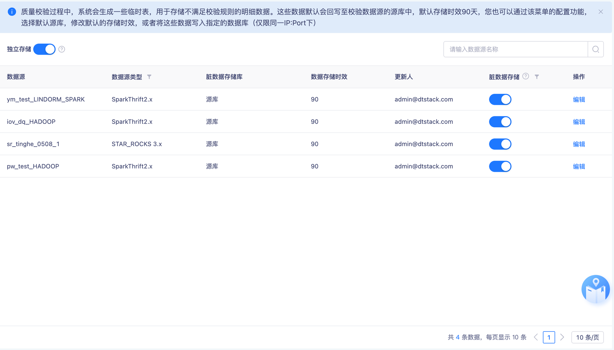
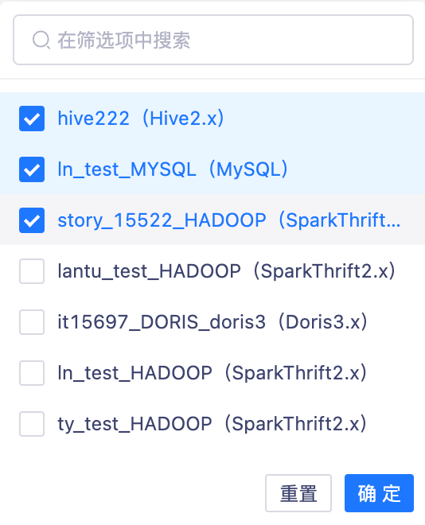
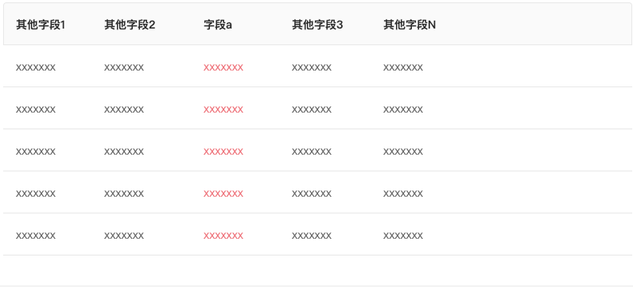

# 支持自定义脏数据存储字段

## 需求身份与来源

- 需求 ID：15912
- 蓝湖文档：资产V7.0.0～7.0.2（岚图/泸州老窖定制）
- 文档 ID：`6e513ee1-fb7f-4e60-897a-21af81c65aba`
- 版本 ID：`6df27b45-b95e-4c3e-b79c-30515d3f4292`
- 页面 ID：`a94fe02759374acfb274aa9bfa7a2351`

## 背景、目标与成功标准

岚图 SOW 外需求。允许按数据表配置脏数据公共字段，使任务执行后保存的明细字段能够在各子规则默认保存字段基础上补充业务定位字段。

## 范围

包含脏数据管理新增‘脏数据明细’页签、公共字段配置的列表与新建编辑删除详情、权限配置，以及公共字段对质量规则和落标检查规则的存储效果。按 PD-001，不包含对历史任务实例明细字段的回填或裁剪。

## 角色、权限与前置条件

脏数据管理下新增‘脏数据明细’和‘脏数据存储’子级权限；两项默认授权管理员和数据开发，并可配置管理员、数据开发、访客。执行效果以开启脏数据存储且任务可生成明细为前置条件。

## 现状与变更

现有‘脏数据存储’页签按数据源管理独立存储；当前 6.3 岚图 release 在通用路径中按源表字段创建脏数据表。本需求新增‘脏数据明细’页签，按数据表维护公共字段，并把目标明细字段收敛为子规则默认保存字段与公共字段的规则化集合。

## 业务场景

用户可搜索、筛选、排序并维护表级公共字段；点击数据表名称查看数据源、数据库和公共字段详情；任务执行后在质量规则或落标检查的不通过明细中验证实际保存字段。

## 字段、枚举、校验与错误

列表展示数据表、数据源、数据库、公共字段、更新人、最近更新时间和操作；公共字段文本超过 25 个字符时省略。新建时数据源、数据库、数据表单选，公共字段多选；已配置的数据表从可选列表过滤。字段类型从数据源表获取。按 PD-002，公共字段至少选择 1 个，未选择或编辑后清空全部字段时阻断保存并提示选择字段。

## 状态与数据规则

表已配置公共字段时，普通质量规则的明细存储字段为公共字段与子规则默认保存字段的去重并集；未配置时仅保存子规则默认字段。仅展示固定规则字段的规则不因公共字段配置而扩展。落标检查明细保存落标检查字段与公共字段的去重并集。

## 异常、边界与兼容性

覆盖公共字段未选择、与默认字段完全不重叠、部分重叠和全部重叠，以及已配置表过滤。按 PD-001，配置新增、编辑和删除只影响后续新执行任务，历史任务实例保持原明细字段。源表后续发生字段删除、重命名或类型变更时如何处理，以及并发保存冲突和通用网络失败提示，需求与当前目标实现均无证据，本需求不定义这些行为。

## 依赖与影响

影响数据质量项目管理菜单和权限、表与字段元数据查询、脏数据建表或写入字段、质量规则明细、落标检查不达标详情。当前 6.3 岚图 release 尚无本需求实现。

## 已确认的产品决策

### PD-001 公共字段配置不追溯历史明细

新增、编辑或删除公共字段配置只影响配置保存后新执行任务产生的脏数据；历史任务实例保持生成时已落盘的字段，不回填、不裁剪。

来源：`Q-001`、`lanhu:a94fe02759374acfb274aa9bfa7a2351`

### PD-002 公共字段配置不能为空

新建或编辑配置时必须至少选择 1 个公共字段；未选择或清空全部字段时阻断保存并提示选择字段。恢复为仅保存规则默认字段时，应删除整条表配置。

来源：`Q-002`、`lanhu:a94fe02759374acfb274aa9bfa7a2351`

## 验收标准

AC-001 公共字段配置可查询和维护、空字段配置被阻断且列表行为符合蓝湖；AC-002 质量规则与落标检查按规则类型生成正确的去重字段集合；AC-003 子级权限的默认授权和可配置角色符合蓝湖；AC-004 配置变更只影响后续任务且历史明细字段保持不变。

## 截图与证据追踪

## 需求追踪矩阵

| ID | 需求或验收表述 | 来源 |
| --- | --- | --- |
| FR-001 | 脏数据管理新增‘脏数据明细’页签，用于按数据表维护公共字段。 | `lanhu:a94fe02759374acfb274aa9bfa7a2351` |
| FR-002 | 脏数据明细列表支持数据表名称模糊搜索、数据源筛选及筛选项搜索、最近更新时间排序。 | `lanhu:a94fe02759374acfb274aa9bfa7a2351` |
| FR-003 | 列表展示数据表、数据源、数据库、公共字段、更新人、最近更新时间和编辑删除操作，公共字段超过 25 个字符时省略显示。 | `lanhu:a94fe02759374acfb274aa9bfa7a2351` |
| FR-004 | 新建配置时数据源、数据库和数据表单选，公共字段多选，且已配置公共字段的数据表不再出现在可选列表中。 | `lanhu:a94fe02759374acfb274aa9bfa7a2351` |
| FR-005 | 支持编辑和删除公共字段配置，并可点击数据表名称查看基本信息与公共字段名称、字段类型。 | `lanhu:a94fe02759374acfb274aa9bfa7a2351` |
| FR-006 | 脏数据管理新增‘脏数据明细’和‘脏数据存储’子级权限，默认授权管理员和数据开发，并可配置访客。 | `lanhu:a94fe02759374acfb274aa9bfa7a2351` |
| BR-001 | 一张数据表只能存在一条公共字段配置。 | `FR-004` |
| BR-002 | 普通质量规则的明细字段为子规则默认保存字段与表公共字段的去重并集；表未配置时仅使用子规则默认保存字段。 | `lanhu:a94fe02759374acfb274aa9bfa7a2351` |
| BR-003 | 仅展示固定规则字段的规则明细不受公共字段配置影响，仍只展示规则字段。 | `lanhu:a94fe02759374acfb274aa9bfa7a2351` |
| BR-004 | 落标检查的不达标明细字段为落标检查字段与表公共字段的去重并集。 | `lanhu:a94fe02759374acfb274aa9bfa7a2351` |
| BR-005 | 公共字段配置的新增、编辑和删除只影响配置保存后新执行任务的脏数据，历史任务实例明细字段不回填、不裁剪。 | `PD-001` |
| ER-001 | 新建未选择公共字段或编辑后清空全部公共字段时阻断保存并提示选择字段；删除整条配置后才恢复为仅保存规则默认字段。 | `PD-002` |
| AC-001 | 用户可完成公共字段配置的查询、新建、编辑、删除和详情查看，列表展示与交互符合需求。 | `FR-001`、`FR-002`、`FR-003`、`FR-004`、`FR-005`、`ER-001` |
| AC-002 | 质量规则和落标检查规则在公共字段未配置、部分重叠和完全不重叠时生成正确的明细字段集合。 | `BR-002`、`BR-003`、`BR-004` |
| AC-003 | 管理员、数据开发和访客对两个子级权限的默认值及可配置行为符合需求。 | `FR-006` |
| AC-004 | 新增、编辑或删除公共字段配置后，历史任务实例保持原明细字段，后续新执行任务使用变更后的字段集合。 | `BR-005` |
