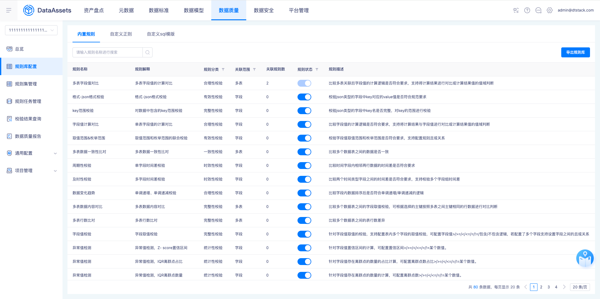

# 完整性规则新增多表去重数据包含关系规则

## 需求身份与来源

- 需求 ID：15913
- 蓝湖文档：资产V7.0.0～7.0.2（岚图/泸州老窖定制）
- 文档 ID：`6e513ee1-fb7f-4e60-897a-21af81c65aba`
- 版本 ID：`6df27b45-b95e-4c3e-b79c-30515d3f4292`
- 页面 ID：`16fe4b9a5116498dbaadeae0b978f299`

## 背景、目标与成功标准

岚图 SOW 外需求。现有完整性规则不能验证多个数据表去重字段集合之间的包含关系；新增内置规则后，可验证校验表去重字段值是否包含或被一个或多个对比表的去重字段值包含。

## 范围

包含完整性规则配置、规则集详情、规则任务详情、校验结果查询监控报告、质量报告、未通过明细和规则库内置规则展示；按 PD-002，详情页不包含维度字段；按 PD-003 和 PD-004，NULL 值参与去重与包含关系计算，并按正常字段值匹配。不覆盖需求未定义的同表或重复对比表、权限、并发、历史数据迁移和转换表达式语法边界。

## 字段、枚举、校验与错误

生效范围新增‘多表去重数据包含关系’。校验表去重字段支持多选且最多 10 个；最多 10 张对比表，每张最多 10 个字段。包含关系支持‘校验表包含对比表’和‘校验表被对比表包含’，表间判断关系支持且或。对比表字段数量必须与校验表一致，类型按字段选择顺序一一对应；数量不足提示‘缺少 x 个字段’。按 PD-001，类型不匹配时失焦后前端立即标红提示‘存在字段类型不匹配’，保存时后端再次校验兜底；有效字段类型转换可消除该错误。

## 状态与数据规则

规则计算前对所选字段组合去重；多字段按有序字段组合形成复合值。按 PD-003 和 PD-004，字段组合中的 NULL 值不被过滤，按正常字段值参与去重与包含关系计算：重复 NULL 去重为一个值，两侧均有 NULL 时匹配，仅一侧存在时按包含方向判定。且关系要求全部对比表关系成立，或关系要求至少一个关系成立。校验通过不记录明细；校验不通过可查看明细；校验失败可查看日志。

## 异常、边界与兼容性

边界包括 10 个校验字段、10 张对比表、每表 10 个对比字段、字段数量不足、类型不匹配、转换后匹配、双边均有 NULL 和仅单边存在 NULL。重复选择同一对比表、同表比较与历史规则兼容没有需求证据，不写成产品事实。

## 依赖与影响

影响完整性规则的生效范围和内置函数、规则配置表单、规则详情、任务详情、监控与质量报告、脏数据明细以及规则库。现有 release 已有多表唯一性与多表内容对比结构，但尚未出现本需求名称或新规则枚举。

## 已确认的产品决策

### PD-001 字段类型不匹配采用双层校验

对比表字段数量一致但类型不匹配时，字段选择失焦后前端立即标红并提示‘存在字段类型不匹配’，保存时后端再次校验兜底；启用有效字段类型转换后不再提示类型不匹配。

来源：`Q-001`、`lanhu:16fe4b9a5116498dbaadeae0b978f299`

### PD-002 完整性详情不展示维度字段

完整性校验不存在维度字段；蓝湖‘新增维度字段’为产品文档错误。规则集详情和规则任务详情展示校验表字段，以及每张对比表的包含关系、表名、分区和字段。

来源：`Q-002`、`lanhu:16fe4b9a5116498dbaadeae0b978f299`

### PD-003 NULL 值参与包含关系计算

所选校验字段中的 NULL 值不被过滤，需参与字段组合去重与包含关系计算；NULL 的匹配语义按 PD-004 执行。

来源：`Q-003`

### PD-004 NULL 按普通字段值匹配

在去重与包含关系中把 NULL 当成正常字段值判断：重复 NULL 去重为一个值，两侧均有 NULL 时视为匹配；仅一侧存在 NULL 时，按配置的包含方向判定是否为未匹配脏数据。

来源：`Q-004`

## 验收标准

AC-001 双向包含关系、去重字段组合和且或逻辑产生正确结果；AC-002 数量上限、字段数量不足、类型不匹配和有效类型转换符合要求；AC-003 规则详情、任务详情、报告和明细与配置及执行结果一致；AC-004 规则库可识别新增内置规则；AC-005 NULL 按正常字段值参与去重和包含判断。

## 截图与证据追踪

## 需求追踪矩阵

| ID | 需求或验收表述 | 来源 |
| --- | --- | --- |
| FR-001 | 完整性校验的生效范围新增‘多表去重数据包含关系’。 | `lanhu:16fe4b9a5116498dbaadeae0b978f299` |
| FR-002 | 校验表去重字段支持多选，最多选择 10 个字段。 | `lanhu:16fe4b9a5116498dbaadeae0b978f299` |
| FR-003 | 支持配置最多 10 张对比表，每张对比表最多选择 10 个去重字段和可选分区。 | `lanhu:16fe4b9a5116498dbaadeae0b978f299` |
| FR-004 | 每张对比表可选择‘校验表包含对比表’或‘校验表被对比表包含’。 | `lanhu:16fe4b9a5116498dbaadeae0b978f299` |
| FR-005 | 多个对比表关系支持且或组合，且要求全部成立，或要求至少一个成立。 | `lanhu:16fe4b9a5116498dbaadeae0b978f299` |
| BR-001 | 校验前对字段组合去重，并按所选字段顺序比较复合值集合的包含关系。 | `lanhu:16fe4b9a5116498dbaadeae0b978f299` |
| BR-003 | 所选字段组合中的 NULL 值不被过滤，按正常字段值参与去重集合与包含关系计算：重复 NULL 去重为一个值，NULL 与 NULL 匹配，仅单边存在 NULL 时按包含方向判定。 | `PD-003`、`PD-004` |
| BR-002 | 对比表字段数量必须与校验表字段数量一致，字段类型按顺序一一对应。 | `lanhu:16fe4b9a5116498dbaadeae0b978f299` |
| ER-001 | 对比表字段数量不足时提示‘缺少 x 个字段’。 | `lanhu:16fe4b9a5116498dbaadeae0b978f299` |
| ER-002 | 字段数量一致但类型不匹配时提示‘存在字段类型不匹配’，有效类型转换可消除该错误；触发时机由 PD-001 确认。 | `lanhu:16fe4b9a5116498dbaadeae0b978f299`、`Q-001` |
| FR-006 | 规则集详情和规则任务详情展示校验表字段以及各对比表的包含关系、表、分区和字段，不展示维度字段。 | `lanhu:16fe4b9a5116498dbaadeae0b978f299`、`PD-002` |
| FR-007 | 监控报告展示规则配置；校验通过不记录明细，校验不通过支持查看明细，校验失败支持查看日志。 | `lanhu:16fe4b9a5116498dbaadeae0b978f299` |
| FR-008 | 质量报告说明对比表、去重字段包含关系是否符合以及不符合数据条数。 | `lanhu:16fe4b9a5116498dbaadeae0b978f299` |
| FR-009 | 明细按关系方向展示未被包含一侧的数据，包含关系、来源表和校验字段可识别，校验字段标红，每张表最多展示 100 条且支持下载。 | `lanhu:16fe4b9a5116498dbaadeae0b978f299` |
| FR-010 | 规则库新增‘多表去重数据包含关系’内置规则，规则分类为完整性校验、关联范围为多表。 | `lanhu:16fe4b9a5116498dbaadeae0b978f299` |
| AC-001 | 双向包含关系、去重字段组合和且或逻辑均可配置并产生符合集合语义的结果。 | `FR-002`、`FR-003`、`FR-004`、`FR-005`、`BR-001`、`BR-003` |
| AC-002 | 10 字段、10 对比表和每表 10 字段边界受控，数量或类型不一致给出可执行修复提示。 | `FR-002`、`FR-003`、`BR-002`、`ER-001`、`ER-002` |
| AC-003 | 规则详情、任务详情、监控报告、质量报告和明细展示与配置和执行结果一致。 | `FR-006`、`FR-007`、`FR-008`、`FR-009` |
| AC-004 | 规则库可识别该新增内置规则及其完整性校验和多表属性。 | `FR-010` |
| AC-005 | NULL 按正常字段值参与去重和包含判断：双边 NULL 匹配，仅单边存在 NULL 时按包含方向产生对应结果和明细。 | `BR-003` |
