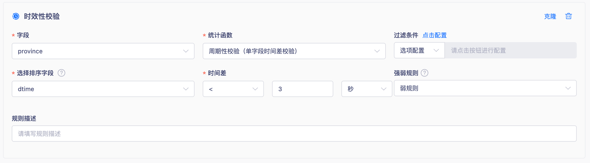
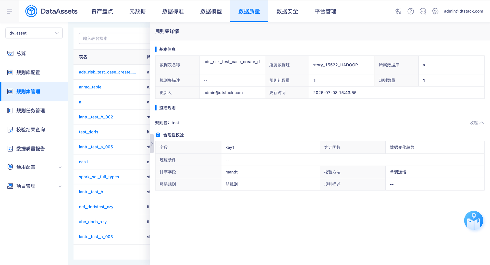
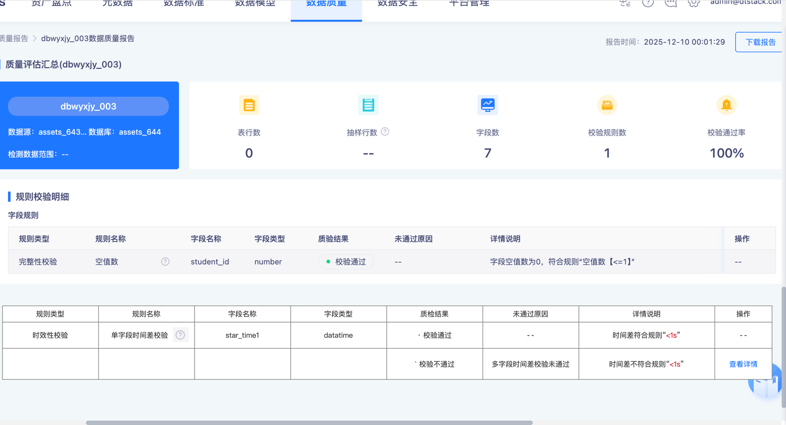

# 时效性校验-周期性校验规则调整

## 需求身份与来源

- 需求 ID：15914
- 蓝湖文档：资产V7.0.0～7.0.2（岚图/泸州老窖定制）
- 文档 ID：`6e513ee1-fb7f-4e60-897a-21af81c65aba`
- 版本 ID：`6df27b45-b95e-4c3e-b79c-30515d3f4292`
- 页面 ID：`53186836f8a14c47acbbc05f5ef0a28c`

## 背景、目标与成功标准

岚图 SOW 外需求。现有周期性校验按全表顺序比较同一字段的时间差，无法按车辆或其他业务维度分别判断。本次目标是支持按一个或多个维度字段分组，并在每个分组内按排序字段比较相邻记录的时间差。

## 范围

包含时效性校验的周期性校验（单字段时间差校验）：规则配置、规则集详情、规则任务详情、校验结果查询监控报告、质量报告说明、违规明细，以及维度字段与校验字段或排序字段重合的特殊边界。不包含及时性校验（多字段时间差校验）及其他规则类型。

## 现状与变更

当前 6.3 岚图分支的 SingleFieldTimeDifferenceConfig 仅含 orderColumn、unit、threshold、operator；校验与脏数据 SQL 的窗口函数只按排序字段排序，无维度分区。目标新增可选维度字段并按维度组合分区，未配置维度时保留现有全表比较行为。

## 业务场景

以车辆等维度字段区分业务实体；多个维度字段作为组合键分组，每组内部按排序字段升序比较相邻记录。某组合内任一时间差不符合规则时，该组合产生不达标结果与违规明细，其他组合不受影响。

## 字段、枚举、校验与错误

选择周期性校验（单字段时间差校验）后新增维度字段选择框；该字段非必填、支持多选，最多选择10个。时间差仍由运算符、阈值和时间单位组成。

## 状态与数据规则

结果达标时不记录明细数据；结果不达标时支持查看明细；运行失败时支持查看日志。违规明细保留校验字段、维度字段和排序字段，校验字段标红，维度字段标蓝。

## 异常、边界与兼容性

覆盖0个、1个、10个和超过10个维度字段，多维度组合分组、单记录分组以及未配置维度的历史兼容行为。运行失败使用专用测试表保存任务后删除再执行的方式稳定构造。维度字段允许与校验字段或排序字段重合，分别验证配置、持久化、详情展示和运行结果；当重合字段值使分组内仅有单条记录时，该分组没有相邻时间差，不产生违规明细。

## 依赖与影响

影响规则配置持久化、窗口 SQL 生成、脏数据列选择、规则集详情、规则任务详情、监控报告和质量报告描述。现有后端模板覆盖 Hive2.x、SparkThrift2.x、Hive3.x(Apache)、Doris2.x 与 Doris3.x，其中 Doris 使用独立时间转换逻辑；功能验收以 SparkThrift2.x 覆盖通用路径，并以 Doris3.x 覆盖 Doris 专用时间转换路径。

## 已确认的产品决策

### PD-001 运行失败日志链路纳入

纳入运行失败异常用例：使用专用测试表创建规则任务，保存后删除该表再立即执行，验证任务状态为运行失败、实例详情可查看日志，且日志可定位表不存在。

来源：`Q-001`、`lanhu:53186836f8a14c47acbbc05f5ef0a28c`

### PD-002 维度字段允许与校验或排序字段重合

维度字段允许选择当前校验字段或排序字段；分别建立边界用例，验证配置可保存、详情可展示，并按正常维度分组语义执行。

来源：`Q-002`、`user-confirmed:2026-08-05`

## 验收标准

AC-001 周期性校验展示非必填、多选且最多10个的维度字段。AC-002 配置维度后按维度组合分组并在组内比较时间差，不同分组互不影响。AC-003 规则集详情、规则任务详情与监控报告展示维度字段。AC-004 达标不记明细、不达标可查看明细、运行失败可查看日志；明细字段与颜色符合要求。AC-005 质量报告按是否配置维度决定是否展示维度描述。AC-006 未配置维度时保留现有全表比较行为。AC-007 维度字段可与校验字段或排序字段重合，两类配置均可保存、回显并正常执行分组逻辑。AC-008 等价数据在 SparkThrift2.x 通用路径与 Doris3.x 专用时间转换路径产生一致的分组校验结果。

## 截图与证据追踪

## 需求追踪矩阵

| ID | 需求或验收表述 | 来源 |
| --- | --- | --- |
| FR-001 | 选择周期性校验（单字段时间差校验）后新增维度字段选择框，非必填、支持多选、最多选择10个。 | `lanhu:53186836f8a14c47acbbc05f5ef0a28c` |
| FR-002 | 配置一个或多个维度字段后，以维度字段组合为分组键，并在每组内按排序字段比较相邻记录的时间差。 | `lanhu:53186836f8a14c47acbbc05f5ef0a28c` |
| FR-003 | 规则集详情与规则任务详情展示维度字段。 | `lanhu:53186836f8a14c47acbbc05f5ef0a28c` |
| FR-004 | 校验结果查询的监控报告展示维度字段。 | `lanhu:53186836f8a14c47acbbc05f5ef0a28c` |
| FR-005 | 达标规则不记录明细数据，不达标规则支持查看明细，运行失败规则支持查看日志。 | `lanhu:53186836f8a14c47acbbc05f5ef0a28c` |
| FR-006 | 违规明细记录不符合时间差的数据，并保留校验字段、维度字段和排序字段；校验字段标红，维度字段标蓝。 | `lanhu:53186836f8a14c47acbbc05f5ef0a28c` |
| FR-007 | 质量报告的单字段时间差规则说明在已配置维度时展示维度字段描述，未配置维度时不展示该描述。 | `lanhu:53186836f8a14c47acbbc05f5ef0a28c` |
| BR-001 | 未配置维度字段时沿用现有全表排序比较行为，兼容历史规则。 | `source:customltem/dt-center-assets@release_6.3.x_ltqc:SingleFieldTimeDifferenceConfig.java`、`source:customltem/dt-center-assets@release_6.3.x_ltqc:202602091400_v6.3.x.sql` |
| BR-002 | 维度字段允许与当前校验字段或排序字段重合，两种特殊边界必须分别纳入正式测试覆盖。 | `PD-002` |
| BR-003 | 功能验收覆盖 SparkThrift2.x 通用时间转换路径与 Doris3.x 专用时间转换路径，等价数据应产生一致的维度分组校验结果。 | `source:customltem/dt-center-assets@release_6.3.x_ltqc:SingleFieldTimeDifferenceServiceImpl.java`、`source:customltem/dt-center-assets@release_6.3.x_ltqc:202602091400_v6.3.x.sql` |
| AC-001 | 维度字段非必填、支持多选，选择10个可保存，尝试选择第11个时不再新增选择。 | `FR-001` |
| AC-002 | 相同维度组合内按排序字段比较时间差；某组合不符合时只产生该组合的违规结果。 | `FR-002` |
| AC-003 | 规则集详情、规则任务详情和监控报告均展示已配置的维度字段。 | `FR-003`、`FR-004` |
| AC-004 | 达标不记明细；不达标可查看包含校验、维度和排序字段的明细，且校验字段标红、维度字段标蓝；运行失败可查看日志。 | `FR-005`、`FR-006` |
| AC-005 | 质量报告仅在配置维度字段时展示维度描述。 | `FR-007` |
| AC-006 | 不配置维度字段时，运行结果与现有全表比较逻辑一致。 | `BR-001` |
| AC-007 | 维度字段与校验字段相同、与排序字段相同的两类配置均可保存和回显，并按维度分组语义正常执行；单记录分组不产生违规明细。 | `BR-002` |
| AC-008 | 相同维度与时间数据在 SparkThrift2.x 和 Doris3.x 执行后，规则结果、违规组合和明细记录一致。 | `BR-003` |
