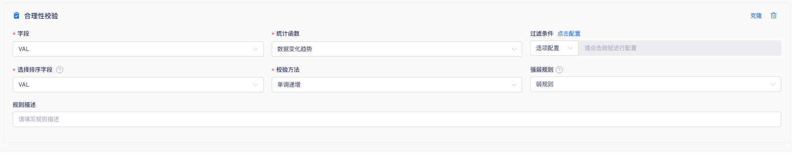
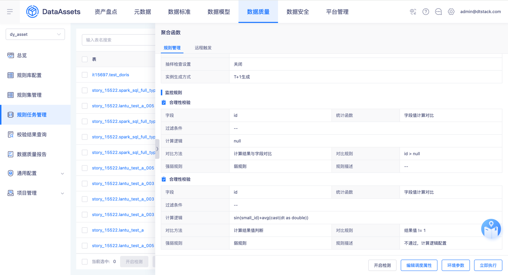
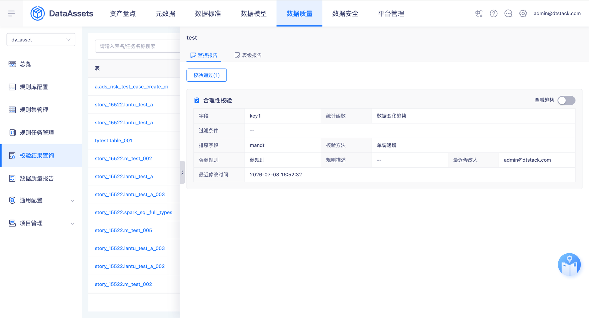
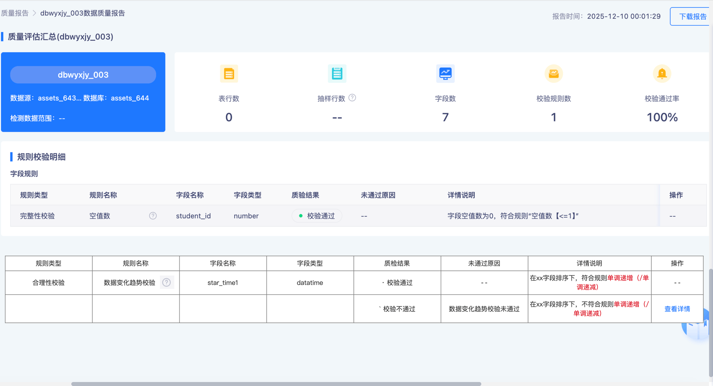

# 合理性校验-数据变化趋势规则调整

## 需求身份与来源

- 需求 ID：15915
- 蓝湖文档：资产V7.0.0～7.0.2（岚图/泸州老窖定制）
- 文档 ID：`6e513ee1-fb7f-4e60-897a-21af81c65aba`
- 版本 ID：`6df27b45-b95e-4c3e-b79c-30515d3f4292`
- 页面 ID：`9390fba91738476db6f5401c5ce00594`

## 背景、目标与成功标准

岚图SOW外需求。历史合理性校验的数据变化趋势规则不满足客户业务场景：仅能全表判断单调递增/递减，无法按维度（如每辆车）判断。本次优化使单调递增、单调递减规则支持按维度字段分组判断该维度下数据是否符合单调递增/递减。注意：数据相同也属于单调递增/递减（如1、2、2、5、6、7、7）。

## 范围

涉及数据质量-合理性校验数据变化趋势规则：规则配置维度字段选择、规则集详情/规则任务详情/校验结果查询监控报告/质量报告展示维度字段与明细数据。不涉及其他统计函数规则类型。

## 字段、枚举、校验与错误

维度字段：非必填，支持多选，最大支持选择10个。校验方法：单调递增(asc)/单调递减(desc)。数据相同属于单调（非严格单调）。

## 状态与数据规则

校验通过：不记录明细数据。校验不通过：支持查看明细，明细数据记录不符合单调递增/递减的数据，数据列表保留校验字段、维度字段、排序字段，校验字段标红展示、维度字段标蓝展示。校验失败：支持查看日志。

## 异常、边界与兼容性

边界：维度字段多选上限10个；校验字段与维度字段为同一字段。兼容性：不选择维度字段时按全表（现状行为）判断，兼容历史规则。

## 依赖与影响

上游影响：质量报告规则详情说明新增维度字段描述；监控报告展示维度字段；明细数据写入脏数据表。

## 已确认的产品决策

### PD-001 校验失败查看日志用例纳入

纳入「构造校验失败场景→实例详情查看日志」用例，用字段类型不支持该子规则的方式构造运行失败。

来源：`Q-001`、`lanhu:9390fba91738476db6f5401c5ce00594`、`knowledge:数据质量模块业务规则 §3.2`

## 验收标准

AC-001 规则配置选择数据变化趋势后新增维度字段选择框，非必填、多选、上限10个。AC-002 规则集详情、规则任务详情、监控报告展示维度字段。AC-003 校验通过的规则不记录明细；校验不通过的规则可查看明细（校验字段标红、维度字段标蓝、保留校验/维度/排序字段）；校验失败的规则可查看日志。AC-004 质量报告规则详情说明新增维度字段描述。AC-005 不选择维度字段时按现状全表判断。

## 截图与证据追踪

## 需求追踪矩阵

| ID | 需求或验收表述 | 来源 |
| --- | --- | --- |
| FR-001 | 合理性校验选择「数据变化趋势」统计函数后，新增「维度字段」选择框：非必填、支持多选、最大支持选择10个。 | `lanhu:9390fba91738476db6f5401c5ce00594` |
| FR-002 | 规则集详情、规则任务详情展示新增「维度字段」。 | `lanhu:9390fba91738476db6f5401c5ce00594` |
| FR-003 | 校验结果查询监控报告展示新增「维度字段」。 | `lanhu:9390fba91738476db6f5401c5ce00594` |
| FR-004 | 针对「校验通过」的规则不记录明细数据；「校验不通过」的规则支持查看明细；「校验失败」的规则支持查看日志。 | `lanhu:9390fba91738476db6f5401c5ce00594` |
| FR-005 | 明细数据记录不符合单调递增/递减的数据，数据列表保留校验字段、维度字段、排序字段；校验字段标红展示、维度字段标蓝展示。 | `lanhu:9390fba91738476db6f5401c5ce00594` |
| FR-006 | 质量报告-数据变化趋势校验的规则详情说明新增维度字段的描述：以xx字段为维度，在xx字段排序下，符合规则单调递增（单调递减）/不符合规则。 | `lanhu:9390fba91738476db6f5401c5ce00594` |
| FR-007 | 单调递增/递减支持按维度字段分组判断；数据相同也属于单调递增/递减。 | `lanhu:9390fba91738476db6f5401c5ce00594` |
| FR-008 | 不选择维度字段时按现状全表判断单调递增/递减，兼容历史规则。 | `source:customltem/dt-center-assets@release_6.3.x_ltqc:ReasonableDataChangeTrendConfig.java`、`source:customltem/dt-center-assets@release_6.3.x_ltqc:ReasonableDataChangeTrendTemplateHandler.java` |
| AC-001 | 规则配置选择数据变化趋势后新增维度字段选择框，非必填、多选、上限10个。 | `FR-001` |
| AC-002 | 规则集详情、规则任务详情、监控报告展示维度字段。 | `FR-002`、`FR-003` |
| AC-003 | 校验通过不记明细；校验不通过可查看明细（校验字段标红、维度字段标蓝、保留校验/维度/排序字段）；校验失败可查看日志。 | `FR-004`、`FR-005` |
| AC-004 | 质量报告规则详情说明新增维度字段描述。 | `FR-006` |
| AC-005 | 不选择维度字段时按现状全表判断。 | `FR-008` |
