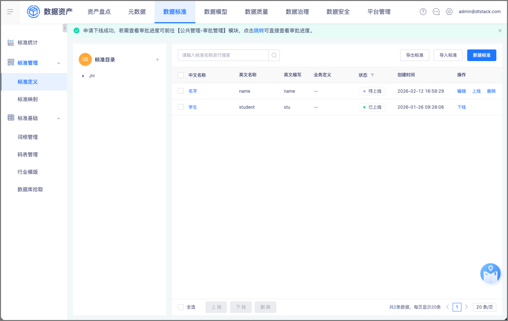

# 标准目录编辑

## 需求身份与来源

- 需求 ID：16209
- 蓝湖文档：数据资产V7.0.1
- 文档 ID：`39a7f277-38a7-4cc3-a489-2cff4eb5c1d4`
- 版本 ID：`3ad3e69d-1464-4ebc-a48f-ee51c593a070`
- 页面 ID：`981d305c6ef14bc09f13faf0b1c89fb8`

## 背景、目标与成功标准

当前数据标准需下线后才能编辑标准信息。为满足已上线标准高频调整所属目录的场景，增加目录单独编辑入口。

## 范围

仅包含单条已上线标准的目录修改；不包含标准其他字段编辑、标准目录树维护、批量修改目录和历史数据迁移。

## 角色、权限与前置条件

具备数据标准操作权限的用户可执行目录修改；标准目录树中存在可选目标目录。

## 现状与变更

现有已上线标准仅提供下线、复制等操作；变更后新增修改目录操作，并通过独立弹窗完成目录选择与保存。

## 业务场景

用户在标准定义列表对已上线标准发起修改目录，选择新目录并保存，随后通过标准详情及目录筛选核对变更结果。

## 字段、枚举、校验与错误

弹窗标题为“修改目录”，字段为必填的“标准目录”，提供“取消”和“保存”按钮；保存成功提示“标准目录保存成功”。

## 状态与数据规则

修改目录入口仅适用于已上线标准；保存后目录立即生效，标准继续保持已上线且不触发上线或下线审批；待上线和待审批标准继续沿用现有状态操作集合。

## 依赖与影响

依赖标准目录树、数据标准详情、标准列表目录筛选和标准版本记录；目录修改后相关展示必须读取同一目录数据，并生成仅包含目录变化的新版本。

## 已确认的产品决策

### PD-001 在线修改目录不触发审批

已上线标准修改目录并保存后立即生效，标准继续保持“已上线”，不触发上线或下线审批。

来源：`Q-001`、`lanhu:981d305c6ef14bc09f13faf0b1c89fb8`

### PD-002 目录修改纳入版本记录

已上线标准修改目录后生成一条新的标准版本记录，版本对比仅体现标准目录由原目录变为新目录。

来源：`Q-002`、`source:dt-insight-web/dt-center-metadata@8fd1c8a1ae367c26b8b31a64b5a2152cfc21c666:StandardVersionRecordService.java`

## 验收标准

已上线标准可通过修改目录入口选择并保存新目录，成功提示准确，详情和目录筛选结果一致，标准状态保持已上线且不触发审批；生成的新版本记录仅体现目录变化；非目标状态及无操作权限用户不能执行该操作。

## 截图与证据追踪

## 需求追踪矩阵

| ID | 需求或验收表述 | 来源 |
| --- | --- | --- |
| FR-001 | 已上线状态的数据标准在操作区增加修改目录入口。 | `lanhu:981d305c6ef14bc09f13faf0b1c89fb8` |
| FR-002 | 点击修改目录后打开独立弹窗，用户可选择标准目录并保存。 | `lanhu:981d305c6ef14bc09f13faf0b1c89fb8` |
| BR-001 | 修改目录仅改变数据标准的所属目录，不开放其他标准字段编辑。 | `lanhu:981d305c6ef14bc09f13faf0b1c89fb8` |
| BR-002 | 目录选择为必填项。 | `source:dt-insight-front/dt-insight-studio@77935a87d414f3e63baa6448353fabbf8b91a92d:standardBusinessAttr.tsx`、`source:dt-insight-web/dt-center-metadata@8fd1c8a1ae367c26b8b31a64b5a2152cfc21c666:DataStandardController.java` |
| BR-003 | 仅具备数据标准操作权限的用户可以执行修改目录。 | `source:dt-insight-front/dt-insight-studio@77935a87d414f3e63baa6448353fabbf8b91a92d:dataStandard/index.tsx` |
| PD-001 | 已上线标准修改目录后立即生效并保持已上线，不触发上线或下线审批。 | `Q-001`、`lanhu:981d305c6ef14bc09f13faf0b1c89fb8` |
| PD-002 | 修改目录后生成一条新的标准版本记录，版本对比仅体现目录变化。 | `Q-002`、`source:dt-insight-web/dt-center-metadata@8fd1c8a1ae367c26b8b31a64b5a2152cfc21c666:StandardVersionRecordService.java` |
| AC-001 | 目录保存成功后展示“标准目录保存成功”。 | `lanhu:981d305c6ef14bc09f13faf0b1c89fb8` |
| AC-002 | 保存后标准详情和目录筛选均展示新的所属目录。 | `lanhu:981d305c6ef14bc09f13faf0b1c89fb8`、`source:dt-insight-front/dt-insight-studio@77935a87d414f3e63baa6448353fabbf8b91a92d:dataStandard/index.tsx` |
| AC-003 | 修改目录后新增一条标准版本记录，版本对比仅显示标准目录由原目录变为新目录。 | `PD-002`、`source:dt-insight-web/dt-center-metadata@8fd1c8a1ae367c26b8b31a64b5a2152cfc21c666:StandardVersionRecordService.java` |
