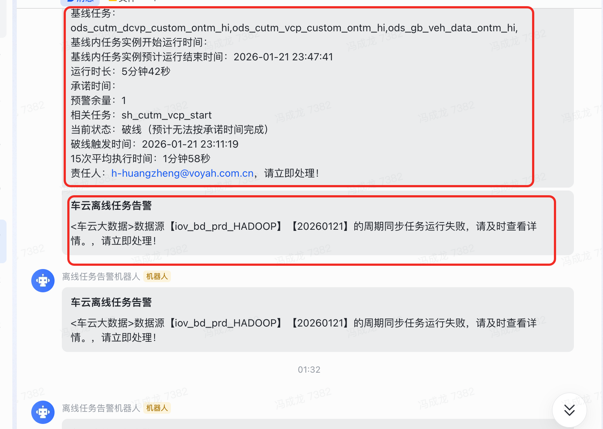
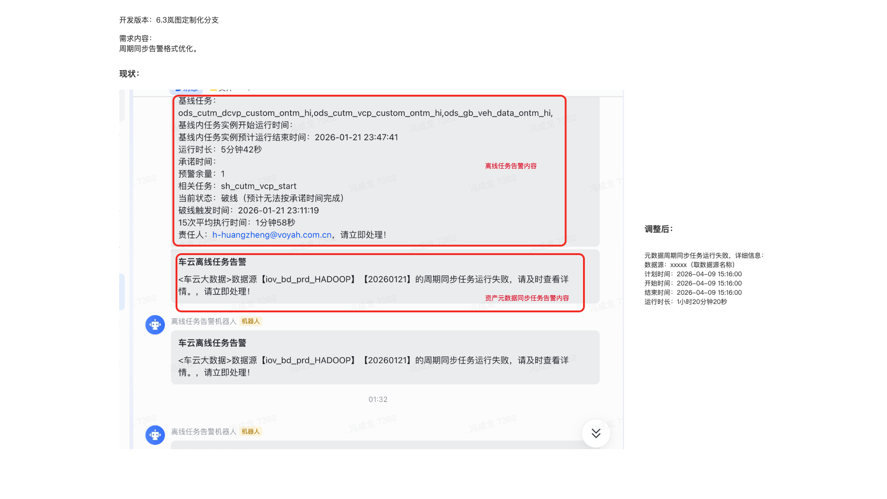

# 【元数据】周期同步告警优化

## 页面元素截图

## 控件文本

开发版本：6.3岚图定制化分支需求内容：周期同步告警格式优化。 | 现状： | 离线任务告警内容 | 资产元数据同步任务告警内容 | 调整后：

## 整页截图

## 页面完整文本

开发版本：6.3岚图定制化分支

需求内容：

周期同步告警格式优化。

现状：

离线任务告警内容

资产元数据同步任务告警内容

调整后：

元数据周期同步任务运行失败，详细信息：

数据源：xxxxx（取数据源名称）

计划时间：2026-04-09 15:16:00

开始时间：2026-04-09 15:16:00

结束时间：2026-04-09 15:16:00

运行时长：1小时20分钟20秒
