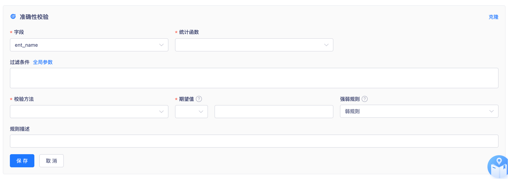
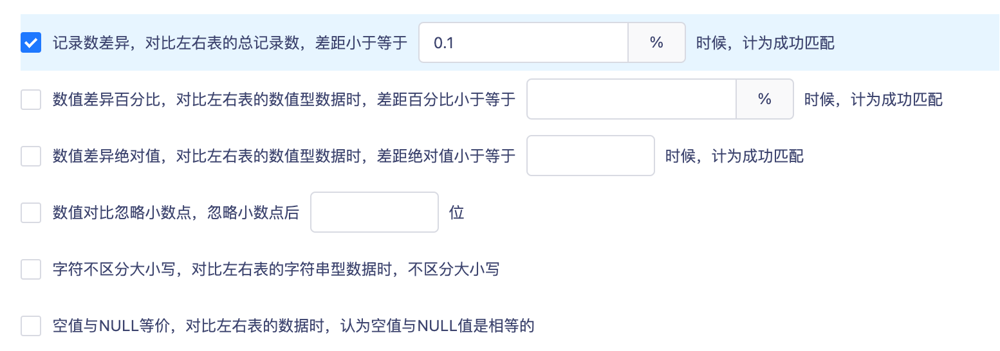
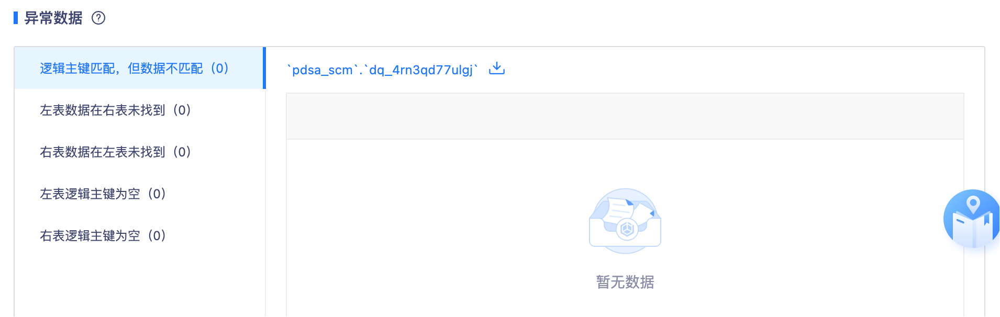
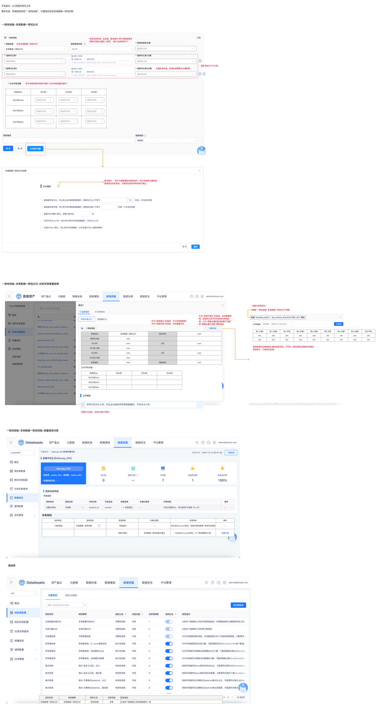

# 【内置规则丰富】一致性，多表数据一致性比对

## 页面元素截图

## 控件文本

一致性校验-多表数据一致性比对 | 请选择 | 一致性校验 | 校验类型 | 选择校验字段 | 多表数据一致性比对设置 | 确定

取 消

16

16 | 确定 | 取 消 | 16 | 支持多表数据一致性比对 | 多表数据一致性比对 | * 选择对比表1 | 请选择表名 | * 选择对比表1主键 | 请选择主键 | * 选择校验表主键 | 表之间 | * 选择对比表2 | * 选择对比表2主键

## 整页截图

## 页面完整文本

一致性校验-多表数据一致性比对

请选择

一致性校验

校验类型

选择校验字段

请选择

多表数据一致性比对设置

确定

取 消

16

16

支持多表数据一致性比对

多表数据一致性比对

* 选择对比表1

请选择表名

* 选择对比表1主键

请选择主键

* 选择校验表主键

请选择主键

表之间

表之间

表之间

* 选择对比表2

请选择表名

* 选择对比表2主键

请选择主键

比对细节设置

最多添加10个对比表

主键支持多选，多选后按照联合主键判断

悬浮提示：“若不勾选配置具体规则细节，则正常按照主键校验数据是否存在差异，只要存在差异判断校验不通过。”

比对规则

开发版本：6.3岚图定制化分支

需求内容：新增规则类型“一致性校验”，内置规则包括多表数据一致性判断

一致性校验-多表数据一致性比对-任务实例查看结果

校验类型

多表数据一致性比对

校验字段

xxxx

校验表主键

xxxx

对比表1

xxxx

分区

xxxx

对比表1主键

xxxx

对比表2

xxxx

分区

xxxx

对比表2主键

xxxx

规则描述

xxxx

强弱规则

xxxx

查看明细

针对“校验不通过”的规则，支持查看明细，明细仅记录不符合规则的校验结果，分为“逻辑主键匹配但数据不匹配”和“逻辑主键不匹配”两种情况

查看“一致性校验-多表数据一致性比对”明细

标题文案修改为：

针对“校验通过”的规则，不记录明细数据；

针对“校验失败”的规则，支持查看日志

一致性校验

仅展示勾选的，没有勾选的不展示

比对规则

字段支持多选，非必选，悬浮提示“若不选择校验字段则只判断主键的一致性”，最大支持选择10个

* 比对字段设置

校验表xxx

对比表1

对比表2

对比表3

对比字段1xxx

对比字段2xxx

对比字段3xxx

请选择字段

请选择字段

请选择字段

请选择字段

请选择字段

请选择字段

请选择字段

请选择字段

请选择字段

若不选择校验字段则不展示“比对字段设置这部分”

校验表xxx

对比表1

对比表2

对比表3

对比字段1xxx

对比字段2xxx

对比字段3xxx

比对字段设置

一致性校验-多表数据一致性校验-质量报告内容

规则类型

规则名称

质检结果

未通过原因

详情说明

操作

一致性校验

   多表数据一致性校验

· 校验通过

- -

对比表为xx;xx;xx(表名)，校验字段的数据一致性符合规则

- -

` 校验不通过

多表数据一致性校验未通过

对比表为xx;xx;xx(表名)，不一致的数据共xx条

查看详情

多表规则

明细数据仅存储校验主键和校验字段，不符合一致性规则的数据均存储在明细表中，不做标红处理。

表1.主键1

表1.主键2

表1.字段

表2.主键1

表2.主键2

表2.字段

表3.主键1

表3.主键2

表3.字段

xxx

xxx

xxx

xxx

xxx

xxx

xxx

xxx

xxx

xxx

xxx

xxx

xxx

xxx

xxx

xxx

xxx

xxx

规则库

规则名称

规则解释

规则分类

关联范围

规则描述

多表数据一致性比对

多表数据一致性比对

一致性校验

多表

比较多个数据表之间的数据是否一致

表之间

表之间
