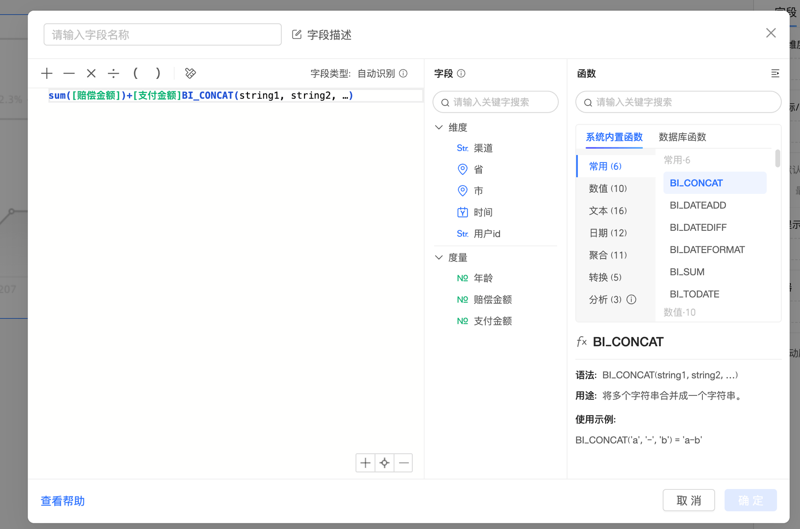
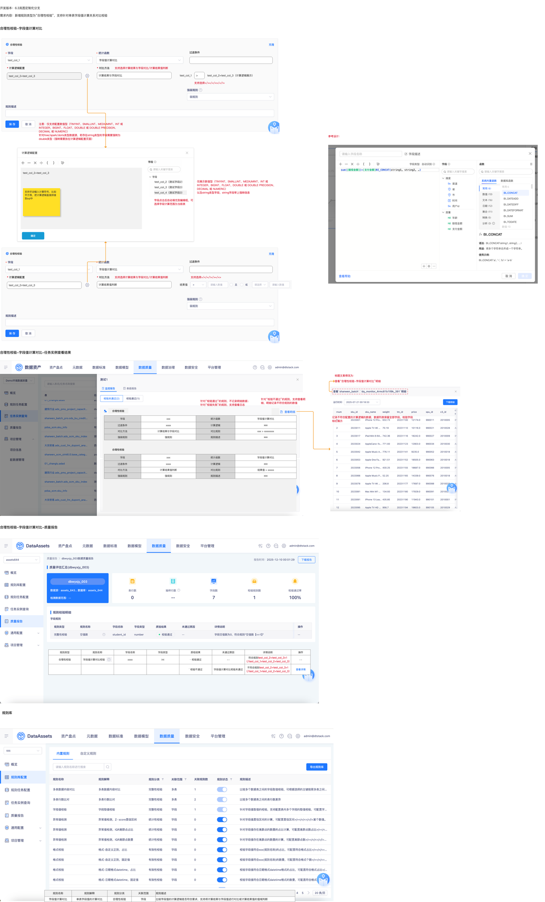

# 【内置规则丰富】合理性，单表，字段值的计算关系对比

## 页面元素截图

## 控件文本

开发版本：6.3岚图定制化分支需求内容：新增规则类型为“合理性校验”，支持针对单表字段值计算关系对比校验 | 合理性校验-字段值计算对比 | 字段值计算对比 | 过滤条件 | * 计算逻辑配置 | test_col_2+test_col_3 | * 对比方法 | test_col_1 | 固定值 | < | 1 | 计算逻辑配置 | 字段 | test_col_2（测试字段2） | test_col_3（测试字段3） | test_col_4（测试字段3） | 字段点击后自动填充到编辑框，可选择字段计算范围为当前表 | 支持手动输入计算符号，比如平方等，把计算逻辑直接拼接到sql中 | > | test_col_2+test_col_3（计算逻辑展示）

## 整页截图

## 页面完整文本

开发版本：6.3岚图定制化分支

需求内容：新增规则类型为“合理性校验”，支持针对单表字段值计算关系对比校验

合理性校验-字段值计算对比

字段值计算对比

过滤条件

* 计算逻辑配置

test_col_2+test_col_3

* 对比方法

test_col_1

固定值

<

1

计算逻辑配置

test_col_2+test_col_3

字段

test_col_2（测试字段2）

test_col_3（测试字段3）

test_col_4（测试字段3）

字段点击后自动填充到编辑框，可选择字段计算范围为当前表

支持手动输入计算符号，比如平方等，把计算逻辑直接拼接到sql中

test_col_1

>

test_col_2+test_col_3（计算逻辑展示）

支持选择>/>=/</<=/=/!=

计算结果与字段对比

支持选择计算结果与字段对比/计算结果值判断

字段值计算对比

过滤条件

* 计算逻辑配置

test_col_2+test_col_3

* 对比方法

test_col_1

固定值

<

1

结果值

计算结果值判断

支持选择计算结果与字段对比/计算结果值判断

合理性校验

合理性校验

支持选择>/</=/!=/>=/<=

参考设计：

仅展示数值型（TINYINT、SMALLINT、MEDIUMINT、INT 或 INTEGER、BIGINT、FLOAT、DOUBLE 或 DOUBLE PRECISION、DECIMAL 或 NUMERIC）

以及string类型字段，string字段带上强转信息

注意：仅支持配置数值型（TINYINT、SMALLINT、MEDIUMINT、INT 或 INTEGER、BIGINT、FLOAT、DOUBLE 或 DOUBLE PRECISION、DECIMAL 或 NUMERIC）

针对hive/spark/doris类型数据源，若存在string类型的字段需要强转为double类型（强转需要放在计算逻辑配置页面）

合理性校验-字段值计算对比-任务实例查看结果

针对“校验不通过”的规则，支持查看明细，明细记录不符合规则的数值

查看“合理性校验-字段值计算对比”明细

记录不符合配置的计算逻辑的数据，数据列表保留全部字段，校验字段标红展示

标题文案修改为：

针对“校验通过”的规则，不记录明细数据；

针对“校验失败”的规则，支持查看日志

字段

xxx

统计函数

字段值计算对比

过滤条件

xxxx

计算逻辑

xxx

对比方法

计算结果与字段对比

对比规则

xxx > xxxxxxxx

强弱规则

强规则

规则描述

xxx

合理性校验

合理性校验-字段值计算对比-质量报告

规则类型

规则名称

字段名称

字段类型

质检结果

未通过原因

详情说明

操作

合理性校验

  字段值计算对比校验

xxxx

int

· 校验通过

- -

符合规则test_col_2+test_col_3>1（/test_col_1>test_col_2+test_col_3）

- -

` 校验不通过

字段值计算对比校验未通过

不符合规则test_col_2+test_col_3>1（/test_col_1>test_col_2+test_col_3）

查看详情

字段

xxx

统计函数

字段值计算对比

过滤条件

xxxx

计算逻辑

xxx

对比方法

计算结果值判断

对比规则

结果值 > xxxxx

强弱规则

强规则

规则描述

xxx

合理性校验

确定

规则库

规则名称

规则解释

规则分类

关联范围

规则描述

字段值计算对比

单表字段值的计算对比

合理性校验

字段

比较字段值的计算逻辑是否符合要求，支持将计算结果与字段值进行对比或计算结果值的值域判断
