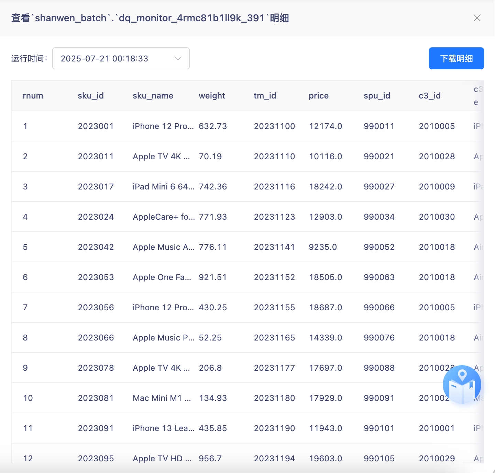
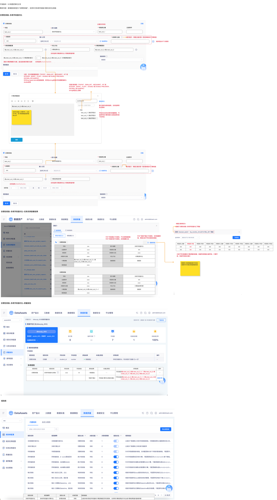

# 【内置规则丰富】合理性，多表，字段大小对比以及字段计算逻辑对比

## 页面元素截图

## 控件文本

开发版本：6.3岚图定制化分支需求内容：新增规则类型为“合理性校验”，支持针对多表字段值计算关系对比校验 | 合理性校验-多表字段值对比 | 多表字段值对比 | 过滤条件 | test_col_1 | 固定值 | < | 1 | 计算逻辑配置 | 表a.test_col_2+表b.test_col_3 | 字段 | test_col_2（测试字段2） | test_col_3（测试字段3） | test_col_4（测试字段3） | 字段点击后自动填充到编辑框，可选择字段计算范围为当前选择的表下的字段 | 支持手动输入计算符号，比如平方等，把计算逻辑直接拼接到sql中 | 合理性校验 | * 字段 | * 计算逻辑配置 | * 对比方法

## 整页截图

## 页面完整文本

开发版本：6.3岚图定制化分支

需求内容：新增规则类型为“合理性校验”，支持针对多表字段值计算关系对比校验

合理性校验-多表字段值对比

多表字段值对比

过滤条件

test_col_1

固定值

<

1

仅展示数值型（TINYINT、SMALLINT、MEDIUMINT、INT 或 INTEGER、BIGINT、FLOAT、DOUBLE 或 DOUBLE PRECISION、DECIMAL 或 NUMERIC）

string类型加上强转

计算逻辑配置

表a.test_col_2+表b.test_col_3

字段

test_col_2（测试字段2）

test_col_3（测试字段3）

test_col_4（测试字段3）

字段点击后自动填充到编辑框，可选择字段计算范围为当前选择的表下的字段

支持手动输入计算符号，比如平方等，把计算逻辑直接拼接到sql中

合理性校验

* 字段

test_col_1

* 计算逻辑配置

表a.test_col_2+表b.test_col_3

* 对比方法

支持选择>/>=/</<=/=/!=

计算结果对比

支持选择计算结果对比/计算结果值判断

表a.test_col_2+表b.test_col_3（计算逻辑1展示）

>

表a.test_col_2+表b.test_col_3（计算逻辑2展示）

* 关联表1

xxx

选择数据表

最多添加10个关联表

* 关联表1主键

悬浮提示：根据主键关联一致的数据进行计算校验

* 校验表主键

test_col_1

* 计算逻辑配置2

表a.test_col_2+表b.test_col_3

固定计算逻辑展示长度，超出鼠标悬浮展示全部

多表字段值对比

过滤条件

test_col_1

固定值

<

1

合理性校验

* 字段

test_col_1

表a.test_col_2+表b.test_col_3

计算结果值判断

支持选择计算结果对比/计算结果值判断

* 校验表主键

test_col_1

结果值

支持选择>/</=/!=/>=/<=

默认选择当前校验表，支持选择其他关联表

注意：仅支持配置数值型（TINYINT、SMALLINT、MEDIUMINT、INT 或 INTEGER、BIGINT、FLOAT、DOUBLE 或 DOUBLE PRECISION、DECIMAL 或 NUMERIC）

针对hive/spark/doris类型数据源，若存在string类型的字段需要强转为double类型

合理性校验-多表字段值对比-任务实例查看结果

针对“校验不通过”的规则，支持查看明细，明细记录不符合规则的数值

查看“合理性校验-多表字段值对比”明细

标题文案修改为：

针对“校验通过”的规则，不记录明细数据；

针对“校验失败”的规则，支持查看日志

字段

xxx

统计函数

多表字段值对比

过滤条件

xxxx

校验表主键

xxx

关联表1

xxx

关联表1分区

xxxx

关联表1主键

xxxx

对比方法

计算结果对比

计算逻辑

表a.test_col_2+表b.test_col_3 > 表a.test_col_2+表b.test_col_3

强弱规则

强规则

规则描述

xxxx

合理性校验

合理性校验-多表字段值对比-质量报告

规则类型

规则名称

字段名称

字段类型

质检结果

未通过原因

详情说明

操作

合理性校验

  多表字段值对比校验

xxxx

int

· 校验通过

- -

符合规则表a.test_col_2+表b.test_col_3 >1（/表a.test_col_2+表b.test_col_3 > 表a.test_col_2+表b.test_col_3）

- -

` 校验不通过

字段值计算对比校验未通过

不符合规则表a.test_col_2+表b.test_col_3 >1（/表a.test_col_2+表b.test_col_3 > 表a.test_col_2+表b.test_col_3）

查看详情

合理性校验

字段

xxx

统计函数

多表字段值对比

过滤条件

xxxx

校验表主键

xxx

关联表1

xxx

关联表1分区

xxxx

关联表1主键

xxxx

对比方法

计算值结果判断

计算逻辑

表a.test_col_2+表b.test_col_3 > 1

强弱规则

强规则

规则描述

xxxx

校验表.主键1

校验表.字段

校验表.字段1

校验表.字段2

关联表1.主键1

关联表1.字段1

关联表1.字段2

关联表2.主键1

关联表2.字段1

关联表2.字段2

xxx

xxx

xxx

xxx

xxx

xxx

xxx

xxx

xxx

xxx

xxx

xxx

xxx

xxx

xxx

xxx

xxx

xxx

xxx

xxx

记录不符合配置的计算逻辑的数据，数据列表保留主键字段、计算字段，校验字段标红展示

主键支持多选

复制表名

多表规则

需要把计算逻辑配置的字段信息解析并存储在明细数据表里

确定

规则库

规则名称

规则解释

规则分类

关联范围

规则描述

多表字段值对比

多表字段值的计算对比

合理性校验

多表

比较多表关联后字段值的计算逻辑是否符合要求，支持将计算结果进行对比或计算结果值的值域判断

* 关联表1

xxx

* 关联表1主键

悬浮提示：根据主键关联一致的数据进行计算校验
