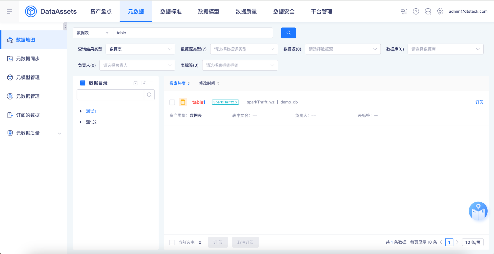
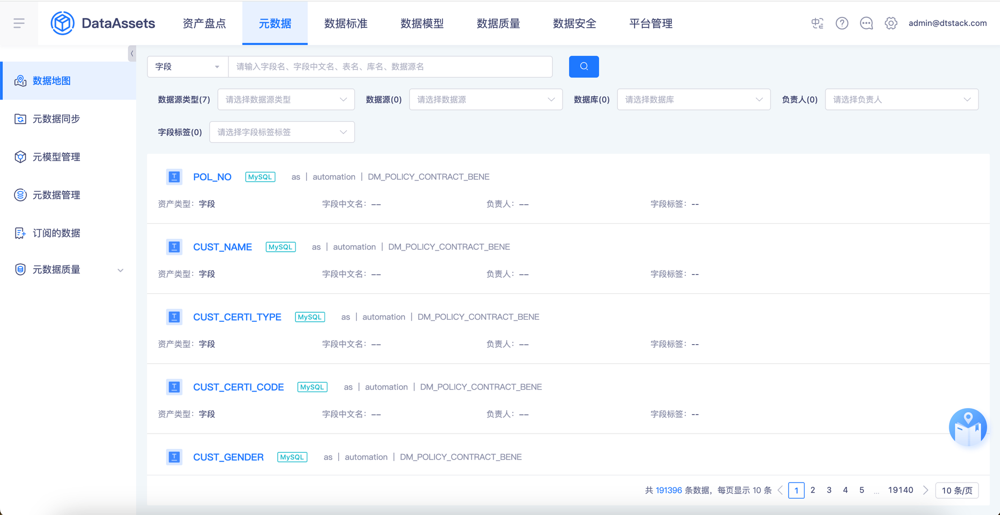
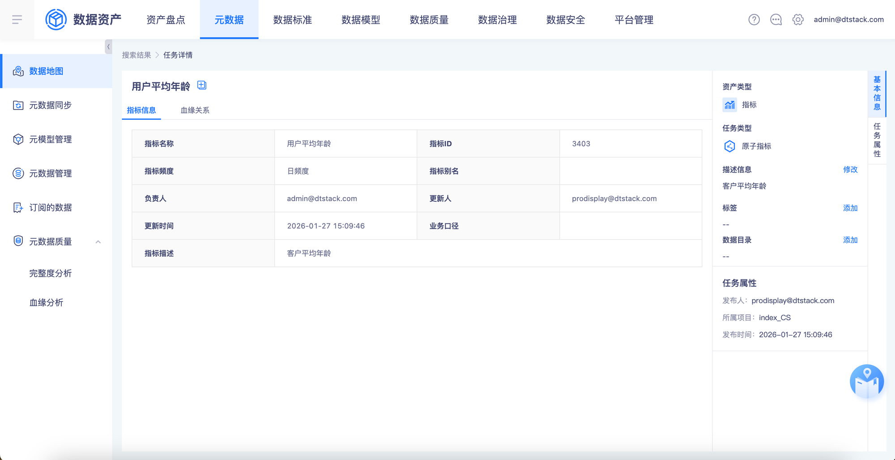
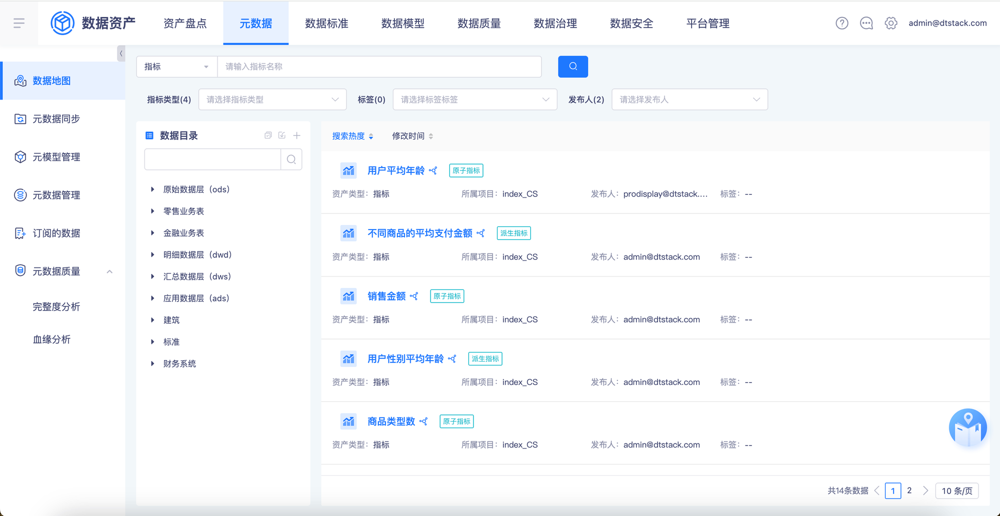
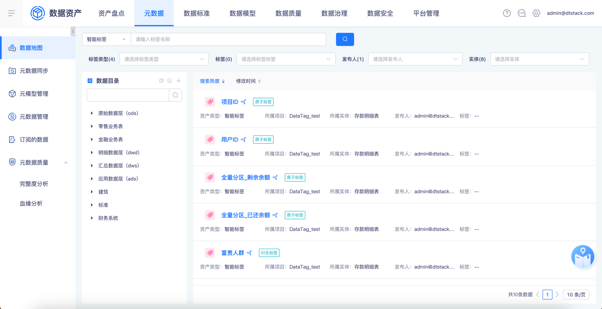
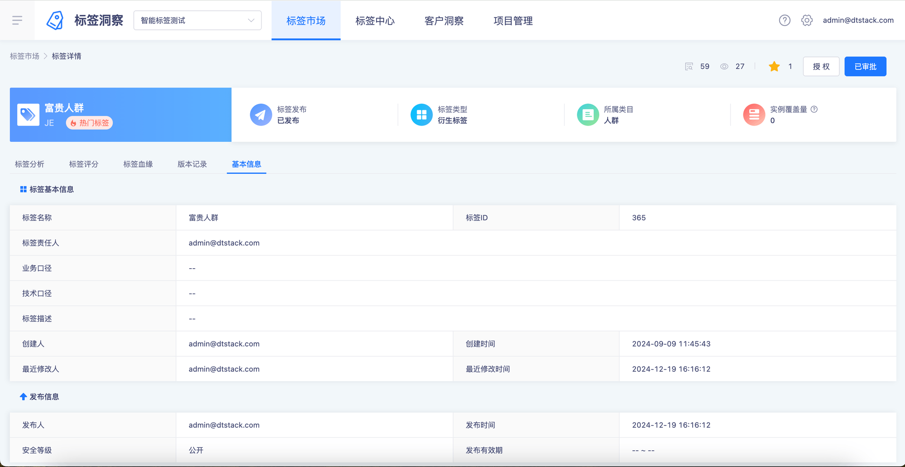
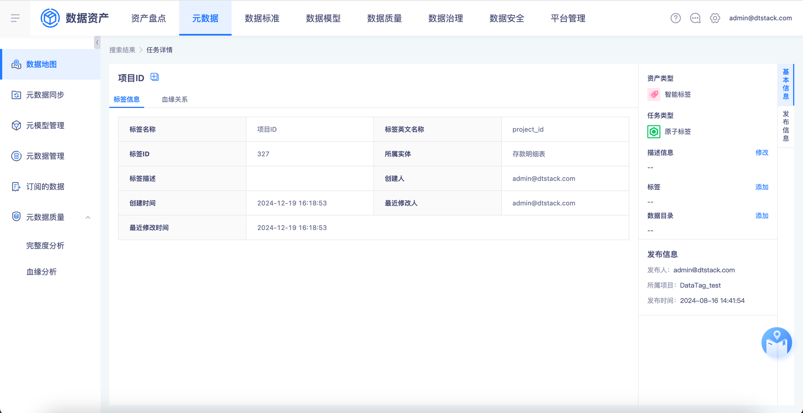
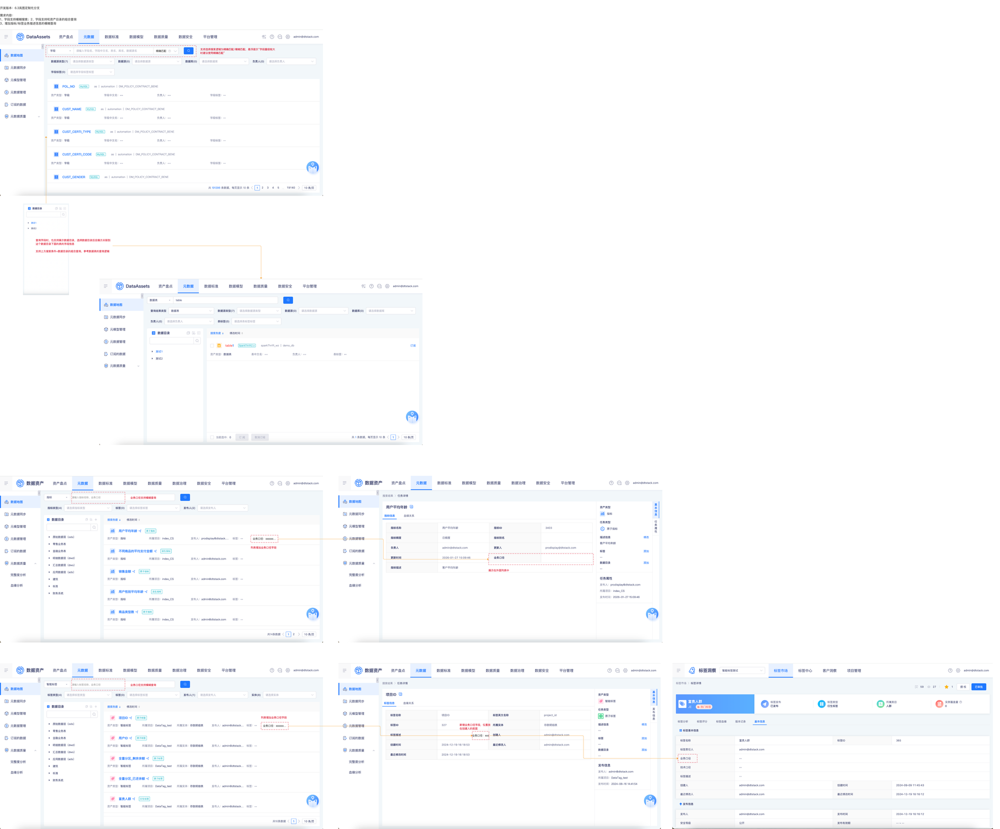

# 【数据地图】查询优化

## 页面元素截图

## 控件文本

开发版本：6.3岚图定制化分支需求内容：1、字段支持模糊搜索；2、字段支持和资产目录的组合查询3、增加指标/标签业务描述信息的模糊查询 | 支持选择搜索逻辑为精确匹配/模糊匹配，悬浮提示“字段量级较大时建议使用精确匹配” | 查询字段时，也支持展示数据目录，选择数据目录后会展示关联到这个数据目录下面的表的字段信息支持上方搜索条件+数据目录的组合查询，参考数据表的查询逻辑 | 精确匹配 | 业务口径：xxxxxx… | 请输入指标名称、业务口径 | 业务口径支持模糊查询 | 请输入标签名称、业务口径 | 列表增加业务口径字段 | 展示在外面列表中 | 业务口径：xxx | 新增业务口径字段，位置放在创建人的前面

## 整页截图

## 页面完整文本

开发版本：6.3岚图定制化分支

需求内容：

1、字段支持模糊搜索；2、字段支持和资产目录的组合查询

3、增加指标/标签业务描述信息的模糊查询

支持选择搜索逻辑为精确匹配/模糊匹配，悬浮提示“字段量级较大时建议使用精确匹配”

查询字段时，也支持展示数据目录，选择数据目录后会展示关联到这个数据目录下面的表的字段信息

支持上方搜索条件+数据目录的组合查询，参考数据表的查询逻辑

精确匹配

业务口径：xxxxxx…

业务口径：xxxxxx…

请输入指标名称、业务口径

业务口径支持模糊查询

请输入标签名称、业务口径

业务口径支持模糊查询

列表增加业务口径字段

列表增加业务口径字段

展示在外面列表中

业务口径：xxx

新增业务口径字段，位置放在创建人的前面
