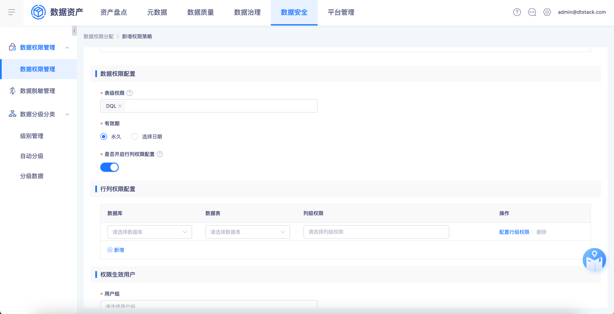
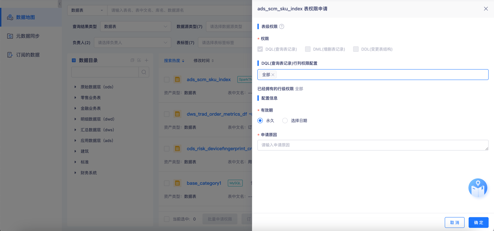
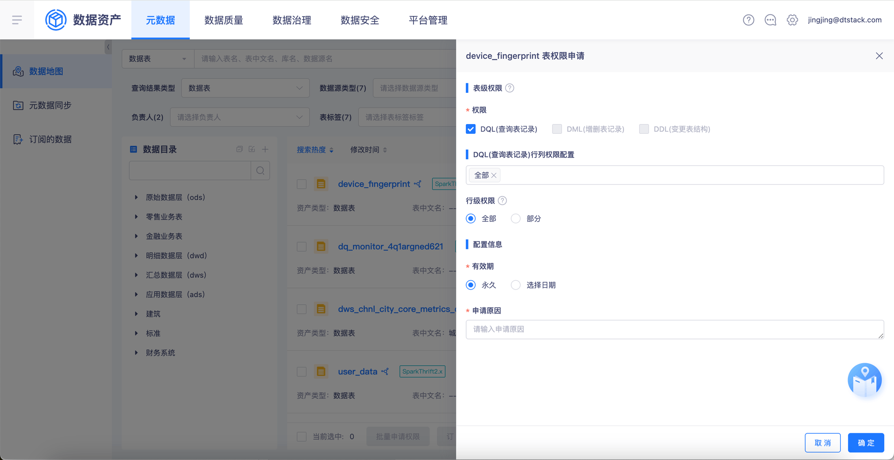
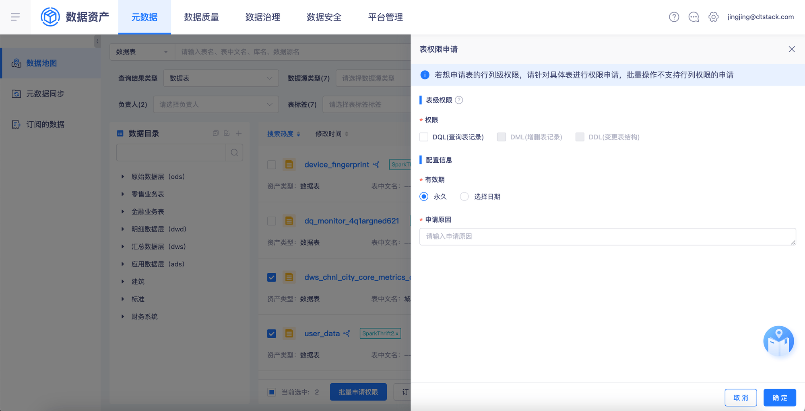
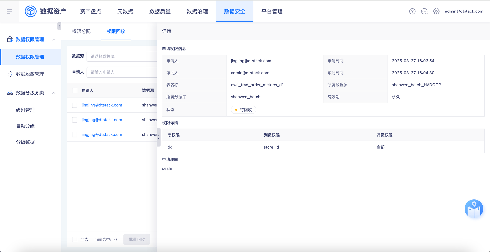
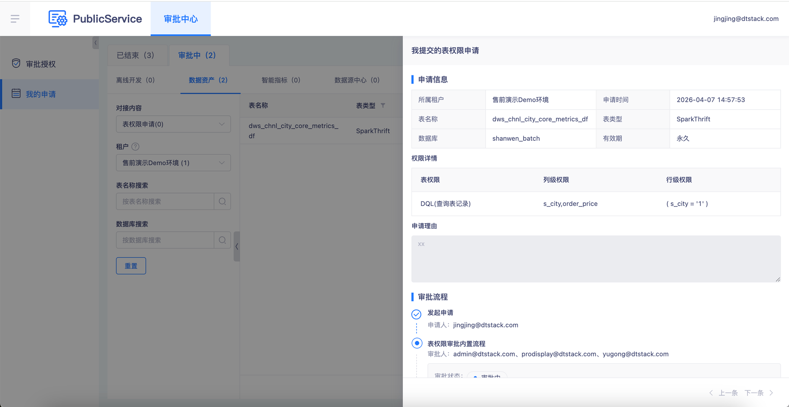
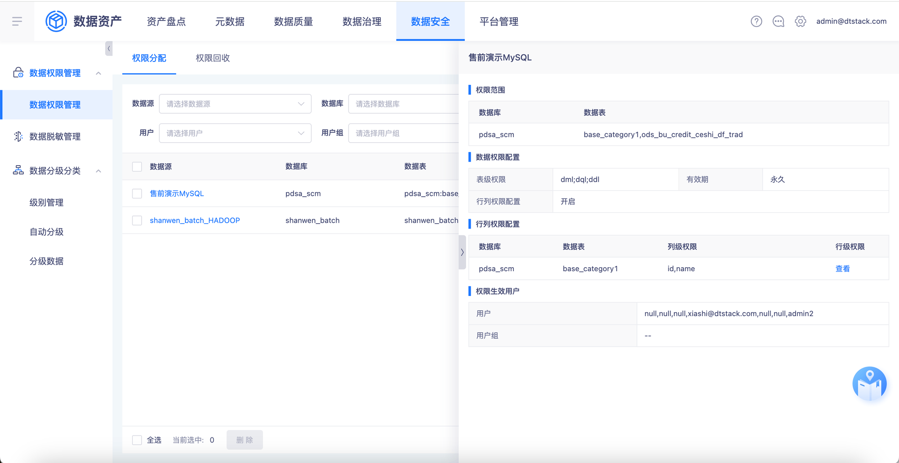
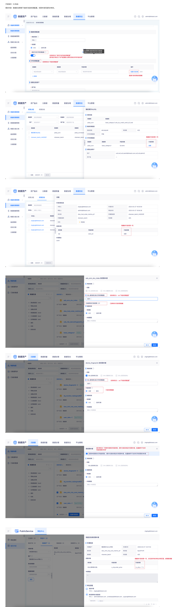

# 【数据安全】下线行列级别权限配置

## 页面元素截图

## 控件文本

开发版本：6.2标品需求内容：数据安全管理下线掉行级别权限配置，权限申请页面同步修改。 | 名称修改为“是否开启列级权限配置”，悬浮提示修改为“若不配置默认拥有该表的所有列级权限” | 配置行级权限按钮隐藏 | 名称修改为“列级权限配置” | 隐藏掉行级权限一列 | 隐藏掉行级权限一列，涉及到所有的审批详情页面，都需要调整 | 名称修改为：xxx”列级权限配置” | 已拥有的行级权限隐藏 | 行级权限隐藏 | 提示修改为：”若想申请表的列级权限，请针对具体表进行权限申请，批量操作不支持列级权限的申请“

## 整页截图

## 页面完整文本

开发版本：6.2标品

需求内容：数据安全管理下线掉行级别权限配置，权限申请页面同步修改。

名称修改为“是否开启列级权限配置”，

悬浮提示修改为“若不配置默认拥有该表的所有列级权限”

配置行级权限按钮隐藏

名称修改为“列级权限配置”

隐藏掉行级权限一列

隐藏掉行级权限一列

隐藏掉行级权限一列，涉及到所有的审批详情页面，都需要调整

名称修改为：xxx”列级权限配置”

已拥有的行级权限隐藏

名称修改为：xxx”列级权限配置”

行级权限隐藏

提示修改为：”若想申请表的列级权限，请针对具体表进行权限申请，批量操作不支持列级权限的申请“
