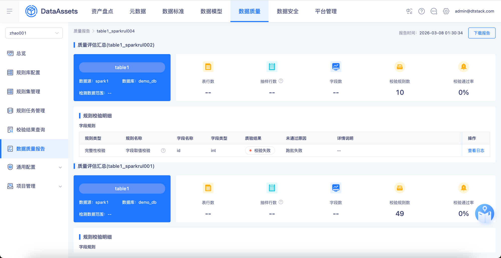
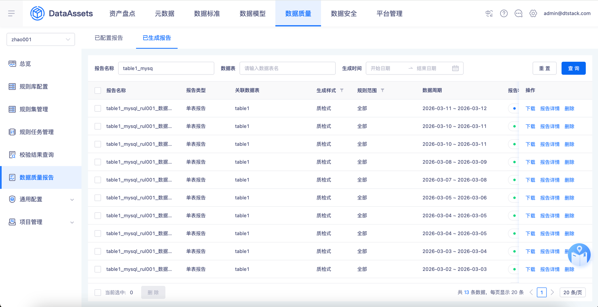
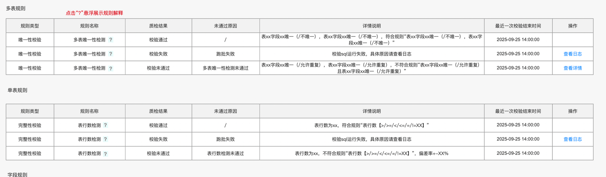
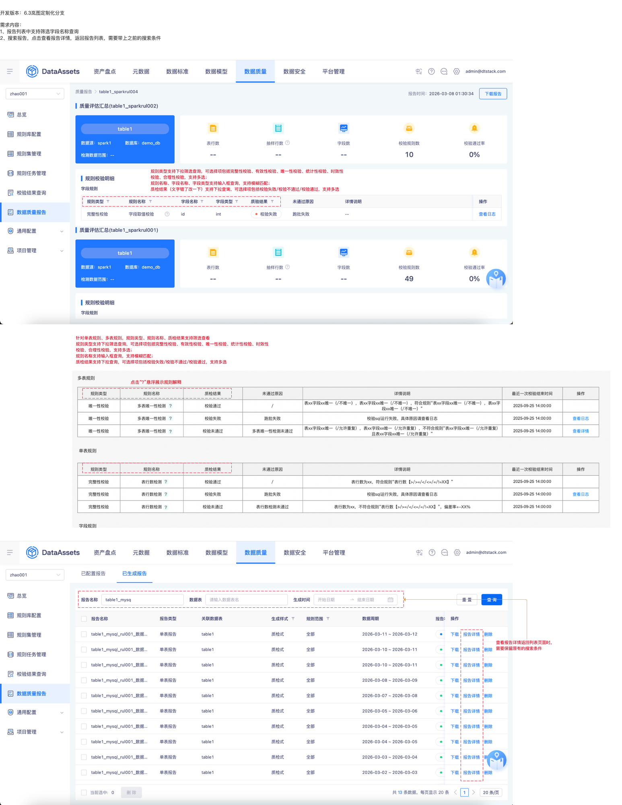

# 【数据质量】报告搜索优化

## 页面元素截图

## 整页截图

## 页面完整文本

开发版本：6.3岚图定制化分支

需求内容：

1、报告列表中支持筛选字段名称查询

2、搜索报告，点击查看报告详情，返回报告列表，需要带上之前的搜索条件

查看报告详情返回列表页面时，需要保留原有的搜索条件

规则类型支持下拉筛选查询，可选择项包括完整性校验、有效性校验、唯一性校验、统计性校验、时效性校验、合理性校验，支持多选；

规则名称、字段名称、字段类型支持输入框查询，支持模糊匹配；

质检结果（文字错了改一下）支持下拉查询，可选择项包括校验失败/校验不通过/校验通过，支持多选

针对单表规则、多表规则，规则类型、规则名称、质检结果支持筛选查看

规则类型支持下拉筛选查询，可选择项包括完整性校验、有效性校验、唯一性校验、统计性校验、时效性校验、合理性校验，支持多选；

规则名称支持输入框查询，支持模糊匹配；

质检结果支持下拉查询，可选择项包括校验失败/校验不通过/校验通过，支持多选
