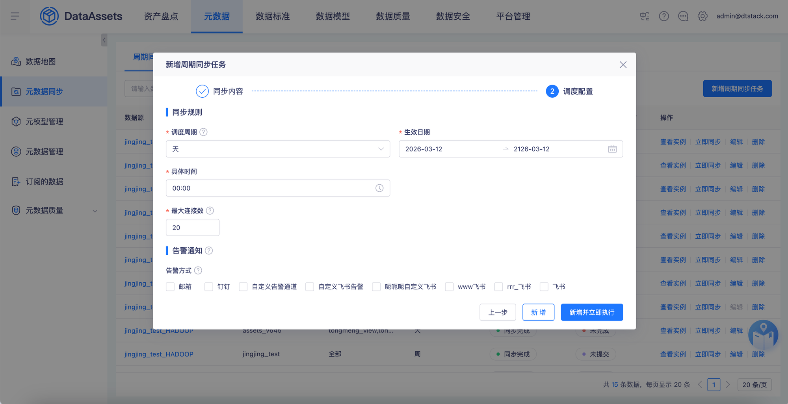
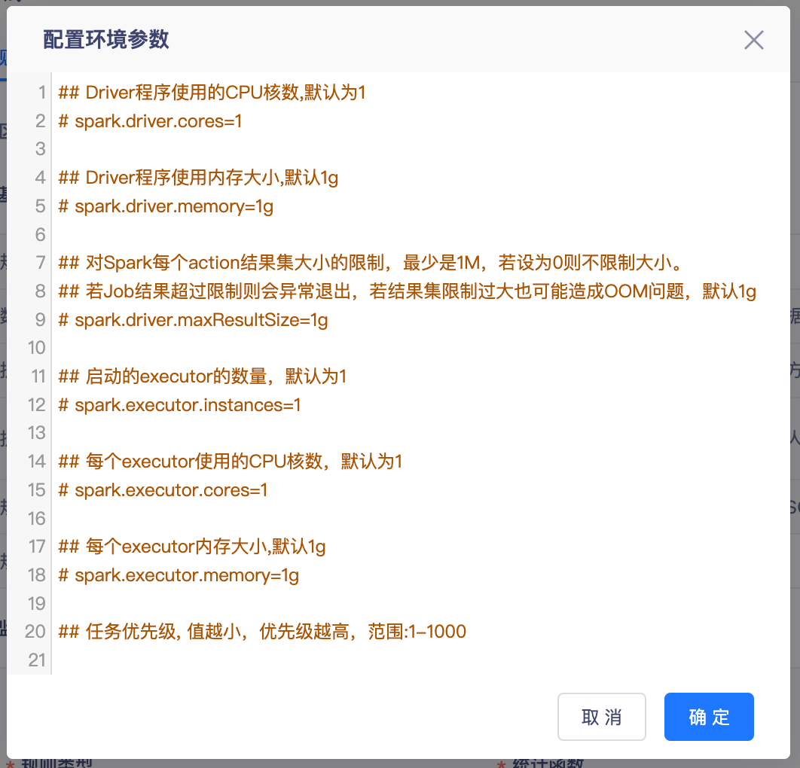
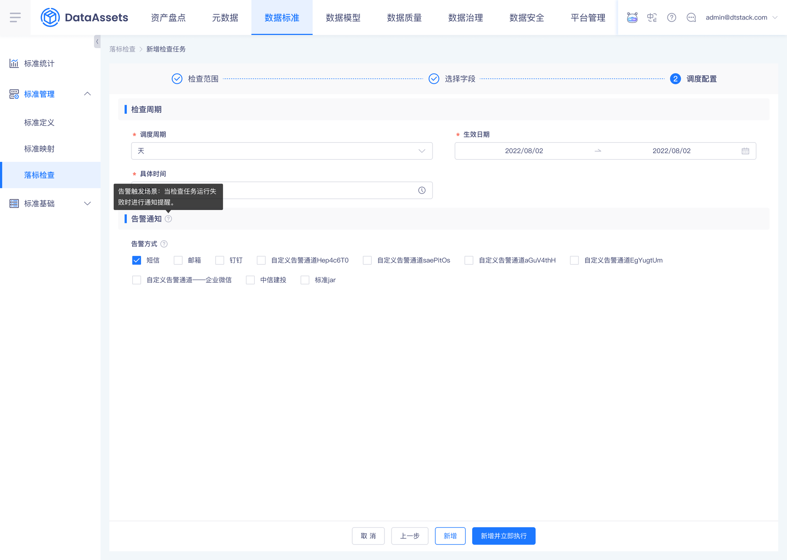
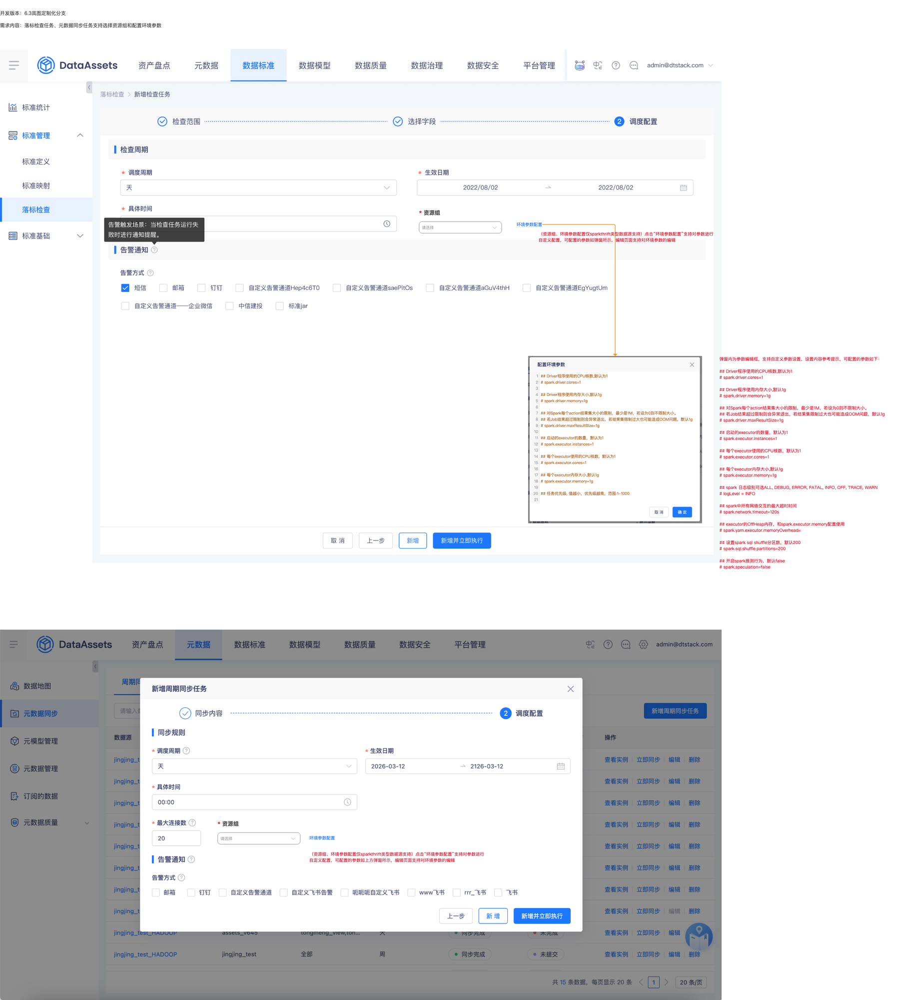

# 【数据资产】落标检查任务、元数据同步任务支持选择资源组和配置环境参数

## 页面元素截图

## 控件文本

开发版本：6.3岚图定制化分支需求内容：落标检查任务、元数据同步任务支持选择资源组和配置环境参数 | 环境参数配置 | （资源组、环境参数配置仅sparkthrift类型数据源支持）点击“环境参数配置”支持对参数进行自定义配置，可配置的参数如弹窗所示，编辑页面支持对环境参数的编辑 | * 资源组 | 请选择 | （资源组、环境参数配置仅sparkthrift类型数据源支持）点击“环境参数配置”支持对参数进行自定义配置，可配置的参数如上方弹窗所示，编辑页面支持对环境参数的编辑

## 整页截图

## 页面完整文本

开发版本：6.3岚图定制化分支

需求内容：落标检查任务、元数据同步任务支持选择资源组和配置环境参数

环境参数配置

（资源组、环境参数配置仅sparkthrift类型数据源支持）点击“环境参数配置”支持对参数进行自定义配置，可配置的参数如弹窗所示，编辑页面支持对环境参数的编辑

弹窗内为参数编辑框，支持自定义参数设置，设置内容参考提示，可配置的参数如下：

## Driver程序使用的CPU核数,默认为1

# spark.driver.cores=1

## Driver程序使用内存大小,默认1g

# spark.driver.memory=1g

## 对Spark每个action结果集大小的限制，最少是1M，若设为0则不限制大小。

## 若Job结果超过限制则会异常退出，若结果集限制过大也可能造成OOM问题，默认1g

# spark.driver.maxResultSize=1g

## 启动的executor的数量，默认为1

# spark.executor.instances=1

## 每个executor使用的CPU核数，默认为1

# spark.executor.cores=1

## 每个executor内存大小,默认1g

# spark.executor.memory=1g

## spark 日志级别可选ALL, DEBUG, ERROR, FATAL, INFO, OFF, TRACE, WARN

# logLevel = INFO

## spark中所有网络交互的最大超时时间

# spark.network.timeout=120s

## executor的OffHeap内存，和spark.executor.memory配置使用

# spark.yarn.executor.memoryOverhead=

## 设置spark sql shuffle分区数，默认200

# spark.sql.shuffle.partitions=200

## 开启spark推测行为，默认false

# spark.speculation=false

* 资源组

  请选择

环境参数配置

* 资源组

  请选择

（资源组、环境参数配置仅sparkthrift类型数据源支持）点击“环境参数配置”支持对参数进行自定义配置，可配置的参数如上方弹窗所示，编辑页面支持对环境参数的编辑
