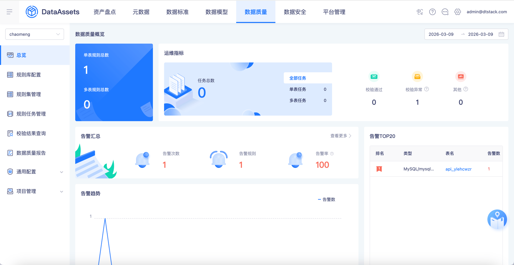
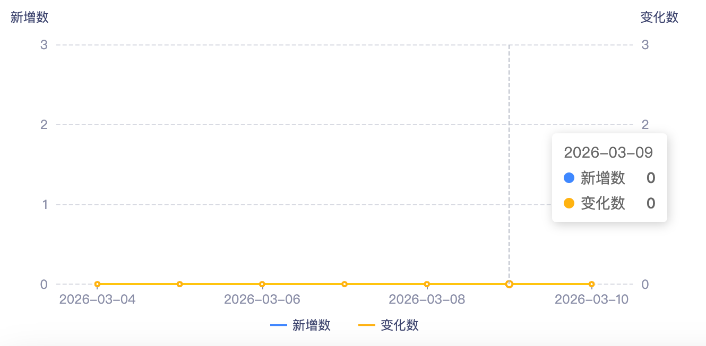
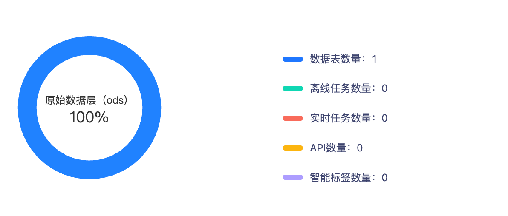
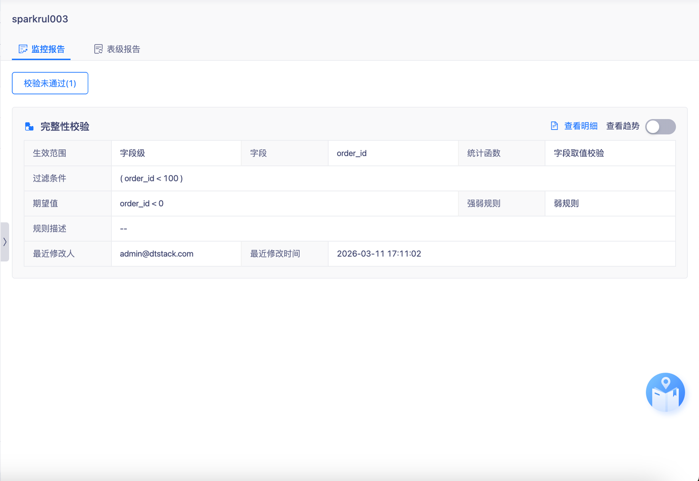
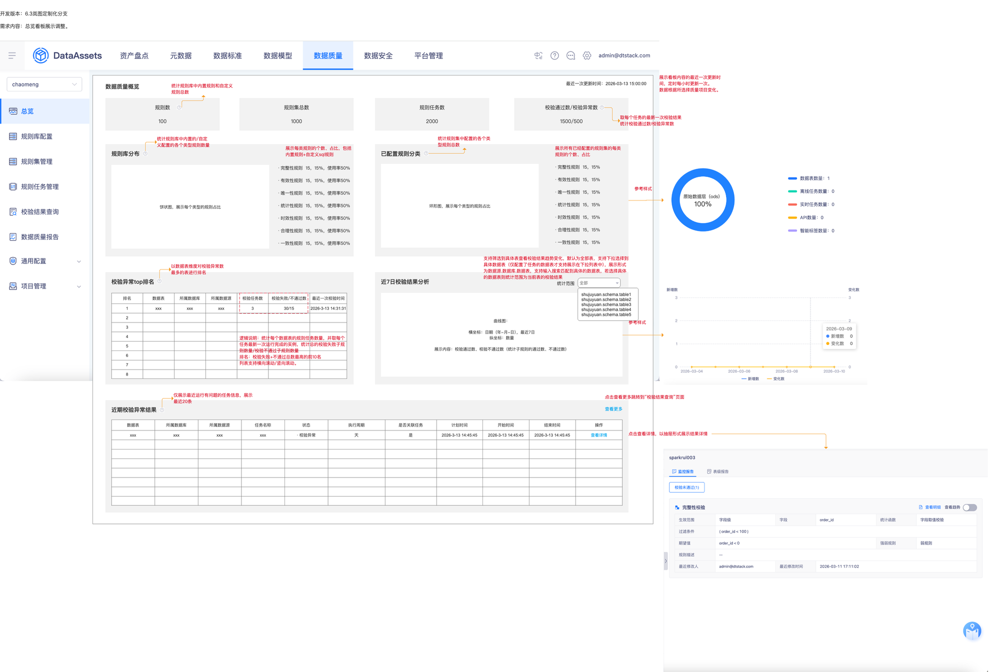

# 【质量总览】总览看板展示

## 页面元素截图

## 控件文本

开发版本：6.3岚图定制化分支需求内容：总览看板展示调整。 | 数据质量概览 | 规则数100 | 规则集总数1000 | 规则任务数2000 | 校验通过数/校验异常数1500/500 | 取每个任务的最新一次校验结果统计校验通过数/校验异常数 | 规则库分布 | 统计规则库中内置规则和自定义规则总数 | 饼状图，展示每个类型的规则占比 | 已配置规则分类 | 校验异常top排名 | 近7日校验结果分析 | 曲线图：横坐标：日期（年-月-日），最近7日纵坐标：数量展示内容：校验通过数、校验不通过数（统计子规则的通过数、不通过数） | 近期校验异常结果 | 排名 | 数据表 | 所属数据库 | 所属数据源 | 校验任务数

## 整页截图

## 页面完整文本

开发版本：6.3岚图定制化分支

需求内容：总览看板展示调整。

数据质量概览

规则数

100

规则集总数

1000

规则任务数

2000

校验通过数/校验异常数

1500/500

取每个任务的最新一次校验结果统计校验通过数/校验异常数

规则库分布

统计规则库中内置规则和自定义规则总数

饼状图，展示每个类型的规则占比

· 完整性规则  15，15%，使用率50%

· 有效性规则  15，15%，使用率50%

· 唯一性规则  15，15%，使用率50%

· 统计性规则  15，15%，使用率50%

· 时效性规则  15，15%，使用率50%

· 合理性规则  15，15%，使用率50%

· 一致性规则  15，15%，使用率50%

已配置规则分类

校验异常top排名

近7日校验结果分析

曲线图：

横坐标：日期（年-月-日），最近7日

纵坐标：数量

展示内容：校验通过数、校验不通过数（统计子规则的通过数、不通过数）

近期校验异常结果

排名

数据表

所属数据库

所属数据源

校验任务数

校验失败/不通过数

最近一次校验时间

1

xxx

xxx

xxx

3

30/15

2026-3-13 14:31:31

2

3

4

5

6

7

8

环形图，展示每个类型的规则占比

· 完整性规则  15，15%

· 有效性规则  15，15%

· 唯一性规则  15，15%

· 统计性规则  15，15%

· 时效性规则  15，15%

· 合理性规则  15，15%

· 一致性规则  15，15%

统计规则集中配置的各个类型规则总数

统计规则库中内置的/自定义配置的各个类型规则数量

以数据表维度对校验异常数最多的表进行排名

参考样式

参考样式

数据表

所属数据库

所属数据源

任务名称

状态

执行周期

是否关联任务

计划时间

开始时间

结束时间

操作

xxx

xxx

xxx

xxx

· 校验异常

天

是

2026-3-13 14:45:45

2026-3-13 14:45:45

2026-3-13 14:45:45

查看详情

仅展示最近运行有问题的任务信息，展示最近20条

查看更多

点击查看更多跳转到“校验结果查询”页面

逻辑说明：统计每个数据表的规则任务数量，并取每个任务最新一次运行完成的实例，统计总的校验失败子规则数量/校验不通过子规则数量

排名：校验失败+不通过总数最高的前10名

列表支持横向滚动/竖向滚动。

点击查看详情，以抽屉形式展示结果详情

展示每类规则的个数、占比，包括内置规则+自定义sql规则

展示所有已经配置的规则集的每类规则的个数、占比

最近一次更新时间：2026-03-13 15:00:00

展示看板内容的最近一次更新时间，定时每小时更新一次。

数据根据所选择质量项目变化。

 全部

支持筛选到具体表查看校验结果趋势变化，默认为全部表，支持下拉选择到具体数据表（仅配置了任务的数据表才支持展示在下拉列表中），展示形式为数据源.数据库.数据表，支持输入搜索匹配到具体的数据表，若选择具体的数据表则统计范围为当前表的校验结果

统计范围

shujuyuan.schema.table1

shujuyuan.schema.table2

shujuyuan.schema.table3

shujuyuan.schema.table4

shujuyuan.schema.table5
